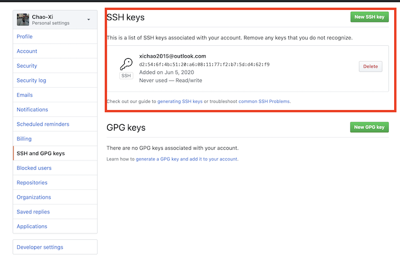
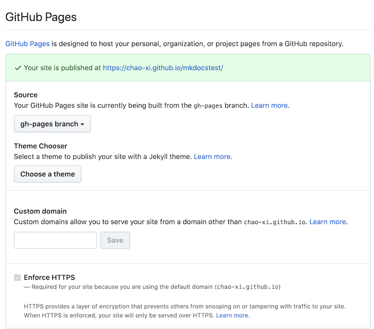
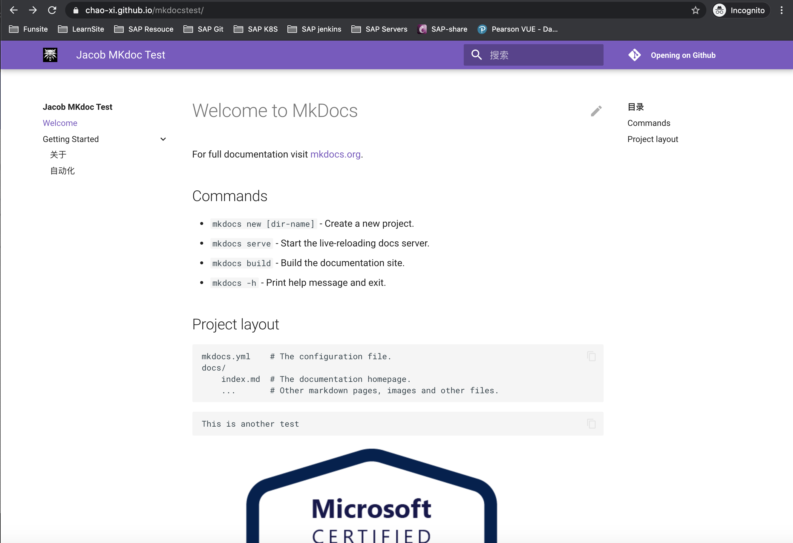
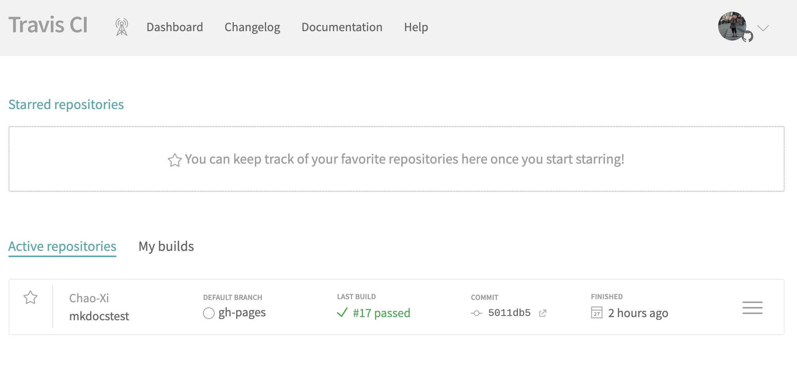
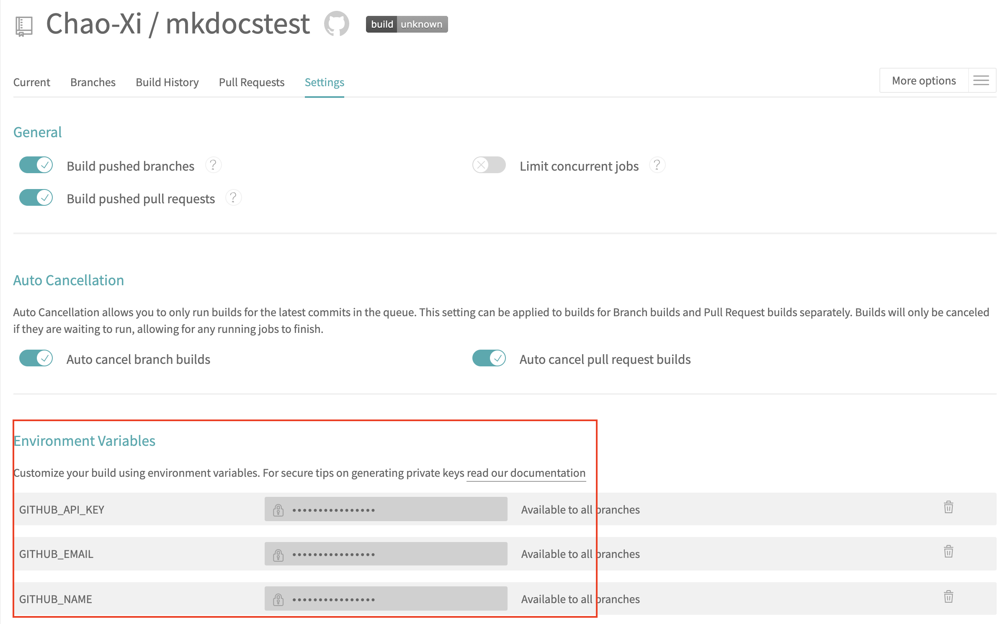
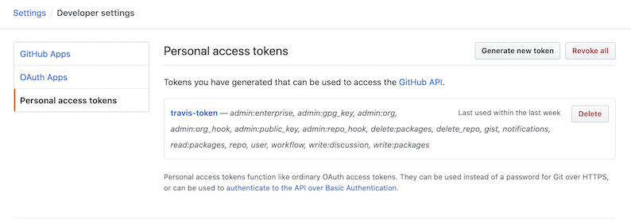
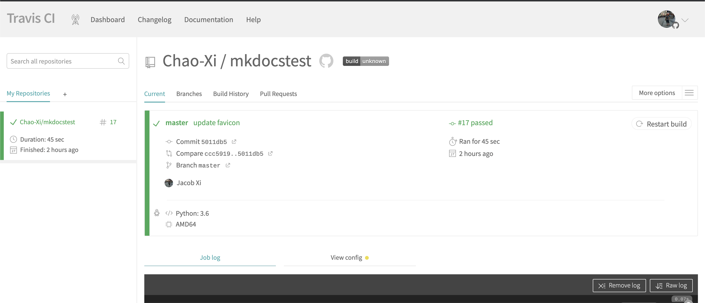
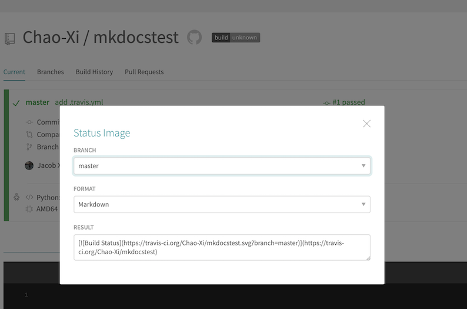
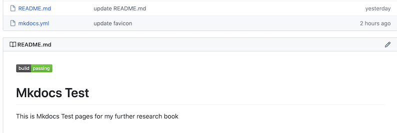
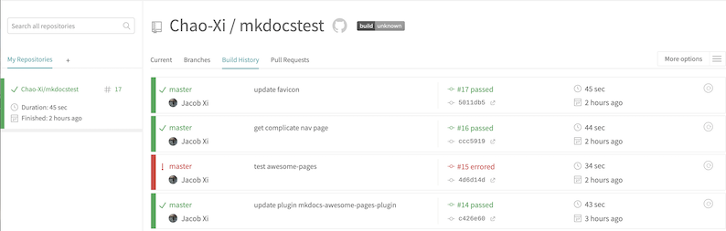

# GitHub+Travis+Mkdocs自动化构建文档库

了解过`Traefik`,`nginx-ingress`的同学都知道他们的官方文档都是基于`mkdocs`和`material`主题制作而成，你觉得这种文档库怎么样？有没有心动把自己的文档也整成那样的？，下面我们直接动手干起来吧。

* **Reference**: https://squidfunk.github.io/mkdocs-material/getting-started/

* [Traefik mkdocs.yml](https://github.com/containous/traefik/blob/master/docs/mkdocs.yml)

## 安装`mkdocs`

```
$ pip3 install mkdocs
```


创建并运行一个新的文档库

```
$ mkdocs new mkdocstest
INFO    -  Creating project directory: mkdocstest 
INFO    -  Writing config file: mkdocstest/mkdocs.yml 
INFO    -  Writing initial docs: mkdocstest/docs/index.md

$ cd mkdocstest

ls
docs       mkdocs.yml
```

创建一个新的GIT仓库 https://github.com/Chao-Xi/mkdocstest/

配置通过SSH无密访问代码仓库

```
ssh-keygen -t rsa 
```

然后将公钥拷贝到`GITHUB`的`SSH-KEY`中



测试本地是否可以远程连接

```
$ ssh -T git@github.com

Hi Chao-Xi! You've successfully authenticated, but GitHub does not provide shell access.
```

```
cd mkdocstest/
$ git init
Initialized empty Git repository in /Users/.../Devops_sap/mkdocstest/.git/

$ git remote add origin https://github.com/Chao-Xi/mkdocstest.git

$ mkdocs build --clean 
INFO    -  Cleaning site directory 
INFO    -  Building documentation to directory: /Users/i515190/Devops_sap/mkdocstest/site 
INFO    -  Documentation built in 0.10 seconds

$ mkdocs gh-deploy --clean
INFO    -  Cleaning site directory 
INFO    -  Building documentation to directory: /Users/i515190/Devops_sap/mkdocstest/site 
INFO    -  Documentation built in 0.07 seconds 
WARNING -  Version check skipped: No version specified in previous deployment. 
INFO    -  Copying '/Users/...../Devops_sap/mkdocstest/site' to 'gh-pages' branch and pushing to GitHub. 
INFO    -  Your documentation should shortly be available at: https://Chao-Xi.github.io/mkdocstest
```



此时，即可通过https://chao-xi.github.io/mkdocstest/ 访问


```
$ httpstat https://Chao-Xi.github.io/mkdocstest/
Connected to 185.199.111.153:443 from 10.59.166.22:55172

HTTP/1.1 301 Moved Permanently
Connection: keep-alive
Content-Length: 162
Server: GitHub.com
Content-Type: text/html
Location: https://chao-xi.github.io/mkdocstest/
X-GitHub-Request-Id: E47A:4120:32AC47:3F1DAD:5ED9BB90
Accept-Ranges: bytes
Date: Fri, 05 Jun 2020 03:27:13 GMT
Via: 1.1 varnish
Age: 0
X-Served-By: cache-hkg17928-HKG
X-Cache: MISS
X-Cache-Hits: 0
X-Timer: S1591327633.042481,VS0,VE237
Vary: Accept-Encoding
X-Fastly-Request-ID: 140827b789772d97c699c32dd8e355bdc9319a80

Body stored in: /var/folders/r7/nml_dsbn44gcd2jlqh7s2w940000gn/T/tmpsm2mjr

  DNS Lookup   TCP Connection   TLS Handshake   Server Processing   Content Transfer
[    121ms   |      37ms      |     88ms      |       273ms       |        0ms       ]
             |                |               |                   |                  |
    namelookup:121ms          |               |                   |                  |
                        connect:158ms         |                   |                  |
                                    pretransfer:246ms             |                  |
                                                      starttransfer:519ms            |
                                                                                 total:519ms  
```


现在开始优化`mkdocs`以及配置主题样式了，这部分工作都在`mkdocs.yml`中完成

这里可以参考官方的文档 

https://squidfunk.github.io/mkdocs-material/getting-started/

```
site_name: Jacob MKdoc Test
site_description: "这是一个mkdocs的demo测试知识网站"
site_author: "Jacob Xi"
copyright: "Copyright &copy; 2016-2020 Jacob Xi"

plugins:
  - search # necessary for search to work
  - awesome-pages
nav:
  - 'Welcome': "index.md"
  - 'Getting Started':
    - '关于': 'about.md'
    - '自动化': 'devops.md'

repo_url: https://github.com/Chao-Xi/mkdocstest.git
repo_name: "Opening on Github"

theme: 
  language: zh
  name: 'material'
  include_sidebar: true
  logo: 'images/logo.png'
  favicon: 'images/logo.png'
  feature:
    tabs: false
  palette:
    primary: 'deep purple'
    accent: 'deep purple'
  i18n:
    prev: 'Previous'
    next: 'Next'
```

```
 tree docs/
docs/
├── about.md
├── devops.md
├── images
│   ├── azure-fundamentals-badge.png
│   └── logo.png
└── index.md

1 directory, 5 files
```

其中`theme`指定的是你的主题，这个主题就是我们常见到的`traefik`,`nginx-ingress`等在使用的官方文档的主题，如果使用它，你可能还需要额外的安装一下

```
pip3 install mkdocs-material
```

安装之后，执行`mkdocs gh-deploy --clean`即可访问网站的主题:



每次手动部署都是比较麻烦的，于是我们利用永久免费的`travis`来帮助解决这个问题:

```
$ tree . -L 1 -a
.
├── .git
├── .travis.yml
├── README.md
├── docs
├── mkdocs.yml
└── site

3 directories, 3 files
```

**`.travis.yml`**

```
language: python # Set the build language to Python

python: 3.6 # Set the version of Python to use

branches: master # Set the branch to build from

install:
  - pip install mkdocs mkdocs-material pymdown-extensions pygments mkdocs-awesome-pages-plugin # Install the required dependencies

script: true # Skip script (Don't use this if one already exists)

before_deploy:
  - mkdocs build --verbose --clean --strict # Build a local version of the docs

deploy: # Deploy documentation to Github in the gh_pages branch
  provider: pages
  skip_cleanup: true
  github_token: $GITHUB_API_KEY
  local_dir: site
  on:
    branch: master
```

> Remember `.travis.yml` needed to be pushed into github first, then can trigger travisCI to auto build


然后我们使用`GITHUB`的账号登录`travis`, 地址是:`https://travis-ci.org`，在登录进去之后，我们选择合适的启用`CICD`



然后点击setting进入仓库的配置界面，设置以下三个环境变量



其中,`GITHUB_API_KEY`是从`gitub`上获取的`Access Token`,剩下的两个是**用户名**和**密码**。完成之后，我们就可以手动的触发以下构建:

[Creating a personal access token for the command line](https://help.github.com/en/github/authenticating-to-github/creating-a-personal-access-token-for-the-command-line)


`Settings` -> `Developer Settings` -> ` Personal access tokens.` -> `Generate new token` -> `Generate token.`





紧接着，我们为了方便我们知道构建是否完成，我们在`README.md`文件上添加了一个构建的状态展示: 



紧接着，我们为了方便我们知道构建是否完成，我们在`README.md`文件上添加了一个构建的状态展示:




复制`RESULT`信息到`readme.md`中，即可显示每次构建的状态信息:

`readme.md`

```
[](https://travis-ci.org/Chao-Xi/mkdocstest)

# Mkdocs Test

This is Mkdocs Test pages for my further research book
```



查看一下我们的构建历史



这样每次推动到Git仓库之后，就会自动的编译好静态文件到`gh-deploy`分支了.

