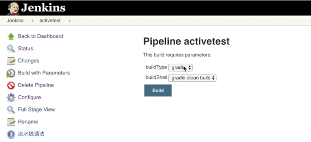
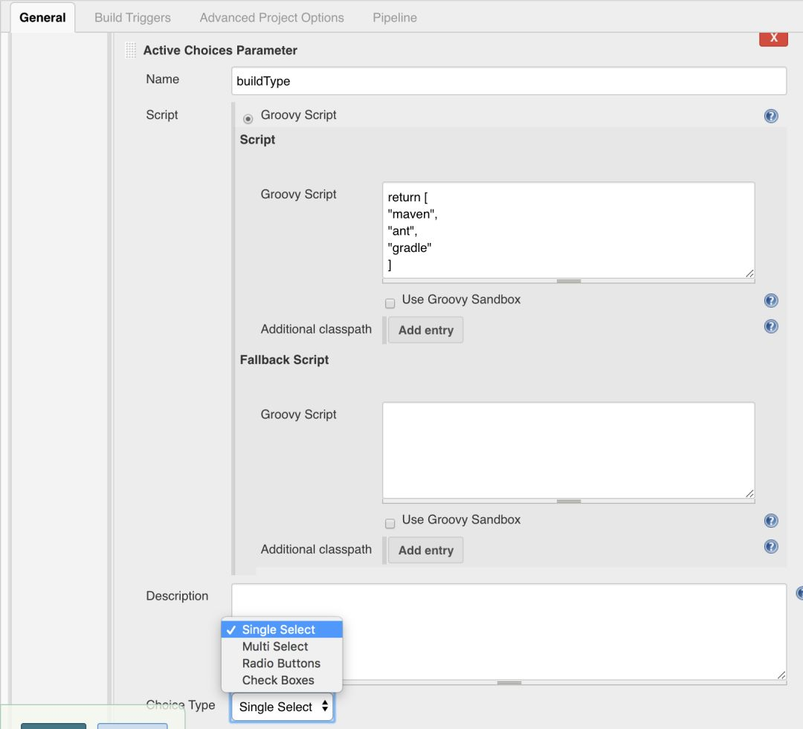
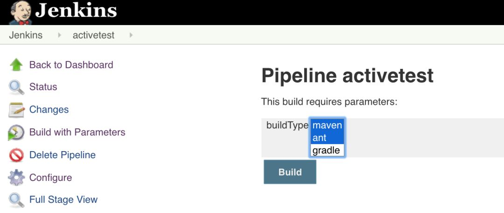
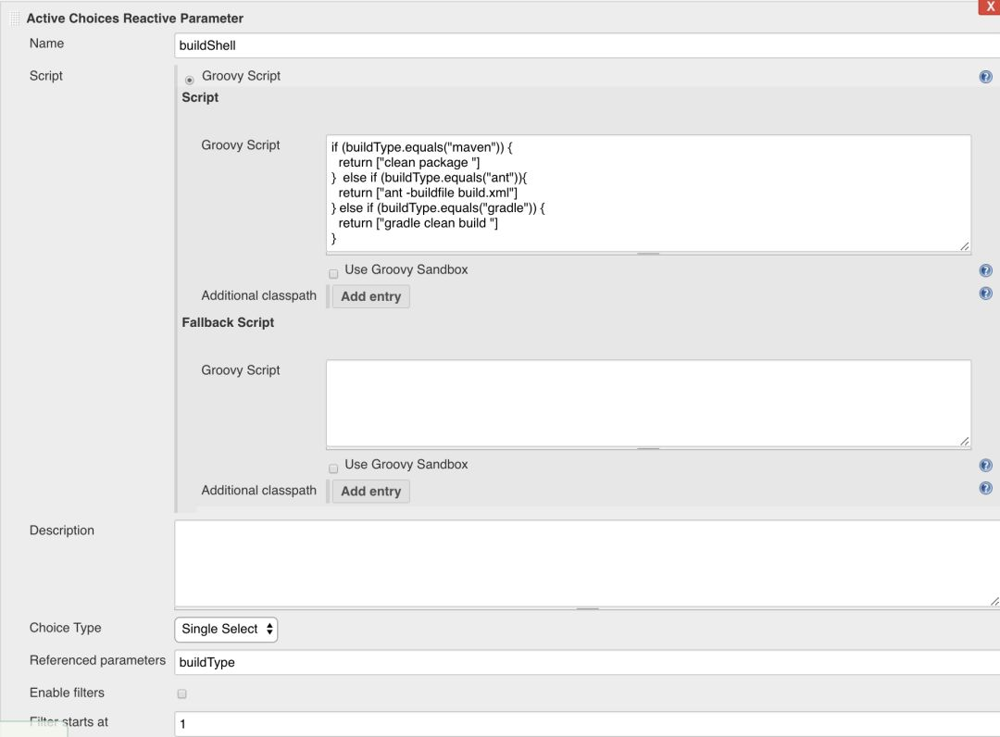

# 使用Active Choice Parameter参数化构建

在使用Pipeline项目时 一般都是参数化构建工作，在Jenkins的构建需要使用参数类型有复选框，单选按钮，多选值等输入的情景

转到→管理Jenkins→选择管理插件→选择可用选项卡，然后搜索主动选择插件。安装并重新启动Jenkins，以正确安装插件。我的已经安装好，因此在“已安装”标签中列出

主动选择参数

使用Groovy脚本或Scriptler目录中的脚本为生成参数动态生成值选项列表。参数可以动态更新，呈现为组合框，复选框，单选按钮或丰富的HTML UI窗口小部件。

**按住Ctrl 就可以多选了。**

**主动选择反应参数**

当作业中UI控件的值发生更改时，可以动态更新（主动选择和响应参考参数） 这里可以使用IF进行条件判断，输出相关的值。

项目地址：

https://github.com/jenkinsci/active-choices-plugin

插件地址：

https://plugins.jenkins.io/uno-choice/
