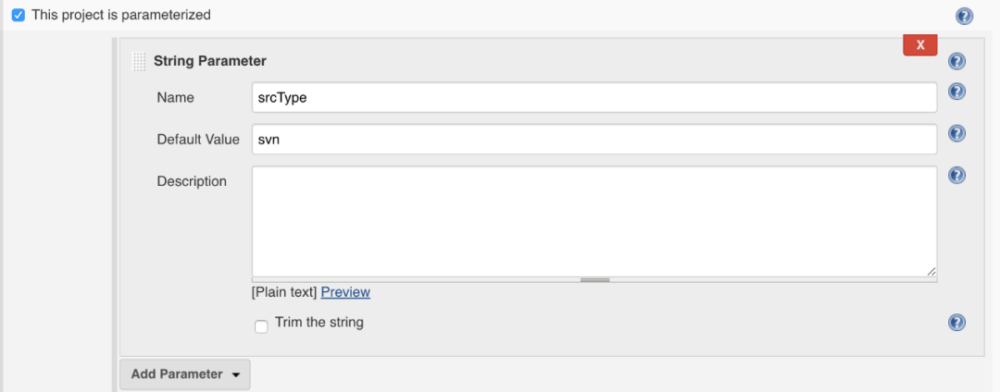
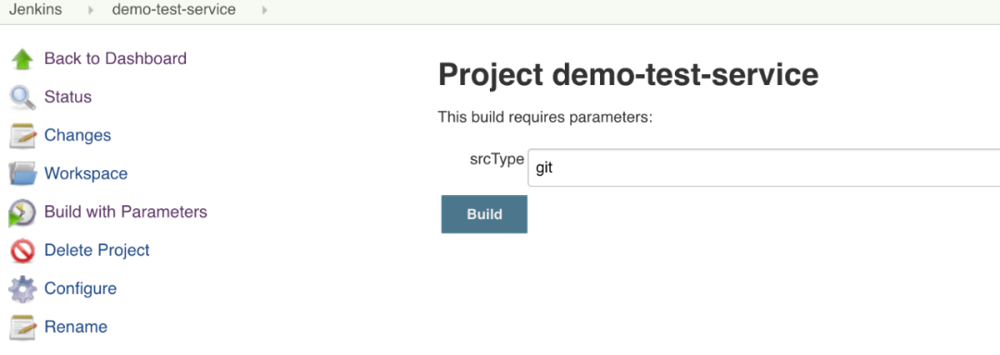

# **第五节 自动化Jenkins管理？使用python-jenkins管理Jenkins**

本次我们将要学习JenkinsAPI接口，我们先用Python-jenkins这个库完成。

* 仓库Pypi ：https://pypi.org/project/python-jenkins/
* 在线文档: http://python-jenkins.readthedocs.org/en/latest/
* 当前环境Python版本 v3.7.0

## 功能

* Create new jobs  创建新项目    
* Copy existing jobs   复制已存在的项目
* Delete jobs  删除项目
* Update jobs  更新项目
* Get a job’s build information   获取一个项目的构建信息
* Get Jenkins master version information   获取Jenkins master的版本信息
* Get Jenkins plugin information  过去jenkins插件信息
* Start a build on a job  构建一个项目
* Create nodes  创建一个节点  
* Enable/Disable nodes  启用/禁用节点
* Get information on nodes  获取节点信息
* Create/delete/reconfig views  创建/删除/更新视图
* Put server in shutdown mode (quiet down)  关机
* List running builds  列出构建中的项目
* Delete builds  删除构建
* Wipeout job workspace  
* Create/delete/update folders  创建/删除/更新文件夹
* Set the next build number 设置下次构建ID
* Install plugins   安装插件

## 使用思路

例如我要创建一个项目

1. 要先找到创建项目的方法
2. 然后根据API文档查阅如何使用 每个接口的使用方法
3. 打开一个python解释器调试

## 初始化配置

安装python-jenkins

```
pip install python-jenkins==1.6.0
```

测试

```
$ python3
Python 3.7.4 (v3.7.4:e09359112e, Jul  8 2019, 14:54:52)
[Clang 6.0 (clang-600.0.57)] on darwin
Type "help", "copyright", "credits" or "license" for more information.
>>> import jenkins

>>> server = jenkins.Jenkins("http://127.0.0.1:8080",username="admin",password="admin")

>>> server.get_whoami()
{'_class': 'hudson.model.User', 'absoluteUrl': 'http://127.0.0.1:8080/user/admin', 'description': '', 'fullName': 'admin', 'id': 'admin', 'property': [{'_class': 'jenkins.security.ApiTokenProperty'}, {'_class': 'jenkins.security.LastGrantedAuthoritiesProperty'}, {'_class': 'hudson.model.MyViewsProperty'}, {'_class': 'hudson.model.PaneStatusProperties'}, {'_class': 'hudson.security.HudsonPrivateSecurityRealm$Details'}, {'_class': 'org.jenkinsci.main.modules.cli.auth.ssh.UserPropertyImpl'}, {'_class': 'jenkins.security.seed.UserSeedProperty'}, {'_class': 'hudson.search.UserSearchProperty', 'insensitiveSearch': True}, {'_class': 'hudson.model.TimeZoneProperty'}]}
```

**查看 所有的方法**

```
>>> dir(server)
['__class__', '__delattr__', '__dict__', '__dir__', '__doc__', '__eq__', '__format__', '__ge__', '__getattribute__', '__gt__', '__hash__', '__init__', '__init_subclass__', '__le__', '__lt__', '__module__', '__ne__', '__new__', '__reduce__', '__reduce_ex__', '__repr__', '__setattr__', '__sizeof__', '__str__', '__subclasshook__', '__weakref__', '_add_missing_builds', '_auth_resolved', '_auths', '_build_url', '_get_encoded_params', '_get_job_folder', '_get_tag_text', '_get_view_jobs', '_maybe_add_auth', '_request', '_response_handler', '_session', '_timeout_warning_issued', 'assert_credential_exists', 'assert_folder', 'assert_job_exists', 'assert_node_exists', 'assert_promotion_exists', 'assert_view_exists', 'auth', 'build_job', 'build_job_url', 'cancel_queue', 'check_jenkinsfile_syntax', 'copy_job', 'create_credential', 'create_folder', 'create_job', 'create_node', 'create_promotion', 'create_view', 'credential_exists', 'crumb', 'debug_job_info', 'delete_build', 'delete_credential', 'delete_job', 'delete_node', 'delete_promotion', 'delete_view', 'disable_job', 'disable_node', 'enable_job', 'enable_node', 'get_all_jobs', 'get_build_console_output', 'get_build_env_vars', 'get_build_info', 'get_build_test_report', 'get_credential_config', 'get_credential_info', 'get_info', 'get_job_config', 'get_job_info', 'get_job_info_regex', 'get_job_name', 'get_jobs', 'get_node_config', 'get_node_info', 'get_nodes', 'get_plugin_info', 'get_plugins', 'get_plugins_info', 'get_promotion_config', 'get_promotion_name', 'get_promotions', 'get_promotions_info', 'get_queue_info', 'get_queue_item', 'get_running_builds', 'get_version', 'get_view_config', 'get_view_name', 'get_views', 'get_whoami', 'install_plugin', 'is_folder', 'jenkins_open', 'jenkins_request', 'job_exists', 'jobs_count', 'list_credentials', 'maybe_add_crumb', 'node_exists', 'promotion_exists', 'quiet_down', 'reconfig_credential', 'reconfig_job', 'reconfig_node', 'reconfig_promotion', 'reconfig_view', 'rename_job', 'run_script', 'server', 'set_next_build_number', 'stop_build', 'timeout', 'upsert_job', 'view_exists', 'wait_for_normal_op', 'wipeout_job_workspace']
```

**do操作方法**

do操作方法

* 功能	/  python方法
* 项目操作: `create_job` , `disable_job` , `delete_job` , `copy_job`, `enable_job`,  `job_exists`,  `jobs_count` , `upsert_job`
* 构建操作	`build_job` `delete_build` `build_job_url`  `stop_build`
* 凭据操作	`create_credential` `delete_credentialcredential_exists`
* 视图操作	`create_view`  `delete_view` `view_exists`
* 节点操作	 `create_node`  `disable_node` `delete_node` `enable_node` `node_exists`
* 晋级操作	`create_promotion`  `delete_promotion` `promotion_exists`
* 取消队列	`cancel_queue`
* 检查jenkinsfile语法	`check_jenkinsfile_syntax`
* 检查项目信息	 `debug_job_info`
* 文件夹操作 `is_folder` `create_folder`
* 安装插件	 `install_plugin`


**get获取方法**

* 获取项目信息	  `get_all_jobs` `get_job_config` `get_job_info` `get_job_info_regex` `get_job_name get_jobs`
* 获取构建信息	 `get_build_console_output` `get_build_env_vars` `get_build_info`  `get_build_test_report`
* 获取凭据信息	 `get_credential_config`   `get_credential_info` `list_credentials`   `get_info`
* 获取节点信息	 `get_node_config` `get_node_info` `get_nodes`
* 获取插件信息	  `get_plugin_info` `get_plugins` `get_plugins_info`
* 获取晋级信息	 `get_promotion_config` `get_promotion_name` `get_promotions`  `get_promotions_info`
* 获取队列信息	  `get_queue_info` `get_queue_item`
* 获取运行中构建	 `get_running_builds`
* 获取版本	`get_version`
* 获取视图信息	 `get_view_config`  `get_view_name`  `get_views`
* 获取当前用户	`get_whoami` `jenkins_open` `jenkins_request`


**更新操作**

* 关机	`quiet_down`
* 更新凭据	 `reconfig_credential`
* 更新项目	 `reconfig_job`
* 更新节点	`reconfig_node`
* 更新晋级	`reconfig_promotion`
* 更新视图	`reconfig_view`
* 重命名项目	`rename_job`
* 运行脚本	`run_script`
* 设置下次构建id	 `set_next_build_number`

## 演示实例

每个接口的使用方法：https://python-jenkins.readthedocs.io/en/latest/api.html

### 项目操作

我们需要认识一下Jenkins项目的`config.xml`，大部分API在创建项目的时候会使用xml文件。首先创建一个项目（任何类型的都可以）然后我们进入`$JENKINS_HOME/jobs/`目录查看我们这个项目生成的`config.xml`文件。

builds存放项目的构建信息。

```
$ ls
demo-test

$ ls demo-test/
buildsconfig.xml
```

config.xml

可以看到jenkins的文件存储都是以xml方式存储的。（后面我们需要利用这个xml创建一个新项目）

```
<?xml version='1.1' encoding='UTF-8'?>
<project>
<description>test</description>
<keepDependencies>false</keepDependencies>
<properties/>
<scm class="hudson.scm.NullSCM"/>
<canRoam>true</canRoam>
<disabled>false</disabled>
<blockBuildWhenDownstreamBuilding>false</blockBuildWhenDownstreamBuilding>
<blockBuildWhenUpstreamBuilding>false</blockBuildWhenUpstreamBuilding>
<triggers/>
<concurrentBuild>false</concurrentBuild>
<builders/>
<publishers/>
<buildWrappers/>
</project>
```

使用方法获取项目配置信息

```
server.get_job_config("demo-test")

'<?xml version=\'1.1\' encoding=\'UTF-8\'?>\n<project>\n <description>test</description>\n <keepDependencies>false</keepDependencies>\n <properties/>\n <scm class="hudson.scm.NullSCM"/>\n <canRoam>true</canRoam>\n <disabled>false</disabled>\n <blockBuildWhenDownstreamBuilding>false</blockBuildWhenDownstreamBuilding>\n <blockBuildWhenUpstreamBuilding>false</blockBuildWhenUpstreamBuilding>\n <triggers/>\n <concurrentBuild>false</concurrentBuild>\n <builders/>\n <publishers/>\n <buildWrappers/>\n</project>'
```


掌握创建项目的方法使用

* `create_job(name, config_xml)`
	* name 项目名称 字符串类型
	* `config_xml` 配置文件 字符串类型

新建项目`demo-test-02`

```
config_xml = server.get_job_config("demo-test")
server.create_job("demo-test-02",config_xml)
```

验证项目是否创建成功 

```
server.job_exists("demo-test-02")
True
```

复制一个新项目demo-test-03

```
copy_job(from_name, to_name)
```

* `from_name` 源项目 字符串类型
* `to_name` 目标项目 字符串类型

当源项目名称与目标项目名称一致的时候会报错。JenkinsException

```
>>> server.copy_job("demo-test-02","demo-test-03")
>>> server.job_exists("demo-test-03")
True
```

写一个脚本用于项目创建

新建一个项目，增加一个参数`srcType`用于分辨项目所使用的的版本控制系统类型。参数可以是(`svn,git`)。

我们要完成的是基于一个项目模板，创建新的项目并替换相关的参数。模板项目名称`demo-devops-service` 。



```
import jenkins

#login
serverUrl = "http://127.0.0.1:8080"
username = "admin"
password = "admin"
server = jenkins.Jenkins(serverUrl,username,password)

defProjectName = "demo-devops-service"
newProjectName = "demo-test-service"


if server.job_exists(newProjectName) != True :
   print("项目不存在开始新建项目")
   
   config_xml=server.get_job_config(defProjectName)
   newconfig_xml = config_xml.replace("<defaultValue>svn</defaultValue>","<defaultValue>git</defaultValue>")
   
   print(newconfig_xml)

   server.create_job(newProjectName,newconfig_xml)
else:
   print("项目已存在!")
```

运行输出

```
$ python3 josbtest.py
项目不存在开始新建项目
<?xml version='1.1' encoding='UTF-8'?>
<project>
<actions/>
<description></description>
<keepDependencies>false</keepDependencies>
<properties>
  <hudson.model.ParametersDefinitionProperty>
    <parameterDefinitions>
      <hudson.model.StringParameterDefinition>
        <name>srcType</name>
        <description></description>
        <defaultValue>git</defaultValue>
        <trim>false</trim>
      </hudson.model.StringParameterDefinition>
    </parameterDefinitions>
  </hudson.model.ParametersDefinitionProperty>
</properties>
<scm class="hudson.scm.NullSCM"/>
<canRoam>true</canRoam>
<disabled>false</disabled>
<blockBuildWhenDownstreamBuilding>false</blockBuildWhenDownstreamBuilding>
<blockBuildWhenUpstreamBuilding>false</blockBuildWhenUpstreamBuilding>
<triggers/>
<concurrentBuild>false</concurrentBuild>
<builders/>
<publishers/>
<buildWrappers/>
</project>
```

效果




