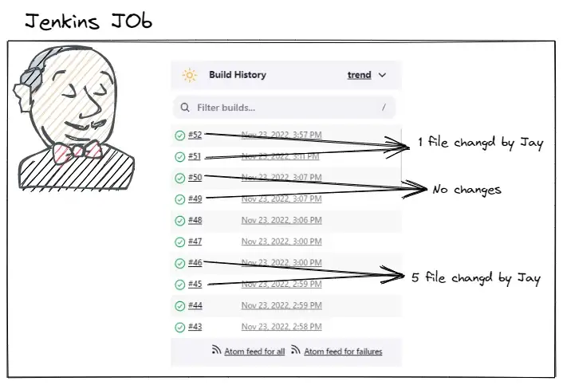
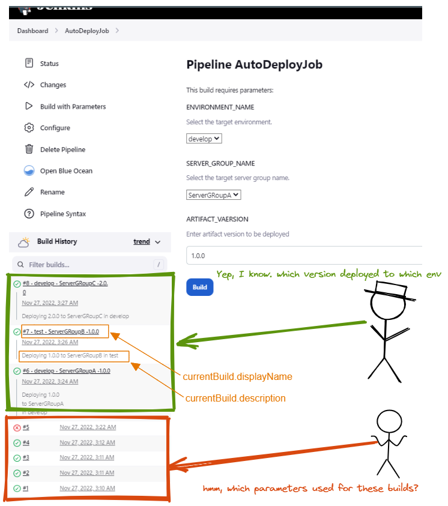

# **第六节 Jenkins: 获取文件变更列表、提交ID、提交人和提交信息**

**Jenkins — Get the latest changed files list, Commit ID, AuthorName, and Commit Message**



We sometimes get requirements such as “We need to run/execute this Jenkins job/stage” only based on changes from the previous build like below:


我们有时会得到诸如“我们需要运行/执行此 Jenkins 作业/阶段”之类的要求，仅基于对先前构建的更改，如下所示：

* Files changes from the previous build to the current build. 文件从以前的版本更改为当前版本。
* Commit message — for example, a particular word/pattern in the message.提交消息 — 例如，消息中的特定单词/模式。
* Commit ID 提交标识
* Author Name 作者姓名


If we use the native git commands via shell block, we always get the git differences between the last two commits, not the git changes between Jenkins builds.

如果我们通过 shell 块使用原生 git 命令，我们总是会得到最后两次提交之间的 git 差异，而不是Jenkins 构建之间的 git 更改。

In order to get expecting details, we can use the currentBuild.changeSets Jenkins environment variable like below.

为了获得预期的详细信息，我们可以使用`currentBuild.changeSetsJenkins `环境变量，如下所示。

```

pipeline {
    agent any

    stages {
        stage('Get Last Commit Details') {
            steps {
                script{

                    List<String> changes = getChangedFilesList()
                    println ("Changed file list: " + changes)

                    String gitCommitId = getGitcommitID()
                    println("GIT CommitID: " + gitCommitID)

                    String gitCommitAuthorName = getAuthorName()
                    println("GIT CommitAuthorName: " + gitCommitAuthorName)

                    String gitCommitMessage = getCommitMessage()
                    println("GIT CommitMessage: " + gitCommitMessage)

                }
            }
        }
    }
}

@NonCPS
List<String> getChangedFilesList(){
    def changedFiles = []
    for ( changeLogSet in currentBuild.changeSets){
        for (entry in changeLogSet.getItems()){
            changedFiles.addAll(entry.affectedPaths)
        }
    }
    return changedFiles
}

@NonCPS
String getGitcommitID(){
    gitCommitID = " "
    for ( changeLogSet in currentBuild.changeSets){
        for (entry in changeLogSet.getItems()){
            gitCommitID = entry.commitId
        }
    }
    return gitCommitID
}

@NonCPS
String getAuthorName(){
    gitAuthorName = " "
    for ( changeLogSet in currentBuild.changeSets){
        for (entry in changeLogSet.getItems()){
            gitAuthorName = entry.authorName
        }
    }
    return gitAuthorName
}

@NonCPS
String getCommitMessage(){
    commitMessage = " "
    for ( changeLogSet in currentBuild.changeSets){
        for (entry in changeLogSet.getItems()){
            commitMessage = entry.msg
        }
    }
    return commitMessage
}
```

Once you get the required values, we can utilize them as data sources to control the flow of our Jenkins pipeline.


获得所需的值后，我们可以利用它们作为数据源来控制 Jenkins 管道的流程。

> 注意：人们经常将 changeSet 视为他们不了解的内容。是在此构建和上一个构建之间修改的文件列表。如果前一个失败并被重新触发，则 changeSet 将为空。您可能希望获取给定分支的更改列表。

## Jenkins: 如何更新当前构建名称和描述

Jenkins is a famous and mostly used CI tool and we are also using it for build and release and other automated jobs. We also have a deployment job that deploys the selected artifact version to selected server groups (similar to autoscaling groups in AWS) in the selected environment. The job is working as expected. By default, Jenkins set the build name as the build number (see the red color box in the below snapshot). what if somebody wants to know to which environment and server group 3rd or 4th build jobs deployed? In that case, we have to open the job details and needs to check.




But for the 6th,7th, and 8th builds, by seeing the build details themselves without opening, we can get all the important details. This can be achieved by updating the currentBuild.displayName and currentBuild.description variables.

但是对于第 6、7 和 8 个构建，通过不打开即可查看构建细节本身，我们可以获得所有重要细节。

这可以通过更新`currentBuild.displayName`和`currentBuild.description`变量来实现。
`Sample template` 示例模板:

```
pipeline {
    agent any

    parameters {
        choice choices: ['develop', 'test', 'state', 'prod'], description: 'Select the target environment.', name: 'ENVIRONMENT_NAME'
        choice choices: ['ServerGRoupA', 'ServerGRoupB', 'ServerGRoupC'], description: 'Select the target server group name.', name: 'SERVER_GROUP_NAME'
        string defaultValue: '1.0.0',description: 'Enter artifact version to be deployed', name: 'ARTIFACT_VAERSION'
    }
    stages {
        stage('Initilization') {
            steps {
                echo 'Initilizating'
                script{
                    currentBuild.displayName = "#${BUILD_NUMBER} - ${params.ENVIRONMENT_NAME} - ${params.SERVER_GROUP_NAME} -${params.ARTIFACT_VAERSION}"
                    currentBuild.description = "Deploying ${params.ARTIFACT_VAERSION} to ${params.SERVER_GROUP_NAME} in ${params.ENVIRONMENT_NAME}"
                }
            }
        }
        stage('Download Atrifacts') {
            steps {
                echo "Downloading ${params.ARTIFACT_VAERSION} Atrifacts"
            }
        }
        stage('Deploy Atrifacts') {
            steps {
                echo "Deploying ${params.ARTIFACT_VAERSION} Atrifacts to ${params.SERVER_GROUP_NAME} in ${params.ENVIRONMENT_NAME}"
            }
        }
    }
}
```

