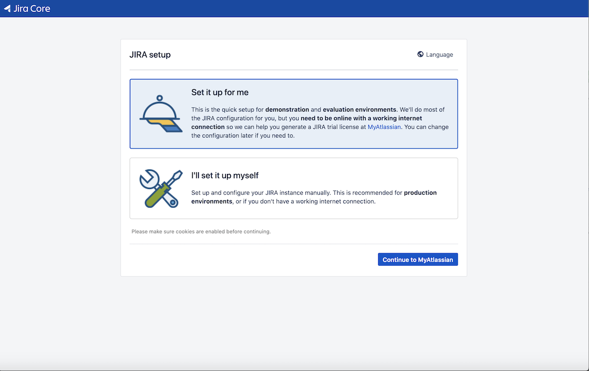
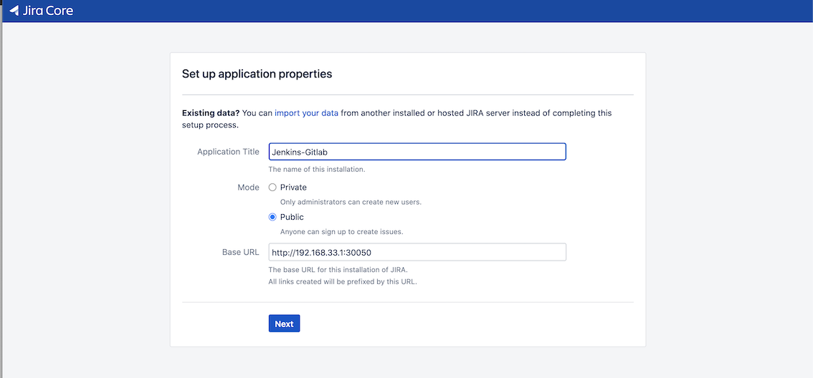
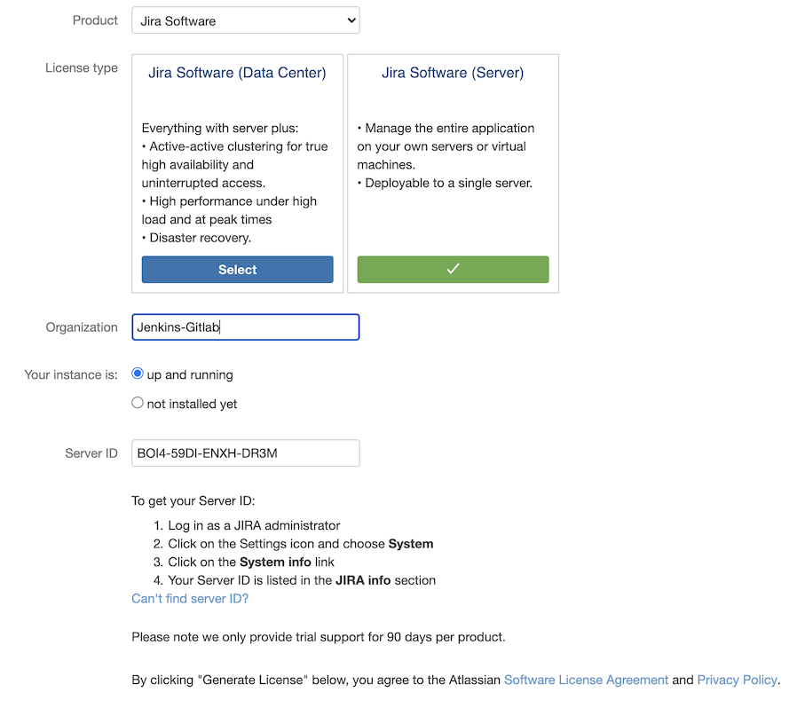
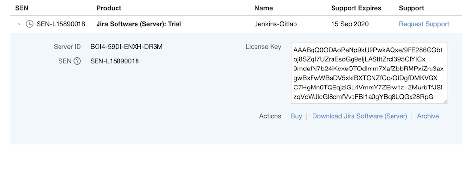

# 第一节 k8s 安装本地 Jira 服务

## 1、搭建 K8S Jira 服务

```
$ kubectl create ns devops
namespace/devops created
```

**`jira-deployment.yaml`**

```
apiVersion: apps/v1
kind: Deployment
metadata:
  labels:
    app: jira
  name: jira
  namespace: devops
spec:
  replicas: 1
  revisionHistoryLimit: 10
  selector:
    matchLabels:
      app: jira
  template:
    metadata:
      labels:
        app: jira
      name: jira
    spec:
      containers:
        - name: jira
          image: "docker.io/cptactionhank/atlassian-jira-software:7.10.1"
          resources:
            limits:
              cpu: "1"
              memory: 2Gi
            requests:
              cpu: "1"
              memory: "2G"
          volumeMounts:
            - name: "jira-home"
              mountPath: /opt/jira-home
      volumes:
        - name: "jira-home"
          emptyDir: {}
```

**`jira-service.yaml`**

```
apiVersion: v1
kind: Service
metadata:
  labels:
    app: jira
  name: jira
  namespace: devops
spec:
  type: NodePort
  ports:
    - port: 8080
      targetPort: 8080
      nodePort: 30050
  selector:
    app: jira
```

```
$ kubectl create ns devops
$ kubectl apply -f jira-deployment.yaml
$ kubectl apply -f jira-service.yaml
```

## 2、初始化 K8S Jira 服务



**我选择了`I'll setup myself`**

* **Jenkins-Gitlab**
* public
* http://192.168.33.1:3005



**`BOI4-59DI-ENXH-DR3M`**



**Generate Lience Key and paste it**



**New admin user :**

* admin
* admin