# 第二节 Jenkins 配置端到端流水线 （Jira 和 Gitlab的集成）

## 1、基于 Jira 流水线的方案

### 1-1 内容概览

* 使用`Jira`中`Git` 插件完成分支创建的予足 
* 优化改进万案 
* 详细技术万案 
* 调研Jira/Gitlab/Jenkins 


### 1-2 现状一使用`Jira`中的Git插件实现集成 

**效果**： 

* 能够实现在Jira系统对应的任务下面创建分支 
* 或者开发人员在创建分支的时候名称包含`Jira ID`自动关联

**不足**： 

* 插件不稳定，资源消耗大。
* 手动创建分支，增加了人员成本。

### 1-3 改进方案

**效果**

* 创建故事或者任务自动在对应的代码库创建分支口 
* 故事或者任务在关联到发布之后自动创建`release`分支和合并请求

**实现**

配置`Jira Webhook`触发`Jenkins`操作`Gitlab`系统

### 1-4 技术方案

* 创建`issues`关联模块，模块名称同`git`仓库名称 
	* `git`: `demo-maven-service`
	* `jira Component`:   `demo-maven-service`

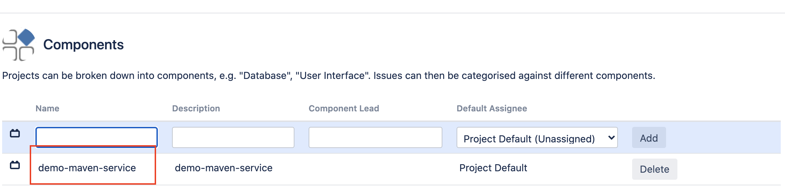

* JIRA创建`issues`（任务或者故事），关联对应模块。 
* `Jenkins`根据模块（components）在对应的仓库中创建分支（IssueName)。 
* `JIRA`更新issues, Jenkins根据模块（components）在对应的仓库中创建分支 (issuesNarne) 
* `JIRA`更新issues到版本中。Jenkins根据issues中的模块信息，在对应的仓库中创建`release`分支（fixVersion)，并创建特性分支（`issueName`）到`release`分支的MR

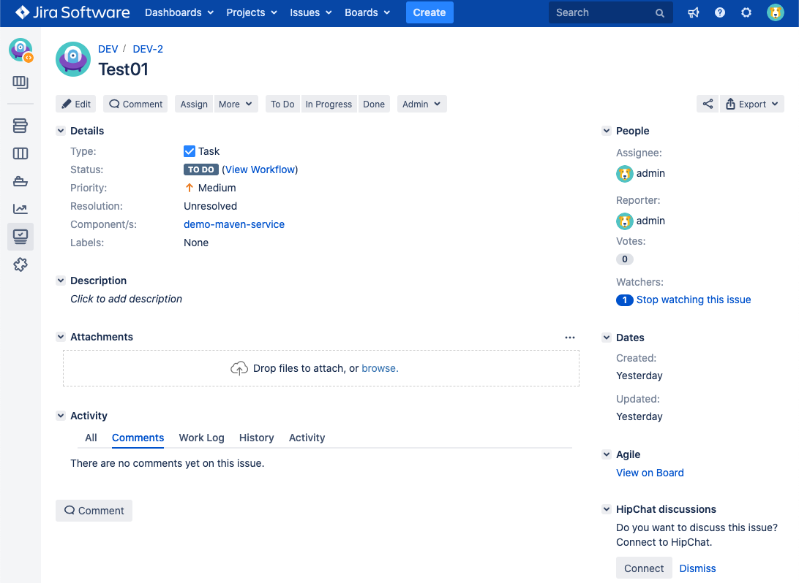


## 2、Jira 自动创建 Gitlab 分支

### 2-1 Gilab Shard Library

`gitlab.groovy`

```
package org.devops

//封装HTTP请求
def HttpReq(reqType,reqUrl,reqBody){
    def gitServer = "http://192.168.33.1:30088/api/v4"
    withCredentials([string(credentialsId: 'gitlab-token', variable: 'gitlabToken')]) {
      result = httpRequest customHeaders: [[maskValue: true, name: 'PRIVATE-TOKEN', value: "${gitlabToken}"]], 
                httpMode: reqType, 
                contentType: "APPLICATION_JSON",
                consoleLogResponseBody: true,
                ignoreSslErrors: true, 
                requestBody: reqBody,
                url: "${gitServer}/${reqUrl}"
                //quiet: true
    }
    return result
}


//更新文件内容
def UpdateRepoFile(projectId,filePath,fileContent){
    apiUrl = "projects/${projectId}/repository/files/${filePath}"
    reqBody = """{"branch": "master","encoding":"base64", "content": "${fileContent}", "commit_message": "update a new file"}"""
    response = HttpReq('PUT',apiUrl,reqBody)
    println(response)

}

//获取文件内容
def GetRepoFile(projectId,filePath){
    apiUrl = "projects/${projectId}/repository/files/${filePath}/raw?ref=master"
    response = HttpReq('GET',apiUrl,'')
    return response.content
}

//创建仓库文件
def CreateRepoFile(projectId,filePath,fileContent){
    apiUrl = "projects/${projectId}/repository/files/${filePath}"
    reqBody = """{"branch": "master","encoding":"base64", "content": "${fileContent}", "commit_message": "create a new file"}"""
    response = HttpReq('POST',apiUrl,reqBody)
    println(response)
}


//更改提交状态
def ChangeCommitStatus(projectId,commitSha,status){
    commitApi = "projects/${projectId}/statuses/${commitSha}?state=${status}"
    response = HttpReq('POST',commitApi,'')
    println(response)
    return response
}

//获取项目ID
def GetProjectID(repoName='',projectName){
    projectApi = "projects?search=${projectName}"
    response = HttpReq('GET',projectApi,'')
    def result = readJSON text: """${response.content}"""
    
    for (repo in result){
       // println(repo['path_with_namespace'])
        if (repo['path'] == "${projectName}"){
            
            repoId = repo['id']
            println(repoId)
        }
    }
    return repoId
}

//删除分支
def DeleteBranch(projectId,branchName){
    apiUrl = "/projects/${projectId}/repository/branches/${branchName}"
    response = HttpReq("DELETE",apiUrl,'').content
    println(response)
}

//创建分支
def CreateBranch(projectId,refBranch,newBranch){
    try {
        branchApi = "projects/${projectId}/repository/branches?branch=${newBranch}&ref=${refBranch}"
        response = HttpReq("POST",branchApi,'').content
        branchInfo = readJSON text: """${response}"""
    } catch(e){
        println(e)
    }  //println(branchInfo)
}

//创建合并请求
def CreateMr(projectId,sourceBranch,targetBranch,title,assigneeUser=""){
    try {
        def mrUrl = "projects/${projectId}/merge_requests"
        def reqBody = """{"source_branch":"${sourceBranch}", "target_branch": "${targetBranch}","title":"${title}","assignee_id":"${assigneeUser}"}"""
        response = HttpReq("POST",mrUrl,reqBody).content
        return response
    } catch(e){
        println(e)
    }
}

//搜索分支
def SearchProjectBranches(projectId,searchKey){
    def branchUrl =  "projects/${projectId}/repository/branches?search=${searchKey}"
    response = HttpReq("GET",branchUrl,'').content
    def branchInfo = readJSON text: """${response}"""
    
    def branches = [:]
    branches[projectId] = []
    if(branchInfo.size() ==0){
        return branches
    } else {
        for (branch in branchInfo){
            //println(branch)
            branches[projectId] += ["branchName":branch["name"],
                                    "commitMes":branch["commit"]["message"],
                                    "commitId":branch["commit"]["id"],
                                    "merged": branch["merged"],
                                    "createTime": branch["commit"]["created_at"]]
        }
        return branches
    }
}

//允许合并
def AcceptMr(projectId,mergeId){
    def apiUrl = "projects/${projectId}/merge_requests/${mergeId}/merge"
    HttpReq('PUT',apiUrl,'')
}
```


* 获取项目ID接口

```
api/v4/projects?search=${projectName}
```

* 创建分支接口

```
api/v4/projects/${projectName}/repository/branches?branch=${NewBranch}&ref=${refBranch}
```

* 创建合并请求接口
	* `api/v4/projects/${projectId}/merge_requests`

```
"""{"source_branch":"${sourceBranch}", "target_branch": "${targetBranch}","title" : "${title}","assignee_id":"${assigneeUser}"}"""
```


### 2-2 Jira Shared Library

```
package org.devops

//封装HTTP请求
def HttpReq(reqType,reqUrl,reqBody){
    def apiServer = "http://192.168.33.1:30050/rest/api/2"
   
   result = httpRequest authentication: 'jira-admin-user',
            httpMode: reqType, 
            contentType: "APPLICATION_JSON",
            consoleLogResponseBody: true,
            ignoreSslErrors: true, 
            requestBody: reqBody,
            url: "${apiServer}/${reqUrl}"
            //quiet: true
    return result
}

//执行JQL
def RunJql(jqlContent){
    apiUrl = "search?jql=${jqlContent}"
    response = HttpReq("GET",apiUrl,'')
    return response
}
```

### 2-3 `Jira-Jenkins` - webhook

* 配置触发器URL为Jenkins地址 
* 通过JQL配置事件触发的项目 
* 选择触发事件 

`plugins/servlet/webhooks` : `system -> webhhooks`

* `jenkins-hook`
* `http://192.168.33.11:8080/generic-webhook-trigger/invoke?token=jira-devops-service&projectKey=${project.Key}`
* `project = DEV `
* Issue: created, updated, deleted

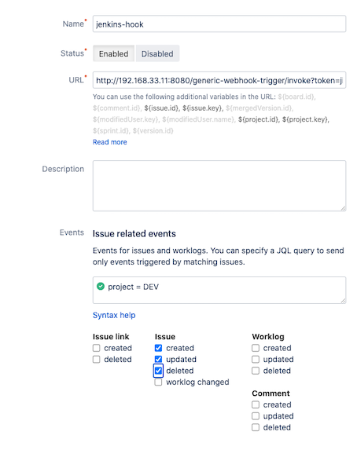

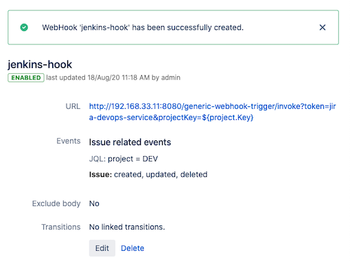

### 2-4 `Jenkins Pipeline`: `jira-devops-service`


* 获取hook中参数 
	* 获取问题名称 
	* 获取模块名称等数据 
* 生成项目唯一Token 
	* 使用项目名称标识 
* 过滤触发请求 
	* 限制只有故事任务等触发 

* **Generic Webhook Trigger**
	* Post content parameters	: `webHookData : $`   , `JSONPath`
	* Request parameter: `projectKey`
	* Token: `jira-devops-service`		
 
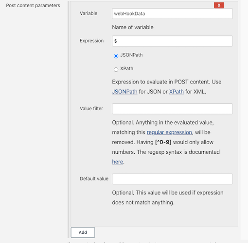

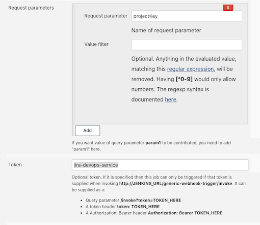


```
#!groovy

@Library('jenkinslib@master') _

def gitlab = new org.devops.gitlab()
def jira = new org.devops.jira()

pipeline {
    agent { node { label "hostmachine" }}

    stages{

        stage("FileterData"){
            steps{
                script{
                    response = readJSON text: """${webHookData}"""

                    println(response)

                    env.eventType = response["webhookEvent"]

                    switch(eventType) {
                        case "jira:version_created":
                            env.versionName = response["version"]["name"]
                            currentBuild.description = " Trigger by  ${eventType} ${versionName} "
                            break

                        case "jira:issue_created":
                            env.issueName = response['issue']['key']
                            env.userName = response['user']['name']
                            env.moduleNames = response['issue']['fields']['components']
                            env.fixVersion = response['issue']['fields']['fixVersions']
                            currentBuild.description = " Trigger by ${userName} ${eventType} ${issueName} "
                            break

                        case "jira:issue_updated":
                            env.issueName = response['issue']['key']
                            env.userName = response['user']['name']
                            env.moduleNames = response['issue']['fields']['components']
                            env.fixVersion = response['issue']['fields']['fixVersions']
                            currentBuild.description = " Trigger by ${userName} ${eventType} ${issueName} "
                            break
                            
                        case "jira:version_released":
                            env.versionName = response["version"]["name"]
                            currentBuild.description = " Trigger by  ${eventType} ${versionName} "
                            break

                        default:
                            println("hello")
                    }
                }
            }
        }
        
        stage("CreateVersionFile"){
            when {
                environment name: 'eventType', value: 'jira:version_created' 
            }
            
            steps{
                script{
                    //获取K8s文件
                    response = k8s.GetDeployment("demo-uat","demoapp")
                    response = response.content
                    //文件转换
                    base64Content = response.bytes.encodeBase64().toString()
                   //上传文件
                   gitlab.CreateRepoFile(7,"demo-uat%2f${versionName}-uat.yaml",base64Content)
                }
            
            }
        }
        
        stage("DeleteBranch"){
            when {
                environment name: 'eventType', value: 'jira:version_released'   
            }
            
            steps{
                script{
                    //获取issuesName
                    println("project%20%3D%20${projectKey}%20AND%20fixVersion%20%3D%20${versionName}%20AND%20issuetype%20%3D%20Task")
                    response = jira.RunJql("project%20%3D%20${projectKey}%20AND%20fixVersion%20%3D%20${versionName}%20AND%20issuetype%20%3D%20Task")
                    
                    response = readJSON text: """${response.content}"""
                    println(response)
                    issues = [:]
                    for ( issue in response['issues']){
                        println(issue["key"])
                        println(issue["fields"]["components"])
                        issues[issue["key"]] = []
                        
                        //获取issue关联的模块
                        for (component in issue["fields"]["components"] ){
                            issues[issue["key"]].add(component["name"])
                        }
                    
                    }
                    
                    println(issues)
                    
                    
                    //搜索gitlab分支是否已合并然后删除
                    
                    
                    for (issue in issues.keySet()){
                        for (projectName in issues[issue]){
                            repoName = projectName.split("-")[0]
                            projectId = gitlab.GetProjectID(repoName, projectName)
                            
                            try {
                                println("创建合并请求  RELEASE-${versionName}  ---> master")
                                result = gitlab.CreateMr(projectId,"RELEASE-${versionName}","master","RELEASE-${versionName}--->master")
                                result = readJSON text: """${result}"""
                                mergeId = result["iid"]
                                gitlab.AcceptMr(projectId,mergeId)
                                
                                sleep 15
                            } catch(e){
                                println(e)
                            }
                            response = gitlab.SearchProjectBranches(projectId,issue)
                            
                            println(response[projectId][0]['merged'])
                            
                            if (response[projectId][0]['merged'] == false){
                                println("${projectName} --> ${issue} -->此分支未合并暂时忽略！")
                            } else {
                                println("${projectName} --> ${issue} -->此分支已合并准备清理！")
                                gitlab.DeleteBranch(projectId,issue)
                            }
                        
                        }

                    }
                }
            }
        }

        stage("CreateBranchOrMR"){

            when {
                anyOf {
                    environment name: 'eventType', value: 'jira:issue_created'   //issue 创建 /更新
                    environment name: 'eventType', value: 'jira:issue_updated' 
                }
            }

            steps{
                script{
                    def projectIds = []
                    println(issueName)
                    fixVersion = readJSON text: """${fixVersion}"""
                    println(fixVersion.size())

                    //获取项目Id
                    def projects = readJSON text: """${moduleNames}"""
                    for ( project in projects){
                        println(project["name"])
                        projectName = project["name"]
                        currentBuild.description += "\n project: ${projectName}"
                        repoName = projectName.split("-")[0]
                        println(repoName)
                        try {
                            projectId = gitlab.GetProjectID(repoName, projectName)
                            println(projectId)
                            projectIds.add(projectId)   
                        } catch(e){
                            println(e)
                            println("未获取到项目ID，请检查模块名称！")
                        }
                    } 

                    println(projectIds)  


                    if (fixVersion.size() == 0) {
                        for (id in projectIds){
                            println("新建特性分支--> ${id} --> ${issueName}")
                            currentBuild.description += "\n 新建特性分支--> ${id} --> ${issueName}"
                            gitlab.CreateBranch(id,"master","${issueName}")
                        }
                            
                        

                    } else {
                        fixVersion = fixVersion[0]['name']
                        println("Issue关联release操作,Jenkins创建合并请求")
                        currentBuild.description += "\n Issue关联release操作,Jenkins创建合并请求 \n ${issueName} --> RELEASE-${fixVersion}" 
                        
                        for (id in projectIds){

                            println("创建RELEASE-->${id} -->${fixVersion}分支")
                            gitlab.CreateBranch(id,"master","RELEASE-${fixVersion}")


                            
                            println("创建合并请求 ${issueName} ---> RELEASE-${fixVersion}")
                            gitlab.CreateMr(id,"${issueName}","RELEASE-${fixVersion}","${issueName}--->RELEASE-${fixVersion}")
                            
                        }
                    } 
                }
            }
        }
    }
}
```


### 2-5 创建`Jira Tasks` => 创建Gitlab分支

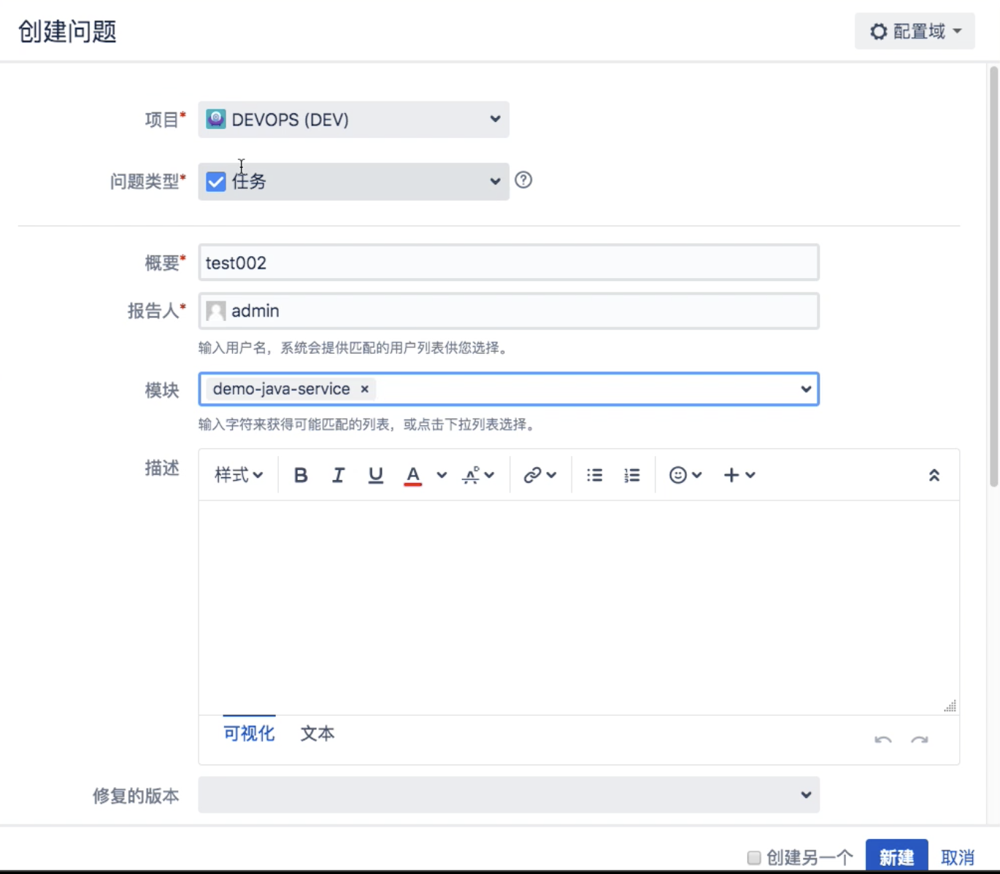

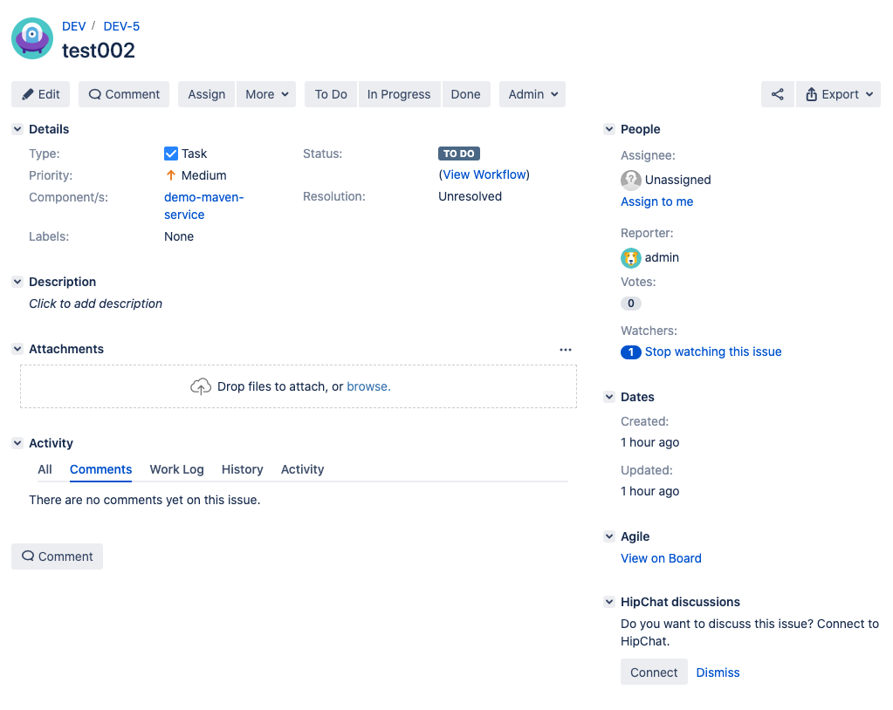

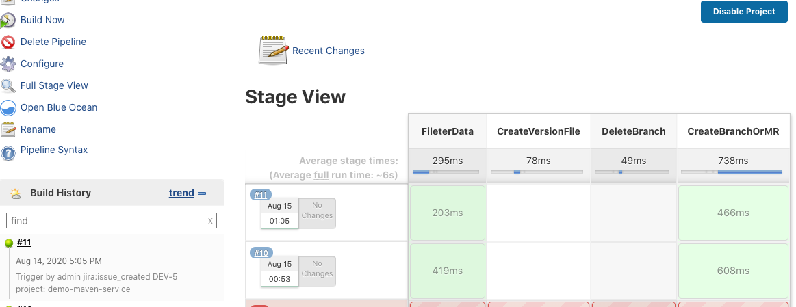

```
[Pipeline] stage
[Pipeline] { (CreateBranchOrMR)
[Pipeline] script
[Pipeline] {
[Pipeline] echo
DEV-5
[Pipeline] readJSON
[Pipeline] echo
0
[Pipeline] readJSON
[Pipeline] echo
demo-maven-service 
[Pipeline] echo
demo
[Pipeline] withCredentials
Masking supported pattern matches of $gitlabToken
...
```

## 3、Jira 自动创建 Gitlab 合并请求

* `JIRA`更新`issues`到版本中。`Jenkins`根据`issues`中的模块信息，在对应的仓库中创建`release`分支（`fixVersion`)，并创建特性分支（`issueName`）到`release`分支的MR

**分支策略**

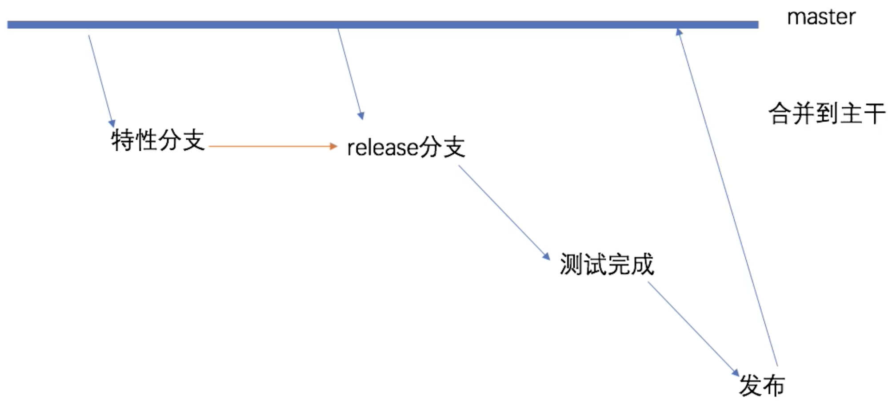

### 3-1 Update Issues version

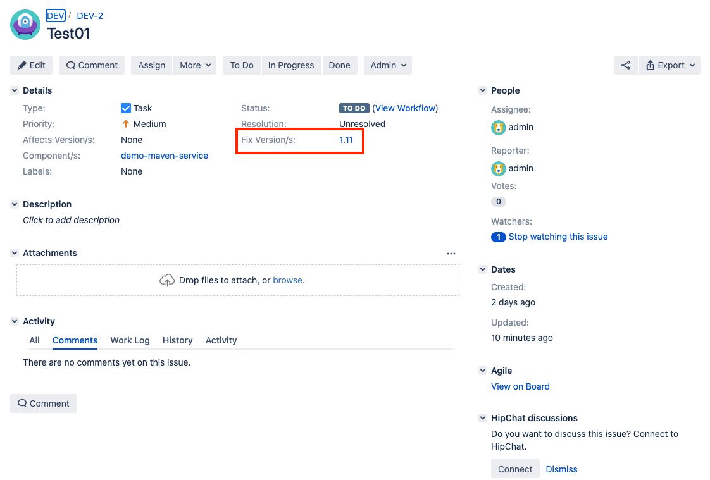

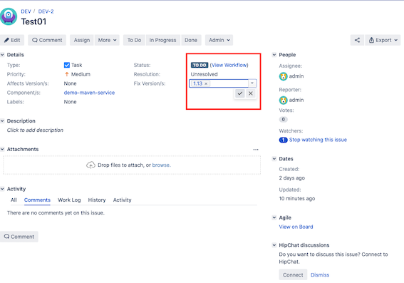

* `jira: version_created` //发布创建 
* `jira:issue_created`  //问题创建 
* `jira:issue_updated` //问题更新 

### 3-2 Version 合并触发pipeline

**Sharedlibrary: Jira**

```
case "jira:issue_updated":
        env.issueName = response['issue']['key']
        env.userName = response['user']['name']
        env.moduleNames = response['issue']['fields']['components']
        env.fixVersion = response['issue']['fields']['fixVersions']
        currentBuild.description = " Trigger by ${userName} ${eventType} ${issueName} "
        break
```

**Sharedlibrary: Gitlab**

```
//创建合并请求
def CreateMr(projectId,sourceBranch,targetBranch,title,assigneeUser=""){
    try {
        def mrUrl = "projects/${projectId}/merge_requests"
        def reqBody = """{"source_branch":"${sourceBranch}", "target_branch": "${targetBranch}","title":"${title}","assignee_id":"${assigneeUser}"}"""
        response = HttpReq("POST",mrUrl,reqBody).content
        return response
    } catch(e){
        println(e)
    }
}

//允许合并
def AcceptMr(projectId,mergeId){
    def apiUrl = "projects/${projectId}/merge_requests/${mergeId}/merge"
    HttpReq('PUT',apiUrl,'')
}
```

**Pipeline**

```
 } else {
            fixVersion = fixVersion[0]['name']
            println("Issue关联release操作,Jenkins创建合并请求")
            currentBuild.description += "\n Issue关联release操作,Jenkins创建合并请求 \n ${issueName} --> RELEASE-${fixVersion}" 
            
            for (id in projectIds){

                println("创建RELEASE-->${id} -->${fixVersion}分支")
                gitlab.CreateBranch(id,"master","RELEASE-${fixVersion}")


                
                println("创建合并请求 ${issueName} ---> RELEASE-${fixVersion}")
                gitlab.CreateMr(id,"${issueName}","RELEASE-${fixVersion}","${issueName}--->RELEASE-${fixVersion}")
                
            }
```


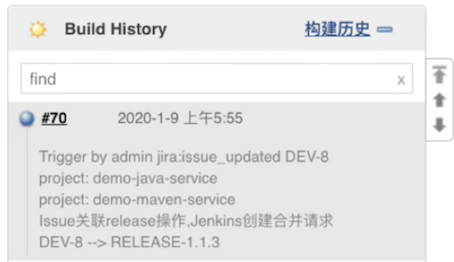

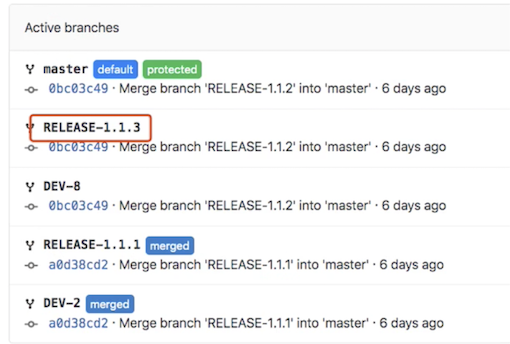

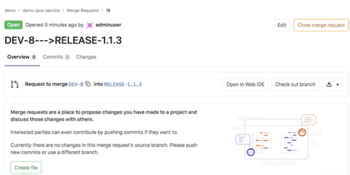


## 4、自动清理已合并的特性分支


### 4-1 Merge Task branch to release branch

项目目标： 自动删除**特性分支**例如`DEV-8`, 在它被 `merge` 到 `RELEASE` 分支， `JIRA`上的`VERSION`被`RELEASE`之后

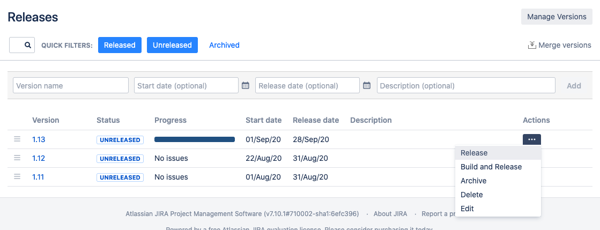

**`DEV-8` -> ` `RELEASE-1.1.3`**

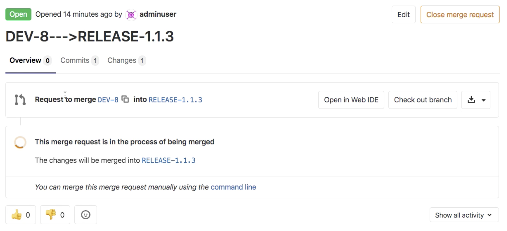


**`RELEASE-1.1.3` -> `MASTER`**

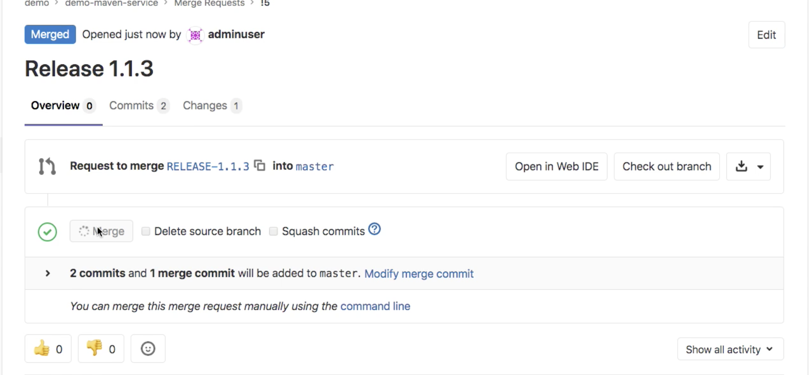

**此时`RELEASE-1.1.3`已经被`MEREGED`**

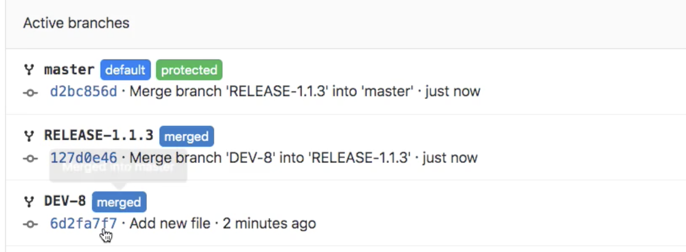


### 4-2 Pipeline 删除分支

**`jira:version_released`**

```
when {
             environment name: 'eventType', value: 'jira:version_released'   
  }
```
 
 
**获取issuesName**
  
```
println("project%20%3D%20${projectKey}%20AND%20fixVersion%20%3D%20${versionName}%20AND%20issuetype%20%3D%20Task")
response = jira.RunJql("project%20%3D%20${projectKey}%20AND%20fixVersion%20%3D%20${versionName}%20AND%20issuetype%20%3D%20Task")
    
response = readJSON text: """${response.content}"""
println(response)
issues = [:]
for ( issue in response['issues']){
    println(issue["key"])
    println(issue["fields"]["components"])
    issues[issue["key"]] = []
    
    //获取issue关联的模块
    for (component in issue["fields"]["components"] ){
        issues[issue["key"]].add(component["name"])
    }
    
}
println(issues)
```

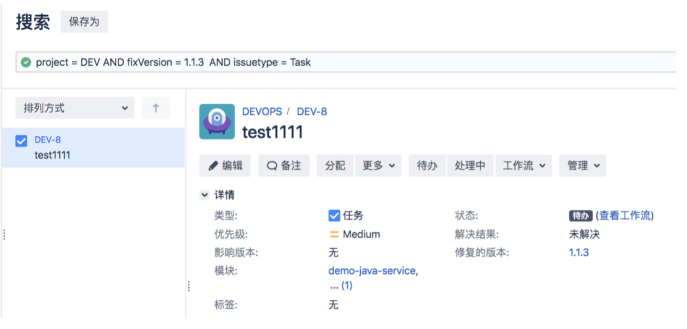

**搜索gitlab分支是否已合并然后删除**

```
for (issue in issues.keySet()){
    for (projectName in issues[issue]){
        repoName = projectName.split("-")[0]
        projectId = gitlab.GetProjectID(repoName, projectName)
        
        try {
            println("创建合并请求  RELEASE-${versionName}  ---> master")
            result = gitlab.CreateMr(projectId,"RELEASE-${versionName}","master","RELEASE-${versionName}--->master")
            result = readJSON text: """${result}"""
            mergeId = result["iid"]
            gitlab.AcceptMr(projectId,mergeId)
            
            sleep 15
        } catch(e){
            println(e)
        }
        response = gitlab.SearchProjectBranches(projectId,issue)
        
        println(response[projectId][0]['merged'])
        
        if (response[projectId][0]['merged'] == false){
            println("${projectName} --> ${issue} -->此分支未合并暂时忽略！")
        } else {
            println("${projectName} --> ${issue} -->此分支已合并准备清理！")
            gitlab.DeleteBranch(projectId,issue)
        }
    
    }

}
```

**`Shard Library: gitlab`  Gitlab API 删除 BRANCH**

```
//删除分支
def DeleteBranch(projectId,branchName){
    apiUrl = "/projects/${projectId}/repository/branches/${branchName}"
    response = HttpReq("DELETE",apiUrl,'').content
    println(response)
}
```

**DEV-8 特性分支被删除**

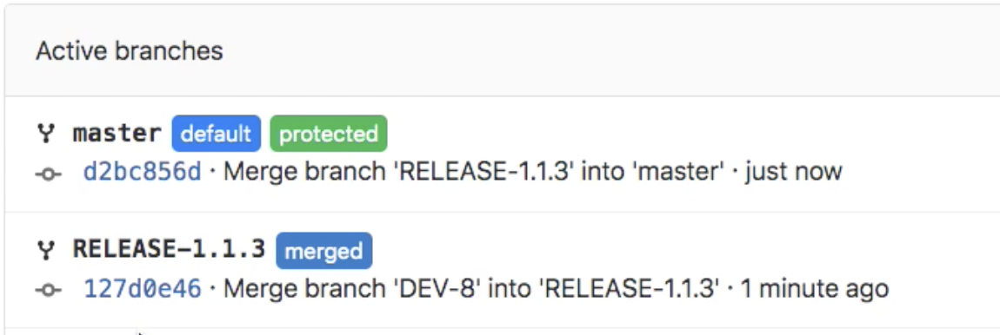


