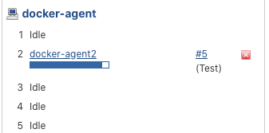

# **第一节 基于 Docker 配置构建资源池**

## 1、整体架构


## 2、Docker安装Jenkins Slave节点(静态)

首先我们在Jenkins的节点管理中，添加节点。输入节点的名称和类型。

配置节点信息：自定义目录 启动方式： `Launch agent by connecting it to the master` 。

* `docker-agent`
* `# of executors`: 5
* `/home/vagrant/workspace	`
* Labels: `docker-agent`


获取JNLP方式运行slave所需要的秘钥信息。


**秘钥信息获取方式,点击下载`slave-agent.jnlp`**，打开文件，及获取秘钥信息

```
<jnlp codebase="http://192.168.33.11:8080/computer/docker-agent/" spec="1.0+"><information><title>Agent for docker-agent</title><vendor>Jenkins project</vendor><homepage href="https://jenkins-ci.org/"></homepage></information><security><all-permissions></all-permissions></security><resources><j2se version="1.8+"></j2se><jar href="http://192.168.33.11:8080/jnlpJars/remoting.jar"></jar></resources><application-desc main-class="hudson.remoting.jnlp.Main"><argument>857f47abd55cb5c13567f8cc8c8ddfb77c5af04260efc2436b50a8b896b522e6</argument><argument>docker-agent</argument><argument>-workDir</argument><argument>/home/vagrant/workspace</argument><argument>-internalDir</argument><argument>remoting</argument><argument>-url</argument><argument>http://192.168.33.11:8080/</argument></application-desc></jnlp>
```

* 857f47abd55cb5c13567f8cc8c8ddfb77c5af04260efc2436b50a8b896b522e6

获取`jnlp slave`的`docker`镜像: https://hub.docker.com/r/jenkins/inbound-agent/

```
docker pull jenkins/inbound-agent

docker run --init -itd jenkins/inbound-agent -url http://192.168.33.11:8080 857f47abd55cb5c13567f8cc8c8ddfb77c5af04260efc2436b50a8b896b522e6 docker-agent
```

启动slave测试，出现以下日志表示成功连接。这个部分容易出现问题，原因很可能是因为网络权限导致的。

```
Aug 19, 2020 12:48:11 PM hudson.remoting.jnlp.Main createEngine
INFO: Setting up agent: docker-agent
Aug 19, 2020 12:48:11 PM hudson.remoting.jnlp.Main$CuiListener <init>
INFO: Jenkins agent is running in headless mode.
Aug 19, 2020 12:48:11 PM hudson.remoting.Engine startEngine
INFO: Using Remoting version: 4.3
Aug 19, 2020 12:48:11 PM hudson.remoting.Engine startEngine
WARNING: No Working Directory. Using the legacy JAR Cache location: /home/jenkins/.jenkins/cache/jars
Aug 19, 2020 12:48:11 PM hudson.remoting.jnlp.Main$CuiListener status
INFO: Locating server among [http://192.168.33.11:8080]
Aug 19, 2020 12:48:11 PM org.jenkinsci.remoting.engine.JnlpAgentEndpointResolver resolve
INFO: Remoting server accepts the following protocols: [JNLP4-connect, Ping]
Aug 19, 2020 12:48:11 PM hudson.remoting.jnlp.Main$CuiListener status
INFO: Agent discovery successful
  Agent address: 192.168.33.11
  Agent port:    50000
  Identity:      50:9b:15:1c:3b:3f:ab:bf:86:0b:82:fb:56:56:e5:f6
Aug 19, 2020 12:48:11 PM hudson.remoting.jnlp.Main$CuiListener status
INFO: Handshaking
Aug 19, 2020 12:48:11 PM hudson.remoting.jnlp.Main$CuiListener status
INFO: Connecting to 192.168.33.11:50000
Aug 19, 2020 12:48:11 PM hudson.remoting.jnlp.Main$CuiListener status
INFO: Trying protocol: JNLP4-connect
Aug 19, 2020 12:48:12 PM hudson.remoting.jnlp.Main$CuiListener status
INFO: Remote identity confirmed: 50:9b:15:1c:3b:3f:ab:bf:86:0b:82:fb:56:56:e5:f6
Aug 19, 2020 12:48:12 PM hudson.remoting.jnlp.Main$CuiListener status
INFO: Connected
```

查看效果


```
pipeline {
    agent { node { label "docker-agent" }}
    stages {
        stage('Test') {
            steps {
                sleep(20)
                echo "Hello world!"
              
            }
        }
    }
}
```

**console output**

```
Running on docker-agent in /home/vagrant/workspace/workspace/docker-agent2
...
```




## 3、基于Docker配置Jenkins Slave节点(动态)


docker插件： https://plugins.jenkins.io/docker-plugin/

项目地址： https://github.com/jenkinsci/docker-plugin

对与Jenkins动态slave的配置，其实就是Jenkins调用Docker的接口完成的。我们需要开启Docker远程访问。

docker 开启API远程访问 (mac) 参考文档： https://juejin.im/entry/5bdf04b06fb9a049e41223f1

```
docker pull bobrik/socat
docker run -d -v /var/run/docker.sock:/var/run/docker.sock -p 2376:2375 bobrik/socat TCP4-LISTEN:2375,fork,reuseaddr UNIX-CONNECT:/var/run/docker.sock
```

如果你的docker环境是使用的centos系统，可以做如下配置。编辑`/usr/lib/systemd/system/docker.service`

```
$ sudo vim /usr/lib/systemd/system/docker.service

...
ExecStart=/usr/bin/dockerd -H tcp://0.0.0.0:2375 -H unix://var/run/docker.sock
```

```
sudo systemctl daemon-reload
sudo systemctl restart docker
```

当我们把上面的配置完成后，可以通过Curl命令进行基本的测试API。出现一下信息表示成功开启。

```
$ curl -XGET http://127.0.0.1:2375/version
{"Platform":{"Name":"Docker Engine - Community"},"Components":[{"Name":"Engine","Version":"19.03.12","Details":{"ApiVersion":"1.40","Arch":"amd64","BuildTime":"2020-06-22T15:45:28.000000000+00:00","Experimental":"false","GitCommit":"48a66213fe","GoVersion":"go1.13.10","KernelVersion":"3.10.0-957.12.2.el7.x86_64","MinAPIVersion":"1.12","Os":"linux"}},{"Name":"containerd","Version":"1.2.13","Details":{"GitCommit":"7ad184331fa3e55e52b890ea95e65ba581ae3429"}},{"Name":"runc","Version":"1.0.0-rc10","Details":{"GitCommit":"dc9208a3303feef5b3839f4323d9beb36df0a9dd"}},{"Name":"docker-init","Version":"0.18.0","Details":{"GitCommit":"fec3683"}}],"Version":"19.03.12","ApiVersion":"1.40","MinAPIVersion":"1.12","GitCommit":"48a66213fe","GoVersion":"go1.13.10","Os":"linux","Arch":"amd64","KernelVersion":"3.10.0-957.12.2.el7.x86_64","BuildTime":"2020-06-22T15:45:28.000000000+00:00"}
```

**Jenkins配置**

我们需要安装插件 Docker plugin

### 方式1： 启动镜像进行构建(无需连接master)

```
dockerNode(dockerHost: 'tcp://192.168.33.11:2375', image: 'jenkins/inbound-agent') {
    // some block
    sh "sleep 50"
}
```


```
[Pipeline] Start of Pipeline
[Pipeline] dockerNode
Launching new docker node based on jenkins/inbound-agent
Pulling from jenkins/inbound-agent
Digest: sha256:9392c06eaef92cebe60deae0581541e8ef19197533cd628d792374c4a32199c9
Status: Image is up to date for jenkins/inbound-agent:latest
Waiting for node to be online ...
Node docker-0001vtsr0hv0n is online.
[Pipeline] {
[Pipeline] sh
+ sleep 50
[Pipeline] }
Terminating docker node ...
Disconnected computer for node 'docker-0001vtsr0hv0n'.
Removed Node for node 'docker-0001vtsr0hv0n'.
```

### 方式2： 使用CLoud

`Manage Jenkins` -> `Manage Nodes and Clouds` -> `Configure Clouds`


**Docker Cloud details**

* Docker Host URI Docker主机信息(需要开启Docker配置)
	* tcp://192.168.33.11:2375
	* unix:///var/run/docker.sock
* Connection Timeout 连接超时时间
* Read Timeout 读操作超时时间 （调大些，容易出现超时的情况）
* Enabled 是否启用？默认否
* Error Duration 错误的持续时间 默认300 5分钟

* Container Cap 容器数量 负值或零，或2147483647都意味着“无限制” ,默认值100。
	* 10

 
 
**Docker Agent templates**

* Labels 节点标签: `jenkins-docker-agent`
* Enabled 是否启动 默认否
* Name 节点名称 `jenkins-docker-agent`
* Docker Image 镜像标签: `jenkins/inbound-agent`
* Remote File System Root 远程文件系统根目录  `/home/jenkins`
* 用法 自定义指定项目运行
* Connect method 连接方式
* **JNLP 推荐**
* User 运行用户 :   `jenkins`
* Jenkins URL jenkins地址 `http://192.168.33.11:8080`
* Idle timeout 空闲时间多少秒后杀死slave
* SSH
* Docker Container
* Pull strategy 镜像下载策略
* Pull timeout 镜像下载超时时间 单位秒
* Instance Capacity 实例数量


 
 
 测试

```
node("jenkins-docker-agent"){
     sh "sleep 30"
    echo "Hello world!"
}
```

 
 
```
[Pipeline] node
Running on jenkins-docker-agent-0001w25yyyc8a on docker in /home/jenkins/workspace/dokcer-agent3
[Pipeline] {
[Pipeline] sh
```


