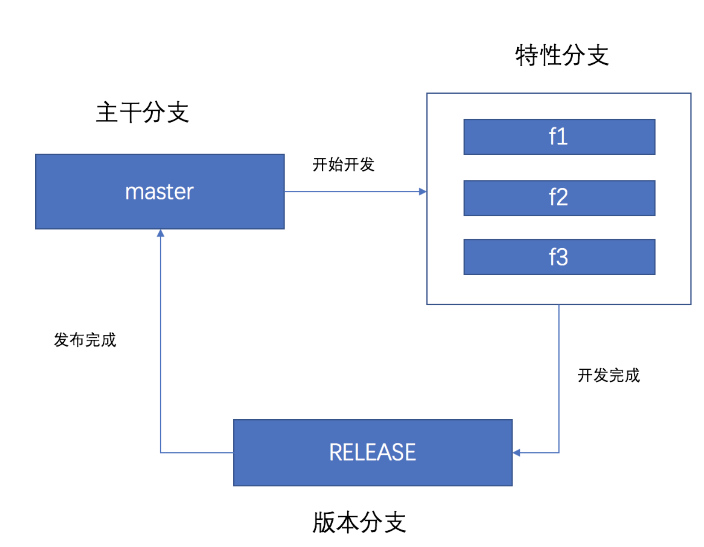
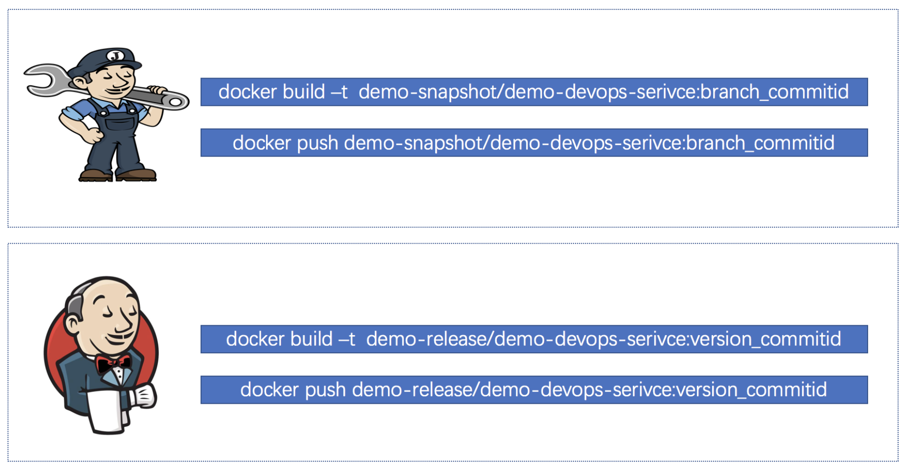
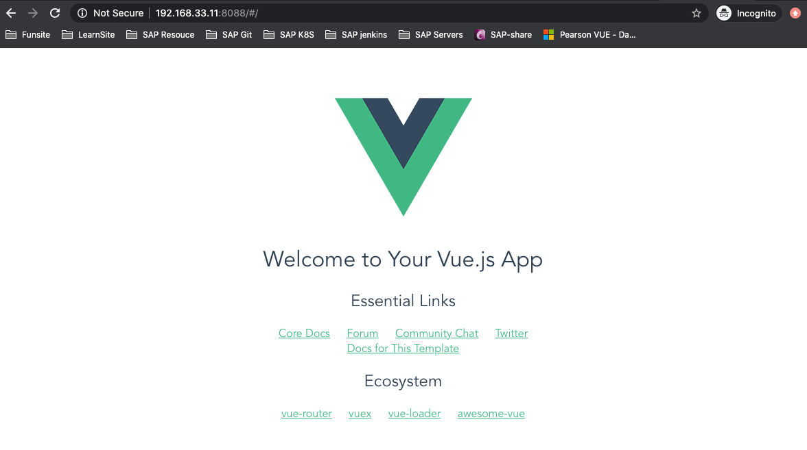

# 第三节 构建应用镜像到镜像仓库管理


将应用构建成镜像、将镜像上传到镜像仓库非常简单。通过命令就能解决。镜像仓库巨大爆满如何解决？ 我们需要在开始使用前就应该设置好镜像的构建策略。（每个公司中管理不一样，具体可根据分支策略决定）。

## 1、分支开发策略

* 主干分支 `master`
* 特性分支 `f1 f2`
* 版本分支 `release`


你会发现：

* 特性分支需要构建发布到特性环境验证。
* 版本分支需要构建发布到`UAT/STAG/PROD`环境验证。

考虑到：

* 特性分支产生的镜像会很多，而且并不重要可以定时清理掉。
* 版本分支产生相对较少（考虑到版本修复情况），每个版本只有一个镜像。（上线发布完成后清除掉其他）



## 2、 镜像管理规范

### 1-1 命名规范

* 仓库类型
	* snapshot ： 开发版本仓库
	* release ： 生产正式版本仓库
* 仓库命名
	* snapshot ： 业务/项目名称-snapshot demo-snapshot
	* release : 业务/项目名称-release demo-release
* 镜像命名
	* (业务/项目名称)/应用名称/标签
	* DEV : `demo-snapshot/demo-devops-service:branch_commitid`
	* PRD: `demo-release/demo-devops-service:version_commitid`
* 标签命名
	* `分支名_提交ID`
	* `版本号_提交ID`

提交ID的意义： 减少重复构建

### 1-2 镜像清理策略



随着镜像越来越多，频繁更新导致Harbor镜像仓库容量很快爆满。

* snapshot仓库： 每天晚上定时清理前一天的镜像（注意风险）
* release仓库： 版本发布完成后，清除版本其他镜像

* 1.1.1_xxxxxxxxxx11
* 1.1.1_xxxxxxxxxx22


## 2、 构建应用镜像

### 2-1 编写应用Dockerfile

```
$ cd demo
$ pwd
/home/vagrant/workspace/workspace/demo-pipeline3/demo
 
$ touch Dockerfile
$ vim Dockerfile
 
FROM nginx:latest

COPY dist /usr/share/nginx/html
```

### 2-2 配置流水线构建镜像

```
docker build -t demo-web-app:1.1.1 .
```

### 2-3 上传镜像

```
docker push demo-web-app:1.1.1
```
**Jenkinsfile**

```
pipeline {
    agent {node {label "hostmachine"}}
    stages {
        stage('WebBuild') {
            steps {
                script {
                    docker.image('node:10.19.0-alpine').inside('-u 0:0 -v /var/jenkins_home/.npm:/root/.npm') {
                
                
                        sh """
                            id 
                            ls /root/.npm

                            ls /root/ -a
                            npm config set unsafe-perm=true
                            npm config list
                            npm config set cache  /root/.npm
                            #npm config set registry https://registry.npm.taobao.org
                            npm config list
                            ls 
                            cd demo && npm install  --unsafe-perm=true && npm run build  && ls -l dist/ && sleep 15 
                        """
                    }
                }
            }
        }
      
      stage("BuildImage"){
        steps {
          script{
            
            
            sh """
                #构建镜像
                cd demo
                docker build -t demo/demo-web-app:1.1.1_xxxxxxxx1 .
                
                #docker push demo/demo-web-app:1.1.1_xxxxxxxx1
                
            """
            
          }
        }
      }
    }
}
```

**console output**

```
+ cd demo
+ docker build -t demo/demo-web-app:1.1.1_xxxxxxxx1 .
Sending build context to Docker daemon    203MB
..
Successfully built 3149ee3602a7
Successfully tagged demo/demo-web-app:1.1.1_xxxxxxxx1
```
```
 $ docker images
REPOSITORY                      TAG                 IMAGE ID            CREATED             SIZE
demo/demo-web-app               1.1.1_xxxxxxxx1     3149ee3602a7        6 minutes ago       133MB
```


运行镜像

```
docker run -itd -p 8088:80 --name nginx-server demo/demo-web-app:1.1.1_xxxxxxxx1
```

```
http://192.168.33.11:8088/#/
```




## 3、 镜像清理(Harbor) 注意风险 扩展研究

**获取标签**

* https://registry.demo.com/api/repositories/${registryName}/${serviceName}/tags
* 方式： GET


**删除标签**

* https://registry.demo.com/api/repositories/${registryName}/${serviceName}/tags/${tag}
* 方式： DELETE

```
#!groovy
@Library('jenkinslib@master') _

def tools = new org.devops.tools()

String registryName = "${env.registryName}"
String serviceName = "${env.serviceName}"
String tagName = "${env.tagName}"
def harborProjects = []

currentBuild.description = "Trigger by ${serviceName} ${tagName}"


pipeline {
agent { node { label "build"} }

stages{

stage("GetHarborTags"){
    steps{
        timeout(time:5, unit:"MINUTES"){
            script{
                tools.PrintMes("获取Harbor仓库中的项目信息","green")
                println(serviceName)
                            
                try {
                    response = httpRequest authentication: 'harbor-admin,
                                           url: "https://registry.demo.com/api/repositories/${registryName}/${serviceName}/tags",
                                           ignoreSslErrors: true
                    //println(response.content)
                    response = readJSON text: """${response.content}"""
                            
                } catch(e){
                    response = ['name':'']
                    println(e)
                    println("Harbor镜像不存在此标签！")
                            
                }

                /*println(tagName)
                for (tagname in response){
                    //println(response)
                    harborProjects << tagname['name']
                }
                        
                println(harborProjects)*/

            }
        }
    }
}


        
stage("DeleteHarborTags"){
    steps{
        timeout(time:20, unit:"MINUTES"){
            script{
                tools.PrintMes("总共找到 ${harborProjects.size()} 个标签","green")
                sumImageNum = harborProjects.size()
                for (tag in harborProjects){
                    sumImageNum -= 1

                    tools.PrintMes(" ${sumImageNum}  Delete Tags ---> ${registryName} --> ${serviceName} --> ${tag} ","green")
                           
                    httpRequest httpMode: 'DELETE',
                               authentication: 'c016027e-0573-4246-93cf-f4a55b08a86a',
                               url: "https://registry.demo.com/api/repositories/${registryName}/${serviceName}/tags/${tag}",
                               ignoreSslErrors: true

                    sleep 1
                }
            }
        }
    }
}
}


post {
always{
    script{
        cleanWs notFailBuild: true 
    }
}
}
}
```