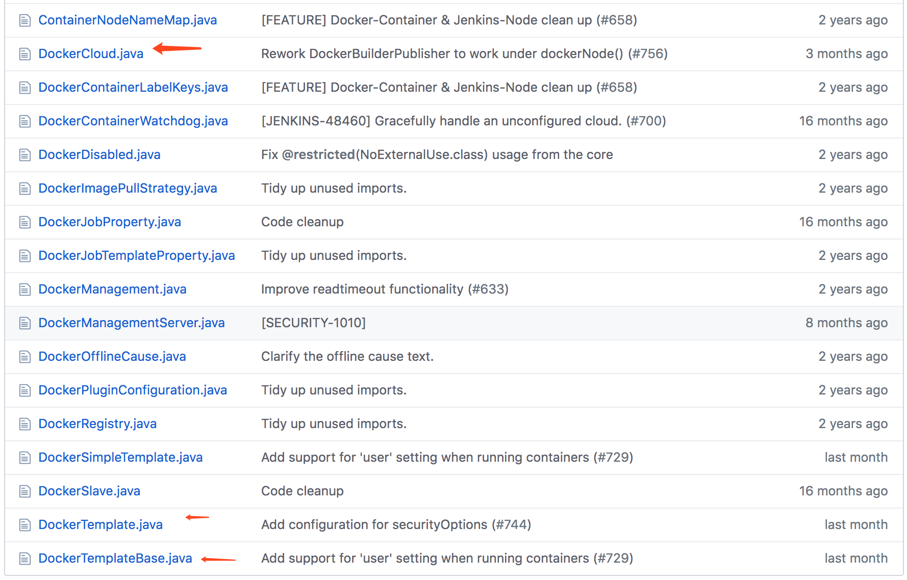
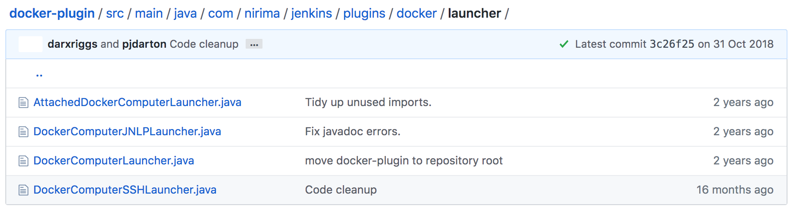
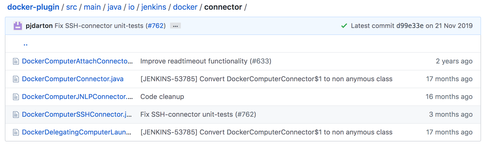
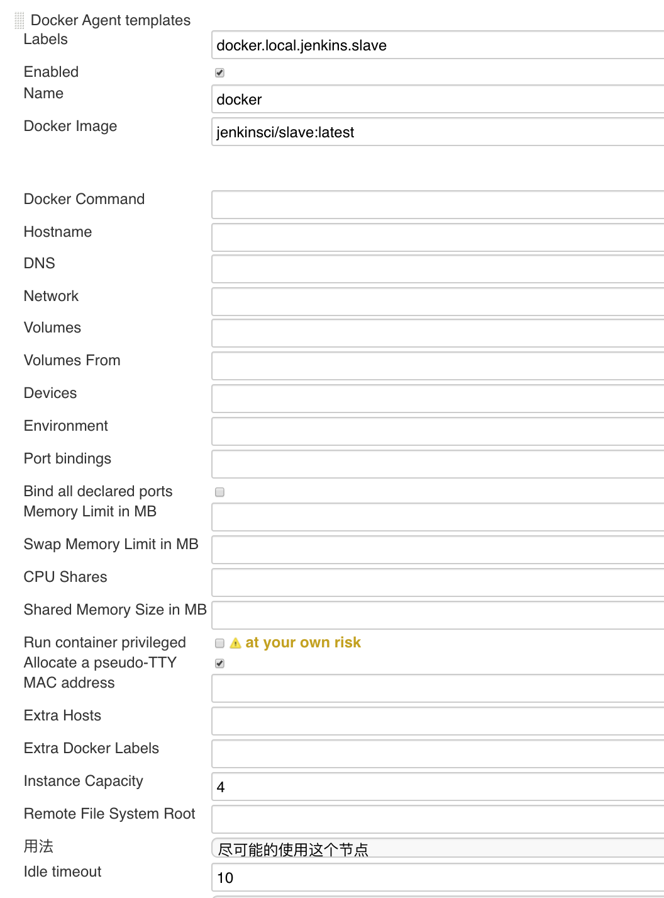
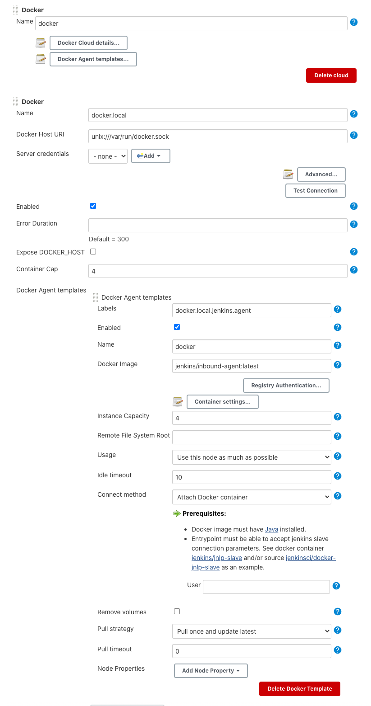
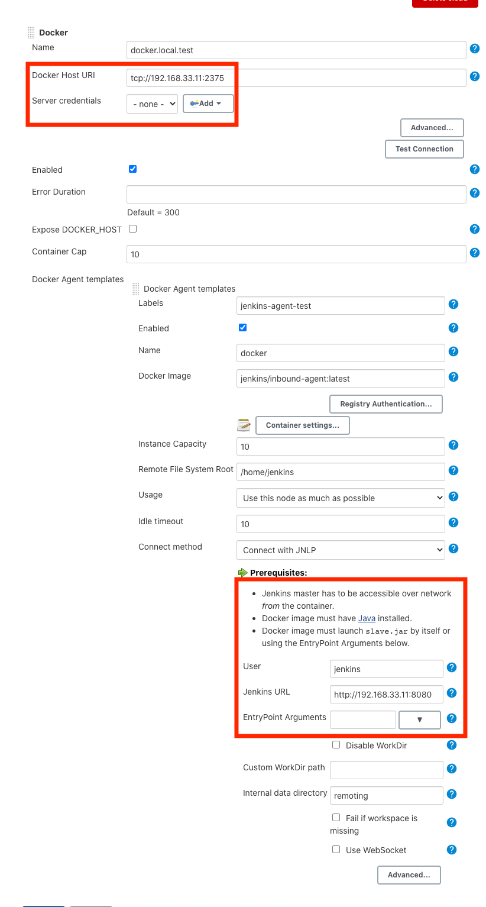

# 第四节 使用Groovy代码初始化Docker配置

## 1、 解析官方提供的groovy代码

插件地址: https://plugins.jenkins.io/docker-plugin/


* https://github.com/jenkinsci/docker-plugin/blob/master/docs/attachments/docker-plugin-configuration-script.groovy

```
import com.nirima.jenkins.plugins.docker.DockerCloud
import com.nirima.jenkins.plugins.docker.DockerTemplate
import com.nirima.jenkins.plugins.docker.DockerTemplateBase
import com.nirima.jenkins.plugins.docker.launcher.AttachedDockerComputerLauncher
import io.jenkins.docker.connector.DockerComputerAttachConnector
import jenkins.model.Jenkins
```

`src/main/java/com/nirima/jenkins/plugins/docker`目录可以看到这些源码文件。




`src/main/java/com/nirima/jenkins/plugins/docker/launcher` 目录下可以看多支持的启动类型。




`src/main/java/io/jenkins/docker/connector` 目录下定义的是每个启动类型对应的连接器。



`dockerTemplateBaseParameters`定义容器的模板所需要的基本参数，实例化新的对象`dockerTemplateBase`。



```
//Docker容器的配置参数
def dockerTemplateBaseParameters = [
  bindAllPorts:       false,
  bindPorts:          '',
  cpuShares:          null,
  dnsString:          '',
  dockerCommand:      '',
  environmentsString: '',
  extraHostsString:   '',
  hostname:           '',
  image:              'jenkins/inbound-agent:latest',
  macAddress:         '',
  memoryLimit:        null,
  memorySwap:         null,
  network:            '',
  privileged:         false,
  pullCredentialsId:  '',
  sharedMemorySize:   null,
  tty:                true,
  volumesFromString:  '',
  volumesString:      ''
]

//Docker容器的配置参数
def DockerTemplateParameters = [
  instanceCapStr: '4',    //实例数量
  labelString:    'docker.local.jenkins.slave',    //节点标签
  remoteFs:       ''     //根目录
]

//src/main/java/com/nirima/jenkins/plugins/docker/DockerTemplateBase.java
//实例化参数
DockerTemplateBase dockerTemplateBase = new DockerTemplateBase(
  dockerTemplateBaseParameters.image,
  dockerTemplateBaseParameters.pullCredentialsId,
  dockerTemplateBaseParameters.dnsString,
  dockerTemplateBaseParameters.network,
  dockerTemplateBaseParameters.dockerCommand,
  dockerTemplateBaseParameters.volumesString,
  dockerTemplateBaseParameters.volumesFromString,
  dockerTemplateBaseParameters.environmentsString,
  dockerTemplateBaseParameters.hostname,
  dockerTemplateBaseParameters.memoryLimit,
  dockerTemplateBaseParameters.memorySwap,
  dockerTemplateBaseParameters.cpuShares,
  dockerTemplateBaseParameters.sharedMemorySize,
  dockerTemplateBaseParameters.bindPorts,
  dockerTemplateBaseParameters.bindAllPorts,
  dockerTemplateBaseParameters.privileged,
  dockerTemplateBaseParameters.tty,
  dockerTemplateBaseParameters.macAddress,
  dockerTemplateBaseParameters.extraHostsString
)
```

根据Docker容器的配置参数，创建一个`DockerComputerAttachConnector`类型的容器模板。

```
//创建容器模板
// src/main/java/com/nirima/jenkins/plugins/docker/DockerTemplate.java
DockerTemplate dockerTemplate = new DockerTemplate(
  dockerTemplateBase,
  new DockerComputerAttachConnector(),
  DockerTemplateParameters.labelString,
  DockerTemplateParameters.remoteFs,
  DockerTemplateParameters.instanceCapStr
)
```

声明DockerCLoud的配置信息：连接超时时间、容器实例数量、认证ID、主机名、读超时时间、服务远程地址、Docker版本信息。

```
//Cloud配置信息
def dockerCloudParameters = [
  connectTimeout:   3,     
  containerCapStr:  '4',
  credentialsId:    '',
  dockerHostname:   '',
  name:             'docker.local',
  readTimeout:      60,
  serverUrl:        'unix:///var/run/docker.sock',
  version:          ''
]
```

将Docker容器的配置模板加入到DockerCloud模板中，通过`Jenkins.clouds`添加的jenkins配置。

```
//配置DockerCloud
// src/main/java/com/nirima/jenkins/plugins/docker/DockerCloud.java
DockerCloud dockerCloud = new DockerCloud(
  dockerCloudParameters.name,
  [dockerTemplate],   //docker容器模板
  dockerCloudParameters.serverUrl,
  dockerCloudParameters.containerCapStr,
  dockerCloudParameters.connectTimeout,
  dockerCloudParameters.readTimeout,
  dockerCloudParameters.credentialsId,
  dockerCloudParameters.version,
  dockerCloudParameters.dockerHostname
)

// get Jenkins instance
Jenkins jenkins = Jenkins.getInstance()

// add cloud configuration to Jenkins
jenkins.clouds.add(dockerCloud)

// save current Jenkins state to disk
jenkins.save()
```

复制写好的代码，在Jenkins脚本命令行运行。

```
import com.nirima.jenkins.plugins.docker.DockerCloud
import com.nirima.jenkins.plugins.docker.DockerTemplate
import com.nirima.jenkins.plugins.docker.DockerTemplateBase
import com.nirima.jenkins.plugins.docker.launcher.DockerComputerJNLPLauncher
import io.jenkins.docker.connector.DockerComputerJNLPConnector
import jenkins.model.Jenkins

// parameters
def dockerTemplateBaseParameters = [
  bindAllPorts:       false,
  bindPorts:          '',
  cpuPeriod:          null,
  cpuQuota:           null,
  cpuShares:          null,
  dnsString:          '',
  dockerCommand:      '',
  environmentsString: '',
  extraHostsString:   '',
  hostname:           '',
  image:              'jenkins/inbound-agent:latest',
  macAddress:         '',
  memoryLimit:        null,
  memorySwap:         null,
  network:            '',
  privileged:         false,
  pullCredentialsId:  '',
  sharedMemorySize:   null,
  tty:                true,
  volumesFromString:  '',
  volumesString:      ''
]

def DockerTemplateParameters = [
  instanceCapStr: '4',
  labelString:    'docker.local.jenkins.agent',
  remoteFs:       ''
]

def dockerCloudParameters = [
  connectTimeout:   3,
  containerCapStr:  '4',
  credentialsId:    '',
  dockerHostname:   '',
  name:             'docker.local',
  readTimeout:      60,
  serverUrl:        'unix:///var/run/docker.sock',
  version:          ''
]

// https://github.com/jenkinsci/docker-plugin/blob/docker-plugin-1.1.2/src/main/java/com/nirima/jenkins/plugins/docker/DockerTemplateBase.java
DockerTemplateBase dockerTemplateBase = new DockerTemplateBase(
  dockerTemplateBaseParameters.image,
  dockerTemplateBaseParameters.pullCredentialsId,
  dockerTemplateBaseParameters.dnsString,
  dockerTemplateBaseParameters.network,
  dockerTemplateBaseParameters.dockerCommand,
  dockerTemplateBaseParameters.volumesString,
  dockerTemplateBaseParameters.volumesFromString,
  dockerTemplateBaseParameters.environmentsString,
  dockerTemplateBaseParameters.hostname,
  dockerTemplateBaseParameters.memoryLimit,
  dockerTemplateBaseParameters.memorySwap,
  dockerTemplateBaseParameters.cpuPeriod,
  dockerTemplateBaseParameters.cpuQuota,
  dockerTemplateBaseParameters.cpuShares,
  dockerTemplateBaseParameters.sharedMemorySize,
  dockerTemplateBaseParameters.bindPorts,
  dockerTemplateBaseParameters.bindAllPorts,
  dockerTemplateBaseParameters.privileged,
  dockerTemplateBaseParameters.tty,
  dockerTemplateBaseParameters.macAddress,
  dockerTemplateBaseParameters.extraHostsString
)

// https://github.com/jenkinsci/docker-plugin/blob/docker-plugin-1.1.2/src/main/java/com/nirima/jenkins/plugins/docker/DockerTemplate.java
DockerTemplate dockerTemplate = new DockerTemplate(
  dockerTemplateBase,
  new DockerComputerAttachConnector(),
  DockerTemplateParameters.labelString,
  DockerTemplateParameters.remoteFs,
  DockerTemplateParameters.instanceCapStr
)

// https://github.com/jenkinsci/docker-plugin/blob/docker-plugin-1.1.2/src/main/java/com/nirima/jenkins/plugins/docker/DockerCloud.java
DockerCloud dockerCloud = new DockerCloud(
  dockerCloudParameters.name,
  [dockerTemplate],
  dockerCloudParameters.serverUrl,
  dockerCloudParameters.containerCapStr,
  dockerCloudParameters.connectTimeout,
  dockerCloudParameters.readTimeout,
  dockerCloudParameters.credentialsId,
  dockerCloudParameters.version,
  dockerCloudParameters.dockerHostname
)

// get Jenkins instance
Jenkins jenkins = Jenkins.getInstance()

// add cloud configuration to Jenkins
jenkins.clouds.add(dockerCloud)

// save current Jenkins state to disk
jenkins.save()
```



## 2、 实例： 添加一个 JNLP类型的Docker Cloud配置

不同点1： 需要引入`DockerComputerJNLPLauncher`、`DockerComputerJNLPConnector`、`hudson.slaves.JNLPLauncher`。

```
import com.nirima.jenkins.plugins.docker.DockerCloud
import com.nirima.jenkins.plugins.docker.DockerTemplate
import com.nirima.jenkins.plugins.docker.DockerTemplateBase
//import com.nirima.jenkins.plugins.docker.launcher.AttachedDockerComputerLauncher
import com.nirima.jenkins.plugins.docker.launcher.DockerComputerJNLPLauncher
//import io.jenkins.docker.connector.DockerComputerAttachConnector
import io.jenkins.docker.connector.DockerComputerJNLPConnector
import jenkins.model.Jenkins
import hudson.slaves.JNLPLauncher;  
```

不同点2: JNLP类型的启动方式需要添加两个变量，分别是Jenkinsuser和Jenkins服务器地址。

```
// src/main/java/com/nirima/jenkins/plugins/docker/DockerTemplate.java
DockerTemplate dockerTemplate = new DockerTemplate(
  dockerTemplateBase,
  //new DockerComputerAttachConnector(),
  new DockerComputerJNLPConnector(new JNLPLauncher(null, null)).withUser("jenkins")
                        .withJenkinsUrl("http://123.123.123:8080"),
  DockerTemplateParameters.labelString,
  DockerTemplateParameters.remoteFs,
  DockerTemplateParameters.instanceCapStr
)
```

参考测试文件，获取JNLP方式的容器模板创建方式。

```
final DockerTemplate template = new DockerTemplate(
                new DockerTemplateBase(JNLP_SLAVE_IMAGE_IMAGENAME),
                new DockerComputerJNLPConnector(new JNLPLauncher(null, null)).withUser(COMMON_IMAGE_USERNAME)
                        .withJenkinsUrl(uri.toString()),
                        LABEL, COMMON_IMAGE_HOMEDIR, INSTANCE_CAP
        );
```
 
完整源码

```
import com.nirima.jenkins.plugins.docker.DockerCloud
import com.nirima.jenkins.plugins.docker.DockerTemplate
import com.nirima.jenkins.plugins.docker.DockerTemplateBase
//import com.nirima.jenkins.plugins.docker.launcher.AttachedDockerComputerLauncher
import com.nirima.jenkins.plugins.docker.launcher.DockerComputerJNLPLauncher
//import io.jenkins.docker.connector.DockerComputerAttachConnector
import io.jenkins.docker.connector.DockerComputerJNLPConnector
import jenkins.model.Jenkins
import hudson.slaves.JNLPLauncher;
// parameters

//Docker Agent 基本参数
def dockerTemplateBaseParameters = [
  bindAllPorts:       false,
  bindPorts:          '',
  cpuShares:          null,
  dnsString:          '',
  dockerCommand:      '',
  environmentsString: '',
  extraHostsString:   '',
  hostname:           '',
  image:              'jenkins/inbound-agent:latest',   //镜像
  macAddress:         '',
  memoryLimit:        null,
  memorySwap:         null,
  network:            '',
  privileged:         false,
  pullCredentialsId:  '',
  sharedMemorySize:   null,
  tty:                true,
  volumesFromString:  '',
  volumesString:      ''
]


//Docker Agnet 参数
def DockerTemplateParameters = [
  instanceCapStr: '10',    //实例数
  labelString:    'jenkins-agent-test',   //节点标签
  remoteFs:       '/home/jenkins'      //主目录

]


def dockerCloudParameters = [
  connectTimeout:   60,       //链接超时
  containerCapStr:  '10',     //实例数量
  credentialsId:    '',
  dockerHostname:   '',
  name:             'docker.local.test',     
  readTimeout:      60,
  serverUrl:        'tcp://192.168.33.11:2375',
  version:          ''
]

// https://github.com/jenkinsci/docker-plugin/blob/docker-plugin-1.1.2/src/main/java/com/nirima/jenkins/plugins/docker/DockerTemplateBase.java
DockerTemplateBase dockerTemplateBase = new DockerTemplateBase(
  dockerTemplateBaseParameters.image,
  dockerTemplateBaseParameters.pullCredentialsId,
  dockerTemplateBaseParameters.dnsString,
  dockerTemplateBaseParameters.network,
  dockerTemplateBaseParameters.dockerCommand,
  dockerTemplateBaseParameters.volumesString,
  dockerTemplateBaseParameters.volumesFromString,
  dockerTemplateBaseParameters.environmentsString,
  dockerTemplateBaseParameters.hostname,
  dockerTemplateBaseParameters.memoryLimit,
  dockerTemplateBaseParameters.memorySwap,
  dockerTemplateBaseParameters.cpuPeriod,
  dockerTemplateBaseParameters.cpuQuota,
  dockerTemplateBaseParameters.cpuShares,
  dockerTemplateBaseParameters.sharedMemorySize,
  dockerTemplateBaseParameters.bindPorts,
  dockerTemplateBaseParameters.bindAllPorts,
  dockerTemplateBaseParameters.privileged,
  dockerTemplateBaseParameters.tty,
  dockerTemplateBaseParameters.macAddress,
  dockerTemplateBaseParameters.extraHostsString
)

// https://github.com/jenkinsci/docker-plugin/blob/docker-plugin-1.1.2/src/main/java/com/nirima/jenkins/plugins/docker/DockerTemplate.java
DockerTemplate dockerTemplate = new DockerTemplate(
  dockerTemplateBase,
  //new DockerComputerAttachConnector(),
  new DockerComputerJNLPConnector(new JNLPLauncher(null, null)).withUser("jenkins")
                        .withJenkinsUrl("http://192.168.33.11:8080"),
  DockerTemplateParameters.labelString,
  DockerTemplateParameters.remoteFs,
  DockerTemplateParameters.instanceCapStr
)


// https://github.com/jenkinsci/docker-plugin/blob/docker-plugin-1.1.2/src/main/java/com/nirima/jenkins/plugins/docker/DockerCloud.java
DockerCloud dockerCloud = new DockerCloud(
  dockerCloudParameters.name,
  [dockerTemplate],
  dockerCloudParameters.serverUrl,
  dockerCloudParameters.containerCapStr,
  dockerCloudParameters.connectTimeout,
  dockerCloudParameters.readTimeout,
  dockerCloudParameters.credentialsId,
  dockerCloudParameters.version,
  dockerCloudParameters.dockerHostname
)

// get Jenkins instance
Jenkins jenkins = Jenkins.getInstance()

// add cloud configuration to Jenkins
jenkins.clouds.add(dockerCloud)

// save current Jenkins state to disk
jenkins.save()
``` 


