# **K8S 平台集成**

[k8s 基于 Jenkins 的 CI/CD 详细教程](https://github.com/Chao-Xi/JacobTechBlog/tree/master/k8s_dev/jenkins)

## 1、Kubernetes 基本对象简介

### Jenkins 架构

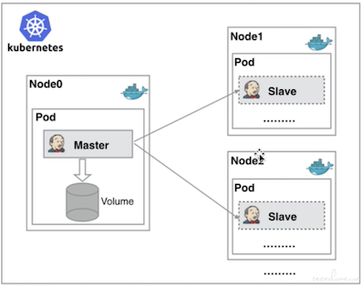

从图上可以看到 `Jenkins Master` 和 `Jenkins Slave` 以 `Pod` 形式运行在 `Kubernetes` 集群的 `Node` 上，`Master` 运行在其中一个节点，并且将其配置数据存储到一个 `Volume` 上去，`Slave` 运行在各个节点上，并且它不是一直处于运行状态，它会按照需求动态的创建并自动删除。

这种方式的工作流程大致为：当 `Jenkins Master` 接受到 `Build` 请求时，会根据配置的 `Label` 动态创建一个运行在 `Pod` 中的 `Jenkins Slave` 并注册到 `Master` 上，当运行完 `Job` 后，这个 `Slave` 会被注销并且这个 `Pod` 也会自动删除，恢复到最初状态。

那么我们使用这种方式带来了哪些好处呢？


* **服务高可用**，当 `Jenkins Master` 出现故障时，`Kubernetes` 会自动创建一个新的 `Jenkins Master` 容器，并且将 `Volume` 分配给新创建的容器，保证数据不丢失，从而达到集群服务高可用。
* **动态伸缩**，合理使用资源，每次运行 `Job` 时，会自动创建一个 `Jenkins Slave`，`Job` 完成后，`Slave` 自动注销并删除容器，资源自动释放，而且 `Kubernetes` 会根据每个资源的使用情况，动态分配 `Slave` 到空闲的节点上创建，降低出现因某节点资源利用率高，还排队等待在该节点的情况。
* **扩展性好**，当 `Kubernetes` 集群的资源严重不足而导致 `Job` 排队等待时，可以很容易的添加一个 `Kubernetes Node` 到集群中，从而实现扩展。

## 2、基于 Kubernetes 部署 Jenkins

```
$ kubectl create ns devops
```

### `jenkins.yaml`

```
kind: Deployment
apiVersion: apps/v1
metadata:
  labels:
    k8s-app: jenkins
  name: jenkins
  namespace: devops
spec:
  replicas: 1
  revisionHistoryLimit: 10
  selector:
    matchLabels:
      k8s-app: jenkins
  template:
    metadata:
      labels:
        k8s-app: jenkins
      namespace: devops
      name: jenkins
    spec:
      containers:
        - name: jenkins
          image: jenkins/jenkins:2.253
          imagePullPolicy: IfNotPresent
          ports:
            - containerPort: 30080
              name: web
              protocol: TCP
            - containerPort: 30081
              name: agent
              protocol: TCP
          resources:
            limits:
              cpu: 1000m
              memory: 2Gi
            requests:
              cpu: 500m
              memory: 512Mi
          livenessProbe:
            httpGet:
              path: /login
              port: 30080
            initialDelaySeconds: 60
            timeoutSeconds: 5
            failureThreshold: 12
          readinessProbe:
            httpGet:
              path: /login
              port: 30080
            initialDelaySeconds: 60
            timeoutSeconds: 5
            failureThreshold: 12
          volumeMounts:
            - name: jenkins-home
              mountPath: /var/lib/jenkins
          env:
            - name: JENKINS_HOME
              value: /var/lib/jenkins
            - name: JENKINS_OPTS 
              value: --httpPort=30080
            - name: JENKINS_SLAVE_AGENT_PORT
              value: "30081"
      volumes:
        - name: jenkins-home
          # hostPath: 
          #   path: /data/devops/jenkins
          #   type: Directory
          emptyDir: {}
      serviceAccountName: jenkins
---
apiVersion: v1
kind: ServiceAccount
metadata:
  labels:
    k8s-app: jenkins
  name: jenkins
  namespace: devops
---
kind: Service
apiVersion: v1
metadata:
  labels:
    k8s-app: jenkins
  name: jenkins
  namespace: devops
spec:
  type: NodePort
  ports:
    - name: web
      port: 30080
      targetPort: 30080
      nodePort: 30080
    - name: slave
      port: 30081
      targetPort: 30081
      nodePort: 30081
  selector:
    k8s-app: jenkins
---
kind: Role
apiVersion: rbac.authorization.k8s.io/v1beta1
metadata:
 name: jenkins
 namespace: devops
rules:
 - apiGroups: [""]
   resources: ["pods","configmaps","namespaces"]
   verbs: ["create","delete","get","list","patch","update","watch"]
 - apiGroups: [""]
   resources: ["pods/exec"]
   verbs: ["create","delete","get","list","patch","update","watch"]
 - apiGroups: [""]
   resources: ["pods/log"]
   verbs: ["get","list","watch"]
 - apiGroups: [""]
   resources: ["secrets"]
   verbs: ["get"]
---
apiVersion: rbac.authorization.k8s.io/v1beta1
kind: RoleBinding
metadata:
 name: jenkins
 namespace: devops
roleRef:
 apiGroup: rbac.authorization.k8s.io
 kind: Role
 name: jenkins
subjects:
 - kind: ServiceAccount
   name: jenkins
   namespace: devops
```

```
 kubectl apply -f jenkins.yaml
 ```
 
 ```
 kubectl logs jenkins-b99f4986b-rjl8m -n devops
 ...
 Jenkins initial setup is required. An admin user has been created and a password generated.
Please use the following password to proceed to installation:

d0ef791eaa204d1a9700341f43a1e898

This may also be found at: /var/lib/jenkins/secrets/initialAdminPassword

*************************************************************
*************************************************************
*************************************************************

2020-08-22 09:55:05.902+0000 [id=26]    INFO    jenkins.InitReactorRunner$1#onAttained: Completed initialization
2020-08-22 09:55:05.915+0000 [id=19]    INFO    hudson.WebAppMain$3#run: Jenkins is fully up and running
2020-08-22 09:55:06.285+0000 [id=39]    INFO    h.m.DownloadService$Downloadable#load: Obtained the updated data file for hudson.tasks.Maven.MavenInstaller
2020-08-22 09:55:06.286+0000 [id=39]    INFO    hudson.util.Retrier#start: Performed the action check updates server successfully at the attempt #1
2020-08-22 09:55:06.289+0000 [id=39]    INFO    hudson.model.AsyncPeriodicWork#lambda$doRun$0: Finished Download metadata. 28,549 ms
```

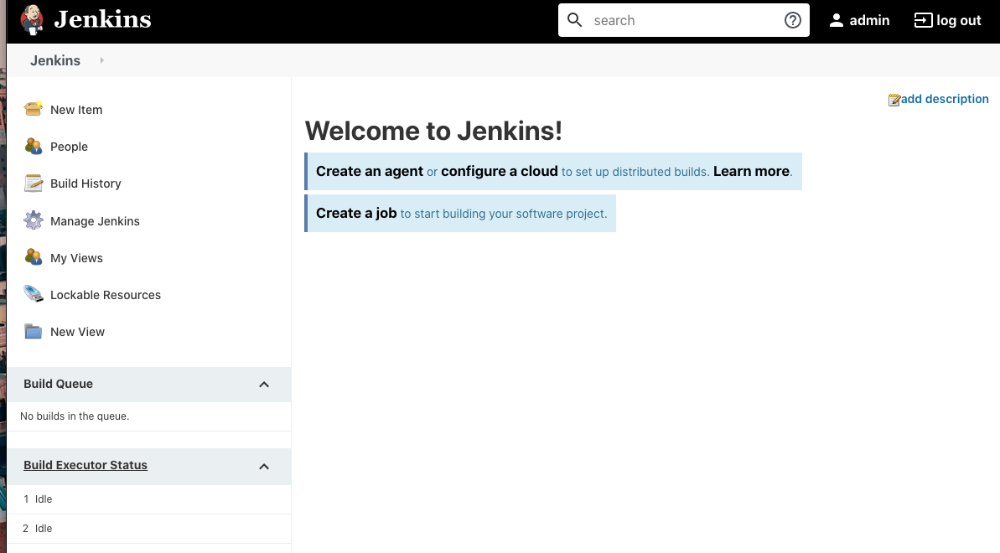


## 3、部署 Jenkins 静态 Slave 节点

### 3-1 填写`Jenkins agent` 信息，获取 secret

**k8s-agent**

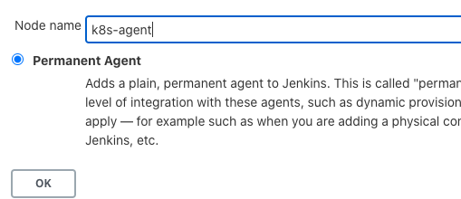

* `k8s-agent`
* `192.168.33.1`
* 5
* `/home/jenkins/workspace`

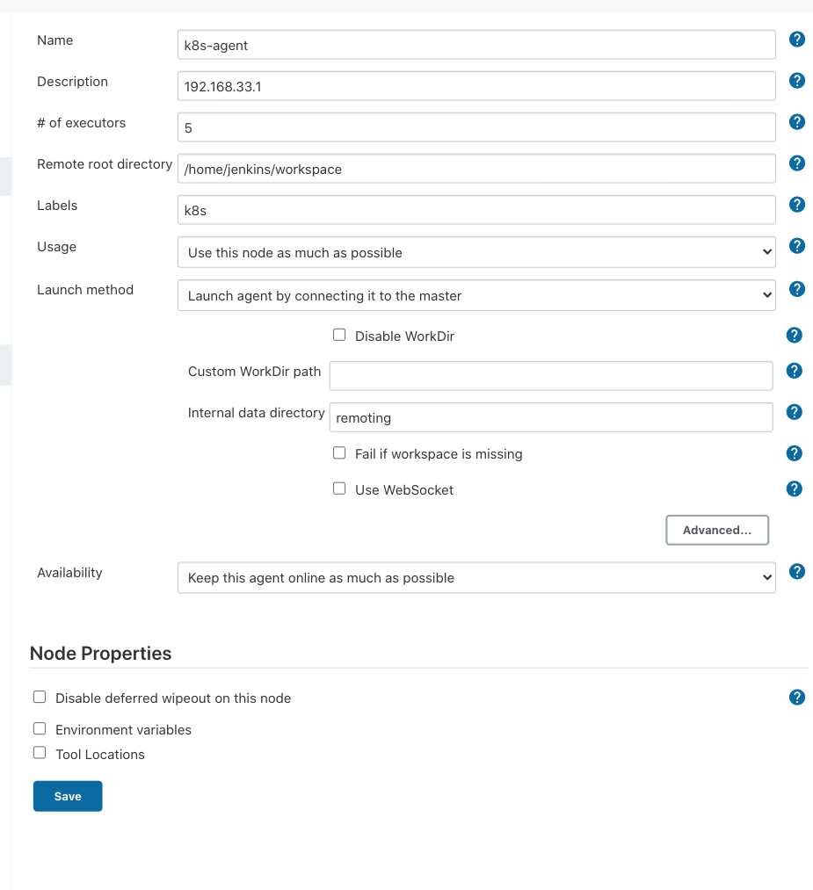

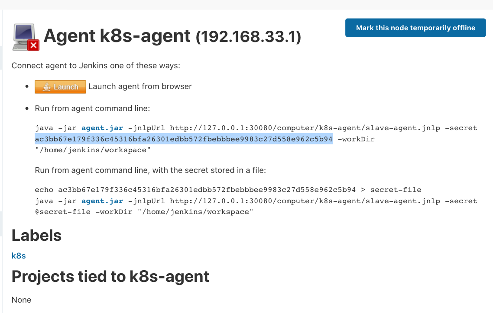

### 3-2 创建k8s-agent

**`jenkinsslave.yaml`**

```
---
kind: Deployment
apiVersion: apps/v1
metadata:
  labels:
    k8s-app: jenkinsagent
  name: jenkinsagent
  namespace: devops
spec:
  replicas: 1
  revisionHistoryLimit: 10
  selector:
    matchLabels:
      k8s-app: jenkinsagent
  template:
    metadata:
      labels:
        k8s-app: jenkinsagent
      namespace: devops
      name: jenkinsagent
    spec:
      containers:
        - name: jenkinsagent
          image: jenkins/inbound-agent:latest
          securityContext:
            privileged: true
          imagePullPolicy: IfNotPresent
          resources:
            limits:
              cpu: 1000m
              memory: 2Gi
            requests:
              cpu: 500m
              memory: 512Mi
          volumeMounts:
            - name: jenkinsagent-workdir
              mountPath: /home/jenkins/workspace
            - name: buildtools
              mountPath: /home/jenkins/buildtools
            - name: dockersock
              mountPath: "/var/run/docker.sock"
            - name: dockercmd
              mountPath: /usr/bin/docker
            - name: kubectlconfig
              mountPath: /home/jenkins/.kube/config
            - name: kubectlcmd
              mountPath: /usr/bin/kubectl
          env:
            - name: JENKINS_URL
              value: http://192.168.33.1:30080
            - name: JENKINS_SECRET
              value: ac3bb67e179f336c45316bfa26301edbb572fbebbbee9983c27d558e962c5b94
            - name: JENKINS_AGENT_NAME
              value: k8s-agent
            - name: JENKINS_AGENT_WORKDIR
              value: /home/jenkins/workspace
      volumes:
        - name: jenkinsagent-workdir
          hostPath: 
            path: /Users/i.../Jenkins/workspace
            type: Directory
        - name: buildtools
          hostPath: 
            path: /Users/I.../Jenkins/buildtools
            type: Directory
        - name: kubectlconfig
          hostPath: 
            path: /Users/I.../.kube/config
        - name: kubectlcmd
          hostPath: 
            path: /usr/local/bin/kubectl
        - name: dockersock
          hostPath: 
            path: /var/run/docker.sock
        - name: dockercmd
          hostPath: 
            path: /usr/local/bin/docker
```

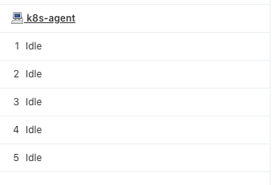


## 4、部署 Jenkins 动态 Slave 节点

安装 k8s plugin: https://plugins.jenkins.io/kubernetes/

### 4-1 配置 集群内部 动态 Slave 节点

* kubernetes
* https://kubernetes.default.svc.cluster.local
* Jenkins URL: http://192.168.33.1:30080/
* POD LABEL: `jenkins : agent`
* namespace: devops
* Pod retention: Never

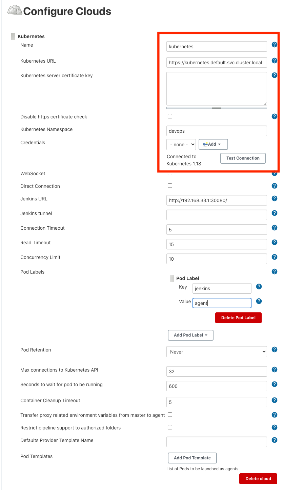

### 4-2 外部集群 动态 Slave 节点

* 进入集群服务器`.kube/config`
* `config`文件中的`certificate-authority-data`内容，生成`base64`文件 `ca.crt` 
* `config`文件中的`client-certificate-data`内容，生成`base64`文件`client.crt`
* config文件中的`client-key-data`内容，生成`base64`文件`c1ient.key` 

`echo zzzzzzzzz | base64 -d > client.key` 

* 生成证书（会输入密码需要记住后面jenkins需要配置） 


`openssl pkcs12 -export -out cert.pfx -inkey client.key -in  client.crt -certfile ca.crt` 

* 下载证书 `cert.pfx `

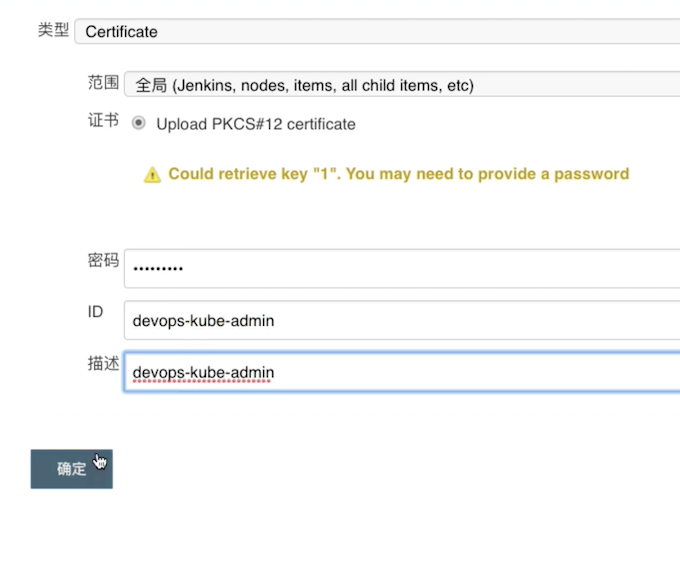

配置 动态 Slave 节点

`cat ca.crt`

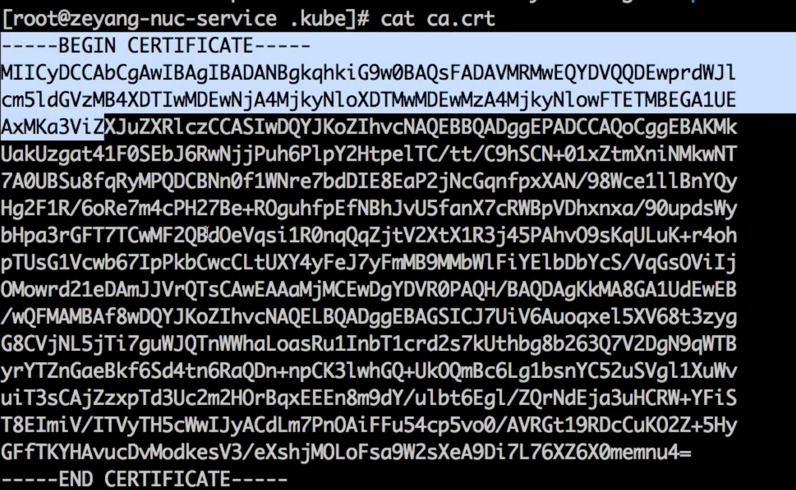

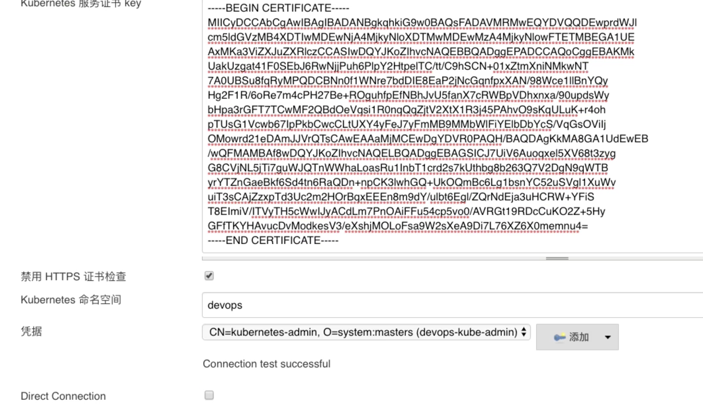

### 4-3 pipeline 启动 动态的 slave

```
pipeline{
    agent{
        kubernetes{
            label "test01"
            cloud 'kubernetes'
            yaml '''
---
kind: Pod
apiVersion: v1
metadata:
  labels:
    k8s-app: jenkinsagent
  name: jenkinsagent
  namespace: devops
spec:
containers:
  - name: jenkinsagent
    image: jenkins/inbound-agent:latest
    imagePullPolicy: IfNotPresent
    resources:
      limits:
        cpu: 1000m
        memory: 2Gi
      requests:
        cpu: 500m
        memory: 512Mi
    volumeMounts:
      - name: jenkinsagent-workdir
        mountPath: /home/jenkins/workspace
      - name: buildtools
        mountPath: /home/jenkins/buildtools
    env:
      - name: JENKINS_AGENT_WORKDIR
        value: /home/jenkins/workspace
volumes:
  - name: jenkinsagent-workdir
    hostPath:
      path: /Users/i../Jenkins/workspace
      type: Directory
  - name: buildtools
    hostPath:
      path: /Users/i.../Jenkins/buildtools
      type: Directory
'''
        }
    }


    stages{
        stage("test"){
          steps{
            script{
              sh "sleep 30"
            }
          }
        }
    }
}
```

**Console Output**

```
Created Pod: devops/test01-2gh1z-q4rtx
[Normal][devops/test01-2gh1z-q4rtx][Scheduled] Successfully assigned devops/test01-2gh1z-q4rtx to docker-desktop
[Normal][devops/test01-2gh1z-q4rtx][Pulling] Pulling image "jenkins/inbound-agent:4.3-4"
Still waiting to schedule task
‘test01-2gh1z-q4rtx’ is offline
Created Pod: devops/test01-2gh1z-llllt
[Normal][devops/test01-2gh1z-llllt][Scheduled] Successfully assigned devops/test01-2gh1z-llllt to docker-desktop
[Normal][devops/test01-2gh1z-llllt][Pulling] Pulling image "jenkins/inbound-agent:4.3-4"
[Normal][devops/test01-2gh1z-llllt][Pulled] Successfully pulled image "jenkins/inbound-agent:4.3-4"
[Normal][devops/test01-2gh1z-llllt][Created] Created container jnlp
[Normal][devops/test01-2gh1z-llllt][Started] Started container jnlp
Agent test01-2gh1z-llllt is provisioned from template test01-2gh1z
---
apiVersion: "v1"
kind: "Pod"
metadata:
  annotations:
    buildUrl: "http://192.168.33.1:30080/job/k8s-test/1/"
    runUrl: "job/k8s-test/1/"
  labels:
    k8s-app: "jenkinsagent"
    jenkins: "agent"
    jenkins/label: "test01"
  name: "test01-2gh1z-llllt"
  namespace: "devops"
spec:
  containers:
  - env:
    - name: "JENKINS_SECRET"
      value: "********"
    - name: "JENKINS_AGENT_NAME"
      value: "test01-2gh1z-llllt"
    - name: "JENKINS_NAME"
      value: "test01-2gh1z-llllt"
    - name: "JENKINS_AGENT_WORKDIR"
      value: "/home/jenkins/agent"
    - name: "JENKINS_URL"
      value: "http://192.168.33.1:30080/"
    image: "jenkins/inbound-agent:4.3-4"
    name: "jnlp"
    resources:
      requests:
        cpu: "100m"
        memory: "256Mi"
    volumeMounts:
    - mountPath: "/home/jenkins/agent"
      name: "workspace-volume"
      readOnly: false
  nodeSelector:
    kubernetes.io/os: "linux"
  restartPolicy: "Never"
  volumes:
  - emptyDir:
      medium: ""
    name: "workspace-volume"

Running on test01-2gh1z-llllt in /home/jenkins/agent/workspace/k8s-test
```

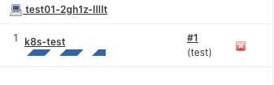