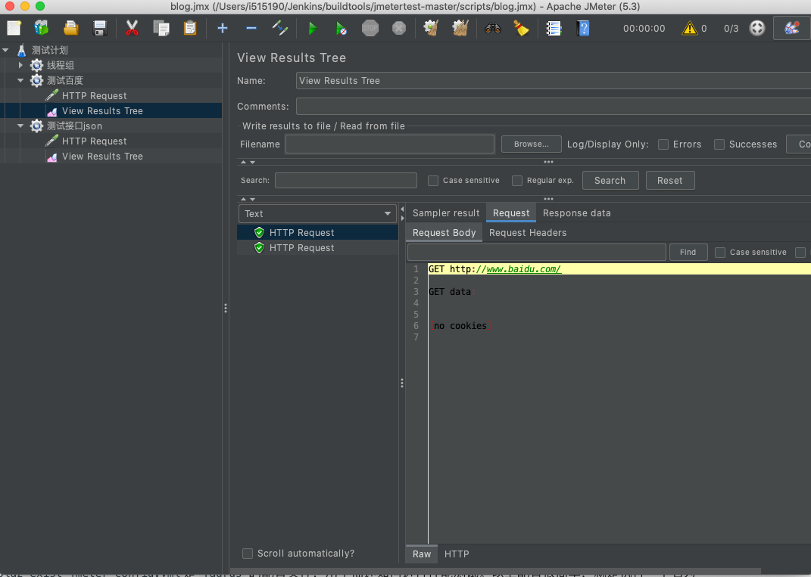
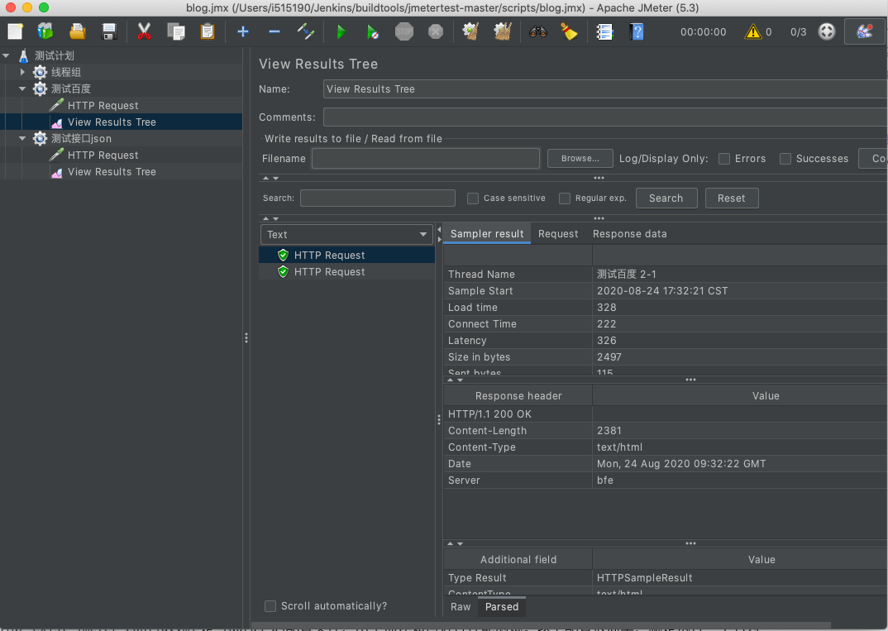
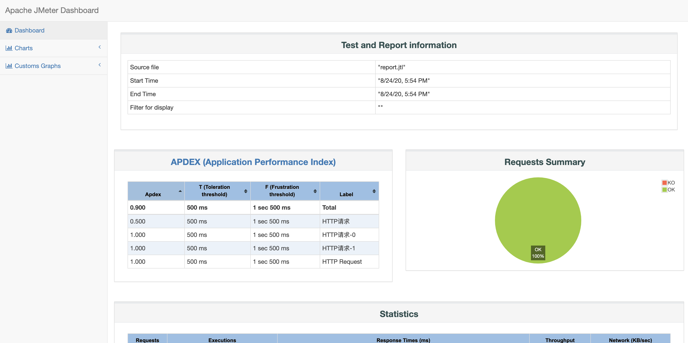
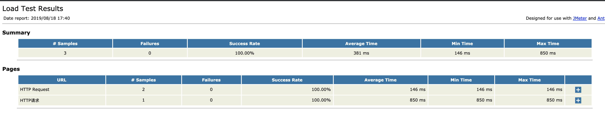
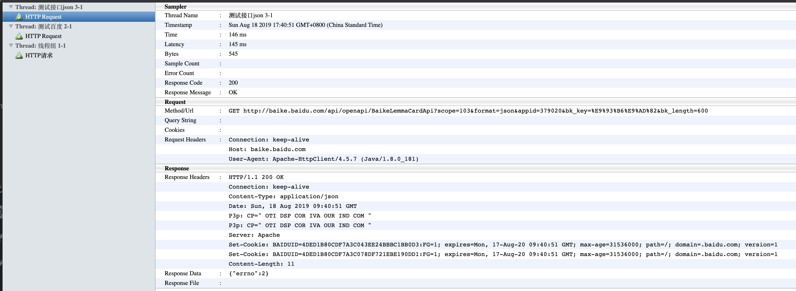

# **第一节 Jmeter & Ant 自动化测试**

## 1、Jmeter 接口测试生成报告

### 1-1 接口

* 接口测试定义为一种软件测试类型，用于验证两个不同软件系统之间的通信是否正确完成。 
* 集成两个组件的连接称为接口。计算机世界中的此接口可以是API，Web服务等之类的东西。这些连接服务或接口的测试称为接口测试。 
* 接口实际上是由一组命令，消息和其他允许设备与用户之间进行通信的属性组成的软件。 


### 1-2 安装 jmeter

* wget
* tar zxf
* export
* source

**Mac 安装**

```
brew install jmeter

brew upgrade jmeter
```

**Intall Java11 on mac**

```
brew tap homebrew/cask-versions
brew cask install java11

 brew cask install java11
Updating Homebrew...
==> Downloading https://download.oracle.com/java/GA/jdk11/9/GPL/openjdk-11.0.2_osx-x64_bin.tar.gz
######################################################################## 100.0%
==> Verifying SHA-256 checksum for Cask 'java11'.
==> Installing Cask java11
==> Moving Generic Artifact 'jdk-11.0.2.jdk' to '/Library/Java/JavaVirtualMachines/openjdk-11.0.2.jdk'.
Password:
🍺  java11 was successfully installed!
```

```
$ sudo vim .bash_profile

export JAVA_11_HOME=$(/usr/libexec/java_home -v11)
alias java11='export JAVA_HOME=$JAVA_11_HOME'

java11
```

```
source .bash_profile

$ java -version
openjdk version "11.0.2" 2019-01-15
OpenJDK Runtime Environment 18.9 (build 11.0.2+9)
OpenJDK 64-Bit Server VM 18.9 (build 11.0.2+9, mixed mode)
```

```
jmeter
```



导入[`blog.jmx`](https://github.com/Chao-Xi/jmetertest/tree/master/scripts/blog.jmx)

**Run the script: 测试百度**




**Run the script: 测试接口**


**Centos 安装**

```
$ wget https://downloads.apache.org//jmeter/binaries/apache-jmeter-5.3.tgz

$ sudo tar zxf apache-jmeter-5.3.tgz -C /opt/
$ sudo vim /etc/profile.d/jmeter.sh

export JMETER_HOME=/opt/apache-jmeter-5.3
export PATH=$JMETER_HOME/bin:$PATH

$ sudo chmod +x /etc/profile.d/jmeter.sh

source /etc/profile.d/jmeter.sh

$ jmeter --help
OpenJDK 64-Bit Server VM warning: If the number of processors is expected to increase from one, then you should configure the number of parallel GC threads appropriately using -XX:ParallelGCThreads=N
    _    ____   _    ____ _   _ _____       _ __  __ _____ _____ _____ ____
   / \  |  _ \ / \  / ___| | | | ____|     | |  \/  | ____|_   _| ____|  _ \
  / _ \ | |_) / _ \| |   | |_| |  _|    _  | | |\/| |  _|   | | |  _| | |_) |
 / ___ \|  __/ ___ \ |___|  _  | |___  | |_| | |  | | |___  | | | |___|  _ <
/_/   \_\_| /_/   \_\____|_| |_|_____|  \___/|_|  |_|_____| |_| |_____|_| \_\ 5.3

Copyright (c) 1999-2020 The Apache Software Foundation


To list all command line options, open a command prompt and type:

jmeter.bat(Windows)/jmeter.sh(Linux) -?

--------------------------------------------------

To run Apache JMeter in GUI mode, open a command prompt and type:

jmeter.bat(Windows)/jmeter.sh(Linux) [-p property-file]

--------------------------------------------------

To run Apache JMeter in NON_GUI mode:
Open a command prompt (or Unix shell) and type:

jmeter.bat(Windows)/jmeter.sh(Linux) -n -t test-file [-p property-file] [-l results-file] [-j log-file]

--------------------------------------------------

To run Apache JMeter in NON_GUI mode and generate a report at end :
Open a command prompt (or Unix shell) and type:

jmeter.bat(Windows)/jmeter.sh(Linux) -n -t test-file [-p property-file] [-l results-file] [-j log-file] -e -o [Path to output folder]

--------------------------------------------------
To generate a Report from existing CSV file:
Open a command prompt (or Unix shell) and type:

jmeter.bat(Windows)/jmeter.sh(Linux) -g [csv results file] -o [path to output folder (empty or not existing)]

--------------------------------------------------

To tell Apache JMeter to use a proxy server:
Open a command prompt and type:

jmeter.bat(Windows)/jmeter.sh(Linux) -H [your.proxy.server] -P [your proxy server port]

---------------------------------------------------

To run Apache JMeter in server mode:
Open a command prompt and type:

jmeter-server.bat(Windows)/jmeter-server(Linux)

---------------------------------------------------
```

### 1-2 运行测试用例

```
jmeter -n -t scripts/blog.jmx  -l report.jtl -e -o report -Jjmeter.save.saveservice.output_format=csv
```

参数说明:

* -n: 非GUI模式执行JMeter
* -t: 执行测试文件所在的位置
* -l: 指定生成测试结果的保存文件，jtl文件格式
* -e: 测试结束后，生成测试报告
* -o: 指定测试报告的存放位置

看下运行的效果：测试报告已生成是HTML文件，可直接打开。

```
$ jmeter -n -t scripts/blog.jmx  -l report.jtl -e -o report -Jjmeter.save.saveservice.output_format=csv
WARNING: package sun.awt.X11 not in java.desktop
Creating summariser <summary>
Created the tree successfully using scripts/blog.jmx
Starting standalone test @ Mon Aug 24 17:54:51 CST 2020 (1598262891834)
Waiting for possible Shutdown/StopTestNow/HeapDump/ThreadDump message on port 4445
Warning: Nashorn engine is planned to be removed from a future JDK release
summary =      3 in 00:00:01 =    4.7/s Avg:   363 Min:   286 Max:   512 Err:     0 (0.00%)
Tidying up ...    @ Mon Aug 24 17:54:52 CST 2020 (1598262892778)
... end of run
```

```
$ tree report -L 1
report
├── content
├── index.html
├── sbadmin2-1.0.7
└── statistics.json

2 directories, 2 files
```





## 2、使用 Ant、Jmeter 自动化测试

### 2-1 复制`ant-jmeter-1.1.1.jar`

```
cp /opt/apache-jmeter-5.3/extras/ant-jmeter-1.1.1.jar /opt/ant/lib
```

将 `${apache-jmeter}/extras` 文件夹下的` ‘ant-jmeter-1.1.1.jar’ `文件复制到` ${apache-ant-}\lib` 文件夹下


```
cd /home/vagrant/tools/script/jmetertest-master
sudo cp jmeter.results.shanhe.me.xsl  /opt/apache-jmeter-5.3/extras/
```

我们可以使用ant与Jmeter集成build.xml部分内容  [`build.xml`地址 ](https://github.com/Chao-Xi/jmetertest/tree/master/scripts/blog.jmx)

```
<?xml version="1.0" encoding="utf8"?>
<!-- 拷贝报告所需的图片资源至目标目录 -->
<project name="ant-jmeter-test" default="run" basedir=".">
    <tstamp>
        <format property="time" pattern="yyyyMMddHHmm" />
    </tstamp>
    <!-- 需要改成自己本地的jmeter目录-->  
    <property name="jmeter.home" value="/opt/apache-jmeter-5.3" />
    <!-- jmeter生成的jtl格式的结果报告的路径--> 
    <property name="jmeter.result.jtl.dir" value="./result/jtlfile" />
    <!-- jmeter生成的html格式的结果报告的路径-->
    <property name="jmeter.result.html.dir" value="./result/htmlfile" />
    <!-- ʺ生成的报告的前缀-->  
    <property name="ReportName" value="TestReport_" />
    <property name="jmeter.result.jtlName" value="${jmeter.result.jtl.dir}/${ReportName}${time}.jtl" />
    <property name="jmeter.result.htmlName" value="${jmeter.result.html.dir}/SummaryReport.html" />
    <property name="jmeter.detail.result.jtlName" value="${jmeter.result.jtl.dir}/${ReportName}${time}.jtl" />
    <property name="jmeter.detail.result.htmlName" value="${jmeter.result.html.dir}/DetailReport.html" />
    <target name="run">
        <antcall target="test" />
        <antcall target="report" />
    </target>

    <target name="test">
        <taskdef name="jmeter" classname="org.programmerplanet.ant.taskdefs.jmeter.JMeterTask" />
        <jmeter jmeterhome="${jmeter.home}" resultlog="${jmeter.result.jtlName}">
             <!-- 声明要运行的脚本“*.jmx”指包含此目录下的所有jmeter脚本-->
            <testplans dir="./scripts" includes="*.jmx" />
           <property name="jmeter.save.saveservice.output_format" value="xml"/>

        </jmeter>
    </target>
    <path id="xslt.classpath">
            <fileset dir="${jmeter.home}/lib" includes="xalan*.jar"/>
            <fileset dir="${jmeter.home}/lib" includes="serializer*.jar"/>
    </path>

    <target name="report">
        <tstamp> 
                <format property="report.datestamp" pattern="yyyy/MM/dd HH:mm" />
        </tstamp>
        <xslt 
            classpathref="xslt.classpath"
            force="true"
            in="${jmeter.detail.result.jtlName}"
            out="${jmeter.detail.result.htmlName}"
            style="./jmeter.results.shanhe.me.xsl">
            <param name="dateReport" expression="${report.datestamp}"/>
        </xslt>
        <xslt 
            classpathref="xslt.classpath"
            force="true"
            in="${jmeter.result.jtlName}"
            out="${jmeter.result.htmlName}"
            style="./jmeter-results-detail-report_21.xsl">
            <param name="dateReport" expression="${report.datestamp}"/>
        </xslt>
        <!-- 拷贝报告所需的图片资源至目标目录 --> 
        <copy todir="${jmeter.result.html.dir}">
            <fileset dir="${jmeter.home}/extras">
                <include name="collapse.png" />
                <include name="expand.png" />
            </fileset>
        </copy>
    </target>
</project>
```


### 2-2 ant构建jmeter 测试

运行用例

```
$ sudo ant -f build.xml
Buildfile: /home/vagrant/tools/script/jmetertest-master/build.xml

run:

test:
   [jmeter] Executing test plan: /home/vagrant/tools/script/jmetertest-master/scripts/blog.jmx ==> /home/vagrant/tools/script/jmetertest-master/result/jtlfile/TestReport_202008210635.jtl
   [jmeter] Creating summariser <summary>
   [jmeter] Created the tree successfully using /home/vagrant/tools/script/jmetertest-master/scripts/blog.jmx
   [jmeter] Starting standalone test @ Fri Aug 21 06:35:38 UTC 2020 (1597991738273)
   [jmeter] Waiting for possible Shutdown/StopTestNow/HeapDump/ThreadDump message on port 4445
   [jmeter] summary =      3 in 00:00:01 =    3.0/s Avg:   518 Min:   338 Max:   752 Err:     0 (0.00%)
   [jmeter] Tidying up ...    @ Fri Aug 21 06:35:39 UTC 2020 (1597991739806)
   [jmeter] ... end of run

report:
     [xslt] Processing /home/vagrant/tools/script/jmetertest-master/result/jtlfile/TestReport_202008210635.jtl to /home/vagrant/tools/script/jmetertest-master/result/htmlfile/202008210635_DetailReport.html
     [xslt] Loading stylesheet /opt/apache-jmeter-5.3/extras/jmeter.results.shanhe.me.xsl
     [xslt] Processing /home/vagrant/tools/script/jmetertest-master/result/jtlfile/TestReport_202008210635.jtl to /home/vagrant/tools/script/jmetertest-master/result/htmlfile/202008210635_SummaryReport.html
     [xslt] Loading stylesheet /opt/apache-jmeter-5.3/extras/jmeter-results-detail-report_21.xsl

BUILD SUCCESSFUL
Total time: 5 seconds
```

```
$ cd jmetertest-master/result/htmlfile
-rw-r--r--. 1 root    root     5191 Aug 21 06:35 202008210635_SummaryReport.html
-rw-r--r--. 1 root    root    16284 Aug 21 06:35 202008210635_DetailReport.html
-rw-r--r--. 1 root    root     5191 Aug 21 06:28 202008210628_SummaryReport.html
-rw-r--r--. 1 root    root    16284 Aug 21 06:28 202008210628_DetailReport.html
...
```

测试报告






