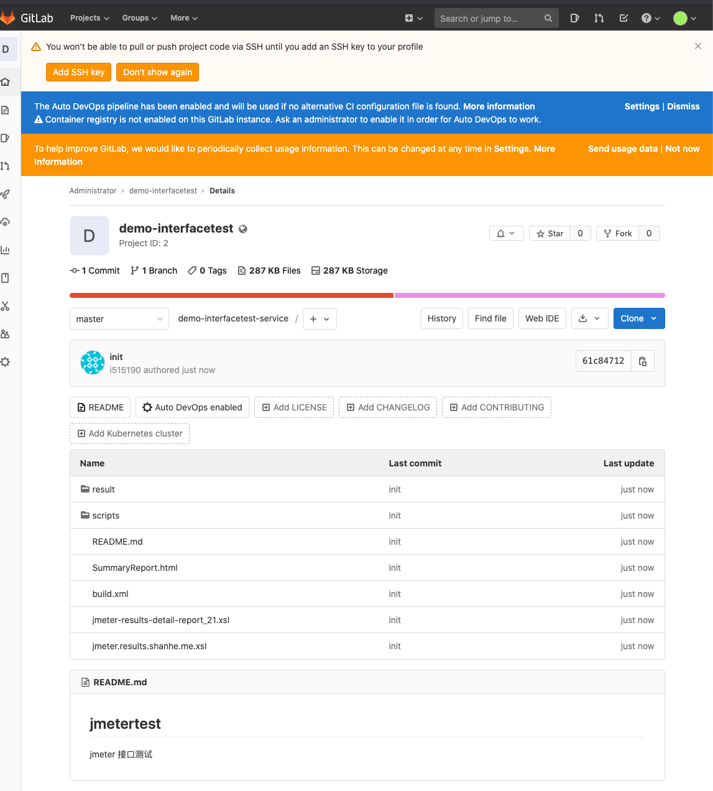
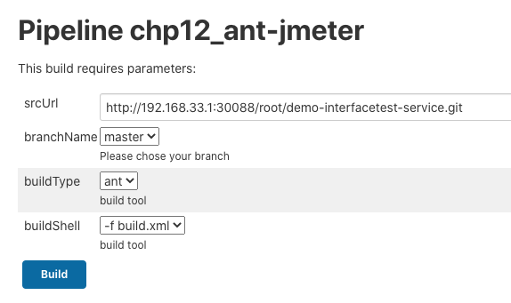
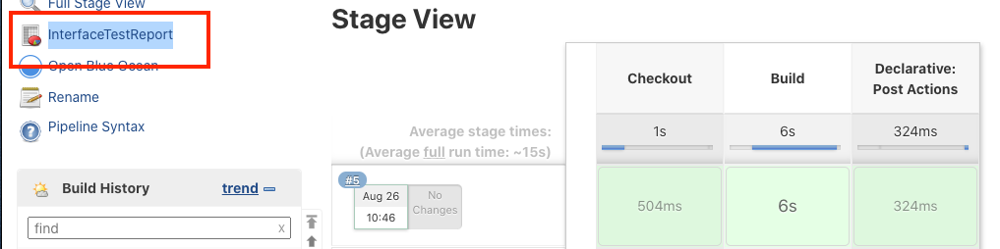
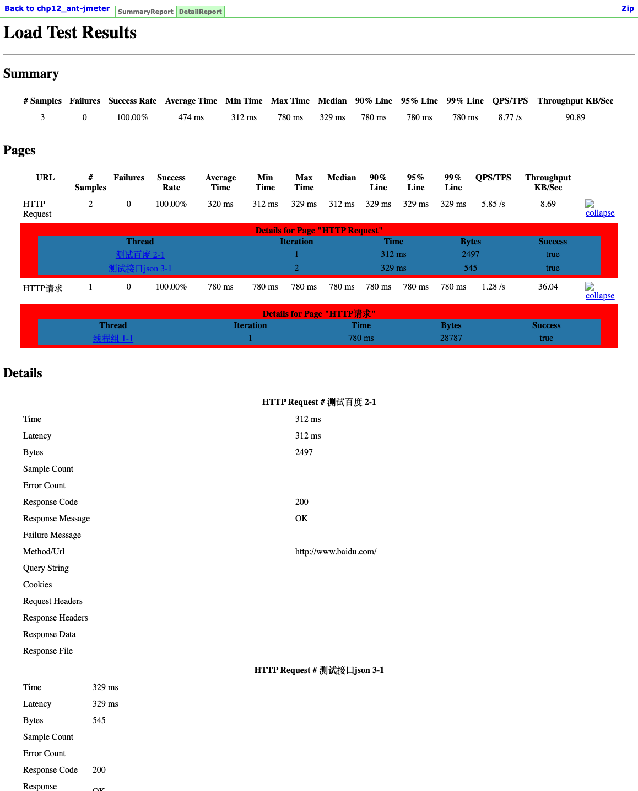
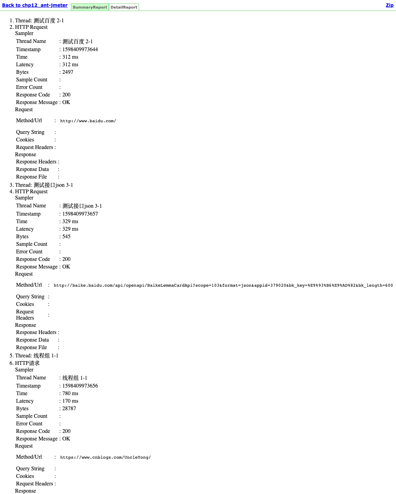

# 第二节 Jenkins、Ant、Jmeter 自动化测试

## 1、Jenkins、Ant、Jmeter 接口测试

使用`Jenkins`集成`ant` 和`jmeter`进行接口测试,直接看`Jenkinsfile`吧。我们可以理解为执行了ant的构建命令去运行接口测试，然后通过`publishHtml`展示测试报告。

### 1-1 在gitlab 上创建新的代码库 `demo-interfacetest`

* `http://192.168.33.1:30088/root/demo-interfacetest-service`



[demo-interfacetest-service](https://github.com/Chao-Xi/jmetertest)

### 1-2 创建`ant-jmeter.pipeline`

```
#!groovy
@Library('jenkinslib@master') _

def build = new org.devops.buildtools()

pipeline {
 	agent { node { label "hostmachine" }}
 	parameters {
        string(name: 'srcUrl', defaultValue: 'http://192.168.33.1:30088/root/demo-interfacetest-service.git', description: '') 
        choice(name: 'branchName', choices: 'master\nstage', description: 'Please chose your branch')
        choice(name: 'buildType', choices: 'ant', description: 'build tool')
        choice(name: 'buildShell', choices: '-f build.xml ', description: 'build tool')
	}

 	stages{
        stage('Checkout') {
	        steps {
	        	script {
	            	checkout([$class: 'GitSCM', branches: [[name: "${branchName}"]], doGenerateSubmoduleConfigurations: false, extensions: [], submoduleCfg: [], userRemoteConfigs: [[credentialsId: 'gitlab-admin-user', url: "${srcUrl}"]]])
	            } 
	        }
	    }
        
		stage('Build') {
	        steps {
	        	script {
	            	build.Build(buildType,buildShell)
	            } 
	        }
	    }
    }
 }
```

* ant
* `-f build.xml`



**Output**

```
...
+ /opt/ant/bin/ant -f build.xml
Buildfile: /home/vagrant/workspace/workspace/chp12_ant-jmeter/build.xml

run:

test:
   [jmeter] Executing test plan: /home/vagrant/workspace/workspace/chp12_ant-jmeter/scripts/blog.jmx ==> /home/vagrant/workspace/workspace/chp12_ant-jmeter/result/jtlfile/TestReport_202008260204.jtl
   [jmeter] 2020-08-26 02:04:24,713 main ERROR FileManager (jmeter.log) 
...
     [xslt] Processing /home/vagrant/workspace/workspace/chp12_ant-jmeter/result/jtlfile/TestReport_202008260204.jtl to /home/vagrant/workspace/workspace/chp12_ant-jmeter/result/htmlfile/202008260204_DetailReport.html
     [xslt] Loading stylesheet /home/vagrant/workspace/workspace/chp12_ant-jmeter/jmeter.results.shanhe.me.xsl
     [xslt] Processing /home/vagrant/workspace/workspace/chp12_ant-jmeter/result/jtlfile/TestReport_202008260204.jtl to /home/vagrant/workspace/workspace/chp12_ant-jmeter/result/htmlfile/202008260204_SummaryReport.html
     [xslt] Loading stylesheet /home/vagrant/workspace/workspace/chp12_ant-jmeter/jmeter-results-detail-report_21.xsl

BUILD SUCCESSFUL
Total time: 6 seconds
```


## 2、Jenkins 展示测试报告

通过`publishHtml`展示测试报告。

```
#!groovy
@Library('jenkinslib@master') _

def build = new org.devops.buildtools()

pipeline {
 	agent { node { label "hostmachine" }}
 	parameters {
        string(name: 'srcUrl', defaultValue: 'http://192.168.33.1:30088/root/demo-interfacetest-service.git', description: '') 
        choice(name: 'branchName', choices: 'master\nstage', description: 'Please chose your branch')
        choice(name: 'buildType', choices: 'ant', description: 'build tool')
        choice(name: 'buildShell', choices: '-f build.xml ', description: 'build tool')
	}

 	stages{
        stage('Checkout') {
	        steps {
	        	script {
	            	checkout([$class: 'GitSCM', branches: [[name: "${branchName}"]], doGenerateSubmoduleConfigurations: false, extensions: [], submoduleCfg: [], userRemoteConfigs: [[credentialsId: 'gitlab-admin-user', url: "${srcUrl}"]]])
	            } 
	        }
	    }
        
		stage('Build') {
	        steps {
	        	script {
	            	build.Build(buildType,buildShell)

                     //展示测试报告
                    publishHTML([allowMissing: false, 
                                 alwaysLinkToLastBuild: false, 
                                 keepAll: false, 
                                 reportDir: 'result/htmlfile', 
                                 reportFiles: 'SummaryReport.html,DetailReport.html', 
                                 reportName: 'InterfaceTestReport', 
                                 reportTitles: ''])
	            } 
	        }
	    }
    }
    post {
        always{
            script{
                println("always")
            }
        }
        
        success{
            script{
                println("success")  
            }
        
        }
        failure{
            script{
                println("failure")
            }
        }
        
        aborted{
            script{
                println("aborted")
            }
        
        }
    }
 }
```





