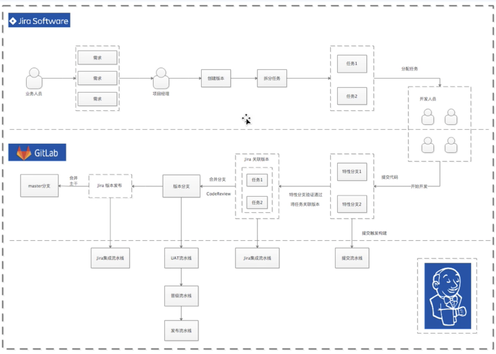
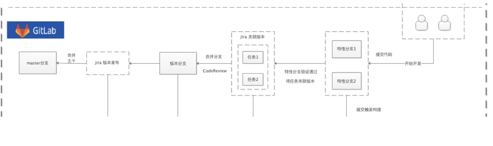

# 第一节 基于Jira端到端流水线的最佳实践

## 1、流水线实践规划设计

### 1-1 整体规划设计

### 1-2 Jira端规划设计

* **创建任务、故事（对应Gitlab分支）** 
	* 创建Jira问题 ->自动创建Gitlab分支 
* **创建发布（对应版本文件）** 

### 1-3 Jenkins端规划设计

**提交流水线**

* 代码->编译->单测->打包->扫描->邮件通知 [Gitlab显示每次提交状态][

**UAT测试流水线**

* 代码 -> 编译 -> 单测 -> 打包 -> 扫描 -> 接口测试 -> 镜像 -> 发布 -> 生成版本文件 -> 邮件通知 

**晋级／版本更新流水线** 

* 选择晋级策略 -> 根据版本文件晋级 -> 生成新版本文件 

**STAGE /PROD发布流水线**

* 选择版本号 -> 获取版本文件 -> 发布应用 

**Jira集成流水线** 

* Jira版本发布 -> 分支合并 -> 清理分支 

