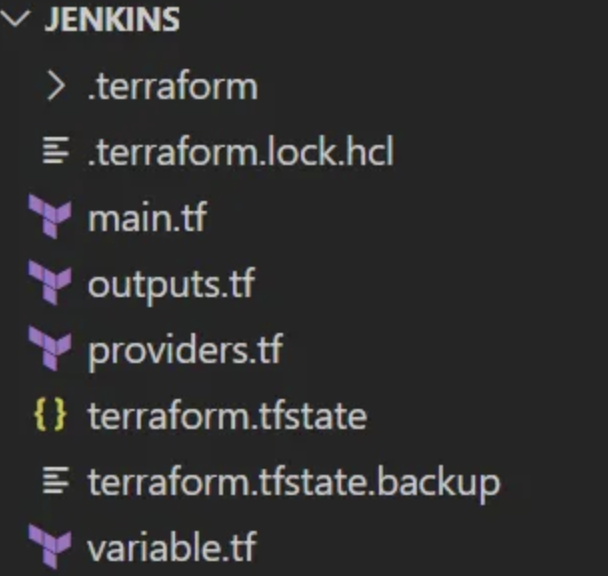

# **L8 基础设施即代码 - 使用Terraform创建AWS EC2实例并部署Jenkins服务**


Terraform 是由 HashiCorp 创建的开源基础设施即代码软件工具。用户使用称为 HashiCorp 配置语言的声明性配置语言（HCL）或可选的 JSON 来定义和提供数据中心基础设施。

您可以使用 Terraform 创建资源，例如 AWS EC2 实例和 AWS S3 存储桶。这些 EC2 实例可以被引导以包含 Jenkins，这是云工程师使用的一种流行的持续集成/持续交付工具。

在此项目中，您将学习如何部署 EC2 实例、引导 EC2 实例以安装和启动 Jenkins、创建 Jenkins 安全组、创建私有 Jenkins S3 存储桶以存储 Jenkins 工件。此外，您还将学习如何创建简单的 Jenkins 管道

### 先决条件：

您需要安装以下工具：

* AWS CLI 安装和配置
* Terraform 安装和配置
* IDE（我使用 VS Code）

## 工程初始化

在您选择的 IDE 中，创建一个新文件夹，然后cd进入该文件夹。

创建 main.tf、variable.tf、providers.tf 和 outputs.tf 文件



main.tf 将包含主要的配置。

```
resource "aws_instance" "instance" {
    ami                    = var.ami
    instance_type          = var.instance
    user_data              = var.ec2_user_data
    vpc_security_group_ids = [aws_security_group.security_group.id]

    tags = {
        Name                  = "Jenkins Instance"
    }
}

resource "aws_security_group" "security_group" { 
    vpc_id                 = var.vpc

    ingress {
        description            = "Allow SSH from my Public IP"
        from_port              = 22
        to_port                = 22
        protocol               = "tcp"
        cidr_blocks            = ["-.-.-.-/32"]  
    }

    ingress {
      description            = "Allows Access to the Jenkins Server"
      from_port              = 8080
      to_port                = 8080
      protocol               = "tcp"
      cidr_blocks            = ["0.0.0.0/0"]
  }

    ingress {
      description           = "Allows Access to the Jenkins Server"
      from_port             = 443
      to_port               = 443
      protocol              = "tcp"
      cidr_blocks           = ["0.0.0.0/0"]
  }

    egress {
      from_port             = 0
      to_port               = 0
      protocol              = "-1"
      cidr_blocks           = ["0.0.0.0/0"]
  }
    tags = {
      Name                = "Jenkins Security Group"
  }
}

resource "aws_s3_bucket" "jojenkinsbucket" {
    bucket                = "jojenkinsbucket"
}

resource "aws_s3_bucket_acl" "jenkinsbucketacl" {
    bucket                = aws_s3_bucket.jojenkinsbucket.id
    acl                   = "private"
}
```

**`variable.tf` 包含变量定义**

```
variable "vpc" {
  description         = "The Default VPC of EC2"
  type                = string
  default             = "vpc-0be40a17d234455e3"
}

variable "ami" {
  description         = "The AMI ID of the Instance"
  type                = string
  default             = "ami-0dfcb1ef8550277af"
}

variable "instance" {
  description         = "The Instance Type of EC2"
  type                = string
  default             = "t2.micro"
}

variable "ec2_user_data" {
  description        = "User Data for Jenkins EC2"
  type               = string
  default            = <<-EOF
  #!/bin/bash
  sudo yum update -y
  sudo wget -O /etc/yum.repos.d/jenkins.repo https://pkg.jenkins.io/redhat-stable/jenkins.repo
  sudo rpm --import https://pkg.jenkins.io/redhat-stable/jenkins.io.key
  sudo yum upgrade
  sudo amazon-linux-extras install java-openjdk11 -y
  sudo yum install -y jenkins
  sudo systemctl enable jenkins
  sudo systemctl start jenkins
  EOF
}
```

**`providers.tf` 定义云供应商配置**

```
provider "aws" {
    region         = "us-east-1"
}

terraform {
  required_providers {
    aws = {
      source       = "hashicorp/aws"
      version      = "~> 4.0"
    }
  }
}
```

**`outputs.tf `代码发布后的输出**

```
output "public_ip" {
    value           = aws_instance.instance.public_ip
}
```

### 基础设施发布

`terraform init`命令将初始化包含 `Terraform` 配置文件的工作目录并安装任何所需的插件。


**`terraform validate`命令验证目录中的配置文件。**


`terraform plan`命令可让您预览 Terraform 为修改您的基础架构而采取的操作。


`terraform apply`命令执行 Terraform 计划中建议的操作以创建、更新或销毁基础设施。


此时您可以通过检查控制台来确认 EC2 实例的创建。


## 测试Jenkins

Jenkins Pipeline 是一套插件，支持在 Jenkins 中实施和集成持续交付管道。

要创建 Jenkins 管道，请在 Web 浏览器中输入“EC2实例的公共IP:8080” 。配置并登录Jenkins后，您应该会看到类似于下图的截图。


单击新项目。

* 输入项目的名称。
* 选择Pipeline，然后选择Ok。


在管道部分，输入以下脚本：

```
pipeline {
    agent any
    stages {
        stage("build") {
    
            steps {
                echo 'Building the application...'
    
            }
        }

        stage("test") {
    
            steps {
                echo 'Testing the application...'
    
            }
        }

        stage("deploy") {
    
            steps {
                echo 'Deploying the application...'
    
            }
        }
 }
}
```

选择Jenkins 仪表板左侧的“立即构建” 。如果您看到绿色的视图，则表示构建已成功完成。


## 销毁资源

如果自己做实验切记删除资源，否则会造成账单消耗。使用terraform destroy销毁资源。