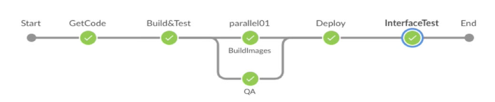
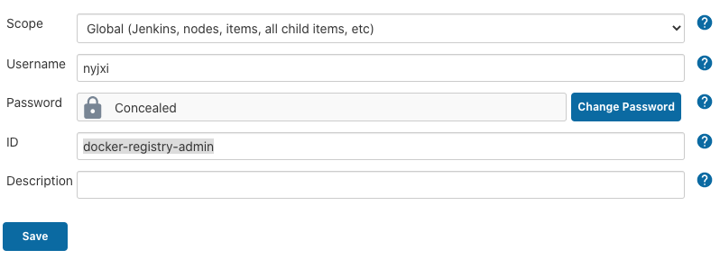
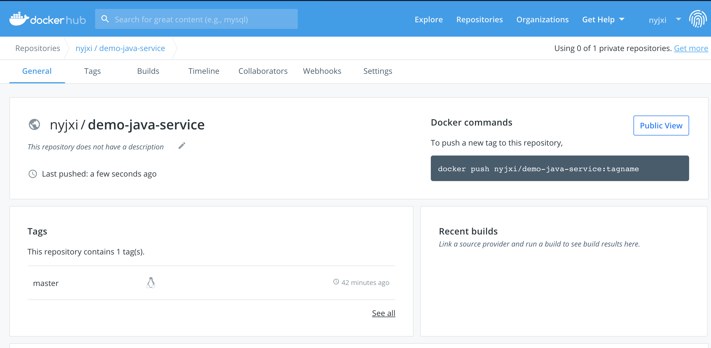
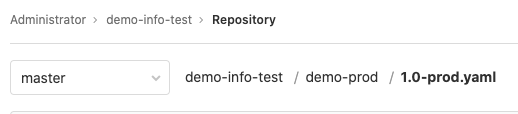
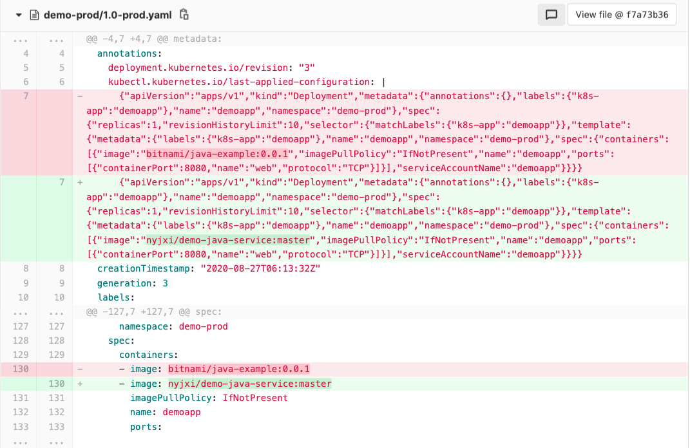
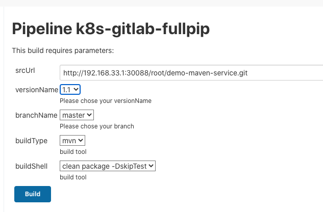
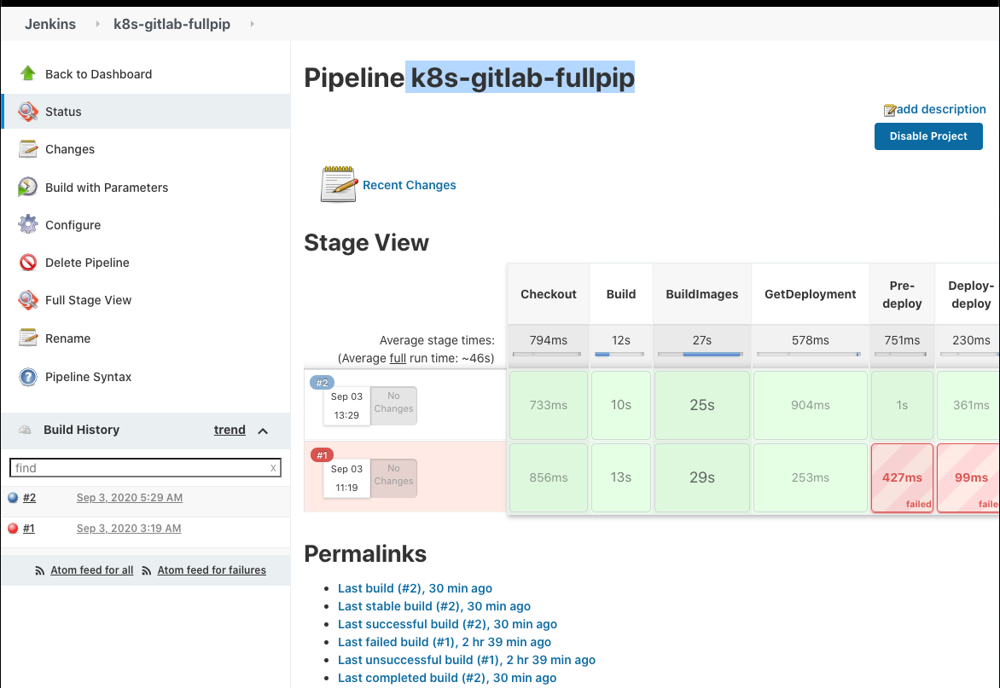

# **第三节 Jenkins + K8S + Gitlab 构建 RLEASE 打包发布更新流水线到K8S集群**

**获取运行中deploy的yaml -> 上传到gitlab -> 更新Container Image （打包jar包 -> 创建新的Image -> 上传Image到Docker Hub） -> 上传到gitlab (yaml)  -> 将新的yaml apply 到集群中**

## 1、配置 Prod-Release 流水线构建镜像

### 1-1 Release 测试流水线 

* 代码 -> 编译 -> 单测 -> 打包 -> 扫描 -> 接口测试 -> 镜像 -> 发布 -> 生成版本文件 -> 邮件通知 



### 1-2 Docker in Docker 配置 

你可以在K8S 集群中 **Run K8S Pod as Agent**

```
- name: dockersock
   hostPath: 
   	path: /var/run/docker.sock
- name: dockercmd
   hostPath: 
   	path: /usr/local/bin/docker
```

### 1-3 创建一个凭据存储registry仓库的账号和密码 

ID: **`docker-registry-admin`**



### 1-4 添加`Dockerfile`到 项目中 `demo-maven-service`

**Dockerfile**

```
FROM  openjdk:8-alpine
MAINTAINER devops


ADD target/*.jar /app.jar


# 执行命令
ENTRYPOINT ["java","-jar","/app.jar"]
```

### 1-5 创建BuildImage pipeline

```
stage("BuildImages"){
                steps{
                    script{
                        env.serviceName = "${JOB_NAME}".split("_")[0]
                       
                        withCredentials([usernamePassword(credentialsId: 'docker-registry-admin', passwordVariable: 'password', usernameVariable: 'username')]) {
                           
                           env.dockerImage = "nyjxi/${serviceName}:${branchName}"
                           sh """
                               docker login -u ${username} -p ${password} 
                               docker build -t nyjxi/${serviceName}:${branchName} .
                               sleep 1
                               docker push nyjxi/${serviceName}:${branchName}
                               sleep 1
                               #docker rmi nyjxi/devopstest/${serviceName}:${branchName}
                            """
                        }
                    }
                }
            }
```


### 1-6 Pipeline Name:  **`demo-java-service_UAT`**

* https://github.com/Chao-Xi/JenkinslibTest/blob/master/src/org/devops/gitlab.groovy
* https://github.com/Chao-Xi/JenkinslibTest/blob/master/src/org/devops/kubernetes.groovy

```
#!groovy
@Library('jenkinslib@master') _

def k8s = new org.devops.kubernetes()
def gitlab = new org.devops.gitlab()
def build = new org.devops.buildtools()


pipeline {
    agent { node { label "vagrant-agent" }}
    parameters {
        string(name: 'srcUrl', defaultValue: 'http://192.168.33.1:30088/root/demo-maven-service.git', description: '') 
        choice(name: 'versionName', choices: '1.0\n1.1\n1.2\n1.3', description: 'Please chose your versionName')
        choice(name: 'branchName', choices: 'master\nstage\ndev', description: 'Please chose your branch')
        choice(name: 'buildType', choices: 'mvn', description: 'build tool')
        choice(name: 'buildShell', choices: 'clean package -DskipTest\n--version', description: 'build tool')

	}
    stages{
        stage('Checkout') {
	        steps {
	        	script {
	            	checkout([$class: 'GitSCM', branches: [[name: "${branchName}"]], doGenerateSubmoduleConfigurations: false, extensions: [], submoduleCfg: [], userRemoteConfigs: [[credentialsId: 'gitlab-admin-user', url: "${srcUrl}"]]])
	            } 
	        }
	    }

        stage('Build') {
            steps {
                script {
                    build.Build(buildType,buildShell)
                } 
            }
        }

        // 构建镜像
           stage("BuildImages"){
                steps{
                    script{
                        env.serviceName = "${JOB_NAME}".split("_")[0]
                       
                        withCredentials([usernamePassword(credentialsId: 'docker-registry-admin', passwordVariable: 'password', usernameVariable: 'username')]) {
                           
                           env.dockerImage = "nyjxi/${serviceName}:${branchName}"
                           sh """
                               docker login -u ${username} -p ${password} 
                               docker build -t nyjxi/${serviceName}:${branchName} .
                               sleep 1
                               docker push nyjxi/${serviceName}:${branchName}
                               sleep 1
                               #docker rmi nyjxi/devopstest/${serviceName}:${branchName}
                            """
                        }
                    }
                }
            }
        
        //连入部署集群
        stage("GetDeployment"){
            agent { node { label "master" }}
            steps{
                script{
                    response = k8s.GetDeployment("demo-prod","demoapp")
                    response = response.content

                    //文件转换
                    base64Content = response.bytes.encodeBase64().toString()

                    //上传文件
                    // gitlab.CreateRepoFile(3,"demo-prod%2f${versionName}-prod.yaml",base64Content)

                }  
            }
        }


    }
}
```

**连入K8S部署集群**

```
 stage("GetDeployment"){
	 agent { node { label "master" }}
	....
```

**Console Output**


```
...
[Pipeline] withCredentials
Masking supported pattern matches of $username or $password
[Pipeline] {
[Pipeline] sh
+ docker login -u **** -p ****
WARNING! Using --password via the CLI is insecure. Use --password-stdin.
WARNING! Your password will be stored unencrypted in /home/vagrant/.docker/config.json.
Configure a credential helper to remove this warning. See
https://docs.docker.com/engine/reference/commandline/login/#credentials-store

Login Succeeded
+ docker build -t ****/demo-java-service:master .
Sending build context to Docker daemon  150.5kB
...
Successfully built 478beebd8a2f
Successfully tagged ****/demo-java-service:master
+ sleep 1
+ docker push ****/demo-java-service:master
The push refers to repository [docker.io/****/demo-java-service]
30c0b2f82718: Preparing
ceaf9e1ebef5: Preparing
9b9b7f3d56a0: Preparing
f1b5933fe4b5: Preparing
9b9b7f3d56a0: Mounted from library/openjdk
f1b5933fe4b5: Mounted from library/openjdk
ceaf9e1ebef5: Mounted from library/openjdk
30c0b2f82718: Pushed
master: digest: sha256:e5e037dfcb67f85dce10ebd98d8cd8278e6b8378f26a4980dafe4a795e532b8b size: 1155
+ sleep 1
[Pipeline] }
...
```

**Image被push到 dockerhub中**




## 2、获取 Gitlab Release 发布文件（k8s-yaml文件)

### 2-1 gitlab API 获取文件内容

```
def GetRepoFile(projectId,filePath){
    apiUrl = "projects/${projectId}/repository/files/${filePath}/raw?ref=master"
    response = HttpReq('GET',apiUrl,'')
    return response.content
}
```

### 2-2 Pipeline 调用  gitlab API 获取 部署文件

```
stage('Deploy') {
	        steps {
                    script{
                        //下载版本库文件 
                        // releaseVersion = "${branchName}".split("-")[-1]
                        releaseVersion = "${versionName}"
                        response = gitlab.GetRepoFile(3,"demo-prod%2f${releaseVersion}-prod.yaml")
                    }
	            } 
	        }
```

* projectId: 3
* filePath: `demo-prod%2f${releaseVersion}-prod.yaml`

* `demo-info-test/-/blob/master/demo-prod/1.0-prod.yaml`




**完整Pipeline**

```
#!groovy
@Library('jenkinslib@master') _

def k8s = new org.devops.kubernetes()
def gitlab = new org.devops.gitlab()
def build = new org.devops.buildtools()


pipeline {
    agent { node { label "vagrant-agent" }}
    parameters {
        string(name: 'srcUrl', defaultValue: 'http://192.168.33.1:30088/root/demo-maven-service.git', description: '') 
        choice(name: 'versionName', choices: '1.0\n1.1\n1.2\n1.3', description: 'Please chose your versionName')
        choice(name: 'branchName', choices: 'master\nstage\ndev', description: 'Please chose your branch')
        choice(name: 'buildType', choices: 'mvn', description: 'build tool')
        choice(name: 'buildShell', choices: 'clean package -DskipTest\n--version', description: 'build tool')

	}
    stages{
        stage('Checkout') {
	        steps {
	        	script {
	            	checkout([$class: 'GitSCM', branches: [[name: "${branchName}"]], doGenerateSubmoduleConfigurations: false, extensions: [], submoduleCfg: [], userRemoteConfigs: [[credentialsId: 'gitlab-admin-user', url: "${srcUrl}"]]])
	            } 
	        }
	    }
	  
	  stage('Deploy') {
	        steps {
                    script{
                        //下载版本库文件 
                        // releaseVersion = "${branchName}".split("-")[-1]
                        releaseVersion = "${versionName}"
                        response = gitlab.GetRepoFile(3,"demo-prod%2f${releaseVersion}-prod.yaml")
                    }
	            } 
	        }
    }
```

**Console Output**

```
...
Masking supported pattern matches of $gitlabToken
[Pipeline] {
[Pipeline] httpRequest
HttpMethod: GET
URL: http://192.168.33.1:30088/api/v4/projects/3/repository/files/demo-prod%2f1.0-prod.yaml/raw?ref=master
Content-Type: application/json
PRIVATE-TOKEN: *****
Sending request to url: http://192.168.33.1:30088/api/v4/projects/3/repository/files/demo-prod%2f1.0-prod.yaml/raw?ref=master
Response Code: HTTP/1.1 200 OK
Response: 
apiVersion: apps/v1
kind: Deployment
metadata:
...
```

## 3、更新 release 流水线 yaml(镜像)发布文件

### 3-1 gitlab API 更新文件内容


```
//更新文件内容
def UpdateRepoFile(projectId,filePath,fileContent){
    apiUrl = "projects/${projectId}/repository/files/${filePath}"
    reqBody = """{"branch": "master","encoding":"base64", "content": "${fileContent}", "commit_message": "update a new file"}"""
    response = HttpReq('PUT',apiUrl,reqBody)
    println(response)

}
```

### 3-2 在pipeline中更新 dockerImage 并上传覆盖 gitlab 原有文件

```
stage('Pre-deploy') {
	        steps {
                    script{
                        //下载版本库文件 
                        // releaseVersion = "${branchName}".split("-")[-1]
                        releaseVersion = "${versionName}"
                        response = gitlab.GetRepoFile(3,"demo-prod%2f${releaseVersion}-prod.yaml")

                        //获取文件中内容（镜像）
                        fileData = readYaml text: """${response}"""
                        println(fileData["spec"]["template"]["spec"]["containers"][0]["image"])
                        println(fileData["metadata"]["resourceVersion"])
                        
                        // 更新新的镜像
                        dockerImage = "nyjxi/demo-java-service:master"
                        OldImage = fileData["spec"]["template"]["spec"]["containers"][0]["image"]
                        response = response.replace(OldImage,dockerImage)
                        println(response)

                        //更新gitlab文件内容
                        base64Content = response.bytes.encodeBase64().toString()
                        gitlab.UpdateRepoFile(3,"demo-prod%2f${releaseVersion}-prod.yaml",base64Content)
                    }
	            } 
	        }
```

**Console output**

```
....
spec:
      containers:
      - image: nyjxi/demo-java-service:master
        imagePullPolicy: IfNotPresent
        name: demoapp
        ports:
        - containerPort: 8080
 ...
 [Pipeline] withCredentials
Masking supported pattern matches of $gitlabToken
[Pipeline] {
[Pipeline] httpRequest
HttpMethod: PUT
URL: http://192.168.33.1:30088/api/v4/projects/3/repository/files/demo-prod%2f1.0-prod.yaml
Content-Type: application/json
PRIVATE-TOKEN: *****
Sending request to url: http://192.168.33.1:30088/api/v4/projects/3/repository/files/demo-prod%2f1.0-prod.yaml
Response Code: HTTP/1.1 200 OK
Response: 
{"file_path":"demo-prod/1.0-prod.yaml","branch":"master"}
Success code from [100‥399]
[Pipeline] }
[Pipeline] // withCredentials
[Pipeline] echo
Status: 200
[Pipeline] }
```



## 4、配置 Prod-Release 流水线应用发布

### 4-1 Kubernetes API 更新 Deployment

```
def UpdateDeployment(nameSpace,deployName,deplyBody){
    apiUrl = "namespaces/${nameSpace}/deployments/${deployName}"
    response = HttpReq('PUT',apiUrl,deplyBody)
    println(response)
}
```

### 4-2 Pipeline 调用API更新 Deployment

```
stage('Pre-deploy') {
	        steps {
                    script{
                        //下载版本库文件 
                        // releaseVersion = "${branchName}".split("-")[-1]
                        releaseVersion = "${versionName}"
                        response = gitlab.GetRepoFile(3,"demo-prod%2f${releaseVersion}-prod.yaml")

                        //获取文件中内容（镜像）
                        fileData = readYaml text: """${response}"""
                        println(fileData["spec"]["template"]["spec"]["containers"][0]["image"])
                        println(fileData["metadata"]["resourceVersion"])
                        
                        // 更新新的镜像
                        dockerImage = "nyjxi/demo-java-service:master"
                        oldImage = fileData["spec"]["template"]["spec"]["containers"][0]["image"]
                        oldVersion = fileData["metadata"]["resourceVersion"]
                        response = response.replace(oldImage,dockerImage)
                        response = response.replace(oldVersion,"")
                        println(response)

                        //更新gitlab文件内容
                        base64Content = response.bytes.encodeBase64().toString()
                        gitlab.UpdateRepoFile(3,"demo-prod%2f${releaseVersion}-prod.yaml",base64Content)
                    }
	            } 
	        }

        stage('Deploy-deploy') {
            agent { node { label "master" }}
            steps {
                script{
                   k8s.UpdateDeployment("demo-prod","demoapp",response)      
                }
            }
        }
```

**Console output**

```
...
Running on Jenkins in /var/lib/jenkins/workspace/k8s-gitlab-updatefile
[Pipeline] {
[Pipeline] script
[Pipeline] {
[Pipeline] withCredentials
Masking supported pattern matches of $kubernetestoken
[Pipeline] {
[Pipeline] httpRequest
HttpMethod: PUT
URL: https://kubernetes.docker.internal:6443/apis/apps/v1/namespaces/demo-prod/deployments/demoapp
Authorization: *****
Content-Type: application/yaml
Accept: application/yaml
Sending request to url: https://kubernetes.docker.internal:6443/apis/apps/v1/namespaces/demo-prod/deployments/demoapp
Response Code: HTTP/1.1 200 OK
Response: 
apiVersion: apps/v1
kind: Deployment
...
```

```
$ kubectl get pod -n demo-prod
NAME                       READY   STATUS              RESTARTS   AGE
demoapp-564f789c47-fzkbd   1/1     Running             0          6d18h
demoapp-766654c58c-x5vgx   0/1     ContainerCreating   0          2s
...

$ kubectl logs demoapp-766654c58c-x5vgx -n demo-prod
Hello World!
```

## 5、完整 Prod-Release 应用发布流水线

* `gitlab.groovy`: https://github.com/Chao-Xi/JenkinslibTest/blob/master/src/org/devops/gitlab.groovy
* `kubernetes.groovy`: https://github.com/Chao-Xi/JenkinslibTest/blob/master/src/org/devops/kubernetes.groovy

### 5-1完整 Pipeline

* **获取运行中deploy的yaml -> 上传到gitlab -> 更新Container Image -> 上传到gitlab (yaml)  -> 将新的yaml apply 到集群中**


**`k8s-gitlab-fullpip`**

```
#!groovy
@Library('jenkinslib@master') _

def k8s = new org.devops.kubernetes()
def gitlab = new org.devops.gitlab()
def build = new org.devops.buildtools()


pipeline {
    agent { node { label "vagrant-agent" }}
    parameters {
        string(name: 'srcUrl', defaultValue: 'http://192.168.33.1:30088/root/demo-maven-service.git', description: '') 
        choice(name: 'versionName', choices: '1.0\n1.1\n1.2\n1.3', description: 'Please chose your versionName')
        choice(name: 'branchName', choices: 'master\nstage\ndev', description: 'Please chose your branch')
        choice(name: 'buildType', choices: 'mvn', description: 'build tool')
        choice(name: 'buildShell', choices: 'clean package -DskipTest\n--version', description: 'build tool')

	}
    stages{
        stage('Checkout') {
	        steps {
	        	script {
	            	checkout([$class: 'GitSCM', branches: [[name: "${branchName}"]], doGenerateSubmoduleConfigurations: false, extensions: [], submoduleCfg: [], userRemoteConfigs: [[credentialsId: 'gitlab-admin-user', url: "${srcUrl}"]]])
	            } 
	        }
	    }

        stage('Build') {
            steps {
                script {
                    build.Build(buildType,buildShell)
                } 
            }
        }

        // 构建镜像
           stage("BuildImages"){
                steps{
                    script{
                        env.serviceName = "${JOB_NAME}".split("_")[0]
                       
                        withCredentials([usernamePassword(credentialsId: 'docker-registry-admin', passwordVariable: 'password', usernameVariable: 'username')]) {
                           
                           env.dockerImage = "nyjxi/${serviceName}:${branchName}"
                           sh """
                               docker login -u ${username} -p ${password} 
                               docker build -t nyjxi/${serviceName}:${branchName} .
                               sleep 1
                               docker push nyjxi/${serviceName}:${branchName}
                               sleep 1
                               #docker rmi nyjxi/devopstest/${serviceName}:${branchName}
                            """
                        }
                    }
                }
            }
        
        stage("GetDeployment"){
            agent { node { label "master" }}
            steps{
                script{
                    response = k8s.GetDeployment("demo-prod","demoapp")
                    response = response.content

                    //文件转换
                    base64Content = response.bytes.encodeBase64().toString()

                    //上传文件
                    gitlab.CreateRepoFile(3,"demo-prod%2f${versionName}-prod.yaml",base64Content)

                }  
            }
        }


        stage('Pre-deploy') {
	        steps {
                    script{
                        //下载版本库文件 
                        // releaseVersion = "${branchName}".split("-")[-1]
                        releaseVersion = "${versionName}"
                        response = gitlab.GetRepoFile(3,"demo-prod%2f${releaseVersion}-prod.yaml")

                        //获取文件中内容（镜像）
                        fileData = readYaml text: """${response}"""
                        println(fileData["spec"]["template"]["spec"]["containers"][0]["image"])
                        println(fileData["metadata"]["resourceVersion"])
                        
                        // 更新新的镜像
                        dockerImage = "nyjxi/demo-java-service:master"
                        oldImage = fileData["spec"]["template"]["spec"]["containers"][0]["image"]
                        oldVersion = fileData["metadata"]["resourceVersion"]
                        response = response.replace(oldImage,dockerImage)
                        response = response.replace(oldVersion,"")
                        println(response)

                        //更新gitlab文件内容
                        base64Content = response.bytes.encodeBase64().toString()
                        gitlab.UpdateRepoFile(3,"demo-prod%2f${releaseVersion}-prod.yaml",base64Content)
                    }
	            } 
	        }

        stage('Deploy-deploy') {
            agent { node { label "master" }}
            steps {
                script{
                   k8s.UpdateDeployment("demo-prod","demoapp",response)      
                }
            }
        }
    }
}
```





```
$ kubectl get pod -n demo-prod 
NAME                       READY   STATUS             RESTARTS   AGE
demoapp-766654c58c-28t4v   0/1     CrashLoopBackOff   12         36m

$ kubectl logs demoapp-766654c58c-28t4v -n demo-prod 
Hello World!
```

