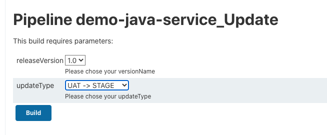
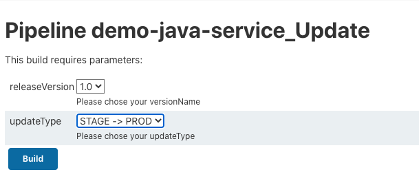
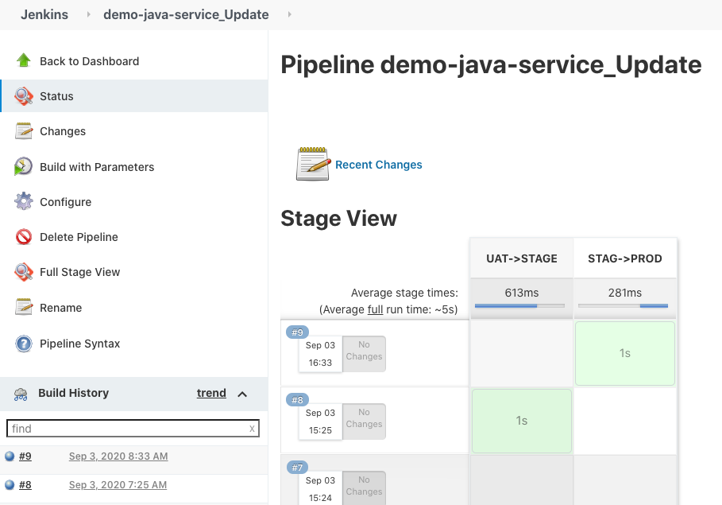
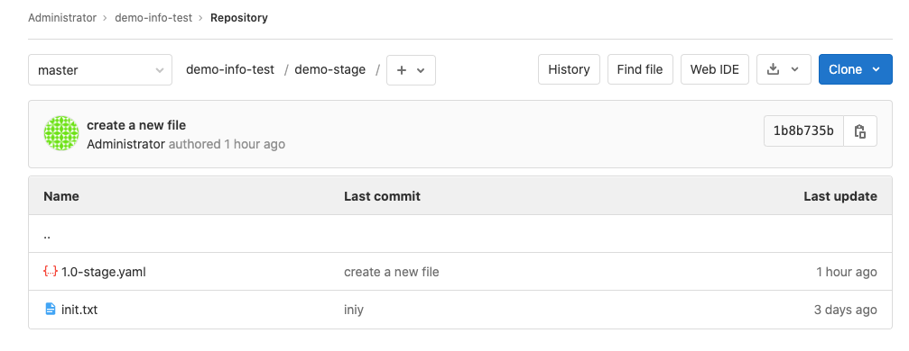
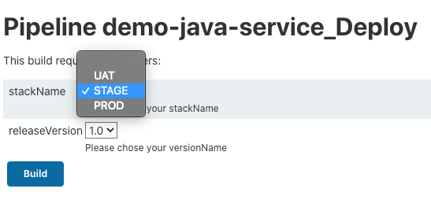

# **第四节 版本晋级及发布流水线**

* https://github.com/Chao-Xi/JenkinslibTest/blob/master/src/org/devops/gitlab.groovy
* https://github.com/Chao-Xi/JenkinslibTest/blob/master/src/org/devops/kubernetes.groovy


## 1、配置版本晋级流水线


**晋级／版本更新流水线** 

* 选择晋级策略 -> 根据版本文件晋级 -> 生成新版本文件 

### 1-1 晋级流水线

`demo-java-service_Update`

```
#!groovy
@Library('jenkinslib@master') _

def k8s = new org.devops.kubernetes()
def gitlab = new org.devops.gitlab()

// String updateType = "${env.updateType}"
// String releaseVersion = "${env.releaseVersion}"

pipeline{
    agent { node { label "master" }}

    parameters {
        choice(name: 'releaseVersion', choices: '1.0\n1.1\n1.2\n1.3', description: 'Please chose your versionName')
        choice(name: 'updateType', choices: 'UAT -> STAGE\nSTAGE -> PROD', description: 'Please chose your updateType')
    }

    stages{
        stage("UAT->STAGE"){
            when {
                environment name: 'updateType', value: 'UAT -> STAGE' 
            }
            
            steps {
                script{
                    println("UAT -> STAGE")
                
                   //获取UAT文件中的images
                    response = gitlab.GetRepoFile(3,"demo-uat%2f${releaseVersion}-uat.yaml")
                    fileData = readYaml text: """${response}"""
                    uatImage = fileData["spec"]["template"]["spec"]["containers"][0]["image"]
                    println("UAT IMAGES --> ${uatImage}")

                   //获取最新STAG环境的deployment
                    stagResponse = k8s.GetDeployment("demo-stage","demoapp")
                    stagResponse = stagResponse.content
                    
                    //获取镜像和version
                    stagfileData = readYaml text: """${stagResponse}"""
                    stagOldImage = stagfileData["spec"]["template"]["spec"]["containers"][0]["image"]
                    stagOldVersion = stagfileData["metadata"]["resourceVersion"]
                    
                    //更新镜像和version
                    println("STAG OLD IMAGES --> ${stagOldImage}")
                    stagResponse = stagResponse.replace(stagOldImage,uatImage)
                    stagResponse = stagResponse.replace(stagOldVersion,"")

                    //生成最新的STAGE版本文件
                    //文件转换
                    base64Content = stagResponse.bytes.encodeBase64().toString()
                    //上传文件
                    try {
                        gitlab.CreateRepoFile(3,"demo-stage%2f${releaseVersion}-stage.yaml",base64Content)
                    } catch(e){
                        gitlab.UpdateRepoFile(3,"demo-stage%2f${releaseVersion}-stage.yaml",base64Content)
                    }

                }
            }
        }
    
    
    
    stage("STAG->PROD"){
            when {
                environment name: 'updateType', value: 'STAGE -> PROD' 
            }
            
            steps {
                script{
                    println("STAGE -> PROD")
                   
                   //获取STAG文件中的images
                    response = gitlab.GetRepoFile(3,"demo-stage%2f${releaseVersion}-stage.yaml")
                    fileData = readYaml text: """${response}"""
                    stagImage = fileData["spec"]["template"]["spec"]["containers"][0]["image"]
                    println("STAGE IMAGES --> ${stagImage}")

                   //获取最新PROD环境的deployment
                    prodResponse = k8s.GetDeployment("demo-prod","demoapp")
                    prodResponse = prodResponse.content
                    
                    //获取镜像和version
                    prodfileData = readYaml text: """${prodResponse}"""
                    prodOldImage = prodfileData["spec"]["template"]["spec"]["containers"][0]["image"]
                    prodOldVersion = prodfileData["metadata"]["resourceVersion"]
                    
                    //更新镜像和version
                    println("PROD OLD IMAGES --> ${prodOldImage}")
                    prodResponse = prodResponse.replace(prodOldImage,stagImage)
                    prodResponse = prodResponse.replace(prodOldVersion,"")

                    //生成最新的PROD版本文件
                    //文件转换
                    base64Content = prodResponse.bytes.encodeBase64().toString()
                    //上传文件
                    try {
                        gitlab.CreateRepoFile(3,"demo-prod%2f${releaseVersion}-prod.yaml",base64Content)
                    } catch(e){
                        gitlab.UpdateRepoFile(3,"demo-prod%2f${releaseVersion}-prod.yaml",base64Content)
                    }

                }
            }
        }
    }
}
```

### 1-2 调用在`kubernetes.groovy` 定义 API 方法

```
//获取Deployment
def GetDeployment(nameSpace,deployName){
    apiUrl = "namespaces/${nameSpace}/deployments/${deployName}"
    response = HttpReq('GET',apiUrl,'')
    return response
}
```

### 1-3 调用在`gitlab.groovy` 定义 API 方法

```
//更新文件内容
def UpdateRepoFile(projectId,filePath,fileContent){
    apiUrl = "projects/${projectId}/repository/files/${filePath}"
    reqBody = """{"branch": "master","encoding":"base64", "content": "${fileContent}", "commit_message": "update a new file"}"""
    response = HttpReq('PUT',apiUrl,reqBody)
    println(response)

}

//获取文件内容
def GetRepoFile(projectId,filePath){
    apiUrl = "projects/${projectId}/repository/files/${filePath}/raw?ref=master"
    response = HttpReq('GET',apiUrl,'')
    return response.content
}

//创建仓库文件
def CreateRepoFile(projectId,filePath,fileContent){
    apiUrl = "projects/${projectId}/repository/files/${filePath}"
    reqBody = """{"branch": "master","encoding":"base64", "content": "${fileContent}", "commit_message": "create a new file"}"""
    response = HttpReq('POST',apiUrl,reqBody)
    println(response)
}
```






**Console Output: UAT -> STAGE**

```
STAG OLD IMAGES --> bitnami/java-example:0.0.1
[Pipeline] withCredentials
Masking supported pattern matches of $gitlabToken
[Pipeline] {
[Pipeline] httpRequest
HttpMethod: POST
URL: http://192.168.33.1:30088/api/v4/projects/3/repository/files/demo-stage%2f1.0-stage.yaml
Content-Type: application/json
PRIVATE-TOKEN: *****
Sending request to url: http://192.168.33.1:30088/api/v4/projects/3/repository/files/demo-stage%2f1.0-stage.yaml
Response Code: HTTP/1.1 201 Created
Response: 
{"file_path":"demo-stage/1.0-stage.yaml","branch":"master"}
Success code from [100‥399]
[Pipeline] }
[Pipeline] // withCredentials
[Pipeline] echo
Status: 201
[Pipeline] }
[Pipeline] // script
[Pipeline] }
[Pipeline] // stage
[Pipeline] stage
[Pipeline] { (STAG->PROD)
Stage "STAG->PROD" skipped due to when conditional
[Pipeline] }
```


**Console Output: STAGE -> PROD**

```
Stage "UAT->STAGE" skipped due to when conditional
[Pipeline] }
...
HttpMethod: POST
URL: http://192.168.33.1:30088/api/v4/projects/3/repository/files/demo-prod%2f1.0-prod.yaml
Content-Type: application/json
PRIVATE-TOKEN: *****
Sending request to url: http://192.168.33.1:30088/api/v4/projects/3/repository/files/demo-prod%2f1.0-prod.yaml
Response Code: HTTP/1.1 400 Bad Request
Response: 
{"message":"A file with this name already exists"}
[Pipeline] }
[Pipeline] // withCredentials
[Pipeline] withCredentials
Masking supported pattern matches of $gitlabToken
[Pipeline] {
[Pipeline] httpRequest
HttpMethod: PUT
URL: http://192.168.33.1:30088/api/v4/projects/3/repository/files/demo-prod%2f1.0-prod.yaml
Content-Type: application/json
PRIVATE-TOKEN: *****
Sending request to url: http://192.168.33.1:30088/api/v4/projects/3/repository/files/demo-prod%2f1.0-prod.yaml
Response Code: HTTP/1.1 200 OK
Response: 
{"file_path":"demo-prod/1.0-prod.yaml","branch":"master"}
Success code from [100‥399]
[Pipeline] }
[Pipeline] // withCredentials
[Pipeline] echo
Status: 200
```






## 2、配置应用发布流水线

### 2-1 发布流水线到不同的环境(Uat, Stage, Prod)


**STAG/PROD发布流水线**

* 选择版本号 -> 获取版本文件 -> 发布应用 

**`demo-java-service_Deploy`**

```
#!groovy

@Library('jenkinslib@master') _

// String stackName = "${env.stackName}"
// String releaseVersion = "${env.releaseVersion}"

def gitlab = new org.devops.gitlab()
def k8s = new org.devops.kubernetes()

pipeline{
   agent { node { label "master" }}

   parameters {
        choice(name: 'stackName', choices: '\nUAT\nSTAGE\nPROD', description: 'Please chose your stackName')
        choice(name: 'releaseVersion', choices: '1.0\n1.1\n1.2\n1.3', description: 'Please chose your versionName')
    }
   
   stages{
   
       stage("Deploy"){
            steps{
                script{
                
                    //获取版本文件
                    stack = "${stackName}".toLowerCase()
                    response = gitlab.GetRepoFile(3,"demo-${stack}%2f${releaseVersion}-${stack}.yaml")
                    //发布应用
                    k8s.UpdateDeployment("demo-${stack}","demoapp",response)
 
                }  
           }
       }
   }
}
```

### 2-1 调用在`kubernetes.groovy` 定义 API 方法

```
//更新Deployment
def UpdateDeployment(nameSpace,deployName,deplyBody){
    apiUrl = "namespaces/${nameSpace}/deployments/${deployName}"
    response = HttpReq('PUT',apiUrl,deplyBody)
    println(response)
}
```



**Console Output**

```
[Pipeline] httpRequest
HttpMethod: PUT
URL: https://kubernetes.docker.internal:6443/apis/apps/v1/namespaces/demo-stage/deployments/demoapp
Authorization: *****
Content-Type: application/yaml
Accept: application/yaml
Sending request to url: https://kubernetes.docker.internal:6443/apis/apps/v1/namespaces/demo-stage/deployments/demoapp
Response Code: HTTP/1.1 200 OK
...
Success code from [100‥399]
[Pipeline] }
[Pipeline] // withCredentials
[Pipeline] echo
Status: 200
```

```
$ kubectl get pod -n demo-stage
NAME                       READY   STATUS        RESTARTS   AGE
demoapp-678d789d86-z6dkm   0/1     Terminating   0          3h22m
demoapp-7d548887f4-tm25g   0/1     Completed     1          6s


$ kubectl logs demoapp-7d548887f4-tm25g -n demo-stage
Hello World!
```

