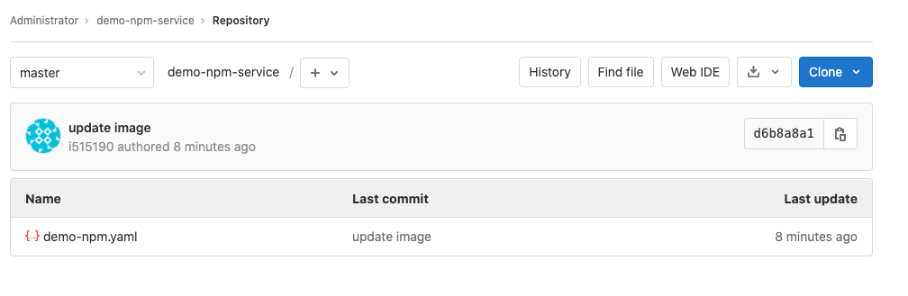
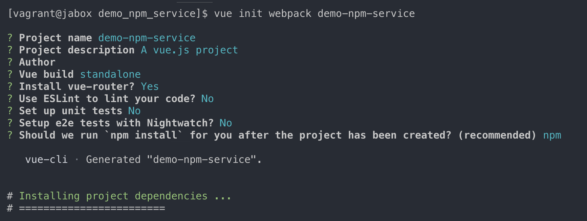
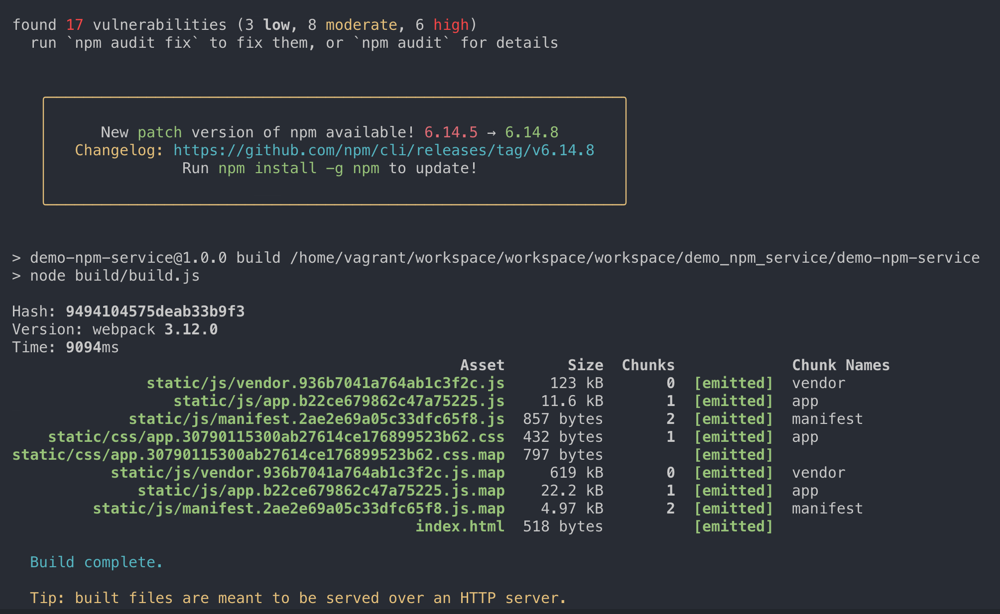
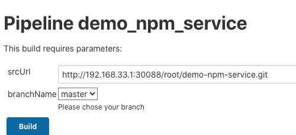
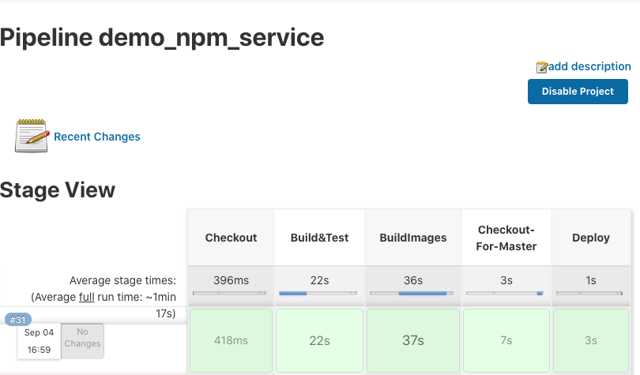
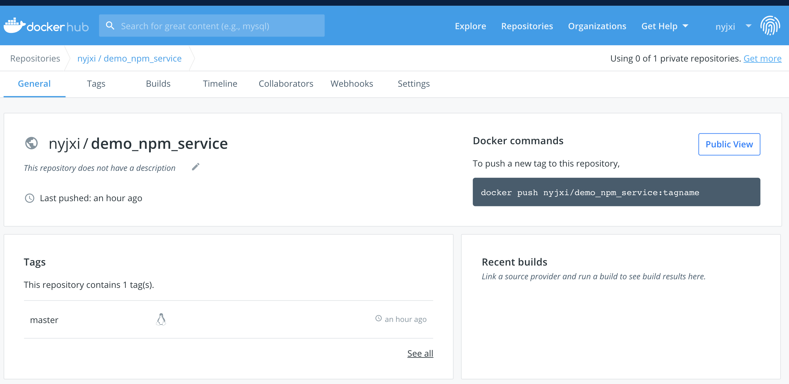
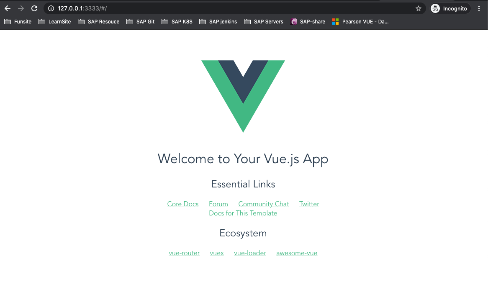

# 第五节 前端后端项目发布流水线（Java+Nodejs)

## 1、Java 项目流水线实践


* 使用`maven`编译打包 
* 使用`Sonar`扫描 
* 编写`Dockerflie`构建镜像 
* 自动生成`K8s`部署文件，替换镜像 
* 使用`Kubectl`发布部署

* [代码库`simple-java-maven-app`](https://github.com/Chao-Xi/jenkins-maven-service)

[流水线教程(第三节 Jenkins + K8S + Gitlab 构建 RLEASE 打包发布更新流水线到K8S集群)](3Jen_k8s_pipeline.md)

## 2、NodeJs 项目流水线实践


* 初始化前端项目 
* 使用`npm`编译打包 
* 使用`Sonar`前端扫描 
* 编写`Dockerfile`构建镜像 
* 编写K8s部署文件，替换镜像
* 使用`Kubectl`发布部署

### 2-1 初始化一个前端项目

**1、安装 npm 和 vue-cli**

* https://chao-xi.github.io/jxjenkinsbook/chap11/2Docker_pipeline/#1-4

```
install node (wget 下载 然后声明环境变量

// 安装 vue-cli

$ sudo chown -R 1000:1000 "/home/vagrant/.npm"

$  npm install -g @vue/cli-init
```

**2、 gitlab 创建一个新项目：`demo-npm-service`**

`demo-npm.yaml`

```
kind: Deployment
apiVersion: apps/v1
metadata:
  labels:
    k8s-app: npmdemo
  name: npmdemo
  namespace: demo-uat
spec:
  replicas: 1
  revisionHistoryLimit: 10
  selector:
    matchLabels:
      k8s-app: npmdemo
  template:
    metadata:
      labels:
        k8s-app: npmdemo
      namespace: demo-uat
      name: npmdemo
    spec:
      containers:
        - name: npmdemo
          image: nginx:1.17.7
          imagePullPolicy: IfNotPresent
          ports:
            - containerPort: 80
              name: web
              protocol: TCP
      serviceAccountName: npmdemo
---
apiVersion: v1
kind: ServiceAccount
metadata:
  labels:
    k8s-app: npmdemo
  name: npmdemo
  namespace: demo-uat
---
kind: Service
apiVersion: v1
metadata:
  labels:
    k8s-app: npmdemo
  name: npmdemo
  namespace: demo-uat
spec:
  ports:
    - name: web
      port: 80
      targetPort: 80
  selector:
    k8s-app: npmdemo
```




**3、快速创建一个 Pipeline 项目 `demo_npm_service`**

```
#!groovy

@Library('jenkinslib@master') _

def k8s = new org.devops.kubernetes()
def gitlab = new org.devops.gitlab()
def build = new org.devops.buildtools()

pipeline {
    agent { node { label "vagrant-agent" }}

    parameters {
        string(name: 'srcUrl', defaultValue: 'http://192.168.33.1:30088/root/demo-npm-service.git', description: '') 
        choice(name: 'branchName', choices: 'master\nstage\ndev', description: 'Please chose your branch')
        choice(name: 'buildType', choices: 'npm', description: 'build tool')
        string(name: 'buildShell', defaultValue: 'install && npm run build', description: 'build tool')
    }

    stages{
        stage('Checkout') {
	        steps {
	        	script {
	            	checkout([$class: 'GitSCM', branches: [[name: "${branchName}"]], doGenerateSubmoduleConfigurations: false, extensions: [], submoduleCfg: [], userRemoteConfigs: [[credentialsId: 'gitlab-admin-user', url: "${srcUrl}"]]])
	            } 
	        }
	    }
    }
 }
```

**4、运行这个Pipeline, 然后进入这个项目中初始化项目**

```
$ cd demo_npm_service
$ vue init webpack demo-npm-service
```


```
$ cd demo-npm-service
$ npm install && npm run build
```



```
$ tree dist/
dist/
├── index.html
└── static
    ├── css
    │   ├── app.30790115300ab27614ce176899523b62.css
    │   └── app.30790115300ab27614ce176899523b62.css.map
    └── js
        ├── app.b22ce679862c47a75225.js
        ├── app.b22ce679862c47a75225.js.map
        ├── manifest.2ae2e69a05c33dfc65f8.js
        ├── manifest.2ae2e69a05c33dfc65f8.js.map
        ├── vendor.936b7041a764ab1c3f2c.js
        └── vendor.936b7041a764ab1c3f2c.js.map

3 directories, 9 files
```

**6、传统发布流程**

```
cd dist/ && tar zcf demo-npm-service.tar.gz
cp demo-npm-service.tar.gz /usr/sahre/nginx/html && tar zxf
```

**7、Docker发布流程**

Dockerfile

```
FROM nginx:1.17.7
COPY demo-npm-service/dist/ /usr/share/nginx/html
```

### 2-2 建立打包发布流水线

**`demo_npm_service`**

```
#!groovy

@Library('jenkinslib@master') _

def k8s = new org.devops.kubernetes()
def gitlab = new org.devops.gitlab()
def build = new org.devops.buildtools()

pipeline {
    agent { node { label "vagrant-agent" }}

    parameters {
        string(name: 'srcUrl', defaultValue: 'http://192.168.33.1:30088/root/demo-npm-service.git', description: '') 
        choice(name: 'branchName', choices: 'master\nstage\ndev', description: 'Please chose your branch')
        // choice(name: 'buildType', choices: 'npm', description: 'build tool')
        // string(name: 'buildShell', defaultValue: 'install && npm run build', description: 'build tool')
    }

    stages{
        stage('Checkout') {
	        steps {
	        	script {
	            	checkout([$class: 'GitSCM', branches: [[name: "${branchName}"]], doGenerateSubmoduleConfigurations: false, extensions: [], submoduleCfg: [], userRemoteConfigs: [[credentialsId: 'gitlab-admin-user', url: "${srcUrl}"]]])
	            } 
	        }
	    }

        stage("Build&Test"){
            steps{
                script{
                    println("执行打包")
                    sh "cd demo-npm-service && npm install  --unsafe-perm=true && npm run build  && ls -l dist/"
                }
            }
        }

         //构建镜像
        stage("BuildImages"){
            steps{
                script{
                    println("构建上传镜像")
                    // env.serviceName = "${JOB_NAME}".split("_")[0]
                    env.serviceName = "${JOB_NAME}"

                    withCredentials([usernamePassword(credentialsId: 'docker-registry-admin', passwordVariable: 'password', usernameVariable: 'username')]) 
                    {
                        
                        env.dockerImage = "nyjxi/${serviceName}:${branchName}"
                        sh """
                            docker login -u ${username} -p ${password} 
                            docker build -t nyjxi/${serviceName}:${branchName} .
                            sleep 1
                            docker push nyjxi/${serviceName}:${branchName}
                            sleep 1
                            docker rmi nyjxi/${serviceName}:${branchName}
                        """
                }

            }
        }
    }   

        stage('Checkout-For-Master') {
            agent { node { label "hostmachine" }}
	        steps {
	        	script {
	            	checkout([$class: 'GitSCM', branches: [[name: "${branchName}"]], doGenerateSubmoduleConfigurations: false, extensions: [], submoduleCfg: [], userRemoteConfigs: [[credentialsId: 'gitlab-admin-user', url: "${srcUrl}"]]])
	            } 
	        }
	    }

        //发布
        stage("Deploy"){
            agent { node { label "hostmachine" }}

            steps{
                script{
                    println("发布应用")
                    
                    //获取旧镜像
                    yamlData = readYaml file: "demo-npm.yaml"
                    
                    println(yamlData[0])
                    println(yamlData[0]["spec"]["template"]["spec"]["containers"][0]["image"])
                    
                    oldImage = yamlData[0]["spec"]["template"]["spec"]["containers"][0]["image"]
                    
                    //替换镜像
                    sourceData = readFile file: 'demo-npm.yaml'
                    println(sourceData)
                    println(sourceData.getClass()) //returns the exact type of an object.
                    sourceData = sourceData.replace(oldImage,dockerImage)
                    println(sourceData)
                    
                    writeFile file: 'demo-npm.yaml', text: """${sourceData}"""
                    
                
                    sh """
                        #cat demo-npm.yaml
                        kubectl apply -f demo-npm.yaml
                    """
                    
                }
            }
        }

    }   
}
```

#### 1. Npm 创建与打包

```
stage("Build&Test"){
            steps{
                script{
                    println("执行打包")
                    sh "cd demo-npm-service && npm install  --unsafe-perm=true && npm run build  && ls -l dist/"
                }
            }
        }
```

#### 2. Npm 构建镜像

```
 stage("BuildImages"){
            steps{
                script{
                    println("构建上传镜像")
                    // env.serviceName = "${JOB_NAME}".split("_")[0]
                    env.serviceName = "${JOB_NAME}"

                    withCredentials([usernamePassword(credentialsId: 'docker-registry-admin', passwordVariable: 'password', usernameVariable: 'username')]) 
                    {
                        
                        env.dockerImage = "nyjxi/${serviceName}:${branchName}"
                        sh """
                            docker login -u ${username} -p ${password} 
                            docker build -t nyjxi/${serviceName}:${branchName} .
                            sleep 1
                            docker push nyjxi/${serviceName}:${branchName}
                            sleep 1
                            docker rmi nyjxi/${serviceName}:${branchName}
                        """
                }

            }
        }
    }   
```

#### 3. 切换构建机器并下载代码（kubectl执行环境所在机器）

```
stage('Checkout-For-Master') {
            agent { node { label "hostmachine" }}
	        steps {
	        	script {
	            	checkout([$class: 'GitSCM', branches: [[name: "${branchName}"]], doGenerateSubmoduleConfigurations: false, extensions: [], submoduleCfg: [], userRemoteConfigs: [[credentialsId: 'gitlab-admin-user', url: "${srcUrl}"]]])
	            } 
	        }
	    }
```

#### 3. 通过`kubectl`更新deployment镜像

```
stage("Deploy"){
            agent { node { label "hostmachine" }}

            steps{
                script{
                    println("发布应用")
                    
                    //获取旧镜像
                    yamlData = readYaml file: "demo-npm.yaml"
                    
                    println(yamlData[0])
                    println(yamlData[0]["spec"]["template"]["spec"]["containers"][0]["image"])
                    
                    oldImage = yamlData[0]["spec"]["template"]["spec"]["containers"][0]["image"]
                    
                    //替换镜像
                    sourceData = readFile file: 'demo-npm.yaml'
                    println(sourceData)
                    println(sourceData.getClass())  //returns the exact type of an object.
                    sourceData = sourceData.replace(oldImage,dockerImage)
                    println(sourceData)
                    
                    writeFile file: 'demo-npm.yaml', text: """${sourceData}"""
                    
                
                    sh """
                        #cat demo-npm.yaml
                        kubectl apply -f demo-npm.yaml
                    """
                    
                }
            }
        }

    }   
}
```





**Console output**

```

SuccessConsole Output
Started by user admin
Running in Durability level: MAX_SURVIVABILITY
Loading library jenkinslib@master
Examining Chao-Xi/JenkinslibTest
Attempting to resolve master as a branch
Resolved master as branch master at revision 4ff6110f7a787bd8eee5e99e0c93cffd2cd265de
using credential github
 > git rev-parse --is-inside-work-tree # timeout=10
Fetching changes from the remote Git repository
 > git config remote.origin.url https://github.com/Chao-Xi/JenkinslibTest.git # timeout=10
Fetching without tags
Fetching upstream changes from https://github.com/Chao-Xi/JenkinslibTest.git
 > git --version # timeout=10
 > git --version # 'git version 2.11.0'
using GIT_ASKPASS to set credentials 
 > git fetch --no-tags --progress -- https://github.com/Chao-Xi/JenkinslibTest.git +refs/heads/master:refs/remotes/origin/master # timeout=10
Checking out Revision 4ff6110f7a787bd8eee5e99e0c93cffd2cd265de (master)
 > git config core.sparsecheckout # timeout=10
 > git checkout -f 4ff6110f7a787bd8eee5e99e0c93cffd2cd265de # timeout=10
Commit message: "add kubernetest"
 > git rev-list --no-walk 4ff6110f7a787bd8eee5e99e0c93cffd2cd265de # timeout=10
[Pipeline] Start of Pipeline
[Pipeline] node
Running on vagrant-agent in /home/vagrant/workspace/workspace/demo_npm_service
[Pipeline] {
[Pipeline] stage
[Pipeline] { (Checkout)
[Pipeline] script
[Pipeline] {
[Pipeline] checkout
using credential gitlab-admin-user
Fetching changes from the remote Git repository
Checking out Revision f92f92ad70c37f3f09c95bfbb85befde3335fc4e (origin/master)
Commit message: "update dockerfile"
 > git rev-parse --is-inside-work-tree # timeout=10
 > git config remote.origin.url http://192.168.33.1:30088/root/demo-npm-service.git # timeout=10
Fetching upstream changes from http://192.168.33.1:30088/root/demo-npm-service.git
 > git --version # timeout=10
 > git --version # 'git version 1.8.3.1'
using GIT_ASKPASS to set credentials 
 > git fetch --tags --progress http://192.168.33.1:30088/root/demo-npm-service.git +refs/heads/*:refs/remotes/origin/* # timeout=10
 > git rev-parse origin/master^{commit} # timeout=10
 > git config core.sparsecheckout # timeout=10
 > git checkout -f f92f92ad70c37f3f09c95bfbb85befde3335fc4e # timeout=10
 > git rev-list --no-walk f92f92ad70c37f3f09c95bfbb85befde3335fc4e # timeout=10
[Pipeline] }
[Pipeline] // script
[Pipeline] }
[Pipeline] // stage
[Pipeline] stage
[Pipeline] { (Build&Test)
[Pipeline] script
[Pipeline] {
[Pipeline] echo
执行打包
[Pipeline] sh
+ cd demo-npm-service
+ npm install --unsafe-perm=true
npm WARN ajv-keywords@3.5.2 requires a peer of ajv@^6.9.1 but none is installed. You must install peer dependencies yourself.
npm WARN optional SKIPPING OPTIONAL DEPENDENCY: fsevents@2.1.3 (node_modules/fsevents):
npm WARN notsup SKIPPING OPTIONAL DEPENDENCY: Unsupported platform for fsevents@2.1.3: wanted {"os":"darwin","arch":"any"} (current: {"os":"linux","arch":"x64"})
npm WARN optional SKIPPING OPTIONAL DEPENDENCY: fsevents@1.2.13 (node_modules/watchpack-chokidar2/node_modules/fsevents):
npm WARN notsup SKIPPING OPTIONAL DEPENDENCY: Unsupported platform for fsevents@1.2.13: wanted {"os":"darwin","arch":"any"} (current: {"os":"linux","arch":"x64"})
npm WARN optional SKIPPING OPTIONAL DEPENDENCY: fsevents@1.2.13 (node_modules/webpack-dev-server/node_modules/fsevents):
npm WARN notsup SKIPPING OPTIONAL DEPENDENCY: Unsupported platform for fsevents@1.2.13: wanted {"os":"darwin","arch":"any"} (current: {"os":"linux","arch":"x64"})

audited 1274 packages in 8.831s

29 packages are looking for funding
  run `npm fund` for details

found 17 vulnerabilities (3 low, 8 moderate, 6 high)
  run `npm audit fix` to fix them, or `npm audit` for details
+ npm run build

> demo-npm-service@1.0.0 build /home/vagrant/workspace/workspace/demo_npm_service/demo-npm-service
> node build/build.js

Hash: cc34753b040c844221bc
Version: webpack 3.12.0
Time: 10232ms
                                                  Asset       Size  Chunks             Chunk Names
               static/js/vendor.936b7041a764ab1c3f2c.js     123 kB       0  [emitted]  vendor
                  static/js/app.b22ce679862c47a75225.js    11.6 kB       1  [emitted]  app
             static/js/manifest.2ae2e69a05c33dfc65f8.js  857 bytes       2  [emitted]  manifest
    static/css/app.30790115300ab27614ce176899523b62.css  432 bytes       1  [emitted]  app
static/css/app.30790115300ab27614ce176899523b62.css.map  797 bytes          [emitted]  
           static/js/vendor.936b7041a764ab1c3f2c.js.map     619 kB       0  [emitted]  vendor
              static/js/app.b22ce679862c47a75225.js.map    22.2 kB       1  [emitted]  app
         static/js/manifest.2ae2e69a05c33dfc65f8.js.map    4.97 kB       2  [emitted]  manifest
                                             index.html  518 bytes          [emitted]  

  Build complete.

  Tip: built files are meant to be served over an HTTP server.
  Opening index.html over file:// won't work.

+ ls -l dist/
total 4
-rw-rw-r--. 1 vagrant vagrant 518 Aug 29 02:11 index.html
drwxrwxr-x. 4 vagrant vagrant  27 Aug 29 02:11 static
[Pipeline] }
[Pipeline] // script
[Pipeline] }
[Pipeline] // stage
[Pipeline] stage
[Pipeline] { (BuildImages)
[Pipeline] script
[Pipeline] {
[Pipeline] echo
构建上传镜像
[Pipeline] withCredentials
Masking supported pattern matches of $username or $password
[Pipeline] {
[Pipeline] sh
+ docker login -u **** -p ****
WARNING! Using --password via the CLI is insecure. Use --password-stdin.
WARNING! Your password will be stored unencrypted in /home/vagrant/.docker/config.json.
Configure a credential helper to remove this warning. See
https://docs.docker.com/engine/reference/commandline/login/#credentials-store

Login Succeeded
+ docker build -t ****/demo_npm_service:master .
Sending build context to Docker daemon  162.7MB

Step 1/2 : FROM nginx:1.17.7
 ---> c7460dfcab50
Step 2/2 : COPY demo-npm-service/dist/ /usr/share/nginx/html
 ---> 7bfb4e14b75f
Successfully built 7bfb4e14b75f
Successfully tagged ****/demo_npm_service:master
+ sleep 1
+ docker push ****/demo_npm_service:master
The push refers to repository [docker.io/****/demo_npm_service]
33aa390ffe98: Preparing
c26e88311e71: Preparing
17fde96446df: Preparing
556c5fb0d91b: Preparing
17fde96446df: Layer already exists
c26e88311e71: Layer already exists
556c5fb0d91b: Layer already exists
33aa390ffe98: Pushed
master: digest: sha256:b07347f3144a8d72dda47b8b6a8c6688e8be505890d83ec6d6fead467b073982 size: 1158
+ sleep 1
+ docker rmi ****/demo_npm_service:master
Untagged: ****/demo_npm_service:master
Untagged: ****/demo_npm_service@sha256:b07347f3144a8d72dda47b8b6a8c6688e8be505890d83ec6d6fead467b073982
Deleted: sha256:7bfb4e14b75f7844a4d8d5c859e58e18b951e47ea5528cee8cf6092921c7b68c
Deleted: sha256:f8efe6a8a2c3832f337ed137ffbb50db64a2d7e4bbd5844b221acefe5c5e021d
[Pipeline] }
[Pipeline] // withCredentials
...
发布应用
[Pipeline] readYaml
[Pipeline] echo
{kind=Deployment, apiVersion=apps/v1, metadata={labels={k8s-app=npmdemo}, name=npmdemo, namespace=demo-uat}, spec={replicas=1, revisionHistoryLimit=10, selector={matchLabels={k8s-app=npmdemo}}, template={metadata={labels={k8s-app=npmdemo}, namespace=demo-uat, name=npmdemo}, spec={containers=[{name=npmdemo, image=nginx:1.17.7, imagePullPolicy=IfNotPresent, ports=[{containerPort=80, name=web, protocol=TCP}]}], serviceAccountName=npmdemo}}}}
[Pipeline] echo
nginx:1.17.7
[Pipeline] readFile
[Pipeline] echo
kind: Deployment
apiVersion: apps/v1
...
[Pipeline] writeFile
[Pipeline] sh
+ kubectl apply -f demo-npm.yaml
deployment.apps/npmdemo configured
serviceaccount/npmdemo unchanged
service/npmdemo unchanged
```

```

$ kubectl get pods -o custom-columns='NAME:metadata.name,IMAGES:spec.containers[*].image' -n demo-uat
NAME                       IMAGES
npmdemo-5fd79bfd49-gt88v   nyjxi/demo_npm_service:master
```

```
$ kubectl get svc -n demo-uat
NAME      TYPE        CLUSTER-IP       EXTERNAL-IP   PORT(S)   AGE
npmdemo   ClusterIP   10.105.172.158   <none>        80/TCP    6h27m

$ kubectl port-forward svc/npmdemo -n demo-uat 3333:80
Forwarding from 127.0.0.1:3333 -> 80
Forwarding from [::1]:3333 -> 80
```





