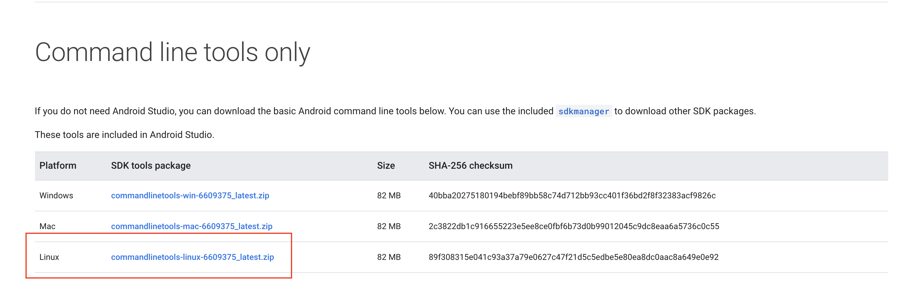

# 第六节 构建Android项目流水线

## 1、配置 Android 项目开发环境

### 1-1 安装JDK

下载地址: http://www.oracle.com/technetwork/java/javase/downloads/jdk8-downloads-2133151.html

```
tar zxf jdk-8u201-linux-x64.tar.gz -C /usr/local

#添加到/etc/profile
export JAVA_HOME=/usr/local/jdk1.8.0_201
export PATH=$PATH:$JAVA_HOME/bin

source /etc/profile

java -version
```

```
$ java -version
openjdk version "1.8.0_252"
OpenJDK Runtime Environment (build 1.8.0_252-b09)
OpenJDK 64-Bit Server VM (build 25.252-b09, mixed mode)
```

### 1-2 安装Android SDK Tools

https://developer.android.com/studio/index.html



```
$ sudo wget  wget https://dl.google.com/android/repository/commandlinetools-linux-6609375_latest.zip
$ unzip commandlinetools-linux-6609375_latest.zip
$ sudo cp -r tools/ /opt/tools
$ sudo ln -s /opt/tools/ /usr/local/tools

$ sudo vim /etc/profile.d/sdk.sh


#!/bin/bash

export ANDROID_HOME=/usr/local/
export PATH=$PATH:$ANDROID_HOME/tools/bin

sudo  chmod +x /etc/profile.d/sdk.sh
source /etc/profile.d/sdk.sh
```


### 1-4 SDKmanager

https://www.jianshu.com/p/f1f209135d5a

```
#验证环境变量配置准确
$  sdkmanager --list --sdk_root=/usr/local/tools --no_https --proxy=http --proxy_host=proxy.sha.sap.corp --proxy_port=8080

```

### 1-3 安装Gradle

* https://gradle.org/releases/
* https://chao-xi.github.io/jxjenkinsbook/chap4/1chp4_tools1/#3-gradle

```
$ gradle -v

------------------------------------------------------------
Gradle 6.5
------------------------------------------------------------

Build time:   2020-06-02 20:46:21 UTC
Revision:     a27f41e4ae5e8a41ab9b19f8dd6d86d7b384dad4

Kotlin:       1.3.72
Groovy:       2.5.11
Ant:          Apache Ant(TM) version 1.10.7 compiled on September 1 2019
JVM:          1.8.0_252 (Oracle Corporation 25.252-b09)
OS:           Linux 3.10.0-957.12.2.el7.x86_64 amd64
```

```
$ sdkmanager --list --sdk_root=/usr/local/tools --no_https --proxy=http --proxy_host=proxy.sha.sap.corp --proxy_port=8080

$ sdkmanager "platforms;android-28" --sdk_root=/opt/tools --no_https --proxy=http --proxy_host=proxy.sha.sap.corp --proxy_port=8080

$ sdkmanager "build-tools;26.0.2" "platforms;android-26" --sdk_root=/usr/local/tools --no_https --proxy=http --proxy_host=proxy.sha.sap.corp --proxy_port=8080


sdkmanager "platforms;android-26" --sdk_root=/usr/local/tools --no_https --proxy=http --proxy_host=proxy.sha.sap.corp --proxy_port=8080

$ sdkmanager --licenses --sdk_root=/opt/tools --no_https --proxy=http --proxy_host=proxy.sha.sap.corp --proxy_port=8080


sdkmanager --sdk_root=/usr/local/tools --update && yes | sdkmanager --licenses --sdk_root=/usr/local/tools 


$ sdkmanager --uninstall  "build-tools;26.0.2" --sdk_root=/opt  --no_https --proxy=http --proxy_host=proxy.sha.sap.corp --proxy_port=8080#卸载这个包

```


