# 第七节 基于Azure部署Jenkins服务并开发MERN应用的CI/CD构建管道


随着开发软件，还必须将其与以前的代码持续集成并将其部署到服务器。手动执行此操作是一个耗时的过程，有时会导致错误。

我们将讨论如何通过使用 Jenkins 设置 CI/CD 管道来改进 MERN（MongoDB、Express、React 和 NodeJs）应用程序开发过程。您将了解如何自动部署以实现更快、更高效的发布。

先决条件

* 对 MERN 堆栈技术的基本了解。
* 对Docker的基本了解。
* 从GitHub获取源代码

### 问题

考虑一下这个生产力应用程序——这是我们将在本文中使用的 MERN 项目。从构建应用程序到将其推送到 Docker 中心，我们必须完成许多步骤。

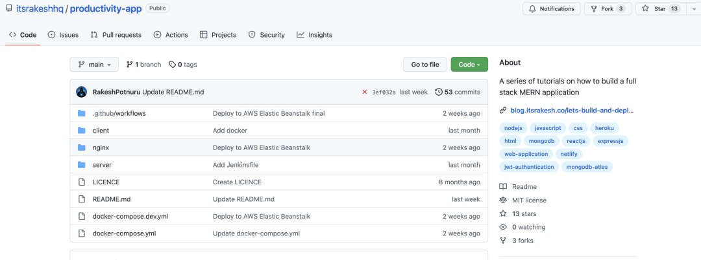

[https://github.com/itsrakeshhq/productivity-app](https://github.com/itsrakeshhq/productivity-app)

首先，我们必须使用命令运行测试以确定所有测试是否通过。如果所有测试都通过，我们将构建 Docker 镜像，然后将这些镜像推送到 Docker Hub。如果您的应用程序极其复杂，您可能需要采取额外的步骤。


现在，假设我们手动完成所有操作，这既费时又可能导致错误。

### 解决方案

为了解决这个问题，我们可以创建一个 CI/CD流水线。因此，每当您添加功能或修复错误时，都会触发此管道。这会自动执行从测试到部署的所有步骤。

**什么是 CI/CD，为什么重要？**

持续集成和持续部署是为自动化软件集成和部署而执行的一系列步骤。CI/CD 是 DevOps 的核心

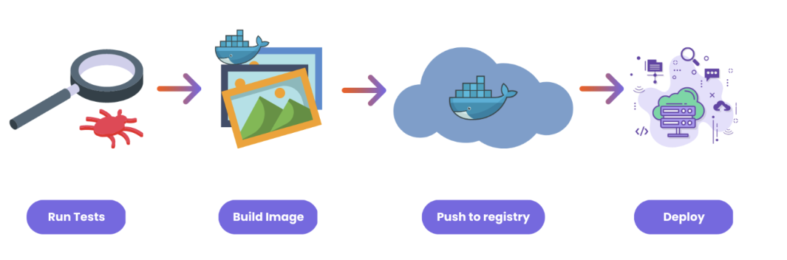

从开发到部署，我们的 MERN 应用程序经历了四个主要阶段：测试、构建 Docker 镜像、推送到注册表以及部署到云提供商。所有这些都是通过运行各种命令手动完成的。每次添加新功能或修复错误时，我们都需要这样做。


但这会显着降低开发人员的工作效率，这就是为什么 CI/CD 可以如此有助于自动化这个过程。在本文中，我们将介绍推送到注册表之前的步骤。

## 该项目

我们将在本教程中使用的项目是一个非常简单的全栈 MERN 应用程序。

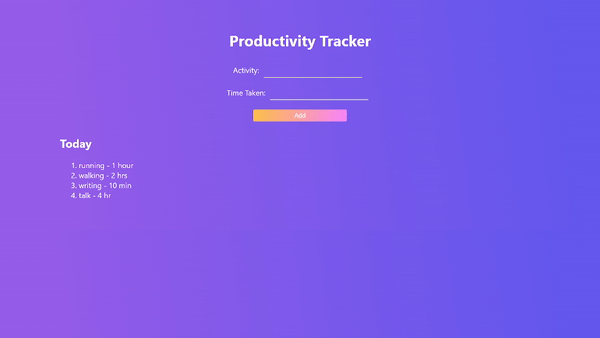

它包含两个微服务。

* 前端
* 后端

这两个应用程序都包含一个 Dockerfile。

### 什么是Jenkins？

要运行 CI/CD 管道，我们需要一个 CI/CD 服务器。这是管道中编写的所有步骤运行的地方。

市场上有许多可用的服务，包括 GitHub Actions、Travis CI、Circle CI、GitLab CI/CD、AWS CodePipeline、Azure DevOps 和 Google Cloud Build。Jenkins 是一种流行的 CI/CD 工具，我们将在这里使用它。

**如何在 Azure 上设置 Jenkins 服务器**

因为 Jenkins 是开源的并且它不提供云解决方案，所以我们必须在本地运行它或在云提供商上自行托管。现在，在本地运行可能很困难，尤其是对于 Windows 用户而言。因此，我选择在 Azure 上自行托管此演示。

如果您想在本地运行或在 Azure 以外的地方自行托管（遵循Jenkins 的这些指南），请跳过此部分并继续阅读如何配置 Jenkins部分。

首先，您需要登录您的Azure帐户（如果您还没有，请创建一个）。打开 Azure Cloud Shell。

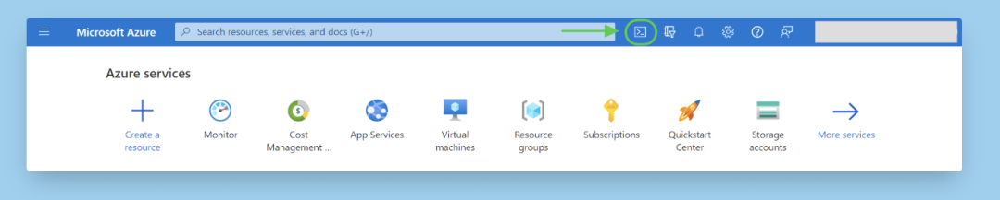

然后创建一个名为jenkins存储所有 Jenkins 配置的目录，并切换到该目录：

```
mkdir jenkins
cd jenkins
```

创建一个名为`cloud-init-jenkins.txt`. 使用 nano 或 vim 打开，

```
touch cloud-init-jenkins.txt
nano cloud-init-jenkins.txt
```

并将此代码粘贴到其中：

```
#cloud-config
package_upgrade: true
runcmd:
  - sudo apt install openjdk-11-jre -y
  - wget -qO - https://pkg.jenkins.io/debian-stable/jenkins.io.key | sudo apt-key add -
  - sh -c 'echo deb https://pkg.jenkins.io/debian-stable binary/ > /etc/apt/sources.list.d/jenkins.list'
  - sudo apt-get update && sudo apt-get install jenkins -y
  - sudo service jenkins restart
```

在这里，我们将在创建虚拟机后使用此文件来安装 Jenkins。首先，我们安装 openjdk，这是 Jenkins 运行所必需的。Jenkins 服务会在我们安装后重新启动。

接下来，创建一个资源组。（Azure 中的资源组就像一个容器，将项目的所有相关资源保存在一个组中）

```
az group create --name jenkins-rg --location centralindia
```

注意：确保将位置更改为离您最近的位置。

现在，创建一个虚拟机。

```
az vm create \
--resource-group jenkins-rg \
--name jenkins-vm \
--image UbuntuLTS \
--admin-username "azureuser" \
--generate-ssh-keys \
--public-ip-sku Standard \
--custom-data cloud-init-jenkins.txt
```

您可以使用以下命令验证 VM 安装：

```
az vm list -d -o table --query "[?name=='jenkins-vm']"
```

不要混淆。此命令只是以表格格式显示 JSON 数据，以便于验证。

Jenkins 服务器在 `8080 port` 上运行，所以我们需要在我们的 VM 上公开这个端口。你可以这样做：

```
az vm open-port \
--resource-group jenkins-rg \
--name jenkins-vm  \
--port 8080 --priority 1010
```

现在我们可以使用 URL 在浏览器中访问 Jenkins 仪表板`http://<your-vm-ip>:8080` 。使用此命令获取 VM IP 地址：

```
az vm show \
--resource-group jenkins-rg \
--name jenkins-vm -d \
--query [publicIps] \
--output tsv
```

您现在可以在浏览器中看到 Jenkins 应用程序。

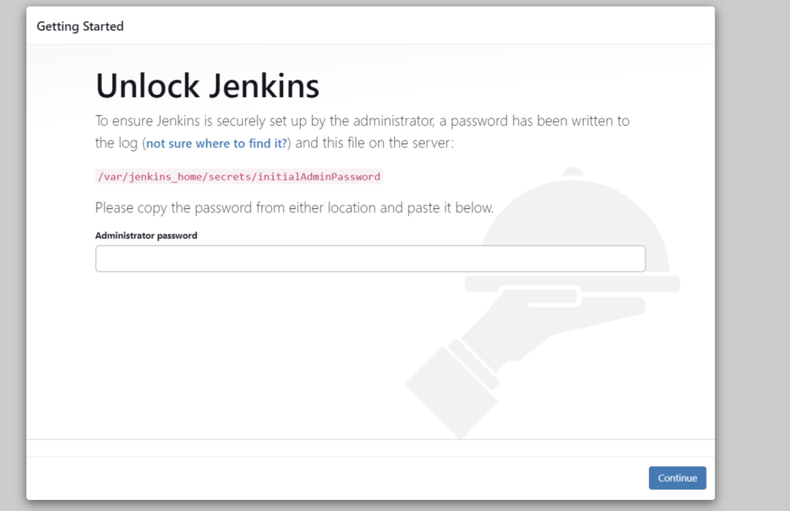

您会注意到，Jenkins 要求我们提供一个在安装过程中自动生成的管理员密码。

但首先让我们通过 SSH 进入安装了 Jenkins 的虚拟机。

```
ssh azureuser@<ip_address>
```

现在，输入以下命令以获取密码：

```
sudo cat /var/lib/jenkins/secrets/initialAdminPassword
```

复制并粘贴它。然后点击继续。

## 如何配置Jenkins

首先，您需要点击Install suggested plugins。安装所有插件需要一些时间。

需要管理员用户来限制对 Jenkins 的访问。因此，继续创建一个。完成后点击保存并继续。

现在您将看到 Jenkins 仪表板。

第一步是安装“Blue Ocean”插件。Jenkins 有一个非常古老的界面，这可能会让一些人难以使用。这个蓝海插件为一些 Jenkins 组件（比如创建管道）提供了一个现代接口。

要安装插件，请转到`Manage Jenkins -> 单击System Configuration下的Manage Plugins -> Available plugins`。

搜索“Blue Ocean” -> 勾选方框并点击Download now and install after restart。

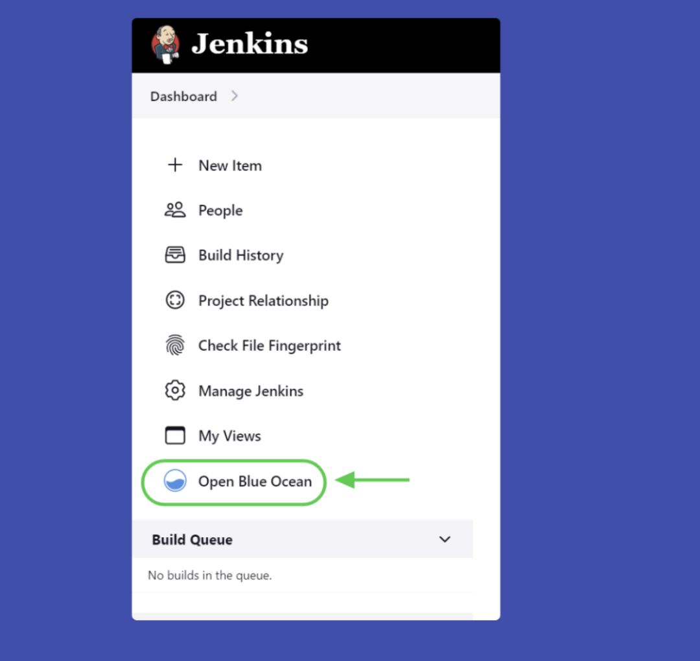

## 如何编写 Jenkinsfile

要创建管道，我们需要一个Jenkinsfile。该文件包含所有管道配置——阶段、步骤等。Jenkinsfile 之于 Jenkins 就像 Dockerfile 之于 Docker。

Jenkinsfile 使用Groovy语法。语法非常简单。看一眼就能明白一切。
让我们开始写：

```
pipeline {

}
```

`agent` 一词应该是您在管道中提到的第一件事。代理类似于运行作业的容器或环境。您可以使用多个代理并行运行作业

```
pipeline {
 agent any
}
```

在这里，我们告诉 Jenkins 使用任何可用的代理。

我们的流水线共有 5 个阶段：

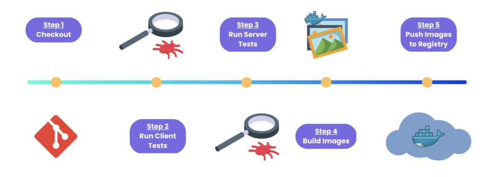

### 第 1 阶段：下载代码

不同的 CI/CD 工具使用不同的命名约定。在 Jenkins 中，这些被称为阶段。在每个阶段，我们编写不同的步骤。

我们的第一个阶段是从源代码管理系统（在我们的例子中是 GitHub）检出代码。

```
pipeline {
 agent any

 stages {
  stage('Checkout') {
   steps {
    checkout scm
   }
  }
 }
}
```

提交更改并推送到您的 GitHub 存储库。

由于我们还没有创建任何管道，现在就开始吧。

在开始之前，我们必须确保 Git 已安装在我们的系统上。如果您按照我之前的步骤在 Azure VM 上安装 Jenkins，则 Git 已经安装。

您可以通过运行以下命令对其进行测试（使您仍然通过 SSH 连接到 VM）：

```
git --version

## install git
sudo apt install git
```

打开蓝海。单击创建新管道。

然后选择您的源代码管理系统。如果您选择 GitHub，则必须为 Jenkins 提供访问令牌以访问您的存储库。我建议在此处单击创建访问令牌，因为它是一个具有所有必要权限的模板。然后点击连接。

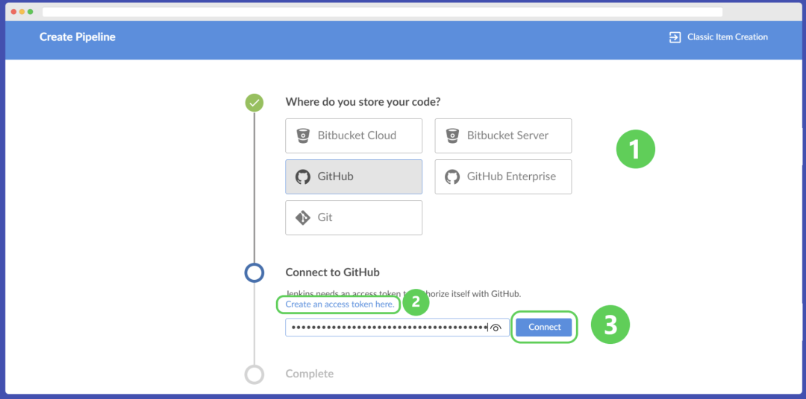

之后，将创建一个管道。由于我们的存储库已经包含一个 Jenkinsfile，Jenkins 会自动检测它并运行我们在管道中提到的阶段和步骤。

如果一切顺利，整个页面将变为绿色。（其他颜色：蓝色表示管道正在运行，红色表示管道出现问题，灰色表示我们停止了管道。）

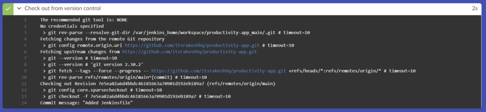

### 第 2 阶段：运行前端测试

通常，所有 CI/CD 管道都包含一些需要在部署之前运行的测试。所以我在前端和后端都添加了简单的测试。让我们从前端测试开始。

```
stage('Client Tests') {
 steps {
  dir('client') {
   sh 'npm install'
   sh 'npm test'
  }
 }
}
```

我们正在将目录更改为，client/因为那是前端代码所在的位置。然后安装依赖项并在 shell 中npm install运行测试`npm test`

同样，在我们重新启动管道之前，我们必须确保安装了节点和 npm。在虚拟机中使用这些命令安装节点和 npm：

```
curl -sL https://deb.nodesource.com/setup_16.x | sudo -E bash -
sudo apt-get install -y nodejs
```

现在，提交代码并重新启动管道。

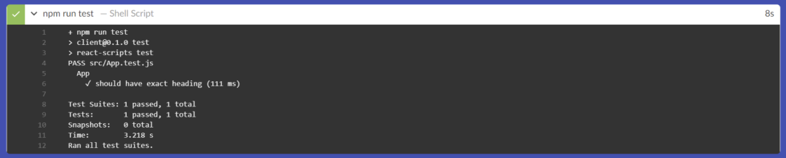

## 第 3 阶段：运行后端测试

现在对后端测试做同样的事情。

但是在我们继续之前，我们需要做一件事。

如果您看一下代码库`activity.test.js`，我们会使用一些环境变量。因此，让我们在 Jenkins 中添加这些环境变量。

### **如何在 Jenkins 中添加环境变量**

要添加环境变量，请转到`Manage Jenkins -> 单击“Security”下的Manage Credentials ->   System -> Global credentials (unrestricted) -> 单击+ Add Credentials`。

对于`Kind`选择“Secret text”，将Scope保留为默认值，对于Secret写入秘密值和ID。这就是我们在 Jenkinsfile 中使用这些环境变量时所使用的。
添加以下环境变量：


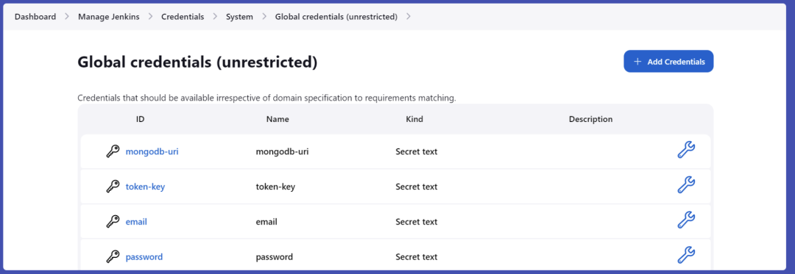

然后在 Jenkinsfile 中，使用这些环境变量：

```
environment {
 MONGODB_URI = credentials('mongodb-uri')
 TOKEN_KEY = credentials('token-key')
 EMAIL = credentials('email')
 PASSWORD = credentials('password')
}
```

添加一个阶段来安装依赖项，在 Jenkins 环境中设置这些变量，然后运行测试：

```
stage('Server Tests') {
 steps {
  dir('server') {
   sh 'npm install'
   sh 'export MONGODB_URI=$MONGODB_URI'
   sh 'export TOKEN_KEY=$TOKEN_KEY'
   sh 'export EMAIL=$EMAIL'
   sh 'export PASSWORD=$PASSWORD'
   sh 'npm test'
  }
 }
}
```

再次提交代码并重新启动管道。

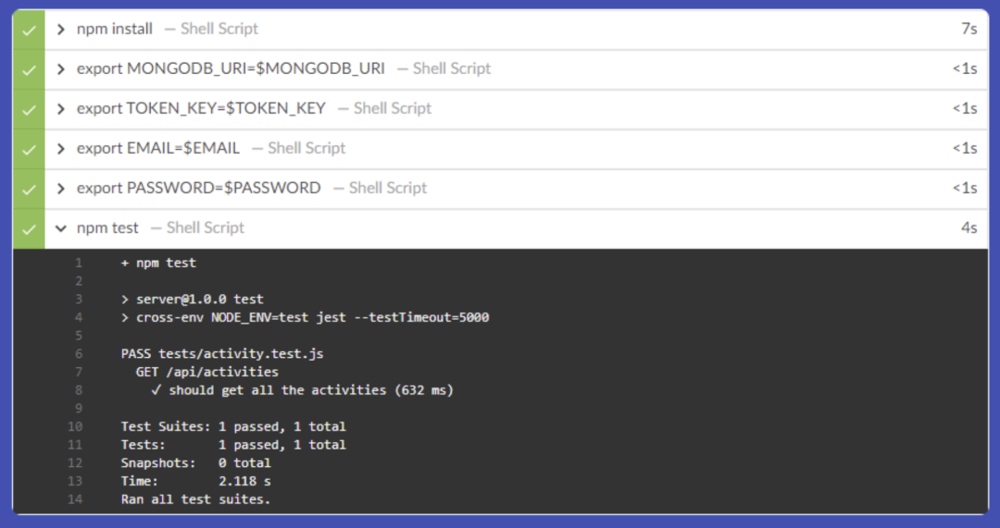


## 第 4 阶段：构建 Docker 镜像

现在，我们必须指定一个步骤来从 Dockerfiles 构建 Docker 镜像。
在我们继续之前，请在 VM 中安装 Docker（如果您尚未安装它）。
安装 Docker：

```
sudo apt install docker.io
```

将用户添加jenkins到docker组中，以便 Jenkins 可以访问 Docker 守护进程——否则您将收到权限被拒绝的错误。

```
sudo usermod -a -G docker jenkins
```

然后重启jenkins服务。

```
sudo systemctl restart jenkins
```

在 Jenkinsfile 中添加一个阶段。

```
stage('Build Images') {
 steps {
  sh 'docker build -t rakeshpotnuru/productivity-app:client-latest client'
  sh 'docker build -t rakeshpotnuru/productivity-app:server-latest server'
 }
}
```

提交代码并重新启动管道。

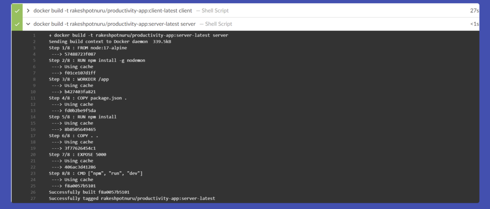

### 阶段 5：将图像推送到注册表

作为最后阶段，我们会将图像推送到 Docker hub。

在此之前，将您的 docker hub 用户名和密码添加到 Jenkins 凭据管理器，但对于种类选择“用户名和密码”。


添加我们登录并将图像推送到 Docker hub 的最后阶段。

```
stage('Push Images to DockerHub') {
 steps {
  withCredentials([usernamePassword(credentialsId: 'dockerhub', passwordVariable: 'DOCKER_PASSWORD', usernameVariable: 'DOCKER_USERNAME')]) {
   sh 'docker login -u $DOCKER_USERNAME -p $DOCKER_PASSWORD'
   sh 'docker push rakeshpotnuru/productivity-app:client-latest'
   sh 'docker push rakeshpotnuru/productivity-app:server-latest'
  }
 }
}
```


完整的Jenkinsfile

```
// This is a Jenkinsfile. It is a script that Jenkins will run when a build is triggered.
pipeline {
    // Telling Jenkins to run the pipeline on any available agent.
    agent any

    // Setting environment variables for the build.
    environment {
        MONGODB_URI = credentials('mongodb-uri')
        TOKEN_KEY = credentials('token-key')
        EMAIL = credentials('email')
        PASSWORD = credentials('password')
    }

    // This is the pipeline. It is a series of stages that Jenkins will run.
    stages {
        // This state is telling Jenkins to checkout the source code from the source control management system.
        stage('Checkout') {
            steps {
                checkout scm
            }
        }
        
        // This stage is telling Jenkins to run the tests in the client directory.
        stage('Client Tests') {
            steps {
                dir('client') {
                    sh 'npm install'
                    sh 'npm test'
                }
            }
        }
        
        // This stage is telling Jenkins to run the tests in the server directory.
        stage('Server Tests') {
            steps {
                dir('server') {
                    sh 'npm install'
                    sh 'export MONGODB_URI=$MONGODB_URI'
                    sh 'export TOKEN_KEY=$TOKEN_KEY'
                    sh 'export EMAIL=$EMAIL'
                    sh 'export PASSWORD=$PASSWORD'
                    sh 'npm test'
                }
            }
        }
        
        // This stage is telling Jenkins to build the images for the client and server.
        stage('Build Images') {
            steps {
                sh 'docker build -t rakeshpotnuru/productivity-app:client-latest client'
                sh 'docker build -t rakeshpotnuru/productivity-app:server-latest server'
            }
        }
        
        // This stage is telling Jenkins to push the images to DockerHub.
        stage('Push Images to DockerHub') {
            steps {
                withCredentials([usernamePassword(credentialsId: 'dockerhub', passwordVariable: 'DOCKER_PASSWORD', usernameVariable: 'DOCKER_USERNAME')]) {
                    sh 'docker login -u $DOCKER_USERNAME -p $DOCKER_PASSWORD'
                    sh 'docker push rakeshpotnuru/productivity-app:client-latest'
                    sh 'docker push rakeshpotnuru/productivity-app:server-latest'
                }
            }
        }
    }
}
```

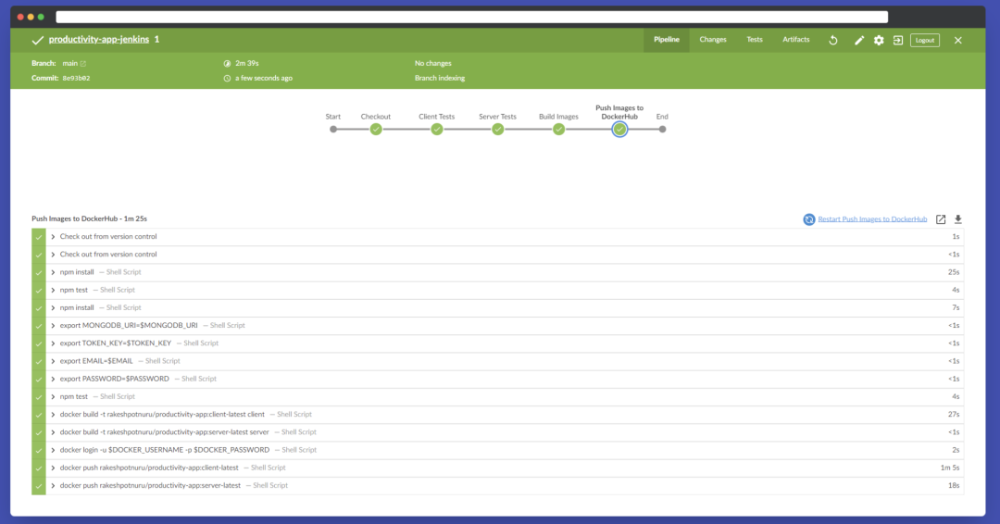
