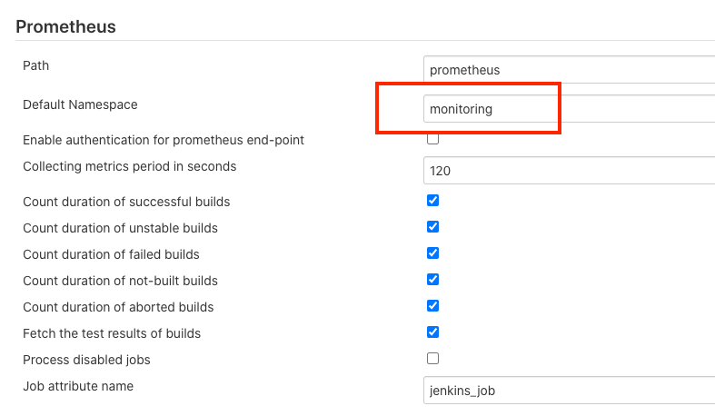
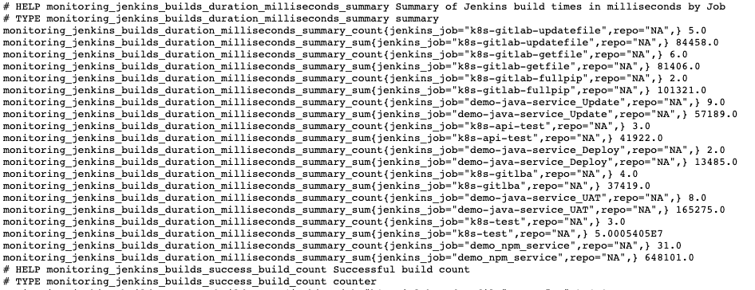
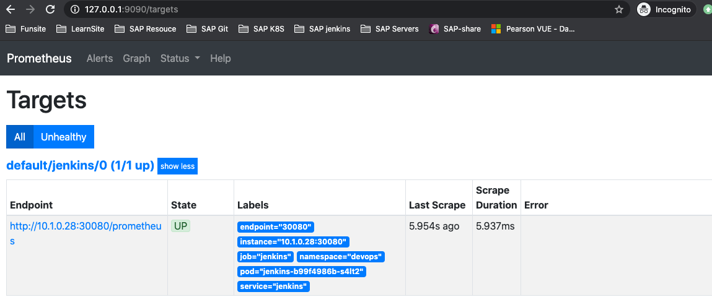
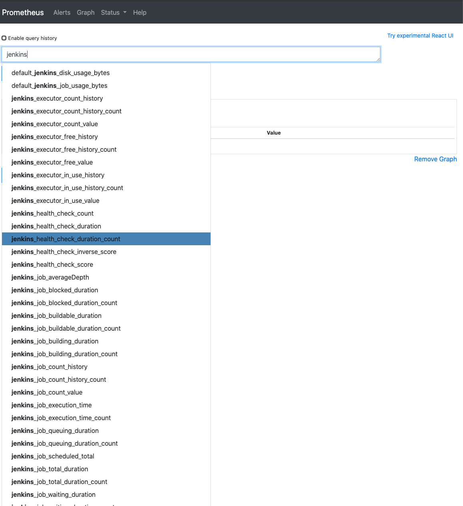
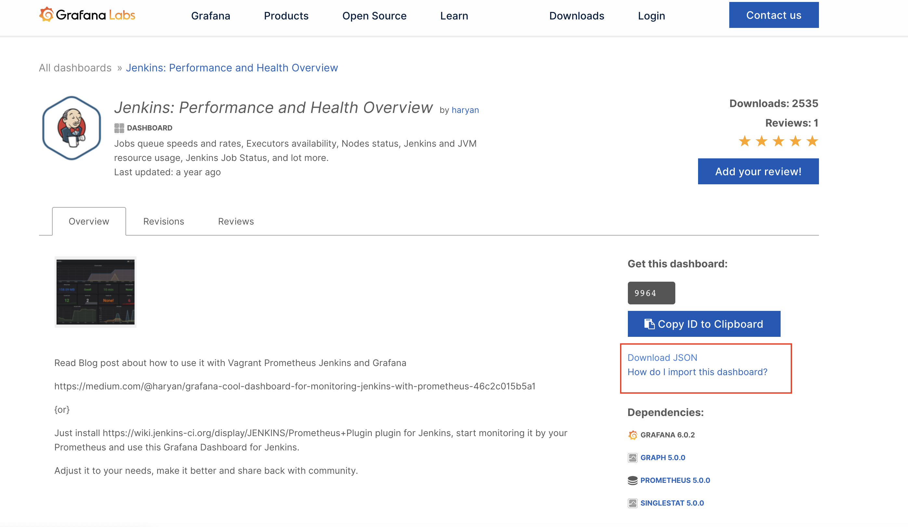
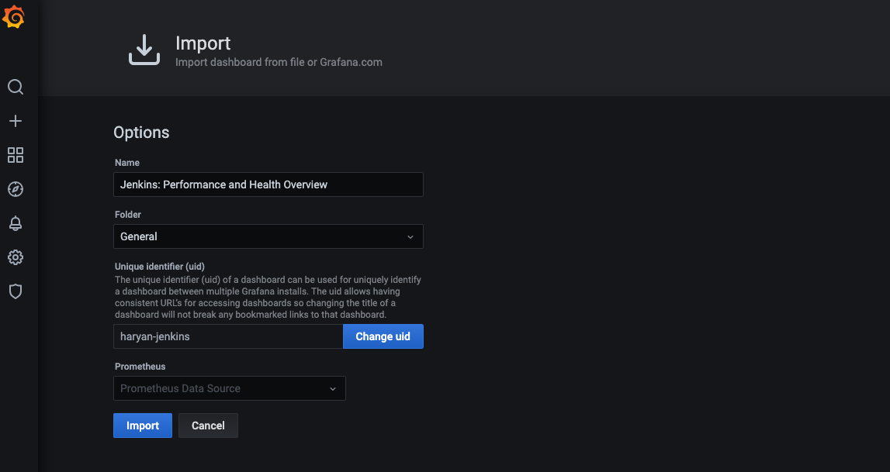
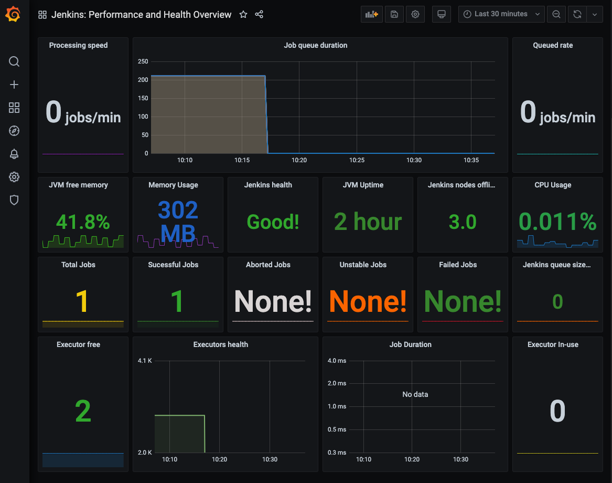

# **第一节 使用 Prometheus 监控 Jenkins**

## 1、安装使用插件

* https://plugins.jenkins.io/prometheus/



Default namespace: **monitoring** **Prometheus安装的Namespace**

**检查 Jenkins 暴露的 promtheus 数据**

http://192.168.33.1:30080/promtheus



## 2、安装 Prometheus Operator 安装 Prometheus

```
kubectl create ns monitoring
```

**`prometheus-operator-values.yml`**

```
# We don't need the alertmanager for this demo
alertmanager:
  enabled: false

# This configuration means all ServiceMonitors in the namespsace will be picked up
# Use with caution!
prometheus: 
  prometheusSpec:
    serviceMonitorSelectorNilUsesHelmValues: false
    serviceMonitorSelector: {}
grafana:
  persistence:
    enabled: true
    type: pvc
    size: 1G
    storageClassName: hostpath
```
 
```
$ helm install kube-prom stable/prometheus-operator -f prometheus-operator-values.yml --namespace monitoring

 kubectl get pod  -n monitoring 
NAME                                                  READY   STATUS              RESTARTS   AGE
kube-prom-grafana-58dd7948b9-8pc4z                    2/2     Running             0          16h
kube-prom-grafana-test                                0/1     Error               0          16h
kube-prom-kube-state-metrics-d5554cd6-lpjtt           1/1     Running             0          16h
kube-prom-prometheus-node-exporter-w7ts8              1/1     Running             0          16h
kube-prom-prometheus-opera-admission-create-trvmv     0/1     ContainerCreating   0          16h
kube-prom-prometheus-opera-operator-8b968895f-dmd8c   2/2     Running             0          16h
prometheus-kube-prom-prometheus-opera-prometheus-0    3/3     Running             1          16h
```

## 3、为 Jenkins Service 创建 ServiceMonitor

**`jenkins-sm.yaml`**

```
apiVersion: monitoring.coreos.com/v1
kind: ServiceMonitor
metadata:
  name: jenkins
  labels:
    prometheus: kube-prometheus
spec:
  selector:
    # note, this matches on the service, not the deployment or pod
    matchLabels:
      k8s-app: jenkins
  # jobLabel: app
  namespaceSelector:
    matchNames:
      - devops
  endpoints:
  - targetPort: 30080
    path: /prometheus
    interval: 10s
```
 
```
$  kubectl get servicemonitor 
NAME      AGE
jenkins   14h
```


稍等一会儿， prometheus 会自动加载Jenkins 的 target






## 4、在Grafana 中 添加 Jenkins 的 dashboard

### 4-1 下载 Grafana json dashboard

https://grafana.com/grafana/dashboards/9964



### 4-2 Grafana 中加载  json dashboard




