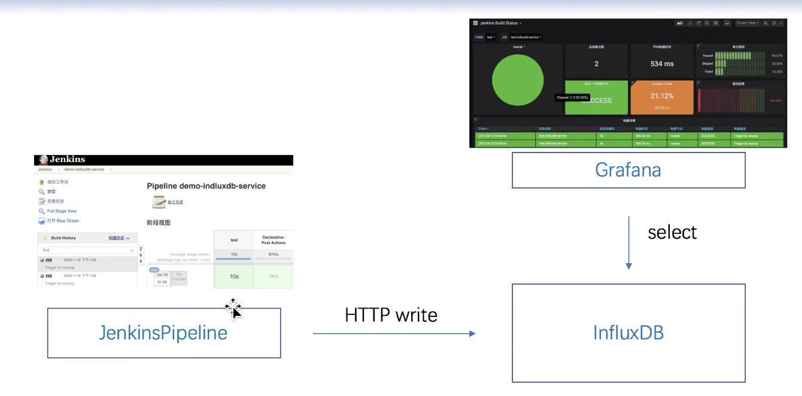
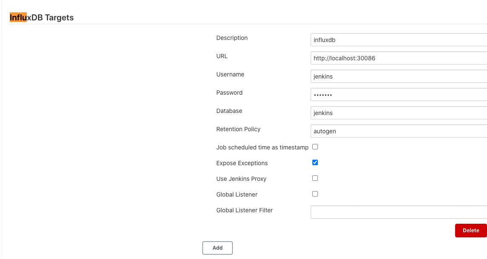
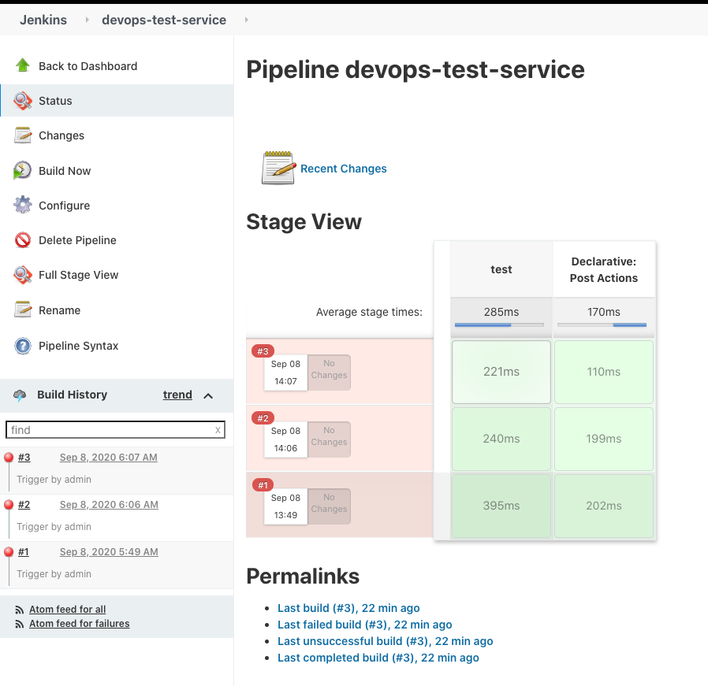
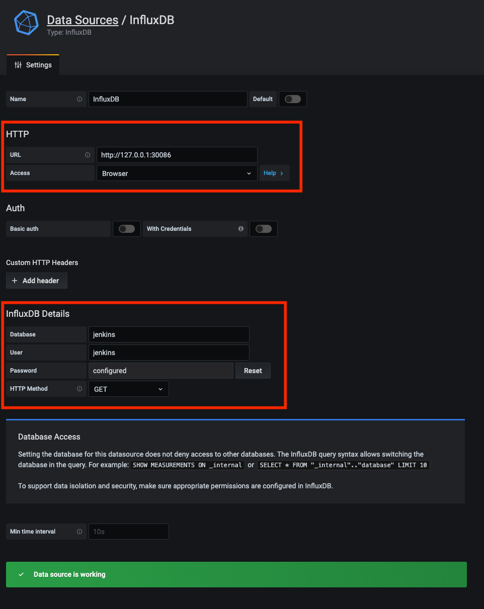
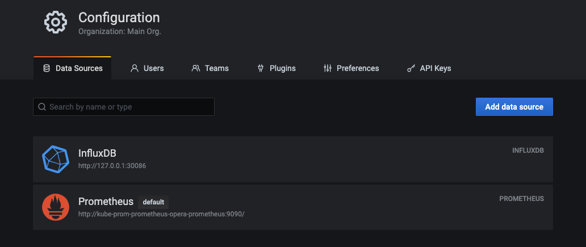
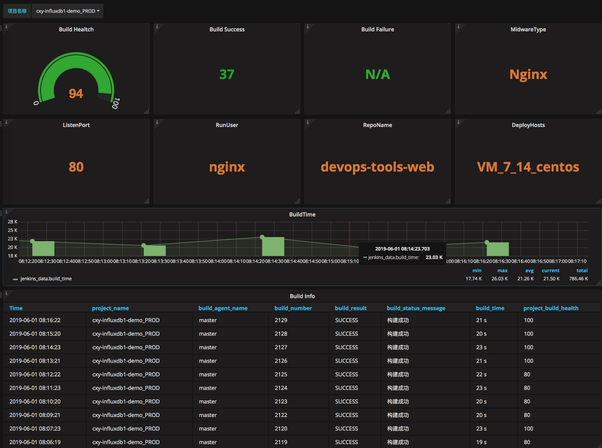
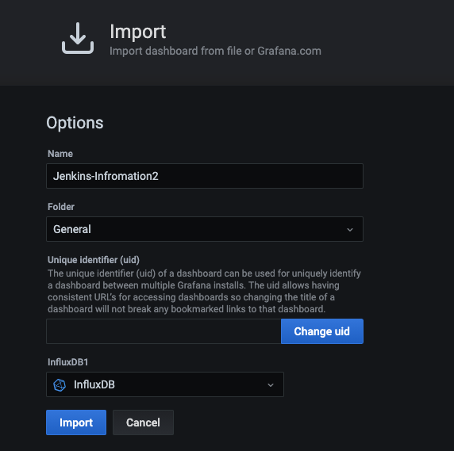

# **第二节 Jenkins+InfluxDB+Grafana 收集构建数据**

## 1、步骤与方案

### 1-1 具体步骤

1. 搭建jenkins、InfluxDB、Grafana。
2. Jenkins安装插件、配置数据库地址、编写Pipeline、自定义数据。
3. InfluxDB创建数据库、创建用户。
4. Grafana建立统一的度量模板，使用变量替换固定的项目名称。

### 1-2 整体方案




## 2、快速安装InfluxDB

**influxdb.yml**

```
---
kind: Deployment
apiVersion: apps/v1
metadata:
  labels:
    k8s-app: influxdb
  name: influxdb
  namespace: devops
spec:
  replicas: 1
  revisionHistoryLimit: 10
  selector:
    matchLabels:
      k8s-app: influxdb
  template:
    metadata:
      labels:
        k8s-app: influxdb
      namespace: devops
      name: influxdb
    spec:
      containers:
        - name: influxdb
          image: influxdb:1.7.9
          imagePullPolicy: IfNotPresent
          ports:
            - containerPort: 8086
              name: web2
              protocol: TCP
          resources:
            limits:
              cpu: 1000m
              memory: 2Gi
            requests:
              cpu: 500m
              memory: 512Mi
          volumeMounts:
            - name: dbhome
              mountPath: /var/lib/influxdb
      volumes:
        - name: dbhome
          hostPath:
            path: .../Jenkins/influxdb
            type: Directory
---
apiVersion: v1
kind: Service
metadata:
 name: influxdb
 namespace: devops
 labels:
   k8s-app: influxdb
spec:
 selector:
   k8s-app: influxdb
 type: NodePort
 ports:
 - name: web
   port: 8086
   targetPort: 8086
   nodePort: 30086
```

```
$ kubectl get pod -n devops | grep inf
influxdb-6476d5bddd-vmhw2       1/1     Running   1          24h
```

## 3、准备工作

### 3-1 创建数据库

```
$ curl -G http://localhost:30086/query --data-urlencode "q=SHOW DATABASES"
{"results":[{"statement_id":0,"series":[{"name":"databases","columns":["name"],"values":[["_internal"]]}]}]}
```

```
$ curl -X POST http://localhost:30086/query --data-urlencode "q=CREATE DATABASE jenkins"
 
$ curl -G http://localhost:30086/query --data-urlencode "q=SHOW DATABASES"
{"results":[{"statement_id":0,"series":[{"name":"databases","columns":["name"],"values":[["_internal"],["jenkins"]]}]}]}


$ curl -X POST http://localhost:30086/query --data-urlencode "q=CREATE USER jenkins WITH PASSWORD 'root123' WITH ALL 
PRIVILEGES"
{"results":[{"statement_id":0}]}


$ curl -G http://localhost:30086/query --data-urlencode "q=SHOW USERS"
{"results":[{"statement_id":0,"series":[{"columns":["user","admin"],"values":[["jenkins",true]]}]}]}
```

### 3-2 配置Jenkins

安装influxdb插件、配置Influxdb信息。

https://plugins.jenkins.io/influxdb/



### 3-3 编写pipeline代码

```
pipeline {
    agent { node { label "hostmachine"}}
    
    stages{
        stage("test"){
            
            steps{
                
                script{
                        measurementName = "${JOB_NAME}".split("-")[0]
    SERVICE_NAME = "${JOB_NAME}"
    BUILD_AGENT = "hostmachine"
    BUILD_RESULT = ["SUCCESS":1,"FAILURE":0]["${currentBuild.currentResult}"]
    currentBuild.description = "Trigger By admin"
    
    httpRequest httpMode: 'POST', 
                requestBody: """${measurementName},build_number=${BUILD_ID},build_agent_name=${BUILD_AGENT} project_name=\"${SERVICE_NAME}\",build_id=${BUILD_ID},build_time=${currentBuild.duration},build_result=${BUILD_RESULT},build_desc=\"${currentBuild.description}\",tests_passed=10,tests_failed=2,tests_skipped=3 1434055564000000000""", 
                url: 'http://localhost:30086/write?db=jenkins'
                }
            }
        }
        
        
    }
    
    post{
        
        success{
            script{
                currentBuild.description = "Trigger by admin"
                
                influxDbPublisher  customPrefix: '', 
                                        customProjectName: "${JOB_NAME}",
                                        jenkinsEnvParameterField: "tests_passed=" + 10 + "\ntests_skipped=" + 2 + "\ntests_failed=" + 3, // OPTIONAL, 自定义字段
                                        measurementName: "${JOB_NAME.split('-')[0]}", // OPTIONAL, 表名称
                                        jenkinsEnvParameterTag: 'build_number=${BUILD_ID}', 
                                        selectedTarget: 'influxdb'
                    
            }
        }
    }
}
```


**Pipeline2**

```
try {
    //pipeline
    currentBuild.description = "构建成功"   //定义Jenkins构建描述，默认无。
} catch(err){
    currentBuild.description = "构建失败"   //定义Jenkins构建描述，默认无。
    throw err
    
}finally{
    step([$class: 'InfluxDbPublisher',
        customData: null,
        customDataMap: null,
        customPrefix: null,
        target: 'influxdb',         // Jenkins中配置的Influxdb。
        selectedTarget: 'influxdb', // Jenkins中配置的Influxdb。
        //jenkinsEnvParameterTag: 'KEY=' + env.PARAM,     // OPTIONAL,自定义tag
        jenkinsEnvParameterField: 'build_agent_name=' + 'master' + '\n' + 'build_status_message=' + currentBuild.description, // OPTIONAL, 自定义字段
        measurementName: 'jenkins_data', // OPTIONAL, 表名称
        replaceDashWithUnderscore: false, // OPTIONAL, 是否替换 "-"为 "_"。
    ])
}


//基于插件自定义字段名称（非完全自定义）
/*
step([$class: 'InfluxDbPublisher',
            customData: null,
            customDataMap: null,
            customPrefix: null,
            target: 'influxdb',
            selectedTarget: 'influxdb', 
            jenkinsEnvParameterTag: 'project_name=' + "${JOB_NAME}".split('/')[-1] ,     // OPTIONAL, 自定义project_name
            jenkinsEnvParameterField: 'build_agent_name=' + 'master'  +  "\n" +           //自定义参数列表，每个参数加上一个换行符
                                      'build_status_message=' + currentBuild.description +  "\n" + 
                                      'midwareType=' + "${midwareType}" +  "\n" + 
                                      'listenPort=' + "${port}" +  "\n" + 
                                      'runUser=' + "${user}" +  "\n" +
                                      'repoName=' + "${srcUrl}".split("/")[-1] - '.git' +  '\n' + 
                                      'project_name=' + "${JOB_NAME}".split('/')[-1]  +  '\n' +
                                      'deployHosts=' + "${targetHosts}" ,
            measurementName: 'jenkins_data', 
            replaceDashWithUnderscore: false,
        ])
*/
```
### 3-4 InfluxDbPublisher SharedLib （Optional)

```
package org.devops 

//创建数据库
def CreateDb(dbName){
   sh """
      curl -XPOST 'http://localhost:30086/query' --data-urlencode 'q=CREATE DATABASE \"${dbName}\"'"
      """
}


def WriteData(){
    measurementName = "${JOB_NAME}".split("-")[0]
    SERVICE_NAME = "${JOB_NAME}"
    BUILD_AGENT = "master"
    BUILD_RESULT = ["SUCCESS":1,"FAILURE":0]["${currentBuild.currentResult}"]
    wrap([$class: 'BuildUser']){
        currentBuild.description = "Trigger By ${$BUILD_USER}"
    }
    
    
    httpRequest httpMode: 'POST', 
            requestBody: """${measurementName},build_number=${BUILD_ID},build_agent_name=${BUILD_AGENT} project_name=\"${SERVICE_NAME}\",build_id=${BUILD_ID},build_time=${currentBuild.duration},build_result=${BUILD_RESULT},build_desc=\"${currentBuild.description}\",tests_passed=10,tests_failed=2,tests_skipped=3 1434055564000000000""", 
            url: 'http://localhost:30086/write?db=jenkins'
    
    
}
```


### 3-5 构建测试



```
$ curl -G http://localhost:30086/query --data-urlencode "q=SHOW SERIES on jenkins"
{"results":[{"statement_id":0,"series":[{"columns":["key"],"values":[["demo,build_agent_name=master,build_number=1"],["demo,build_agent_name=master
,build_number=2"],["demo,build_agent_name=master,build_number=3"],["devops,build_agent_name=hostmachine,build_number=1"],["devops,build_agent_name=
hostmachine,build_number=2"],["devops,build_agent_name=hostmachine,build_number=3"],["test,build_agent_name=master,build_number=2"]]}]}]}


$ curl -G http://localhost:30086/query?db=jenkins --data-urlencode  "q=select * from devops"
{"results":[{"statement_id":0,"series":[{"name":"devops","columns":["time","build_agent_name","build_desc","build_id","build_number","build_result"
,"build_time","project_name","tests_failed","tests_passed","tests_skipped"],"values":[["2015-06-11T20:46:04Z","hostmachine","Trigger By admin",1,"1
",1,2860,"devops-test-service",2,10,3],["2015-06-11T20:46:04Z","hostmachine","Trigger By admin",3,"3",1,706,"devops-test-service",2,10,3],["2015-06
-11T20:46:04Z","hostmachine","Trigger By admin",2,"2",1,1512,"devops-test-service",2,10,3]]}]}]}
```


## 4、配置Grafana

### 4-1 导入 influxDb DataSources





效果图

### 4-1 导入 Dashboard Json

[`jenkins_build_status.json`](../images/chp15_jenkins_build_status.json)



