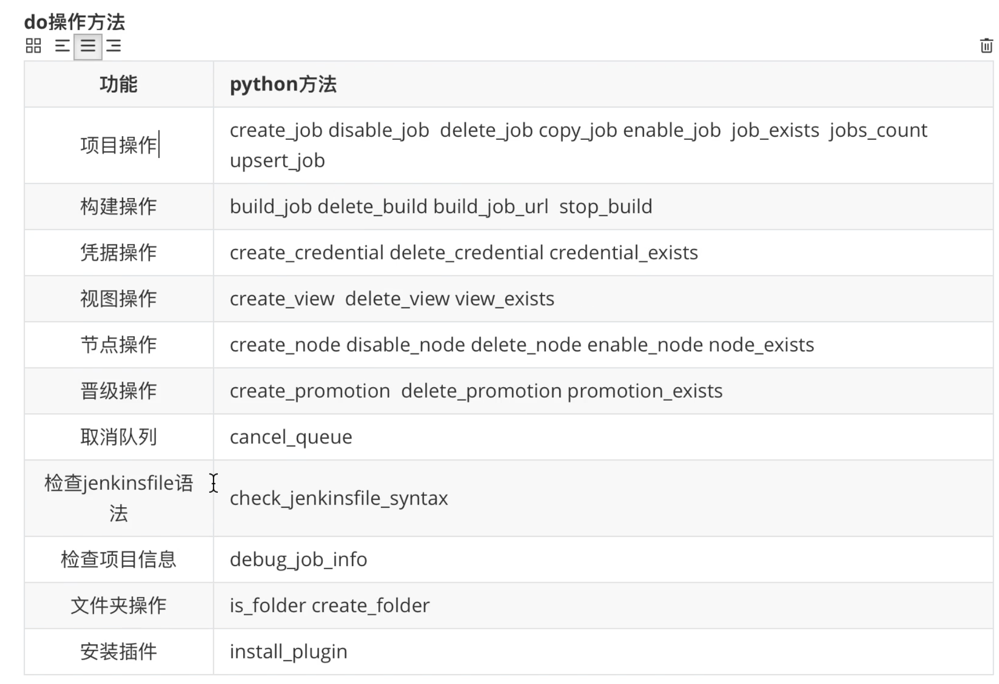
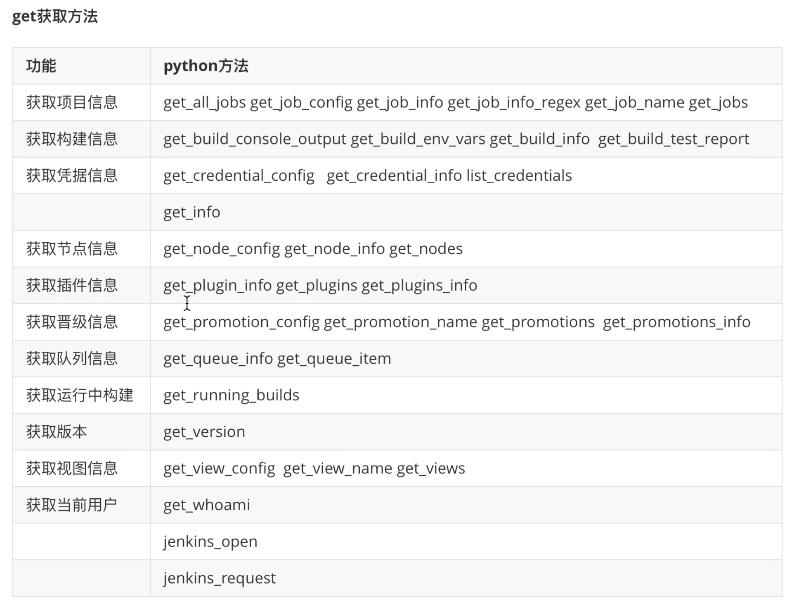
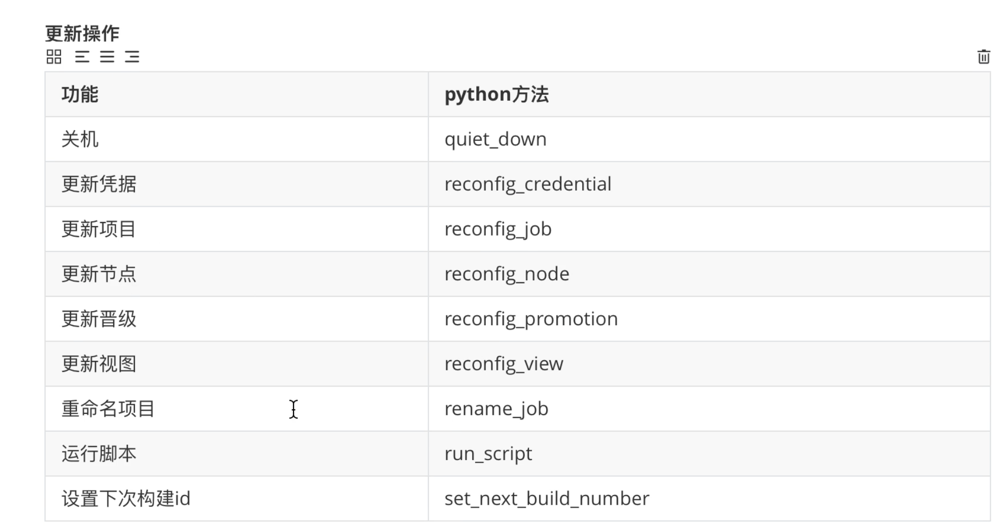
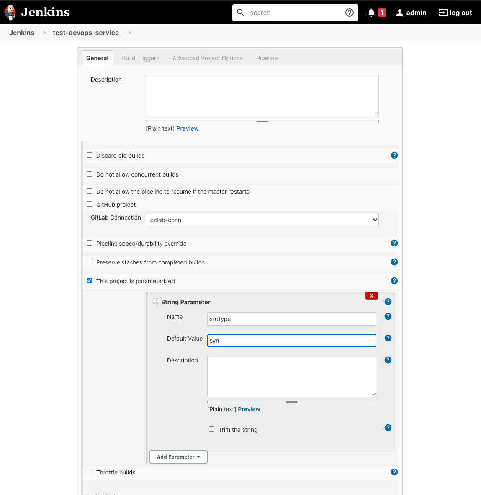
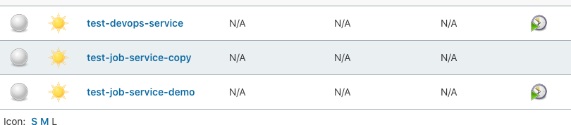
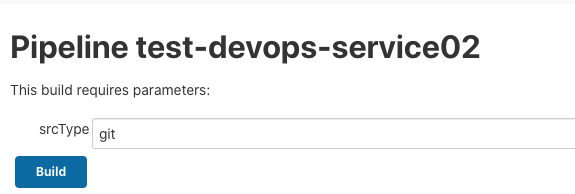

# 第三节 Jenkins Python API 实践

## 1、查询使用 Jenkins  Python API

* http://jenkins_url/api/python?pretty=true
* http://jenkins_url/api/

[Python Jenkins API Docs](https://python-jenkins.readthedocs.io/en/latest/#:~:text=Python%20Jenkins%20is%20a%20python,to%20automate%20our%20Jenkins%20servers.)


### 1-1 安装 python-jenkins 库

```
pip3 install python-jenkins
```

## 2、常用Jenkins Python API 的方法

### 2-1 常用方法

**`test.py`**

```
import jenkins
server = jenkins.Jenkins("http://127.0.0.1:30080",username="admin",password="admin")
print(server.get_whoami())
```

```
{'_class': 'hudson.model.User', 'absoluteUrl': 'http://192.168.33.1:30080/user/admin', 'description': None, 'fullName': 'admin', 'id': 'admin', 'property': [{'_class': 'jenkins.security.ApiTokenProperty'}, {'_class': 'com.cloudbees.plugins.credentials.UserCredentialsProvider$UserCredentialsProperty'}, {'_class': 'hudson.plugins.emailext.watching.EmailExtWatchAction$UserProperty', 'triggers': []}, {'_class': 'hudson.model.MyViewsProperty'}, {'_class': 'org.jenkinsci.plugins.displayurlapi.user.PreferredProviderUserProperty'}, {'_class': 'hudson.model.PaneStatusProperties'}, {'_class': 'jenkins.security.seed.UserSeedProperty'}, {'_class': 'hudson.search.UserSearchProperty', 'insensitiveSearch': True}, {'_class': 'hudson.model.TimeZoneProperty'}, {'_class': 'hudson.security.HudsonPrivateSecurityRealm$Details'}, {'_class': 'hudson.tasks.Mailer$UserProperty', 'address': 'admin@sap.com'}, {'_class': 'jenkins.security.LastGrantedAuthoritiesProperty'}]}
```

```
import jenkins
server = jenkins.Jenkins("http://127.0.0.1:30080",username="admin",password="admin")
print(dir(server))
```

```
['__class__', '__delattr__', '__dict__', '__dir__', '__doc__', '__eq__', '__format__', '__ge__', '__getattribute__', '__gt__', '__hash__', '__init__', '__init_subclass__', '__le__', '__lt__', '__module__', '__ne__', '__new__', '__reduce__', '__reduce_ex__', '__repr__', '__setattr__', '__sizeof__', '__str__', '__subclasshook__', '__weakref__', '_add_missing_builds', '_auth_resolved', '_auths', '_build_url', '_get_encoded_params', '_get_job_folder', '_get_tag_text', '_get_view_jobs', '_maybe_add_auth', '_request', '_response_handler', '_session', '_timeout_warning_issued', 'assert_credential_exists', 'assert_folder', 'assert_job_exists', 'assert_node_exists', 'assert_promotion_exists', 'assert_view_exists', 'auth', 'build_job', 'build_job_url', 'cancel_queue', 'check_jenkinsfile_syntax', 'copy_job', 'create_credential', 'create_folder', 'create_job', 'create_node', 'create_promotion', 'create_view', 'credential_exists', 'crumb', 'debug_job_info', 'delete_build', 'delete_credential', 'delete_job', 'delete_node', 'delete_promotion', 'delete_view', 'disable_job', 'disable_node', 'enable_job', 'enable_node', 'get_all_jobs', 'get_build_console_output', 'get_build_env_vars', 'get_build_info', 'get_build_test_report', 'get_credential_config', 'get_credential_info', 'get_info', 'get_job_config', 'get_job_info', 'get_job_info_regex', 'get_job_name', 'get_jobs', 'get_node_config', 'get_node_info', 'get_nodes', 'get_plugin_info', 'get_plugins', 'get_plugins_info', 'get_promotion_config', 'get_promotion_name', 'get_promotions', 'get_promotions_info', 'get_queue_info', 'get_queue_item', 'get_running_builds', 'get_version', 'get_view_config', 'get_view_name', 'get_views', 'get_whoami', 'install_plugin', 'is_folder', 'jenkins_open', 'jenkins_request', 'job_exists', 'jobs_count', 'list_credentials', 'maybe_add_crumb', 'node_exists', 'promotion_exists', 'quiet_down', 'reconfig_credential', 'reconfig_job', 'reconfig_node', 'reconfig_promotion', 'reconfig_view', 'rename_job', 'run_script', 'server', 'set_next_build_number', 'stop_build', 'timeout', 'upsert_job', 'view_exists', 'wait_for_normal_op', 'wipeout_job_workspace']
```









### 2-2 Job 方法测试

#### 2-1-1 手工创建模板job




#### 2-1-2 查询 job 的 config

```
print(server.get_job_config('test-devops-service'))
```

```
<?xml version='1.1' encoding='UTF-8'?>
<flow-definition plugin="workflow-job@2.39">
  <description></description>
  <keepDependencies>false</keepDependencies>
  <properties>
    <com.dabsquared.gitlabjenkins.connection.GitLabConnectionProperty plugin="gitlab-plugin@1.5.13">
      <gitLabConnection>gitlab-conn</gitLabConnection>
    </com.dabsquared.gitlabjenkins.connection.GitLabConnectionProperty>
    <hudson.model.ParametersDefinitionProperty>
      <parameterDefinitions>
        <hudson.model.StringParameterDefinition>
          <name>srcType</name>
          <description></description>
          <defaultValue>svn</defaultValue>
          <trim>false</trim>
        </hudson.model.StringParameterDefinition>
      </parameterDefinitions>
    </hudson.model.ParametersDefinitionProperty>
  </properties>
  <definition class="org.jenkinsci.plugins.workflow.cps.CpsFlowDefinition" plugin="workflow-cps@2.82">
    <script></script>
    <sandbox>true</sandbox>
  </definition>
  <triggers/>
  <disabled>false</disabled>
</flow-definition>
```

#### 2-1-3 利用模板job的config文件创建新的job

```
import jenkins
server = jenkins.Jenkins("http://127.0.0.1:30080",username="admin",password="admin")

config_xml = server.get_job_config('test-devops-service')

if(server.job_exists("test-job-service-demo")== True):
    print("The job already exists")
else:
    server.create_job("test-job-service-demo",config_xml)
    print("Create new job...")
```


#### 2-1-4 Copy模板job到新的Job

```
import jenkins
server = jenkins.Jenkins("http://127.0.0.1:30080",username="admin",password="admin")

if (server.job_exists("test-job-service-copy") != True):
    print("The Dest job doesnt exists")
    server.copy_job("test-job-service-demo","test-job-service-copy")
else:
    print("The Dest job exists")
```



## 3、Jenkins Python API 脚本创建 Job 

**jobs.py**

**将srcType 从 svn 改到 git**

```
import jenkins

# login
serverUrl = "http://127.0.0.1:30080"
username = "admin"
password = "admin"

server = jenkins.Jenkins(serverUrl,username,password)

defProjectName = "test-devops-service"
newProjectName = "test-devops-service02"


if server.job_exists(newProjectName) != True: 
    
    print("The project doesnt exist")

    config_xml = server.get_job_config(defProjectName)
    newconfig_xml = config_xml.replace("<defaultValue>svn</defaultValue>","<defaultValue>git</defaultValue>" )

    print(newconfig_xml)

    server.create_job(newProjectName,newconfig_xml)
else:
    print("The project exist")
```

