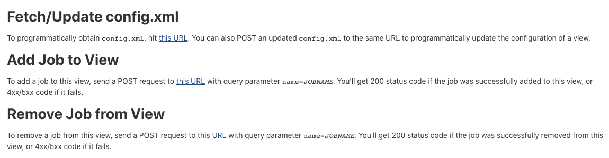
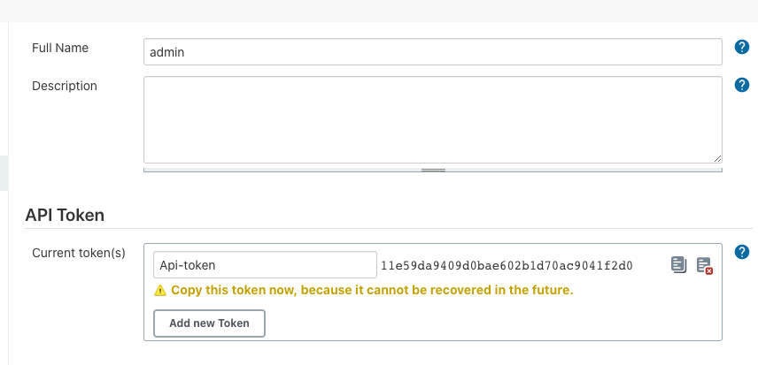
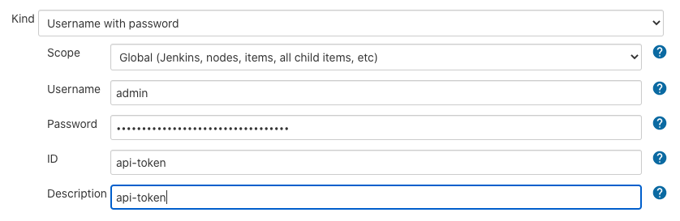
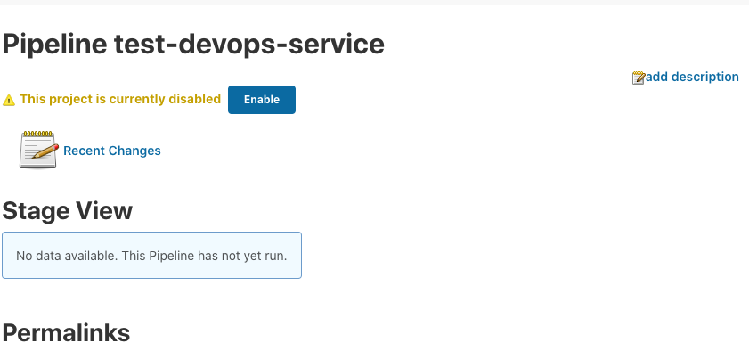
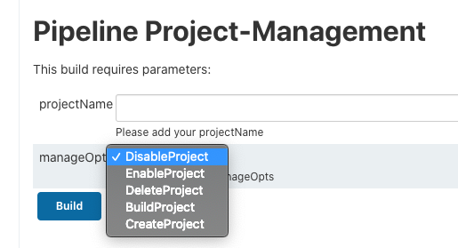

# **第四节 Jenkins REST API 使用实践**

## 1、Jenkins REST API 介绍


* **Job API**: http://127.0.0.1:30080/job/jobname/api/
* **View API**: http://192.168.33.11:8080/view/viewname/api/




### 1-1 获取项目信息 

* 接口： http://127.0.0.1:30080/job/{projectNarne}/api/json 。
* 方式：GET 
* 实例：http://127.0.0.1:30080/job/demo-test-03/api/json 

### 1-2 获取项目构建信息 

* 接口: http://127.0.0.1:30080/job/{projectName}/{buildNumber}/api/json 
* 方式：GET 
* 实例： http://127.0.0.1:30080/job/demo-test-03/1/api/json 。

### 1-3 获取项目配置 

* 接口： http://127.0.0.1:30080/job/{projectName}/config.xml 。
* 实例： http://127.0.0.1:30080/job/test-devops-service/config.xml 。
* 方式：GET

### 1-4 创建项目 

* 接口： http://127.0.0.1:30080/createltem?name={projectName} 
* 参数：`--data-binary@conflg.xml `
* 头部：`-H "Content-Type:text/xml"` 
* 方式：POST

### 1-5 禁用项目 

* 接口：http://127.0.0.1:30080/job/{projectName}/disable 。
* 方式：POST

### 1-6 删除项目 

* 接口：http://127.0.0.1:30080/job/{projectName}/doDelete 
* 方式：POST

### 1-7 构建项目 

* 接口：http://127.0.0.1:30080/job/{projectName}/build 
* 方式：POST 

### 1-8 参数化构建 

* 接口：http://127.0.0.1:30080/job/{projectName}/buiidWithParameters 
* 方式：POST


## 2、Jenkins REST API 共享库封装

### 2-1 使用 httprequest 封装请求 

* 如果没有做认证集成：用户名＋密码 
* 如果做了集成：用户名＋token 



* admin
* 11e59da9409d0bae602b1d70ac9041f2d0
* api-token

 

### 2-2 测试 httprequest 请求 Pipeline

* Disable job: `test-devops-service`

```
pipeline{
    agent { node { label "master"}}

    stages{
        stage('test'){
            steps{
                script{
                    httpRequest authentication: 'api-token',
                            httpMode: 'POST',
                            responseHandle: 'NONE',
                            url: 'http://127.0.0.1:30080/job/test-devops-service/disable'
                }
            }
        }
    }
}
```

**Console Output**

```
[Pipeline] httpRequest
HttpMethod: POST
URL: http://127.0.0.1:30080/job/test-devops-service/disable
Using authentication: api-token
Sending request to url: http://127.0.0.1:30080/job/test-devops-service/disable
Response Code: HTTP/1.1 302 Found
Success code from [100‥399]
```

 


### 2-3 jenkinsapi 共享库代码

**`jenkinsapi.groovy`**

```
package org.devops

//封装HTTP请求
def HttpReq(reqType,reqUrl,reqBody){
    def jenkinsServer = 'http://127.0.0.1:30080'
    result = httpRequest authentication: 'api-token',
                        httpMode: reqType,
                        consoleLogResponseBody: true,
                        ignoreSslErrors: true, 
                        requestBody: reqBody,
                        url: "${jenkinsServer}/${reqUrl}"
                        //quiet: true
                        
}


//新建项目

def CreateProject(projectName){
    
    withCredentials([usernamePassword(credentialsId: 'api-token', passwordVariable: 'password', usernameVariable: 'username')]) {
       
        sh """
        
           curl -u ${username}:${password} -X GET 'http://127.0.0.10:30080/job/test-devops-service/config.xml' -o config.xml
           ls -l 
       
           curl -u ${username}:${password} -X POST 'http://127.0.0.1:30080/createItem?name=${projectName}' -H 'Content-Type:text/xml' --data-binary @config.xml
    
    
        """
    }
}


//禁用项目

def Project(projectName,option){

    println(projectName)
    println(option)
    
    options = [ "DisableProject": "disable",
                "EnableProject":"enable",
                "DeleteProject":"doDelete",
                "BuildProject":"build"]
    
    result = HttpReq('POST',"job/${projectName}/${options[option]}",'')
    
}
```

### 2-4 项目操作流水线


创建一个流水线项目具有两个参数，一个字符参数`projectName`用于填写用户名称。一个选项参数`manageOpts`用于项目的操作

manageOpts: 

* CreateProject   创建项目
* DisableProject  禁用项目
* EnableProject  启动项目 
* DeleteProject  删除项目
* Build Project  构建项目 

```
@Library('jenkinslib@master') _

def jenkinsapi = new org.devops.jenkinsapi()

// String projectName = "${env.projectName}"
// String manageOpts = "${env.manageOpts}"

pipeline {
    
    agent { node {label "master"}}

    parameters {
        string(name: 'projectName', defaultValue: '', description: 'Please add your projectName')
        choice(name: 'manageOpts', choices: 'DisableProject\nEnableProject\nDeleteProject\nBuildProject\nCreateProject', description: 'Please chose your manageOpts')
    }
   
    
    stages{
        stage("test"){
            steps{
                script{
                    
                    if (manageOpts == "CreateProject"){
                        jenkinsapi.CreateProject(projectName)
                    } else {
                        jenkinsapi.Project(projectName,manageOpts)
                    }
                }
            }
        }
    }
}
```

 
 
 
**CreateProject: test** Console Output

```
...
[Pipeline] sh
+ curl -u ****:**** -X GET http://127.0.0.10:30080/job/test-devops-service/config.xml -o config.xml
  % Total    % Received % Xferd  Average Speed   Time    Time     Time  Current
                                 Dload  Upload   Total   Spent    Left  Speed

  0     0    0     0    0     0      0      0 --:--:-- --:--:-- --:--:--     0
100  1056  100  1056    0     0   253k      0 --:--:-- --:--:-- --:--:--  343k
+ ls -l
total 4
-rw-r--r-- 1 jenkins jenkins 1056 Sep  9 03:03 config.xml
+ curl -u ****:**** -X POST http://127.0.0.1:30080/createItem?name=test -H Content-Type:text/xml --data-binary @config.xml
  % Total    % Received % Xferd  Average Speed   Time    Time     Time  Current
                                 Dload  Upload   Total   Spent    Left  Speed

  0     0    0     0    0     0      0      0 --:--:-- --:--:-- --:--:--     0
100  1056    0     0  100  1056      0  81670 --:--:-- --:--:-- --:--:-- 88000
[Pipeline] }
..
```
 
 