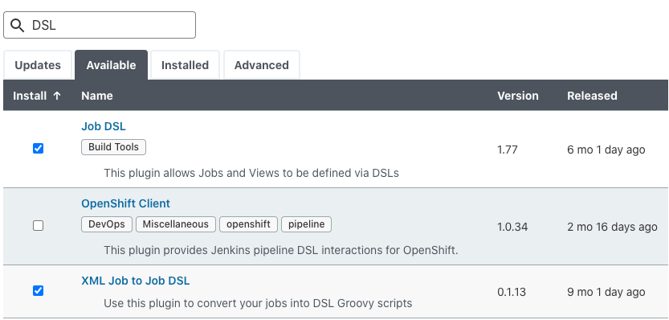
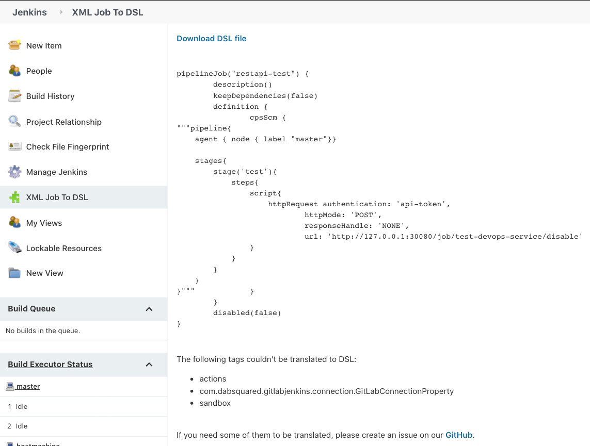
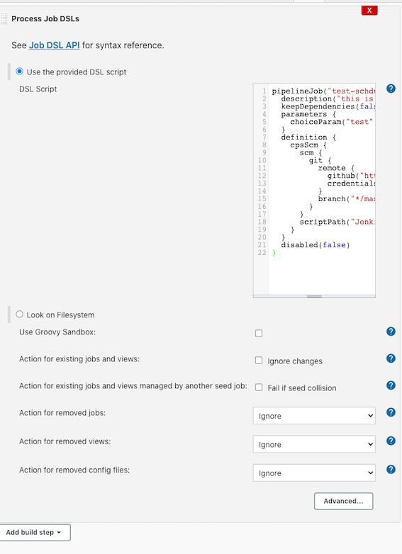
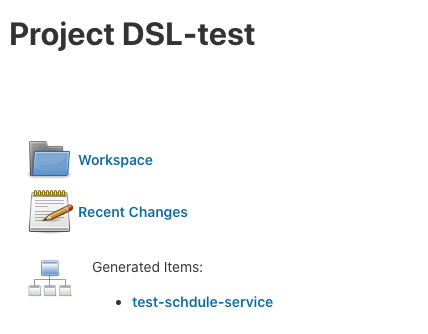
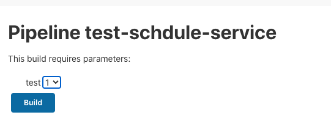
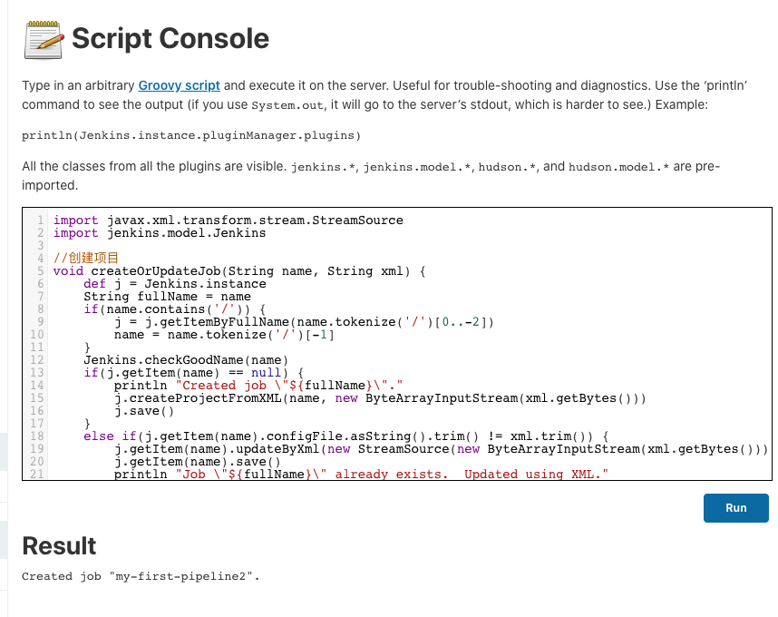
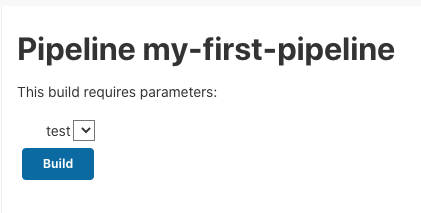

# 第五节 Jenkins Core Api & Job DSL创建项目

在大规模的Jenkins实践中创建项目也是一个问题，如何通过模板自动化的创建Jenkins项目呢？ 可以通过安装Job Dsl插件后，通过 Dsl直接创建项目。也可以通过工具将dsl转换为xml，然后再通过Jenkins API创建项目。相对比较第一种方式更加直接一些，由于时间问题今天暂时分享第二种创建项目的方式。

## 1、Jenkins Job DSL 应用实践

### 1-1 安装插件 

* job DSL 
	* 用于扩展，可以通过插件自带的dsl方法来完成一些的操作。 
* XML job to Job DSL 
	* 将一个项目转换成DSL格式 



### 1-2 资源文件 

* DSL 语法
	* https://jenkinsci.github.io/job-dsl-plugin/#path/pipelinejob

* DSL转换XML 
	* http://job-dsl.herokuapp.com/

### 1-3 使用DSL

通过XML Job TO dsl 生成DSL语句

**Example**

```
pipelineJob("test-schdule-service") {
  description("this is my first job")
  keepDependencies(false)
  parameters {
    choiceParam("test", [1, 2, 3], "")
  }
  definition {
    cpsScm {
      scm {
        git {
          remote {
            github("https://gitlab.com/xxx/xxx.git", "https")
            credentials("24982560-17fc-4589-819b-bc5bea89da77")
          }
          branch("*/master")
        }
      }
      scriptPath("Jenkinsfile")
    }
  }
  disabled(false)
}
```



建立`Free style job`








## 2、Jenkins Core API 应用

* https://javadoc.jenkins-ci.org/

### 2-1 通过Jenkins Core Api创建项目

```
import javax.xml.transform.stream.StreamSource
import jenkins.model.Jenkins

//创建项目
void createOrUpdateJob(String name, String xml) {
    def j = Jenkins.instance
    String fullName = name
    if(name.contains('/')) {
        j = j.getItemByFullName(name.tokenize('/')[0..-2])
        name = name.tokenize('/')[-1]
    }
    Jenkins.checkGoodName(name)
    if(j.getItem(name) == null) {
        println "Created job \"${fullName}\"."
        j.createProjectFromXML(name, new ByteArrayInputStream(xml.getBytes()))
        j.save()
    }
    else if(j.getItem(name).configFile.asString().trim() != xml.trim()) {
        j.getItem(name).updateByXml(new StreamSource(new ByteArrayInputStream(xml.getBytes())))
        j.getItem(name).save()
        println "Job \"${fullName}\" already exists.  Updated using XML."
    }
    else {
        println "Nothing changed.  Job \"${fullName}\" already exists."
    }
}

try {
    //just by trying to access properties should throw an exception
    // itemName == null
    // xmlData == null
    // isPropertiesSet = true
} catch(MissingPropertyException e) {
    println 'ERROR Can\'t create job.'
    println 'ERROR Missing properties: itemName, xmlData'
    return
}

String xmlData = """<!-- 1. test-schdule-service -->
<flow-definition>
    <actions></actions>
    <description>this is my first job</description>
    <keepDependencies>false</keepDependencies>
    <properties>
        <hudson.model.ParametersDefinitionProperty>
            <parameterDefinitions>
                <hudson.model.ChoiceParameterDefinition>
                    <choices class='java.util.Arrays$ArrayList'>
                        <a class='string-array'>
                            <string>1</string>
                            <string>2</string>
                            <string>3</string>
                        </a>
                    </choices>
                    <name>test</name>
                    <description></description>
                </hudson.model.ChoiceParameterDefinition>
            </parameterDefinitions>
        </hudson.model.ParametersDefinitionProperty>
        <com.coravy.hudson.plugins.github.GithubProjectProperty>
            <projectUrl>https://github.com/https://gitlab.com/xxx/xxx.git/</projectUrl>
        </com.coravy.hudson.plugins.github.GithubProjectProperty>
    </properties>
    <triggers></triggers>
    <definition class='org.jenkinsci.plugins.workflow.cps.CpsScmFlowDefinition'>
        <scriptPath>Jenkinsfile</scriptPath>
        <lightweight>false</lightweight>
        <scm class='hudson.plugins.git.GitSCM'>
            <userRemoteConfigs>
                <hudson.plugins.git.UserRemoteConfig>
                    <url>https://github.com/https://gitlab.com/xxx/xxx.git.git</url>
                    <credentialsId>24982560-17fc-4589-819b-bc5bea89da77</credentialsId>
                </hudson.plugins.git.UserRemoteConfig>
            </userRemoteConfigs>
            <branches>
                <hudson.plugins.git.BranchSpec>
                    <name>*/master</name>
                </hudson.plugins.git.BranchSpec>
            </branches>
            <configVersion>2</configVersion>
            <doGenerateSubmoduleConfigurations>false</doGenerateSubmoduleConfigurations>
            <gitTool>Default</gitTool>
            <browser class='hudson.plugins.git.browser.GithubWeb'>
                <url>https://github.com/https://gitlab.com/xxx/xxx.git/</url>
            </browser>
        </scm>
    </definition>
    <disabled>false</disabled>
</flow-definition>
"""
String itemName = "my-first-pipeline"

createOrUpdateJob(itemName, xmlData)
```

### 2-2 通过Jenkins Script Console运行






