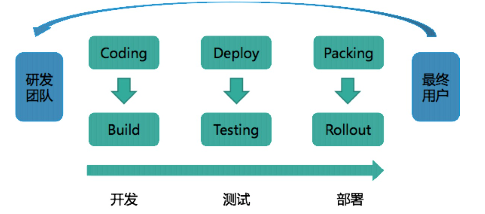

# **L1 量身定制你的持续交付体系**

## **1 持续交付到底有什么价值？**

### **1-1 持续集成、持续交付和持续部署的关系**

我们通常会把软件研发工作拆解，拆分成不同模块或不同团队后进行编码，编码完成后，进行集成构建和测试。**这个从编码到构建再到测试的反复持续过程，就叫作“持续集成”**。

“持续集成”一旦完成，则代表产品处在一个可交付状态，但并不代表这是最优状态，还需要根据外部使用者的反馈逐步优化。当然这里的使用者并不一定是真正的用户，还可能是测试人员、产品人员、用户体验工程师、安全工程师、企业领导等等。

**这个在“持续集成”之后，获取外部对软件的反馈再通过“持续集成”进行优化的过程就叫作“持续交付”，它是“持续集成”的自然延续。**

**而“持续部署”就是将可交付产品，快速且安全地交付用户使用的一套方法和系统，它是“持续交付”的最后“一公里”。**

可见，“持续交付”是一个承上启下的过程，它使“持续集成”有了实际业务价值，形成了闭环，而又为将来达到“持续部署”的高级目标做好了铺垫。

### **1-2 持续交付的显性价值**

持续交付也通常以“发布流水线”的方式来解释，即研发团队从开发，到测试，再到部署，最终将产品交付给最终用户使用的过程。如下图：

虽然持续交付着重打造的是发布流水线的部分，但它所要达到的目标是在“最终用户”和“研发团队”之间建立紧密的反馈环：**<mark>通过持续交付新的软件版本，以验证新想法和软件改动的正确性，并衡量这些改动对软件价值的影响。</mark>**

这里说的“软件价值”，说白了就是收入、日活、GMV 等 KPI 指标了。

## **2 影响持续交付的因素有哪些？**

### **2-1 组织和文化因素**

* 第一个层次：紧密配合，这是组织发展，部门合作的基础。
* 第二个层次：集思广益，这就需要组织内各个不同部门，或不同职能的角色，跳出自身的“舒适区”。
* 第三个层次：自我驱动，是理想中的完美组织形式。

**持续集成的三个层次**

* 分模块编码；
* 整体集成；
* 实现以上两个过程的自动化，并形成闭环；

一般软件企业与交付有关的研发部门包括四个：产品、开发、测试和运维。而这四个部门天然地形成了一个生产流水线，所以形成理想组织的第一层次紧密配合，基本没什么问题。

但是，要达到第二层次集思广益的难度，往往就很大。**因为，每个部门有自身的利益，以及自己的工作方式和目标。**

* 比如，产品人员和测试人员就是一对矛盾体：**产品人员希望产品尽快上线，而测试人员则希望多留时间进行更完整的测试**。
* 又比如，开发人员和运维人员也经常矛盾：**开发人员希望能有完全权限，而运维人员却控制着生产的 root**。

织的问题，还是需要通过组织变革来解决。通常我们会采用以下三种方案：

* 成立项目管理办公室（Project Manage Office，简称 PMO）这样的监督型组织，帮助持续交付落地；
* 独立建立工程效能部门，全面负责包括持续交付在内的研发效率提升工作；
* 使用敏捷形式，如 Scrum，打破职能部门间的“隔离墙”，以产品的形式组织团队，各团队自行推进持续交付 。

**总而言之，持续交付必须有与其相适应的组织和文化，否则将很难实施。**

### **2-2 流程因素**

要说持续交付对企业和组织改变最多的是什么，那么一定是流程。

* **耗时较长的流程**。比如，一个功能的研发迭代周期为 5 天，而其中有一个上线审核流程，需要花费 3 天时间，那这个流程就严重影响了持续交付，必须被打破。
* **完全人工类的流程**。 完全人工操作的流程，一般效率低下，且质量难以保证，持续交付的逐步深入会通过自动化替代这些人工流程的存在。
* **信息报备类的流程。** 持续交付过程中同样会产生各种信息流，这些信息有些需要广播，有些需要定点传递。实施持续交付后，这些信息报备类的流程一定会通过异步消息等方式进行改造。

其中，如何对待审批流程是重点。

在持续交付过程中，其实最让你头痛的应该是一些审批流程。这些流程既然叫做审批，那就代表着授权与责任，代表着严谨与严肃，因此也一定有其存在的价值和意义，不能轻易被去除或打破。

### **2-3 架构因素**

**影响持续交付的架构因素，主要有两大部分：系统架构和部署架构**

* **第一，系统架构**
	* 系统架构指系统的组成结构，它决定了系统的运行模式，层次结构，调用关系等。我们通常会遇到的系统架构包括：
		* **单体架构，一个部署包，包含了应用所有功能**；
		* **SOA 架构，面向服务，通过服务间的接口和契约联系**；
		* **微服务架构，按业务领域划分为独立的服务单元，可独立部署，松耦合**。

**对单体架构来说：**

* 整个应用使用一个代码仓库，在系统简单的情况下，因为管理简单，可以快速简单地做到持续集成；
	* 但是一旦系统复杂起来，仓库就会越变越大，开发团队也会越来越大，多团队维护一个代码仓库简直就是噩梦，会产生大量的冲突；
	* 而且持续集成的编译时间也会随着仓库变大而变长，团队再也承受不起一次编译几十分钟，结果最终失败的痛苦。

* 应用变复杂后，测试需要全回归，因为不管多么小的功能变更，都会引起整个应用的重新编译和打包。即使在有高覆盖率的自动化测试的帮助下，测试所要花费的时间成本仍旧巨大，且错误成本昂贵。

* 在应用比较小的情况下，可以做到单机部署，简单直接，这有利于持续交付；
	* 但是一旦应用复杂起来，每次部署的代价也变得越来越高，这和之前说的构建越来越慢是一个道理。而且部署代价高会直接影响生产稳定性。这显然不是持续交付想要的结果。

**对 SOA 架构来说：**

* 由于服务的拆分，使得应用的代码管理、构建、测试都变得更轻量，这有利于持续集成的实施。
* 因为分布式的部署，使得测试环境的治理，测试部署变得非常复杂，这里就需要持续交付过程中考虑服务与服务间的依赖，环境的隔离等等。
* 一些新技术和组件的引入，比如服务发现、配置中心、路由、网关等，使得持续交付过程中不得不去考虑这些中间件的适配。

**对微服务架构来说：**

* 其实，微服务架构是一种 SOA 架构的演化，它给持续交付带来的影响和挑战也基本与 SOA 架构一致。
* 当然，如果你采用容器技术来承载你的微服务架构，就另当别论了，这完全是一个持续交付全新的领域，这部分内容我将在后续文章中跟你分享

**第二，部署架构**

**部署架构指的是，系统在各种环境下的部署方法，验收标准，编排次序等的集合。它将直接影响你持续交付的“最后一公里”。**

* 首先，你需要考虑，是否有统一的部署标准和方式。
* 其次，需要考虑发布的编排次序。
* 再次，是 markdown 与 markup 机制。 
* 最后，是预热与自检。 

