# **L2 配置管理**

## **1 代码分支策略的选择**

你需要思考的几个问题如下：

* Google 和 Facebook 这两个互联网大咖都在用主干开发（Trunk Based Development，简称 TBD），我们是不是也参照它俩，采用主干开发分支策略？
* 用 Google 搜索一下，会发现有个排名很靠前的分支策略，叫“A successful Git branching model”（简称 Git Flow），它真的好用吗？团队可以直接套用吗？
* GitHub 和 GitLab 这两个当下最流行的代码管理平台，各自推出了 GitHub Flow 和 GitLab Flow，它们有什么区别？适合我使用吗？

### **1-1 谈谈主干开发（TBD）**

**主干开发是一个源代码控制的分支模型，开发者在一个称为 “trunk” 的分支（Git 称 master） 中对代码进行协作，除了发布分支外没有其他开发分支。**

Google 和 Facebook 都是采用“主干开发”的方式，代码一般直接提交到主干的头部，这样可以保证所有用户看到的都是同一份代码的最新版本。

**“主干开发”确实避免了合并分支时的麻烦，因此像 Google 这样的公司一般就不采用分支开发，分支只用来发布。**

大多数时候，发布分支是主干某个时点的快照。

以后的改 Bug 和功能增强，都是提交到主干，必要时 cherry-pick （选择部分变更集合并到其他分支）到发布分支。与主干长期并行的特性分支极为少见。

**由于不采用“特性分支开发”，所有提交的代码都被集成到了主干，为了保证主干上线后的有效性，一般会使用特性切换（feature toggle）**。特性切换就像一个开关可以在运行期间隐藏、启用或禁用特定功能，项目团队可以借助这种方式加速开发过程。

### **1-2 谈谈特性分支开发**

* **第一，Git Flow**

Git 刚出来的那些年，可参考的模型不多，所以 Git Flow 模型在 2011 年左右被大家当作了推荐的分支模型，至今也还有项目团队在使用。然而，Git Flow 烦琐的流程也被许多研发团队吐槽，大家普遍认为 hotfix 和 release 分支显得多余，平时都不会去用。

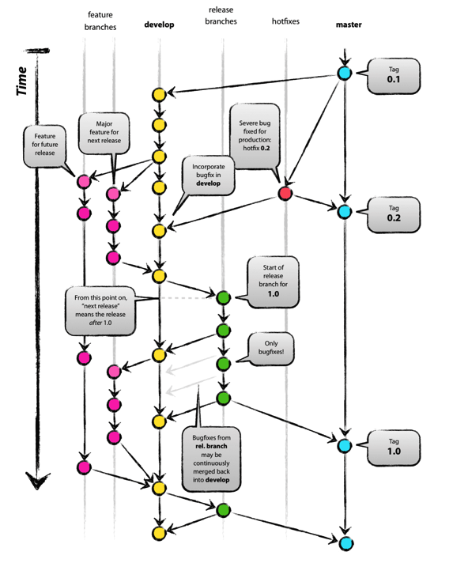

* **第二，GitHub Flow**

GitHub Flow 是 GitHub 所使用的一种简单流程。该流程只使用 master 和特性分支，并借助 GitHub 的 pull request 功能。

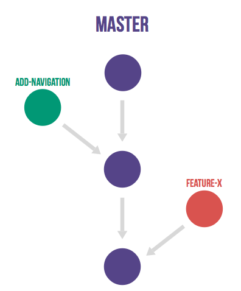


**在 GitHub Flow 中，master 分支中包含稳定的代码，它已经或即将被部署到生产环境**。

任何开发人员都不允许把未测试或未审查的代码直接提交到 master 分支。

对代码的任何修改，包括 Bug 修复、热修复、新功能开发等都在单独的分支中进行。不管是一行代码的小改动，还是需要几个星期开发的新功能，都采用同样的方式来管理。

当需要修改时，从 master 分支创建一个新的分支，所有相关的代码修改都在新分支中进行。开发人员可以自由地提交代码和提交到远程仓库。

当新分支中的代码全部完成之后，通过 GitHub 提交一个新的 pull request。团队中的其他人员会对代码进行审查，提出相关的修改意见。由持续集成服务器（如 Jenkins）对新分支进行自动化测试。当代码通过自动化测试和代码审查之后，该分支的代码被合并到 master 分支。再从 master 分支部署到生产环境。

GitHub Flow 的好处在于非常简单实用，开发人员需要注意的事项非常少，很容易形成习惯。当需要修改时，只要从 master 分支创建新分支，完成之后通过 pull request 和相关的代码审查，合并回 master 分支就可以了。

* **第三，GitLab Flow**

上面提到的 GitHub Flow，适用于特性分支合入 master 后就能马上部署到线上的这类项目，但并不是所有团队都使用 GitHub 或使用 pull request 功能，而是使用开源平台 GitLab，特别是对于公司级别而言，代码作为资产，不会随意维护在较公开的 GitHub 上（除非采用企业版）。

GitLab Flow 针对不同的发布场景，在 GitHub Flow（特性分支加 master 分支）的基础上做了改良，额外衍生出了三个子类模型，如表 2 所示。


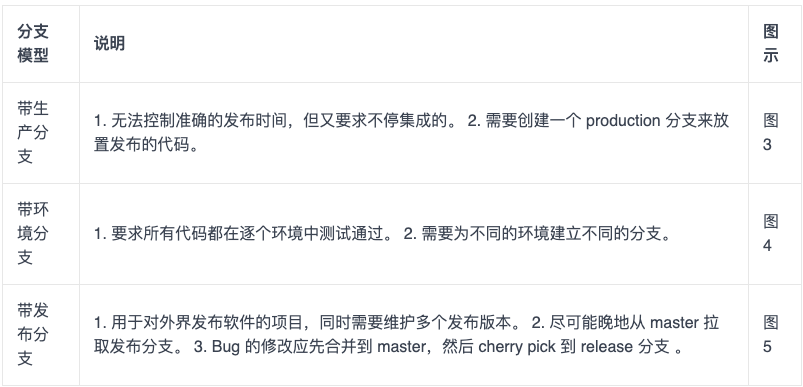

表 2 GitLab Flow 的三个分支

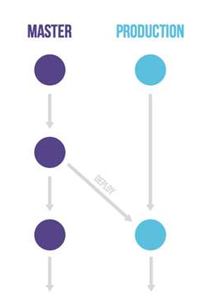

图 3 带生产分支的 GitLab Flow

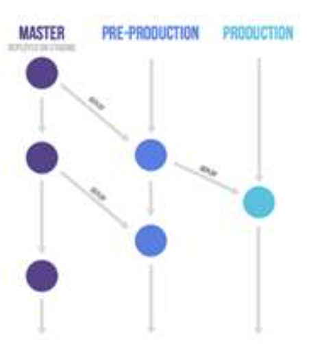

图 4 带环境分支的 GitLab Flow

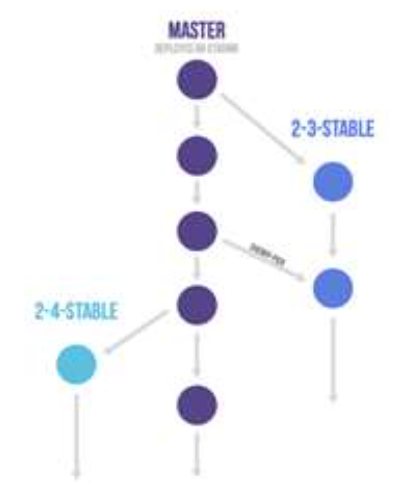

GitLab Flow 的特性分支合入 master **用的是“Merge Request”，功能与 GitHub Flow 的“pull request”相同，这里不再赘述**。

通过 Git Flow、GitHub Flow 和 GitLab Flow（3 个衍生类别） 这几个具体模型的介绍，我给你总结一下特性分支开发的优缺点。

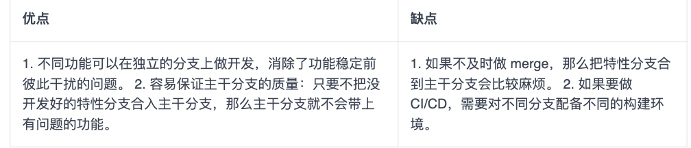


### **1-3 选出最适合的分支策略**

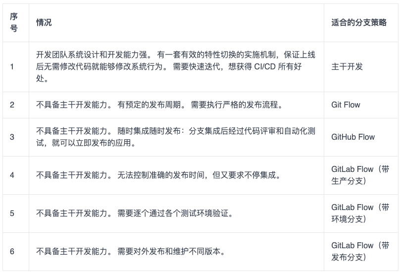


## **2 依赖管理**

操作系统的依赖管理工具，比如 CentOS 的 yum，Debian 的 apt，Arch 的 Packman，macOS 的 Homebrew； 编程语言的依赖管理工具，比如 Java 的 Maven， `.Net` 的 nuget，Node.js 的 npm，Golang 的 `go get`，Python 的 pip，Ruby 的 Gem 。


这些平台的解决思路都是将依赖放到共同的仓库，然后管理工具通过依赖描述文件去中央仓库获取相应的包。

一个典型的依赖管理工具通常会有以下几个特性：

* 统一的命名规则，也可以说是坐标，在仓库中是唯一的，可以被准确定位到；
* 统一的中心仓库可以存储管理依赖和元数据；
* 统一的依赖配置描述文件；
* 本地使用的客户端可以解析上述的文件以及拉取所需的依赖。

### **2-1 Maven 如何管理依赖？**

Maven 是 Java 生态系统里面一款非常强大的构建工具，其中一项非常重要的工作就是对项目依赖进行管理。

Maven 使用 XML 格式的文件进行依赖配置描述的方式，叫作 POM（Project Object Model ），以下就是一段简单的 pom.xml 文件片段：

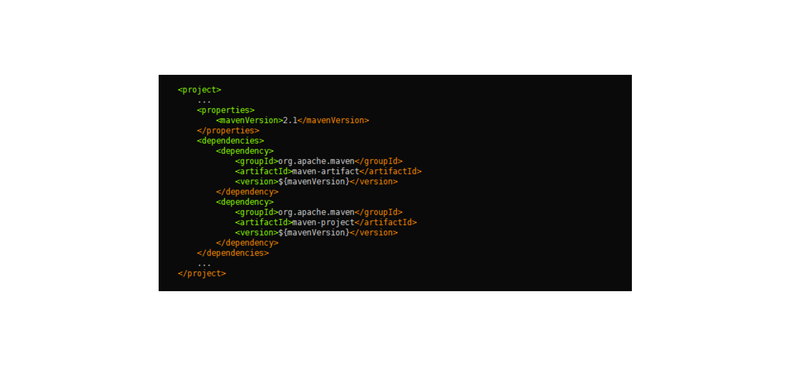

在 POM 中，根元素 project 下的 dependencies 可以包含一个或多个 dependency 元素，以声明一个或者多个项目依赖。每个依赖可以包含的元素有：

1. groupId、artifactId、version： 依赖的基本坐标；
2. type： 依赖的类型，默认为 jar；
3. scope： 依赖的范围；
4. optional： 标记依赖是否可选；
5. exclusions： 用来排除传递性依赖；

要想用好 Maven 管理依赖，你必须理解每一项的含义，而新手通常傻傻分不清楚。举个例子，依赖范围这一项，Maven 在不同的时期会使用不同的 classpath ：

* 比如，junit 只有在测试的时候有用，那么将其设为 test scope 就可以；
* 再比如 ，servlet API 这个 jar 包只需要在编译的时候提供接口，但是实际在运行时会有对应的 servlet 容器提供，所以没必要打到 war 包中去，这时候只需要指定在 provided scope 就可以了

包管理工具还解决了依赖传递的问题，比如你的项目 A 依赖了 B，而 B 依赖了 C 和 D，那么在获取依赖的时候会把 B、C、D 都一起拉下来，这样可以节省大量的时间。

* **第一原则： 最短路径优先原则**。 比如，A 依赖了 B 和 C，而 B 也依赖了 C，**那么 Maven 会使用 A 依赖的 C 的版本，因为它的路径是最短的。**
* **第二原则： 第一声明优先原则**。 比如，A 依赖了 B 和 C，B 和 C 分别依赖了 D，**那么 Maven 会使用 B 依赖的 D 的版本，因为它是最先声明的。**

根据这两个原则，Maven 就可以确定一个项目所有依赖的列表，但它处理依赖的方式还是有些简单粗暴。有时 Maven 的决定结果并不是你想要的，所以我们在使用 Maven 的时候还是要多加小心。

### **2-2 Maven 最佳实践**

* 生产环境尽量不使用 SNAPSHOT 或者是带有范围的依赖版本，可以减少上线后的不确定性，我们必须保证，测试环境的包和生产环境是一致的。
* 将 POM 分成多个层次的继承关系，比如携程的 POM 继承树一般是这样：

```
corp pom
	ctrip pom/qunar pom
		bu pom
			product pom
				project parent pom
					project sub module pom
```

这样做的好处是每一层都可以定义这一级别的依赖。 其中 `ctrip pom/qunar pom` 我们叫它为公司的 super-pom，每个项目必须直接或间接的继承其所在公司的 super-pom。这样做的好处是每一层都可以定义这一级别的依赖，便于各个层次的统一管理。


为什么我本地可以编译通过，而你们编译系统编译通不过？”难道 Maven 在工作的时候还看脸？ 当然不是!

遇到这样的情况不要急，处理起来通常有如下“三板斧”：

1. 确认开发操作系统，Java 版本，Maven 版本。通常情况下操作系统对 Java 编译的影响是最小的，但是偶尔也会遇到一些比如分隔符（冒号与分号）之类的问题。Java 和 Maven 的版本应尽量与生产编译系统保持一致，以减少不必要的麻烦。
2. 如果确认了开发操作系统没问题，那么你可以把用户的项目拉到自己的本地，并且删除本地依赖的缓存，也就是删除 .m2 目录下的子目录，减少干扰，执行编译。若编译通不过，说明用户本地就有问题，让他也删掉自己本地的缓存找问题。如果可以编译通过，说明问题出在编译系统，进入第 3 步。
3. 使用 mvn dependency 命令对比生产编译系统与本地依赖树的区别，检查编译系统本地是否被缓存了错误的 jar 包，从而导致了编译失败。有时候这种错误会隐藏得比较深，非常难查，需要很大的耐心。

## **3 代码回滚**

* 包回滚是指，线上运行的系统，从现在的版本回滚到以前稳定的老版本。
* 代码回滚是指，Git 分支的指针（游标），**从指向当前有问题的版本改为指向一个该分支历史树上没问题的版本，而这个版本可以是曾经的 commit，也可以是新建的 commit**。

### **3-1 你是不是也遇到了问题？**

* 我本地的分支通过 `reset --hard` 的方式做了代码回滚，想通过 push 的方式让远端的分支也一起回滚，执行 push 命令时却报错，该怎么办？ 
	* **答：如果不加 `-f` 参数，执行 `reset --hard` 后，push 会被拒绝，因为你当前分支的最新提交落后于其对应的远程分支。push 时加上 `-f` 参数代表强制覆盖**。

* 线上产品包已经回滚到昨天的版本了，我清清楚楚地记得昨天我把发布分支上的代码也 `reset --hard `到对应的` commit` 了，怎么那几个有问题的 commit 今天又带到发布分支上了？真是要命
 	* 答：**集成分支不能用 `reset --hard` 做回滚，应该采用集成分支上新增 commit 的方式达到回滚的目的**。

* 我刚刚在 GitLab 上接纳了一个合并请求（Merge Request），变更已经合入到 master 上了，但现在我发现这个合并出来的 commit 有较大的质量问题，我必须把 master 回滚到合并之前，我该怎么办？ 
	* 答：可以在 GitLab 上找到那个合并请求，点击 revert 按钮。

* 刚刚线上 A 产品 V6.2 的包有问题，我已经把 A 的产品包回退到 V6.1 版本了，请问发布分支上的代码也要回滚到 V6.1 对应的 commit 吗？ 
	* 答：你可以在下文“哪些情况下需要回滚代码？”和“哪些情况下包的回滚无需回滚代码？”中找到答案。

* 产品包的回滚可以在我们公司持续交付云平台上执行，平台能不能也提供代码一键回滚的功能？这样我们回滚代码能相对轻松一些。
	*  答：针对已上线发布的版本，我认为持续交付平台提供一键回滚的方式还是有必要的。这么做可以规范集成分支上线后代码回滚的行为，也能减少人为失误。

### **3-2 哪些情况下需要回滚代码？**	

在代码集成前和集成后，都有可能需要回滚代码。

**第一种情况：开发人员独立使用的分支上，如果最近产生的 commit 都没有价值，应该废弃掉，此时就需要把代码回滚到以前的版本。** 如图 1 所示。

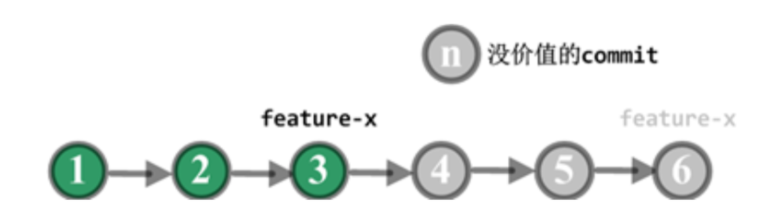

图 1 个人分支回滚

**第二种情况：代码集成到团队的集成分支且尚未发布，但在后续测试中发现这部分代码有问题，且一时半会儿解决不掉，为了不把问题传递给下次的集成，此时就需要把有问题的代码从集成分支中回滚掉**。 如图 2 所示。

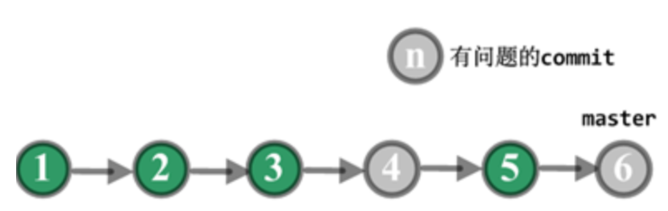

图 2 集成分支上线前回滚

**第三种情况：代码已经发布到线上，线上包回滚后发现是新上线的代码引起的问题，且需要一段时间修复，此时又有其他功能需要上线，那么主干分支必须把代码回滚到产品包 V0529 对应的 commit**。 如图 3 所示。

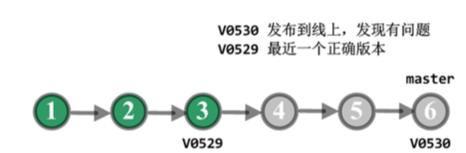

图 3 集成分支上线后回滚

### **3-3 哪些情况下包的回滚无需回滚代码？**

* 线上回滚后，查出并不是因为源代码有问题。
* 下次线上发布，就是用来修复刚才线上运行的问题。

### **3-4 代码回滚必须遵循的原则**

集成分支上的代码回滚坚决不用 `reset --hard` 的方式，原因如下：

* 集成分支上的 commit 都是项目阶段性的成果，即使最近的发布不需要某些 commit 的功能，但仍然需要保留这些 commit ，以备后续之需。
* 开发人员会基于集成分支上的 commit 拉取新分支，如果集成分支采用 reset 的方式清除了该 commit ，下次开发人员把新分支合并回集成分支时，又会把被清除的 commit 申请合入，很可能导致不需要的功能再次被引入到集成分支。

### **3-5 三种典型回滚场景及回滚策略**

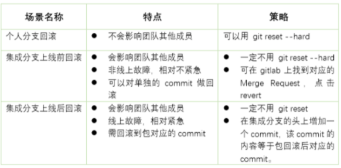

**第一，个人分支回滚**

* feature-x 分支回滚前 HEAD 指针指向 C6 。
* 在个人工作机上，执行下面的命令

```
$ git checkout feature-x   
$ git reset --hard  C3 的 HASH 值
```

如果 feature-x 已经 push 到远端代码平台了，则远端分支也需要回滚：

```
$ git push -f origin  feature-x
```

**第二，集成分支上线前回滚**


* 假定走特性分支开发模式，上面的 commit 都是特性分支通过 merge request 合入 master 产生的 commit。
* 集成后，测试环境中发现 C4 和 C6 的功能有问题，不能上线，需马上回滚代码，以便 C5 的功能上线。
* 团队成员可以在 GitLab 上找到 C4 和 C6 合入 master 的合并请求，然后点击 revert 。

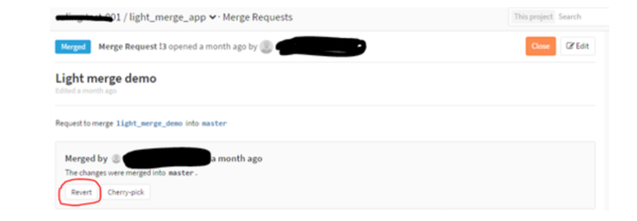

回滚后 master 分支变成如所示，C4’是 revert C4 产生的 commit，C6’是 revert C6 产生的 commit。通过 revert 操作，C4 和 C6 变更的内容在 master 分支上就被清除掉了，而 C5 变更的内容还保留在 master 分支上。

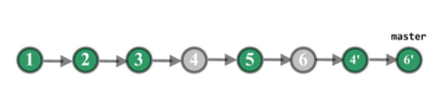


**第三，集成分支上线后回滚**

* C3 打包并上线，生成线上的版本 V0529，运行正确。之后 C6 也打包并上线，生成线上版本 V0530，运行一段时间后发现有问题。C4 和 C5 并没有单独打包上线，所以没有对应的线上版本。
* 项目组把产品包从 V0530 回滚到 V0529，经过定位，V0530 的代码有问题，但短时间不能修复，于是，项目组决定回滚代码。
* C4 和 C5 没有单独上过线，因此从线上包的角度看，不能回滚到 C4 或 C5，应该回滚到 C3。
* 考虑到线上包可以回滚到曾发布过的任意一个正确的版本。为了适应线上包的这个特点，线上包回滚触发的代码回滚我们决定不用 一个个 revert C4、C5 和 C6 的方式，而是直接创建一个新的 commit，它的内容等于 C3 的内容。
* 具体回滚步骤：

```
$ git fetch origin  
$ git checkout master
$ git reset --hard  V0529         # 把本地的 master 分支的指针回退到 V0529，此时暂存区 (index) 里就指向 V0529 里的内容了。
$ git reset --soft  origin/master  # --soft 使得本地的 master 分支的指针重新回到 V05javascript:;30，而暂存区 (index) 变成 V0529 的内容。
$ git commit -m "rollback to V0529"  # 把暂存区里的内容提交，这样一来新生成的 commit 的内容和 V0529 相同。 
$ git push origin  master        # 远端的 master 也被回滚。
```

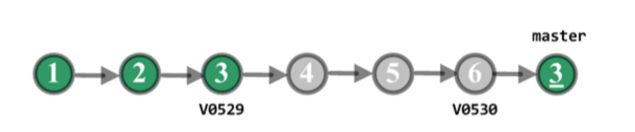

回滚后的示意图

C3’的内容等于 C3，master 分支已清除 C4、C5 和 C6 的变更。

现在 master 又回到了正确的状态，其他功能可以继续上线。

如果要修复 C4、C5 和 C6 的问题，可以在开发分支上先 revert 掉 C3’ ，这样被清除的几个 commit 的内容又恢复了。

