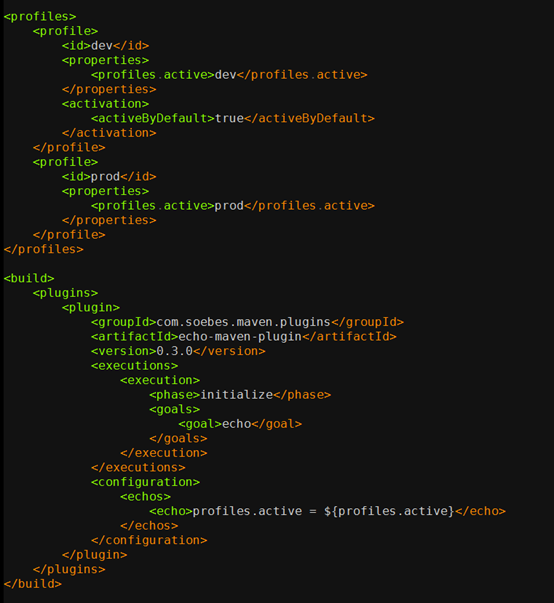

# **L3 环境管理**

## **1 测试环境要多少**

### **1-1 互联网公司测试环境的结构**

目前互联网公司常见的环境模型一般分为**开发环境，功能测试环境，验收测试环境，预发布环境，生产环境这五个大套环境**。

* **第一，开发环境**

微服务架构下，单机已经无法完整地运行业务应用，这就**需要开发环境内包含一套完整的业务应用依赖以及相关的基础设施**，以保证业务开发同学能在本地完成开发测试。

* **第二，功能测试环境**

在开发环境下，每个下游依赖应用都只有一个可用的 stable 版本。**而在实际的开发过程中，由于项目的并行开发，往往会同时存在多个可依赖的版本**。而每个项目组的同学在测试时，都希望测试过程中的关键依赖应用是可以被独占的，版本是固定的，不会被其他项目组干扰。

所以，一套独立的功能测试环境就很有必要了。通常，互联网企业会通过中间件的方式分割出一块隔离区域，在功能测试环境中创建多个子环境来解决这个问题。

* **第三，验收测试环境**

**验收测试环境和功能测试环境是完全隔离的。当功能测试通过后，你可以在验收测试环境进行最终的验收。**

它除了可以用作测试之外，还可以用作产品展示。所以，除了测试和开发人员，产品经理也是验收测试环境的主要使用者。

* **第四，预发布环境**

**到了预发布阶段，应用已经进入了生产网络，和真实的生产应用共享同一套数据库等基础设施。**

**预发布是正式发布前的最后一次测试，在这个环境中往往可以发现线下环境中发现不了的 Bug。这个环境的运维标准等同于生产环境，一般不允许开发人员直接登录机器**。

根据不同的业务需求和部署策略，不同公司对预发布环境的实现也有所不同：

一种比较常见的方式是，将金丝雀发布作为预发布，从接入真实流量的集群中挑选一台或一小组机器先进行版本更新，通过手工测试以及自动化测试和监控系统验证，降低新版本发布的风险。
另一种做法是，独立出一组始终不接入真实流量的机器，调用在预发布环境中形成闭环。
相对于第一种方式，第二种方式对生产环境的影响更小，但需要额外的资源和维护成本。

* **第五，生产环境**

生产环境是用户真实使用的环境，对安全性和稳定性的要求最高。

### **什么是好的测试环境？**

而每种角色对于产品研发流程中的需求也是不同的：


* 开发同学关注研发效率；
* 测试同学关注测试的可靠性；
* 产品经理更关注的是真实的用户体验和产品的完整性；
* 预发布环境的需求其实来自于运维同学，他们需要保证生产环境的稳定性，减少生产环境的变更，所以需要将预发布环境与线下环境完全隔离。

以下几个需求都是必须被做到的

* 可得性，即在开发一个新项目时，能快速获取构建一个环境需要的机器，基础设施。最好的情况是，能随时可得，随时归还。
* 快速部署，即在搭建新环境时，能以最快的速度构建出一整套完整的环境。测试环境的部署很频繁，在代码提交后，能在很短的时间内构建代码，在环境上更新，就能更早开始测试。
* 独立性，即一个环境在使用过程中，可以不受其他项目测试人员的干扰。
* 稳定性，即不会因为下游服务，基础设施的异常，造成测试中断、等待。
* 高仿真，主要分为两个方面：“测试数据真实”，即能在测试环境构建出真实的测试用例；“环境真实”，即基础服务的架构和行为与线上环境保持一致，避免因为环境不一致造成测试结果不一致。

## **2 各环境的重要性**

从面向的目标来看，环境配置大体上可以分为两大部分：

* 以环境中每台服务器为对象的运行时配置；
* 以一个环境为整体目标的独立环境配置。

### **2-1 服务器运行时配置**

以一个 Java Web 应用为例，需要哪些运行时配置呢？

* 安装 war 包运行依赖的基础环境，比如 JDK，Tomcat 等。
* 修改 Tomcat 的配置文件，关注点主要包括：应用的日志目录，日志的输出格式，war 包的存放位置。Tomcat 的 server.xml 配置包括：连接数、 端口、线程池等参数。
* 配置 Java 参数，包括 JVM 堆内存的 xmx、xmn 等参数，GC 方式、参数，JMX 监控开启等。
* 考虑操作系统参数，比较常见的一个配置是 Linux 的文件句柄数，如果应用对网络环境有一些特殊要求的话，还需要调整系统的 TCP 参数等配置。

我们不光要考虑单个实例初始化配置，还要考虑每次 JDK、Tomcat 等基础软件的版本升级引起的运行时配置的变更，而且这些变更都需要被清晰地记录下来，从而保证扩容出新的服务器时能取到正确的、最新的配置。


### **2-2 独立环境配置**

独立环境配置的主要目的是，保证一个环境能够完整运作的同时，又保证足够的隔离性，使其成为一个内聚的整体。

所以，要让一个环境能够符合需求的正常运作，你需要考虑的内容包括：

* 这个环境所依赖的数据库该如何配置，缓存服务器又该如何配置。
* 如果是分布式系统，或者 SOA 架构的话，就需要考虑服务中心、配置中心等一系列中间件的配置问题。

### **2-3 环境一定要标准化**

最好的简化方法，莫过于标准化了。**所谓标准化，就是为了在一定范围内获得最佳秩序，对实际的或潜在的问题制定共同、可重复使用的规则**

我们首先可以实现对语言栈的使用、运行时配置模板、独立环境配置的方法等的标准化：

* 规定公司的主流语言栈；
* 统一服务器安装镜像；
* 提供默认的运行时配置模板；
* 统一基础软件的版本，以及更新方式；
* 在架构层面统一解决环境路由问题；
* 自动化环境产生过程。

建议你在实施持续交付的同时，去推动形成以下几个方面的规范：

1. 代码及依赖规范；
2. 命名规范；
3. 开发规范；
4. 配置规范；
5. 部署规范；
6. 安全规范；
7. 测试规范。


### **2-4 环境配置**

**首先，需要定义 Server Spec。**

这是重中之重，在服务器生成时，写入它自己的描述文件。我们通常把这个文件命名为“Server Spec”。在这个文件里，记录了这台服务器的所有身份信息，**包括：IDC，型号，归属环境，作用，所属应用，服务类型，访问路径等。**

**其次，解决配置中心寻址。**

中间件根据 Server Spec 的描述，寻找到它所在环境对应的配置中心，从而进一步获取其他配置，如数据库连接字符串，短信服务地址等等。

**最后，完成服务自发现。**


其实这就是一个服务自发现的过程。根据服务类型，访问路径等，还可以自动生成对应的路由配置，负载均衡配置等。

## **3 了解各种配置方法**

**配置管理**： 是通过技术或行政手段对软件产品及其开发过程和生命周期进行控制、规范的一系列措施。 它的目标是记录软件产品的演化过程，确保软件开发者在软件生命周期的各个阶段都能得到精确的产品配置信息。

**配置**： 是指独立于程序之外，但又对程序产生作用的可配变量。也就是说，同一份代码在不同的配置下，会产生不同的运行结果。

**如果我们把这些信息都硬编码在代码里，结果就是：每次发布因为环境不同，或者业务逻辑的调整，都要修改代码。而代码一旦被修改，就需要完整的测试，那么变更的代价将是巨大的。**

### **3-1 构建时配置**

以 Maven 为例，实现多环境的构建可移植性需要使用 profile。

profile 是一组可选的配置，可以用来设置或者覆盖配置默认值。通过不同的环境激活不同的 profile，可以实现构建的可移植性。 我们可以看一个简单使用示例：



这段代码定义了 dev 和 prod 两个 profile（没有定义任何其他配置，实际使用中可按需定义任何配置），并且使用了 echo 插件验证 profile 是否生效，通过运行。

```
maven initialize –Pdev
```

```
maven initialize –Pprod
```
然后，可以看到输出：

```
[INFO] profiles.active = prod
```

其中， dev 是默认激活的，也就是说如果不填写任何 `–P` 参数，或者 –P 参数不为 dev 或者 prod，都会使用 dev 作为默认的 profile。

这样在代码构建时，你就可以根据具体需要选择对应的 profile 了。

这个方案看起来很简单， 但也有两个缺点：

* **它依赖于某个特定的构建工具，而且使用方法不统一。** 什么意思呢？如果你不使用 Maven 作为构建工具，这个配置功能就失效了；而且对于跨平台、跨语言栈的支持也不友好。
* 每次都要重新编译，浪费计算资源。 即使你只是替换一些配置文件，并没有改动任何代码，但为了让配置生效，还是需要完成代码的整个构建过程，这就会在编译上花费大量的计算资源。

### **3-2 打包时配置**

正因为构建时配置，需要针对多个 profile 编译多次，而持续交付有一个核心概念，**即：一次构建多次部署。打包就是为了解决这个问题而被发明的**。

打包时配置，需要借助发布的力量使配置生效。而实际场景中，只是修改了配置就要发布代码往往是不被接受的。特别是，如果你还不具备很成熟的持续部署能力，那将会是很头痛的事情。


### **3-3 运行时配置**

随着程序功能的日益复杂，程序的配置日益增多，各种功能的开关，参数的配置，服务器的地址，等等不断增加到系统中。而且应用对程序配置的期望值也越来越高，需要配置系统能够：

* 修改后实时生效；
* 支持灰度发布；
* 能分环境、分集群管理配置；
* 有完善的权限、审核机制。

在这样的大环境下，传统的配置文件、数据库等方式已经越来越无法满足开发人员对配置的管理需求；另外，对于数据库连接串，各个服务之间的 API Key 等机密配置，如果放在代码里也会引起安全的问题。

### **3-4 回滚是配置永远的痛**

**先回滚配置还是先回滚代码就成了一个死循环的问题。最好的办法是保证配置与代码的兼容性，这有点类似于数据库的 schema 变更。** 比如，只增加配置不删减配置、不改变配置的数据类型而是新增一个配置等方法。同时，也要做好代码版本与配置版本的对应管理

所以，对于配置回滚这个复杂问题，没有一劳永逸的办法， 只能根据实际情况选择最适合自己的方案。

**我有一个推荐做法就是，每次回滚时，将可能发生变化的配置进行 diff 操作，由负责回滚的具体人根据结果去做最后的判断**

**三种配置方案：**

* 构建时配置：会增加构建成本；
* 打包时配置：依赖发布生效；
* 运行时配置：配置中心，便于管理和维护。

## **4 如何做到分钟级搭建环境**

### **4-1 环境构建流水线**

* **虚拟机环境准备**，根据环境的应用数、每个应用需要的硬件配置，准备好环境的硬件资源。
* **应用部署流水线**，在标准化的虚拟机上进行应用部署，当出现问题时如何容错。
* **环境变更**，在 SOA 或微服务的架构体系下，常常会因为测试的需求，将几套环境合并或拆分，创建环境时，你需要考虑如何高效地完成这些操作。

### **4-2 虚拟机环境准备**

建议是，采用资源池的方案。你可以根据用户平时使用虚拟机的情况，统计每天虚拟机申请和销毁的具体数量，预先初始化一定量的虚拟机。 这样用户从上层的 PaaS 平台创建环境时，就不用等待初始化了，可以直接从资源池中获取虚拟机，这部分的时间就被节省下来了

### **4-3 应用部署流水线**

由于不同公司的中间件和运维标准不同，部署流水线的差异也会很大，所以这里我只会从单应用部署标准化、应用部署的并行度，以及流水线的容错机制，这三个关键的角度，分享如何提速环境的搭建

* **单应用部署标准化**，这是整个环境部署的基础
* **应用部署的并行度**，为了提高环境的部署速度，需要尽可能得最大化应用部署的并行度
* 流水线的容错机制
	* **第一种方法是，错误中断法**。 创建环境过程中，各种资源申请、应用部署出现问题时，我们将工作流快照下来，然后收集所有的异常信息，返回给用户。由用户判断当前的情况，等用户确认问题已经得到解决后，可以触发一次快照重试，继续被中断的流程。
	* **第二种方法是，优先完成法**。 创建环境过程中发生错误时，先进行几次重试。
		* 如果重试依然发生错误的话，就忽略当前错误，先走完剩余的流程，等所有的流程都走完了，再一次性将错误返回给用户。 
		* 从整体速度上来看，第二种优先完成的处理方式是更优的，而且也会更少地打断用户。
		* 只是方式二需要保证的关键原则是：所有的部署脚本的操作都是幂等的，即两次操作达成的效果是一致的，并不会带来更多的问题。

### **4-4 环境变更**

实现了应用部署流水线后，创建环境的主流程，即虚机准备和应用部署已经完成，环境已经可以工作了。但还是不能忽略了后续环境变更的需求和工作。一般情况下，研发人员变更环境主要有以下 4 种场景。

* 已经有一套新环境，当有新项目时，开发人员会挑选部分应用，组成一个独立的子环境。这里的重点是，要保证子环境和完整环境的调用是互相隔离的。
* 当存在多个子环境时，可能在某个时间点需要做多个项目的集成，这时开发人员需要合并多个环境。
* 和合并的情况相反，有些情况下，开发人员需要将一个子环境中的应用切分开来，分为两个或者多个环境分别进行隔离测试。
* 已经存在一个子环境，当多个并行项目时，开发人员会克隆一套完整的子环境做测试。

对于这 4 个场景，我们需要关注的是在多并行环境的情况下应用拓扑图，包括用户访问应用的入口、应用之间调用链的管理，以及应用对数据库之类的基础设施的访问。

* **用户访问应用的入口管理。** 以最常用的访问入口（域名）为例，我推荐的做法是根据约定大于配置的原则，当环境管理平台识别到这是一个 Web 应用时，通过应用在生产环境中的域名、路由，环境名等参数，自动生产一个域名并在域名服务上注册。 这里需要注意的是，域名的维护尽量是在 SLB（负载均衡，Server Load Balancer）类似的软负载中间件上实现，而不要在 DNS 上实现。因为域名变更时，通过泛域名的指向，SLB 二次解析可以做到域名访问的实时切换。而如果配置在 DNS 上，域名的变更就无法做到瞬时生效了。
* **应用之间调用链的管理**
* **对数据库的访问**。 
	* 一是，数据库连接串的维护问题，与 SOA 调用链（即服务之间的调用关系）的维护类似，完全可以借鉴；
	* 二是，数据库的快速创建策略。 对于数据库中的表结构和数据，我们采取的方式是根据生产中实际的数据库结构，产生一个基准库，由用户自己来维护这个基准库的数据，保证数据的有效性。并在环境创建时，提供数据库脚本变更的接口，根据之前的基准库创建一个新的实例，由此保证环境中的数据符合预期。


**对于环境的创建和拆分**，最主要的问题就是如何复制和重新配置环境中的各个零件。

* 环境创建，就是不断提高虚拟机准备和应用部署两个流水线的速度和稳定性；
* 环境拆分，则需要关注以上所说的三个最重要的配置内容。

**而环境的合并需要注意的问题是，合并后的环境冲突**。 比如，两套环境中都存在同一个服务应用，而两者的版本是不一致的；又或者，两个环境各自配置了一套数据库。此时该如何处理呢。

因为环境的描述已经被代码化了，所以我们解决这些问题的方式类似于解决代码合并的冲突问题。在环境合并前，先进行一次环境的冲突检测，如果环境中存在不可自动解决的冲突，就将这些冲突罗列出来，由用户选择合适的服务版本。

## **5 容器技术之环境管理**

### **5-1 容器和虚拟机的主要差异，包括三个方面：**

* 首先，**多个容器可以共享同一个宿主机的内核，所以容器的体积要比虚拟机小很多**，这就使得容器在分发和存储上比较有优势；
* 其次，**启动容器不需要启动整个操作系统**，所以容器部署和启动速度更快、开销更小，也更容易迁移，这使得容器拥有更强的恢复能力；
* 最后，**容器连带代码和环境一起部署的方式，保证了它所包含的程序的运行依赖不会被变更，这就使得容器有效解决了不同环境不同结果的问题**。

### **5-2 重新定义交付标准**

没有容器之前，交付标准包括软件环境（也就所谓的机器）和软件代码两部分。交付系统更关注的是软件代码，环境一旦产生后，我们就不再关心或者很难再干预用户后期是如何对其做变更的了。

**容器技术统一了软件环境和软件代码，交付产物中既包括了软件环境，又包括了软件代码。也就是说，容器帮我们重新定义了交付标准。**

**第一，交付结果一致**

容器镜像可以把软件的运行环境以及代码打包在一起，因此可以基于同一个镜像，在不同的地方生成一模一样的运行环境，**也就是说单个镜像的交付结果不可变**。

当然，单个容器只能提供一个服务，而实际场景下，应用都是跑在 SOA 或微服务的框架下的。所以，还需要利用如 Mesos 或 Kubernetes 这样的编排系统，将多个容器组织起来，并固化编排过程。

基于这两个特性，一旦形成了固定的容器镜像和对应的编排（也成为应用模板），那在不同的环境下，一定可以重复部署，且部署结果保持一致。

**第二，交付自动化**

容器镜像及容器编排技术很好地解决了 CI 和 CD 问题：

* CI 方面，与传统方式的不同只在于，原先交付的是安装包或软件包，而容器交付的则是镜像；
* CD 方面，与传统方式相比则有了长足的进步。 对传统方式而言，部署和安装方式与软件类型、开发方式有直接关系，存在多种多样的可能。 而容器技术则没有这样的问题，唯一的方式就是拉起容器镜像。这就大大简化了部署的复杂度，而且在编排系统的支持下，完成 CD 越来越容易了。

**第三，交付个性化**

有了容器之后，我们可以使用统一的接口完成任何应用的部署，几乎可以很好地满足所有的个性化需求

**第四，交付版本控制**

对于容器来说，遵循的是不可变基础设施（Immutable Infrastructure）的理念，也就是说任何变化，包括代码、环境、配置的变更，都需要重新制作镜像，产生一个新的版本。这与版本往往只和代码变更有关的传统方式有所不同。

### **5-3 容器不是银弹**


