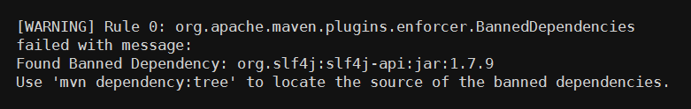

# **L4 构建集成**

## **1 构建的提速**

### **1-1 升级硬件资源**

需要注意的是，这里的硬件资源包括 CPU、内存、磁盘、网络等等，具体升级哪一部分，需要具体情况具体分析。

比如，**你要构建一个 C 语言程序，那么 CPU 就是关键点。你可以增加 CPU 的个数或者提升 CPU 主频以实现更快的编译速度**。

再比如，**你要用 Maven 构建一个 Java 应用，除了 CPU 之外，Maven 还会从中央仓库下载依赖写在本地磁盘**。

这时，**网络和磁盘的 I/O 就可能成为瓶颈**，你可以通过增加网络带宽提升网络吞吐，使用 SSD 代替机械硬盘增加磁盘 I/O ，从而到达提升整个构建过程速度的目的。

**总之，当你使用成熟的构建工具进行构建时，如果无法通过一些软件技术手段提升软件本身的构建速度，那么根据构建特点，有针对性地升级硬件资源，是最简单粗暴的方法**。

### **1-2 搭建私有仓库**

构建很多时候是需要下载外部依赖的，而网络 I/O 通常会成为整个构建的瓶颈。尤其在当前网络环境下，从外网下载一些代码或者依赖的速度往往是瓶颈，所以在内网搭建各种各样的私有仓库就非常重要了。

目前，我们需要的依赖基本上都可以搭建一套私有仓库，比如：

* 使用 createrepo 搭建 CentOS 的 yum 仓库；
* 使用 Nexus 搭建 Java 的 Maven 仓库；
* 使用 cnpm 搭建 NodeJS 的 npm 仓库；
* 使用 pypiserver 搭建 Python 的 pip 仓库；
* 使用 GitLab 搭建代码仓库；
* 使用 Harbor 搭建 Docker 镜像仓库

所以，如果你的团队暂时没有条件自己搭建私有仓库的话，可以使用国内已有的一些私有仓库，来提升下载速度。当然，在选择私有仓库时，你要尽量挑选那些被广泛使用的仓库，避免安全隐患。

### **1-3 使用本地缓存**

虽然搭建私有仓库可以解决代码或者依赖下载的问题，但是私有仓库不能滥用，还是要结合构建机器本地的磁盘缓存才能达到利益最大化。


所以，妥善地用好本地缓存十分重要。这里说的“妥善”，主要包括以下两个方面：

* 对于变化的内容，增量下载；
* 对于不变的内容，不重复下载。

对于第一点，项目的源码是经常变化的内容，下载源码时，如果你使用 Git 进行增量下载，那么就不需要在每次构建时都重复拉取所有的代码。Jenkins 的 Git 插件，也默认使用这种方式。

对于第二点，Maven 每次下载依赖后都会在本地磁盘创建一份依赖的拷贝，在构建下载之前会先检查本地是否已经有依赖的拷贝，从而达到复用效果。并且，这个依赖的拷贝是公共的，也就是说每个项目都可以使用这个缓存，极大地提升了构建效率。

如果你使用 Docker，那么你可以在宿主机上 mount 同一个依赖拷贝目录到多个 Slave 容器上，这样多个容器就可以共享同一个依赖拷贝目录。你可以最大程度地利用这一优势，但要注意不要让宿主机的磁盘 I/O 达到瓶颈。

### **1-4 规范构建流程**

Less is More，Simple is Better

程序的追求是简约而不简单，但随着业务越来越复杂，构建过程中各种各样的需求也随之出现，虽然工具已经封装了很多实用的功能，但是很多情况下，你都需要加入一些自定义的个性化功能，才能满足业务需求。

Java 构建过程中就有大量的额外逻辑，**比如 Enforcer 检查、框架依赖检查、Sonar 检查、单元测试、集成测试等等**，可以说是无所不用其极地去保证构建产物的质量

以 Java 构建为例，Enforcer 检查、框架依赖检查、Sonar 检查、单元测试、集成测试这些步骤，并没有放在同一个构建过程中同步执行，而是通过异步的方式穿插在 CI/CD 当中，甚至可以在构建过程之外执行。

比如， Sonar 扫描在代码集成阶段执行，用户在 GitLab 上发起一个合并请求（Merge Request），这时只对变更的代码进行对比 Sonar 扫描，只要变更代码检查没有问题，那么就可以保证合并之后主干分支的代码也是没问题的。

所以，用户发布时就无需再重复检查了，只要发布后更新远端 Sonar Qube 的数据即可，同时，这个过程完全不会影响用户的构建体验。

### **1-5 善用构建工具**

以 Maven 为例，我来带你看看有哪些提速方式，当然其他的构建工具，如 Gradle 等也都可以采用类似的方法：

1. **设置合适的堆内存参数**。 过小的堆内存参数，会使 Maven 增加 GC 次数，影响构建性能；过大的堆内存参数，不但浪费资源，而且同样会影响性能。因此，构建时，你需要反复试验，得到最优的参数。
2. **使用 `-Dmaven.test.skip = true` 跳过单元测试**。 Maven 默认的编译命令是 `mvn package`，这个命令会自动执行单元测试，但是通常我们的构建机器无法为用户提供一套完整的单元测试环境，特别是在分布式架构下。因此如果单元测试需要服务依赖，则可以去掉它
3. **在发布阶段，不使用 Snapshot 版本的依赖。** 这就可以在 Maven 构建时不填写 `-U` 参数来强制更新依赖的检查，省下因为每次检查版本是否更新而浪费的时间。
4. **使用 `-T 2C` 命令进行并行构建**。 在该模式下 ，Maven 能够智能分析项目模块之间的依赖关系，然后并行地构建那些相互间没有依赖关系的模块，从而充分利用计算机的多核 CPU 资源。
5. **局部构建**。 如果你的项目里面有多个没有依赖关系的模块，那么你可以使用 `-pl` 命令指定某一个或几个模块去编译，而无需构建整个项目，加快构建速度。
6. **正确使用 clean 参数**。 通常情况下，我们建议用户在构建时使用 clean 参数保证构建的正确性。clean 可以删除旧的构建产物，但其实我们大多数时间可能不需要这个参数，只有在某些情况下（比如，更改了类名，或者删除了一些类）才必须使用这个参数，所以，如果某次变更只是修改了一些方法，或者增加了一些类，那么就不需要强制执行 clean 了。


五种常见的构建提速的方式，分别是

1. 升级硬件资源，最直接和粗暴的提速方式；
2. 搭建私有仓库，避免从外网下载依赖；
3. 使用本地缓存，减少每次构建时依赖下载的消耗；
4. 规范构建流程，通过异步方式解决旁支流程的执行；
5. 善用构建工具，根据实际情况合理发挥的工具特性。

## **2 构建检测**

### **2-1 什么是 Maven Enforcer 插件？**

Maven Enforcer 插件提供了非常多的通用检查规则，比如检查 JDK 版本、检查 Maven 版本、检查依赖版本，等等。下图所示就是一个简单的使用示例。


上述的配置会在构建时（准确的说是在 validate 时）完成三项检查：

* requireMavenVersion 检查 Maven 版本必须大于 3.3.9；
* requireJavaVersion 检查 JDK 版本必须大于等于 1.9；
* requireOS 检查 OS 必须是 Windows 系统。

如果你使用 Java 1.8， Maven 3.3.3， 在 Linux 上构建， 便会出现如下的错误：

* Rule 0: org.apache.maven.plugins.enforcer.RequireMavenVersion failed with message: Detected Maven Version: 3.3.3 is not in the allowed range 3.3.9.
* Rule 1: org.apache.maven.plugins.enforcer.RequireJavaVersion failed with message: Detected JDK Version: 1.8.0-77 is not in the allowed range 1.9.
* Rule 2: org.apache.maven.plugins.enforcer.RequireOS failed with message: OS Arch: amd64 Family: unix Name: linux Version: 3.16.0-43-generic is not allowed by Family=windows

从而导致构建失败。

构建系统在构建之前会先检查项目的继承树，继承树中必须包含 super-pom， 否则构建失败。并且，构建系统虽然允许用户自定义 Maven 的构建命令，但是会将 Enforcer 相关的参数过滤掉，用户填写的任何关于 Enforcer 的参数都被视为无效。

Enforcer 会被强制按照统一标准执行，这样就保证了所有应用编译时都要经过检查。

### **2-2 丰富的内置的 Enforcer 规则**

Maven Enforcer 提供了非常丰富的内置检查规则，在这里，我给你重点介绍一下 bannedDependencies 规则、dependencyConvergence 规则，和 banDuplicateClasses 规则。

**第一，bannedDependencies 规则**

**该规则表示禁止使用某些依赖，或者某些依赖的版本**，使用示例：


该代码检查的逻辑是，只允许使用版本大于等于 1.8.0 的 `org.slf4j:slf4j-api` 依赖，否则将会出现如下错误：



bannedDependencies 规则的常见应用场景包括：

* 当我们知道某个 jar 包的某个版本有严重漏洞时，可以用这种方法禁止用户使用，从而避免被攻击；
* 某个公共组件的依赖必须要大于某个版本时，你也可以使用这个方法禁止用户直接引用不兼容的依赖版本，避免公共组件运行错误。

**第二，dependencyConvergence 规则**

但是，Maven 基于这两个原则处理依赖的方式过于简单粗暴。毕竟在一个成熟的系统中，依赖的关系错综复杂，用户很难一个一个地排查所有依赖的关系和冲突，稍不留神便会掉进依赖的陷阱里，这时 dependencyConvergence 就可以粉墨登场了。

**dependencyConvergence 规则的作用是： 当项目中的 A 和 B 分别引用了不同版本的 C 时， Enforce 检查失败**。 下面这个实例，可以帮你理解这个规则的作用。


`org.slf4j:slf4j-jdk14:1.6.1` 依赖了 `org.slf4j:slf4j-api:1.6.1`， 而 `org.slf4j:slf4j-nop:1.6.0` 依赖了 `org.slf4j:slf4j-api:1.6.0`，当我们在构建项目时， 便会有如下错误：


这时就需要开发人员介入了，使用 dependecy 的 exclusions 元素排除掉一个不合适的版本。 虽然这会给编程带来一些麻烦， 但是非常必要。因为，我始终认为你应该清楚地知道系统依赖了哪些组件， 尤其是在某些组价发生冲突时，这就更加重要了。

**第三，banDuplicateClasses 规则**

**该规则是 Extra Enforcer Rules 提供的，主要目的是检查多个 jar 包中是否存在同样命名的 class，如果存在编译便会报错。** 

同名 class 若内容不一致，可能会导致 `java.lang.NoSuchFieldError`，`java.lang.NoSuchMethodException` 等异常，而且排查起来非常困难，因为人的直觉思维很难定位到重复类这个非显性错误上，例如下面这种情况：

`org.jboss.netty` 包与 `io.netty` 包中都包含一个名为 `NettyBundleActivator` 的类，另外还有 2 个重复类：`spring/NettyLoggerConfigurator 和 microcontainer/NettyLoggerConfigurator`。


当激活了 banDuplicateClasses 规则之后，Enforcer 检查，便会有如下的报错：


通常情况下，用户需要排除一个多余的 jar 包来解决这个问题，但有些情况下两个 jar 包都不能被排除，如果只是个别类名冲突了，那么可以通过 `ignoreClasses` 去忽略冲突的类，类名可以使用通配符`（）`，如: `org.jboss.netty.container.`。

但是，用户不能随意更改这个配置，因为它必须得到一定的授权，否则随意忽略会产生其他不确定的问题。因此我们将这个插件做了一些改动，通过 API 来获取 `ignoreClasses` 的内容。当用户有类似的需求时，可以提交 `ignoreClasses` ，但必须申请，经过 Java 专家审批之后才可忽略掉。

### **2-3 自定义的 Enforcer 检查规则**

除了上述的官方规则，实际上还做了若干个扩展的规则，如：

* CheckVersion，用于检查模块的版本号必须是数字三段式，或者带有 `SNAPSHOT` 的数字三段式；
* CheckGroupId，用于检查 GroupId 是否符合规范，我们为每个部门都分别指定了 `GroupId`；
* `CheckDistributionManagementRepository`，用于检查项目的 `distributionManagement` 中的 repository 节点，并为每个部门都指定了他们在 Nexus 上面的 repositroy；
* `CheckSubModuleSaveVersion`，用于检查子模块版本号是否与父模块版本号一致。

## **3 构建资源的弹性伸缩**

### **3-1 持续集成工具**

这些持续集成工具，最流行的应属 Travis CI、Circle CI、Jenkins CI 这三种。

**第一，Travis CI**

Travis CI 是基于 GitHub 的 CI 托管解决方案之一，由于和 GitHub 的紧密集成，在开源项目中被广泛使用。

Travis CI 的构建，主要通过 `.travis.yml` 文件进行配置。这个 `.travis.yml` 文件描述了构建时所要执行的所有步骤。

另外，Travis CI 可以支持市面上绝大多数的编程语言。但是，因为 Travis 只支持 GitHub，而不支持其他代码托管服务，所以官方建议在使用前需要先具备以下几个条件：

* 能登录到 GitHub；
* 对托管在 GitHub 上的项目有管理员权限；
* 项目中有可运行的代码；
* 有可以工作的编译和测试脚本。

**Travis CI 的收费策略是，对公共仓库免费，对私有仓库收费**。

**第二，CircleCI**

CircleCI 是一款很有特色，也是比较流行的，云端持续集成管理工具。CircleCI 目前也仅支持 GitHub 和 Bitbucket 管理。

CircleCI 与其他持续集成工具的区别在于，它们提供服务的方式不同。CircleCI 需要付费的资源主要是它的容器。

你可以免费使用一个容器，但是当你发现资源不够需要使用更多的容器时，你必须为此付费。你也可以选择你所需要的并行化级别来加速你的持续集成，它有 5 个并行化级别（1x、4x、8x,、12x，和 16x）可供选择，分别代表利用几个容器同时进行一个项目的构建，如何选择就取决于你了。

**第三，Jenkins CI**

Jenkins 是一款自包含、开源的用于自动化驱动编译、测试、交付或部署等一系列任务的自动化服务，它的核心是 Jenkins Pipline 。Jenkins Pipline 可以实现对持续交付插件的灵活组合，以流水线的方式接入到 Jenkins 服务。


Jenkins 还提供了一整套可扩展的工具集，程序员可以通过代码的方式，定义任何流水线的行为。另外，经过多年的发展，Jenkins 已经包含了很多实用的第三方插件，覆盖了持续交付的整个生命周期。

目前，绝大多数组织都选择了 Jenkins 作为内部的持续集成工具，主要原因是：


* 代码开源， 插件完善，系统稳定；
* 社区活跃，成功实践与网上资源比较丰富；
* Jenkins Pipeline 非常灵活好用。

### **3-2 Jenkins Master 高可用架构的**

目前普遍的 Jenkins 搭建方案是：一个 Jenkins Master 搭配多个 Jenkins Slave。大多数情况下，这种方案可以很好地工作，并且随着构建任务的增加，无脑扩容 Jenkins Slave 也不是一件难事。另外，不管是 Linux Slave 还是 Windows Slave ，Jenkins 都可以很好地支持，并且非常稳定。

但是，随着业务的增长，微服务架构的流行，持续交付理念的深入人心，构建会变得越来越多，越来越频繁，单个 Jenkins Master 终究会成为系统中的瓶颈。

遗憾的是，开源的 Jenkins 并没有给我们提供一个很好的 Master 高可用方案，CloudBees 公司倒是提供了一个高可用的插件，但是价格不菲。


思路是在 Jenkins 上面再封装两层： **Build Service 暴露构建的 HTTP 接口，接收请求后将任务丢给异步队列 Build Worker，Build Worker 根据不同的策略将任务分发给符合条件的 Jenkins Master**。

这里的分发条件，可以是编译任务的平台或语言，比如可以将基于 Windows 和 Linux 的任务分别放在不同的 Jenkins Master 上，也可以将 Java 构建和 NodeJS 构建任务放在不同的 Jenkins Master 上。

总而言之，构建任务分发的策略可以是非常灵活的：构建 Worker 和 Jenkins Master 之间有“心跳监测”，可以时刻检查 Jenkins Master 是否还健康，如果有问题就将任务分发到其他等价的 Jenkins Master 上，并给相关人员发送告警通知。

这种拆解 Jenkins Master 主要有以下几个好处：

* 每个 Job 都可运行在至少两个 Jenkins Master 之上， 保证高可用；
* 根据不同的策略将 Job 做 Sharding， 避免积压在同一个 Master 上；
* Jenkins Master 按需配置，按需安装不同的插件，便于管理。

### **3-3 Jenkins Slave 弹性伸缩方案**

解决了 Jenkins Master 的高可用问题，接着就要去思考如何才能解决 Slave 资源管理和利用率的问题了。

因为，你会发现一个组织的集成和构建往往是周期性的，高峰和低谷都比较明显，而且随着组织扩大，幅度也有所扩大。所以，如果按照高峰的要求来配备 Slave 实例数，那么在低谷时，就很浪费资源了。反之，又会影响速度，造成排队。

因此，我们需要整个 Slave 集群具有更优的弹性：既要好管理，又要好扩展。

**容器化的甜头**

* 使用 Dockerfile 描述环境信息相对于之前的文档更加直观，并且可以很自然地跟 Git 结合做到版本化控制，先更新 Dockerfile 再更新镜像是很自然的事。
* 镜像更容易继承，你可以配置一个 Base 镜像，然后根据不同的需求叠加软件。比如，你的所有构建都需要安装 Git 等软件，那么就可以把它写到 Base 镜像里面。
* Docker 镜像可以自由控制，开发人员可以自己推送镜像，快速迭代。重建容器的代价比重建虚拟机小得多，容器更加轻量，更容易在本地做测试。


## **4  容器镜像构建**

### **4-1 什么是容器镜像？**

容器镜像可以是一个完整的 Ubuntu 系统，也可以是一个仅仅能运行一个 sleep 进程的独立环境，大到几 G 小到几 M。而且 Docker 的镜像是分层的，它由一层一层的文件系统组成，这种层级的文件系统被称为 UnionFS。下图就是一个 Ubuntu 15.04 的镜像结构。


图中的镜像部分画了一个锁的标记，它表示镜像中的每一层都是只读的，只有创建容器时才会在最上层添加一个叫作 Container layer 的可写层。容器运行后的所有修改都是在这个可写层进行，而不会影响容器镜像本身。

因为这一特性，创建容器非常节省空间，因为一台宿主机上基于同一镜像创建的容器只有这一份镜像文件系统，每次创建多出来的只是每个容器与镜像 diff 的磁盘空间。而虚拟机每增加一个实例，都会在宿主机上占用一个完整的镜像磁盘空间。

### **4-2 什么是 Dockerfile**

**简单来说，Dockerfile 第一个好处就是，可以通过文本格式的配置文件描述镜像，这个配置文件里面可以运行功能丰富的指令，你可以通过运行 docker build 将这些指令转化为镜像。**

```
FROM ubuntu 
RUN apt-get install vim -y
```

其中，FROM 指令说明我们这个镜像需要继承 Ubuntu 镜像，RUN 指令是需要在镜像内运行的命令。

因为 Ubuntu 镜像内包含了 apt-get 包管理器，所以相当于启动了一个 Ubuntu 镜像的容器，然后在这个容器内部安装 Vim。这期间会产生一个新的 layer，这个新的 layer 包含安装 Vim 所需的所有文件。

**Dockerfile 的另外一个好处就是可以描述镜像的变化**，通过一行命令就可以直观描述出环境变更的过程，如果再通过 git 进行版本控制，就可以让环境的管理更加可靠与简单。

了解了 Dockerfile 之后，你就可以利用它进行代码更新了，最主要的步骤就以下三步：

* 将代码包下载到构建服务器；
* 通过 Dockerfile 的 ADD 命令将代码包加载到容器里；
* Docker build 完成新的镜像。

### **4-3 镜像构建优化**

原则上，我们总是希望能够让镜像保持小巧、精致，这样可以让镜像环境更加清晰，不用占用过多空间，下载也会更快。

那么，如何做好镜像的优化呢？你可以从 3 个方面入手：

* 选择合适的 Base 镜像；
* 减少不必要的镜像层的产生；
* 充分利用指令的缓存。

减少不必要的镜像层，是因为使用 Dockerfile 时，每一条指令都会创建一个镜像层，继而会增加整体镜像的大小。

比如，下面这个 Dockerfile：

```
FROM ubuntu 
RUN apt-get install vim -y 
RUN apt-get remove vim -y
```

虽然这个操作创建的镜像中没有安装 Vim，但是镜像的大小和有 Vim 是一样的。原因就是，每条指令都会新加一个镜像层，执行 install vim 后添加了一层，执行 remove vim 后也会添加一层，而这一删除命令并不会减少整个镜像的大小。

Dockerfile 构建的另外一个重要特性是指令可以缓存，可以极大地缩短构建时间。 因为之前也说了，每一个 RUN 都会产生一个镜像，而 Docker 在默认构建时，会优先选择这些缓存的镜像，而非重新构建一层镜像。


### **4-4 镜像构建环境**

当我们学会了使用 Dockerfile 构建镜像之后，下一步就是如何搭建构建环境了。搭建构建环境最简单的方式就是在虚拟机上安装 Docker Daemon，然后根据你所使用的语言提供的 Docker 客户端与 Docker Daemon 进行交互，完成构建。

但是，我们推崇构建环境容器化，因为我们的构建环境可能除了 Docker 外，还会有一些其他的依赖，比如编程语言、Git 等等。

接下来，我们就看看构建环境如何实现容器化。一般情况下，用容器来构建容器镜像有两种方式：

* Docker Out Of Docker（DooD）
* Docker In Docker（DinD)

**第一，Docker Out Of Docker（DooD）**

这种方式比较简单，首先在虚拟机上安装 Docker Daemon，然后将你的构建环境镜像下载下来启动一个容器。

在默认情况下，Docker 客户端都是通过 `/var/run/docker.sock` 与 `Docker Daemon` 进行通信。我们在创建 Docker 实例时，把外部的 `/var/run/docker.sock mount` 到容器内部，这样容器内的 Docker 客户端就可以与外部的 Docker Daemon 进行通信了。

另外，你还需要注意权限问题，容器内部的构建进程必须拥有读取 `/var/run/docker.sock` 的权限，才可以完成通信过程。

**第二，Docker In Docker（DinD）**

Docker In Docker ，就是在容器内部启动一个完整的 Docker Daemon 进程，然后构建工具只需要和该进程交互，而不影响外部的 Docker 进程。

默认情况下，容器内部不允许开启 Docker Daemon 进程，必须在运行容器的时候加上 --privileged 参数，这个参数的作用是真正取得 root 的权限。另外，Docker 社区官方提供了一个 docker:dind 镜像可以直接拿来使用。

这样一来，容器内部 Docker Daemon 就和容器外部的 Docker Daemon 彻底分开了，容器内部就是一个完整的镜像构建环境，是不是很神奇。

然而 DinD 也不是百分之百的完美和健壮，它也有一些关于安全和文件系统的问题。此外，因为每个容器都有独立的 `/var/lib/docker` 用来保存镜像文件，一旦容器被重启了，这些镜像缓存就消失了，这可能会影响我们构建镜像的性能。

### **4-5 总结**


首先，容器镜像是一个独立的文件系统，它包含了容器运行初始化时所需要的数据或软件。Docker 容器的文件系统是分层的、只读的，每次创建容器时只要在最上层添加一个叫作 Container layer 的可写层就可以了。这种创建方式不同于虚拟机，可以极大的减少对磁盘空间的占用。

其次，Docker 提供了 Dockerfile 这个可以描述镜像的文本格式的配置文件。你可以在 Dockerfile 中运行功能丰富的指令，并可以通过 docker build 将这些指令转化为镜像。

再次，基于 Dockerfile 的特性，我分享了 Dockerfile 镜像构建优化的三个建议，包括：选择合适的 Base 镜像、减少不必要的镜像层产生，以及善用构建缓存。

## **5  如何做好容器镜像的个性化及合规检查**

### **5-1 自定义镜像发布**

**Docker Clair 是一种静态检查，但对于动态的情况就显得无能为力了**。所以，对于镜像的安全规则我还总结了如下的一些基本建议：

* 基础镜像来自于 Docker 官方认证的，并做好签名检查；
* 不使用 root 启动应用进程；
* 不在镜像保存密码，Token 之类的敏感信息；
* 不使用 `--privileged` 参数标记使用特权容器；
* 安全的 Linux 内核、内核补丁。如 SELinux，AppArmor，GRSEC 等。


* 用户自定义环境脚本，通过 build-env.sh 和 image-env.sh 两个文件可以在构建的两个阶段改变镜像的内容；
* 平台环境选项与服务集市，利用这两个自建系统，可以将个性化的内容进行抽象，以达到快速复用，和高度封装的作用；
* 自定义镜像，是彻底解决镜像个性化的方法，但也要注意符合安全和合规的基本原则。

除了 Clair 进行 CVE 扫描之外，还有其他一些关于镜像安全的工具也可以从其他方面进行检查，