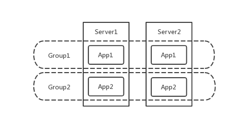

# **L5 发布及监控**

## **1 发布**

部署和发布是不是一回事儿？

有一些观点认为，部署和发布是有区别的，前者是一个技术范畴，而后者则是一种业务决策。这样的理解应该说是正确的。应用被部署，并不代表就是发布了，比如旁路运行（dark launch）方式，对于客户端产品更是如此的。

但对互联网端的产品来说，这个概念就比较模糊了，所以从英文上来看，我们通常既不用 deploy 这个词，也不用 release 这个词，而是使用 rollout 这个词。所以，从用词的选择上，我们就可以知道，发布是一个慢慢滚动向前、逐步生效的过程。

### **1-1 发布的需求**

**因此，我们想要的应该是：一个易用、快速、稳定、容错力强，必要时有能力迅速回滚的发布系统**。

### **1-2 什么是好的发布流程？**

**这套程序是否能满足发布的需求**：快速、易用、稳定、容错、回滚顺滑。

* **易用**：执行脚本就好，填入参数，一键执行。
* **快速**：自动化肯定比手工快，并且有提升空间。比如，因为有版本的概念，我们可以跳过相同版本的部署，或是某些步骤。
* **稳定**：因为这个程序逻辑比较简单，而且执行步骤并不多，没有交叉和并行，所以稳定性也没什么大的挑战。
* **容错性强**：表现一般，脚本碰到异常状况只能停下来，但因为版本间是隔离的，不至于弄坏老的服务，通过人工介入仍能恢复。
* **回滚顺滑**：因为每个版本都是完整的可执行产物，所以回滚可以视作使用旧版本重新做一次发布。甚至我们可以在目标机器上缓存旧版本产物，实现超快速回滚。

### **1-3 扩展到集群**

当发布的目标是一组机器而不是一台机器时，主要问题就变成了如何协调整个过程。

比如，追踪、同步一组机器目前发布进行到了哪一步，编排集群的发布命令就成为了更核心功能。好消息是，集群提供了新的、更易行的方法提高系统的发布时稳定性，其中最有用的一项被称为灰度发布。

**灰度发布是指，渐进式地更新每台机器运行的版本，一段时期内集群内运行着多个不同的版本，同一个 API 在不同机器上返回的结果很可能不同。** 虽然灰度发布涉及到复杂的异步控制流，但这种模式相比简单粗暴的“一波流”显然要安全得多。

### **1-4 几种常见的灰度方式**

灰度发布中最头疼的是如何保持服务的向后兼容性，发现苗头不对后如何快速切回老的服务。这在微服务场景中，大量服务相互依赖，A 回滚需要 B 也回滚，或是 A 的新 API 测试需要 B 的新 API 时十分头疼。为了解决这些问题，业界基于不同的服务治理状况，提出了不同的灰度理念。

**蓝绿发布**

**是先增加一套新的集群，发布新版本到这批新机器，并进行验证，新版本服务器并不接入外部流量**。此时旧版本集群保持原有状态，发布和验证过程中老版本所在的服务器仍照常服务。

验证通过后，流控处理把流量引入新服务器，待全部流量切换完成，等待一段时间没有异常的话，老版本服务器下线。

* 这种发布方法需要额外的服务器集群支持，对于负载高的核心应用机器需求可观，实现难度巨大且成本较高。
* 蓝绿发布的好处是所有服务都使用这种方式时，实际上创造了蓝绿两套环境，隔离性最好、最可控，回滚切换几乎没有成本。

**滚动发布**，

* 是不添加新机器，从同样的集群服务器中挑选一批，停止上面的服务，并更新为新版本，进行验证，验证完毕后接入流量。
* 重复此步骤，一批一批地更新集群内的所有机器，直到遍历完所有机器。 这种滚动更新的方法比蓝绿发布节省资源，但发布过程中同时会有两个版本对外提供服务，无论是对自身或是调用者都有较高的兼容性要求，需要团队间的合作妥协。但这类问题相对容易解决，实际中往往会通过功能开关等方式来解决。

**金丝雀发布**，

从集群中挑选特定服务器或一小批符合要求的特征用户，对其进行版本更新及验证，随后逐步更新剩余服务器。这种方式，比较符合携程对灰度发布的预期，但可能需要精细的流控和数据的支持，同样有版本兼容的需求。

## **2 发布系统的用户体验**

### **1 张页面展示发布信息**

首先应该有 1 张页面，且仅有 1 张页面，能够展示发布当时的绝大多数信息、数据和内容，这个页面既要全面，又要精准。 全面指的是内容清晰完整，精准指的是数据要实时、可靠。

除了以上的要求外，对于实际的需求，还要考虑 2 个时态，即发布中和未发布时，展示的内容应该有所区别。

* 发布中：自然应该展示发布中的内容，包括处理的过程、结果、耗时、当前情况等等。
* 未发布时：应该显示这个应用历史发布的一个过程，也就是整个版本演进的路线图，以及当前各集群、各服务器上具体版本的情况。

### **2 个操作按钮简化使用**

最终，用户在页面上可能会看到的同时出现的按钮组合有以下四种情况：

* 开始发布，1 个按钮；
* 中断发布，1 个按钮；
* 中断或重试发布，2 个按钮，发生在有局部错误的情况下；
* 中断或继续发布，2 个按钮，发生在发布被刹车时。

### **3 种发布结果**

系统不复杂了，用户体验自然也就简单了。这是一个相辅相成的过程。

从最抽象的角度来说，发布系统只需要 3 种结果，即：成功、失败和中断。

* 成功状态：很好理解，即整个发布过程，所有的实例发布都成功；
* 失败状态：只要发布过程中有一个步骤、一个实例失败，则认为整个发布事务失败；
* 中断状态：发布过程中任何时间点都可以允许中断此次发布，中断后事务结束。

### **4 类操作选择**

将发布结果高度概括为成功、失败和中断后，配合这三种状态，我们可以进一步地定义出最精简的 4 种用户操作行为，即开始发布、停止发布、发布回退和发布重试。

* **开始发布**，指的是用户操作开始发布时，需要选择版本、发布集群、发布参数，配置提交后，即可立即开始发布。
* **停止发布**，指的是发布过程中如果遇到了异常情况，用户可以随时停止发布，发布状态也将停留在操作“停止发布”的那一刻。
* **发布回退**，指的是如果需要回退版本，用户可以在任意时刻操作“发布回退”，回退到历史上最近一次发布成功的版本。
* **发布重试**，指的是在发布的过程中，因为种种原因导致一些机器发布失败后，用户可以在整个事务发布结束后，尝试重新发布失败的机器，直到发布完成。

### **5 个发布步骤**

* markdown：为了减少应用发布时对用户的影响，所以在一个实例发布前，都会做拉出集群的操作，这样新的流量就不会再继续进入了。
* download：这就是根据版本号下载代码包的过程；
* install：在这个过程中，会完成停止服务、替换代码、重启服务这些操作；
* verify：除了必要的启动预检外，这一步还包括了预热过程；
* markup：把实例拉回集群，重新接收流量和请求。

### **6 大页面主要内容**

* **第一，集群**。集群是发布的标准单元
* **第二，实例**。实例是集群的成员，通常情况下，一个集群会有多个实例承载流量。在界面上，用户可以查看实例的基本信息，了解实例的 IP、部署状态、运行状态等。用户能够看到发布时的状态与进度，这些信息可以帮助用户更好地控制发布。
*** 第三，发布日志**。在发布中和发布完成后，用户都可以通过查询发布日志了解发布时系统运行的日志，包括带有时间戳的执行日志和各种提示与报错信息，方便后续排查问题。
* **第四，发布历史**。发布历史对发布系统来说尤为重要。用户可以通过发布历史了解集群过去所做的变更，并且可以清晰地了解集群回退时将会回退到哪一天发布的哪个版本。
* **第五，发布批次**。由于集群中有很多实例，如何有序地执行发布，就是比较重要的事情。设定发布批次，可以让集群的发布分批次进行，避免问题版本上线后一下子影响所有的流量。每个批次中的实例采用并行处理的方式，而多个批次间则采用串行处理的方式。
* **第六，发布操作**。所有的发布操作按钮都会集中在这个区域，以便用户快速定位。

所以，在考虑灰度发布系统的用户体验时，我建议你可以参考以下三个原则：

* 信息要全面直观，并且聚合，而不要分散；
* 操作要简单直接，不要让用户做过多思考；
* 步骤与状态要清晰，减少模糊的描述。

## **3 发布系统的核心架构和功能设计**

### **3-1 发布系统架构**

### **3-2 发布系统核心模型**

发布系统的核心模型主要包括 Group、DeploymentConfig、Deployment、DeploymentBatch，和 DeploymentTarget 这 5 项。

同时，Group 的属性非常重要，包括 Site 站点、Path 虚拟路径、docBase 物理路径、Port 应用端口、HealthCheckUrl 健康检测地址等，这些属性都与部署逻辑息息相关。

所以这样设计，是因为 group 这个对象直接表示一个应用的一组实例，这样既可以支持单机单应用的部署架构，也可以支持单机多应用的情况。

**DeploymentConfig，即发布配置，提供给用户的可修改配置项要通俗易懂，包括：单个批次可拉出上限比、批次间等待时间、应用启动超时时间、是否忽略点火。**

Deployment，即一个发布实体，主要包括 Group 集群、DeploymentConfig 发布配置、Package 发布包、发布时间、批次、状态等等信息。

**DeploymentBatch，即发布批次**，通常发布系统选取一台服务器作为堡垒批次，集群里的其他服务器会按照用户设置的单个批次可拉出上限比划分成多个批次，必须先完成堡垒批次的发布和验证，才能继续其他批次的发布。

DeploymentBatch，即发布批次，通常发布系统选取一台服务器作为堡垒批次，集群里的其他服务器会按照用户设置的单个批次可拉出上限比划分成多个批次，必须先完成堡垒批次的发布和验证，才能继续其他批次的发布。

这里一定要注意，发布系统的对象模型和你所采用的部署架构有很大关系

### **3-3 发布流程及状态流转**

发布系统的主流程大致是：

同一发布批次中，目标服务器并行发布；不同发布批次间则串行处理。每台目标服务器在发布流程中的五个阶段包括 Markdown、Download、Install、Verify、Markup。

首先，借助于 Celery 分布式任务队列的 Chain 函数，发布系统将上述的 Markdown、Download、Install、Verify、Markup 五个阶段定义为一个完整的链式任务工作流，保证一个 Chain 函数里的子任务会依次执行。

**其次，每个子任务执行成功或失败，都会将 DeploymentTarget 设置为对应的发布状态。**例如，堡垒批次中的 DeploymentTarget 执行到 Verify 点火这个任务时，如果点火验证成功，那么 DeploymentTarget 会被置为 `VERIFY_SUCCESS`（点火成功）的状态，否则置为 `VERIFY_FAILURE`（点火失败）的状态。

发布过程中，如果有任意一台 DeploymentTarget 发布失败，都会被认为是发布局部失败，允许用户重试发布。因此，重试发布只针对于有失败的服务器批次进行重试，对于该批次中已经发布成功的服务器，发布系统会对比当前运行版本与发布目标版本是否一致，如果一致且点火验证通过的话，则直接跳过。

**这里需要注意的是， 堡垒批次不同于其他批次**：堡垒批次中 DeploymentTarget 的 Chain 的最后一个子任务是 Verify 点火，而不是 Markup。

再次，点火验证成功，DeploymentTarget 的状态流转到 `VERIFY_SUCCESS` 后，需要用户在发布系统页面上触发 Baking 操作，即堡垒批次中 DeploymentTarget 的 Markup，此时执行的是一个独立的任务事务，会将堡垒批次中的服务器拉入集群，接入生产流量。也就是说，这部分是由用户触发而非自动拉入。`BAKE_SUCCESS` 堡垒拉入成功之后，就是其他批次的 RollingOut 事务了，这也是一个独立的任务，需要由用户触发其他批次开始发布的操作。

## **4 如何利用监控保障发布质量**

### **4-1 监控的分类**

从一般意义上来讲，我们会把监控分为以下几类：

1. **用户侧监控**，关注的是用户真正感受到的访问速度和结果；
2. **网络监控**，即 CDN 与核心网络的监控；
3. **业务监控**，关注的是核心业务指标的波动；
4. **应用监控**，即服务调用链的监控；
5. **系统监控**，即基础设施、虚拟机及操作系统的监控。

因此，我们要做好一个监控系统，可以从这五个层面去考虑，将这五个层面整合就可以做成一个完整的、端到端的全链路监控系统。当然，监控系统的这 5 个层次的目标和实现方法有所不同，接下来我将分别进行介绍。

### **4-2 用户侧监控**

用户侧的监控通常从以下几个维度进行，这些监控数据既可以通过打点的方式，也可以通过定期回收日志的方式收集。

* **端到端的监控**，主要包括包括一些访问量、访问成功率、响应时间、发包回包时间等等监控指标。同时，我们可以从不同维度定义这些指标，比如：地区、运营商、App 版本、返回码、网络类型等等。因此，通过这些指标，我们就可以获得用户全方位的感受。
* **移动端的日志**。我们除了关注系统运行的日志外，还会关注系统崩溃或系统异常类的日志，以求第一时间监控到系统故障。
* **设备表现监控，主要指对 CPU、内存、温度等的监控，以及一些页面级的卡顿或白屏现象**；或者是直接的堆栈分析等。
* **唯一用户 ID 的监控**。除了以上三种全局的监控维度外，用户侧的监控一定要具备针对唯一用户 ID 的监控能力，能够获取某一个独立用户的具体情况。

### **4-3 网络监控**

网络是整个系统通路的保障。因为大型生产网络配置的复杂度通常比较高，以及系统网络架构的约束，所以网络监控一般比较难做。

**一般情况下，从持续交付的角度来说，网络监控并不需要做到太细致和太深入，因为大多数网络问题最终也会表现为其他应用层面的故障问题。但是，如果你的诉求是要快速定位 root cause，那就需要花费比较大的精力去做好网络监控了。**

网络监控，大致可以分为两大部分：

* **公网监控**。这部分监控，可以利用模拟请求的手段（比如，CDN 节点模拟、用户端模拟），获取对 CDN、DNS 等公网资源，以及网络延时等监控的数据。当然，你也可以通过采样的方式获取这部分数据。
* **内网监控。**这部分监控，主要是对机房内部核心交换机数据和路由数据的监控。如果你能打造全局的视图，形成直观的路由拓扑，可以大幅提升监控效率。

### **4-4 业务监控**

如果你的业务具有连续性，业务量达到一定数量后呈现比较稳定的变化趋势，那么你就可以利用业务指标来进行监控了。一般情况下，单位时间内的订单预测线，是最好的业务监控指标。

任何的系统故障或问题，影响最大的就是业务指标，而一般企业最重要的业务指标就是订单和支付。**因此，监控企业的核心业务指标，能够以最快的速度反应系统是否稳定**。 反之，如果系统故障或问题并不影响核心业务指标，那么也就不太会造成特别严重的后果，监控的优先级和力度也就没有那么重要。

### **4-5 应用监控**

分布式系统下，应用监控除了要解决常规的单个应用本身的监控问题外，还需要解决分布式系统，特别是微服务架构下，服务与服务之间的调用关系、速度和结果等监控问题。因此，应用监控一般也被叫作调用链监控。

调用链监控一般需要收集应用层全量的数据进行分析，要分析的内容包括：调用量、响应时长、错误量等；面向的系统包括：应用、中间件、缓存、数据库、存储等；同时也支持对 JVM 等的监控。

**调用链监控系统，一般采用在框架层面统一定义的方式，以做到数据采集对业务开发透明，但同时也需要允许开发人员自定义埋点监控某些代码片段。**

另外，除了调用链监控，不要忘了最传统的应用日志监控。将应用日志有效地联合，并进行分析，也可以起到同样的应用监控作用，但其粒度和精准度比中间件采集方式要弱得多。

### **4-6 系统监控**

系统监控，指的是对基础设施的监控。我们通常会收集 CPU、内存、I/O、磁盘、网络连接等作为监控指标。

对于系统监控的指标，我们通常采用定期采样的方式进行采集，一般选取 1 分钟、3 分钟或 5 分钟的时间间隔，但一般不会超过 5 分钟，否则监控效果会因为间隔时间过长而大打折扣

### **4-7 发布监控的常见问题**

**快速发现发布带来的系统异常。**

对于这样的诉求，优先观察业务监控显然是最直接、有效的方式。但是只观察业务监控并不能完全满足这样的需求，因为有两种情况是业务监控无能为力的：

* 第一种情况是我们所谓的累积效应，即系统异常需要累积到一定量后才会表现为业务异常；
* 另外一种情况就是业务的阴跌，这种小幅度的变化也无法在业务监控上得到体现。

第一，测试环境也要监控吗？

首先，我们需要认识到一个问题，即：**部署一套完整的监控系统的代价非常昂贵。而且，监控作为底层服务，你还要保证它的稳定性和扩展性。**

我来说说我建议的做法：

* 如果你的监控系统只能做到系统监控或日志级别的系统监控，那么对于一些对系统性能压榨比较厉害、对稳定性也没太多要求的测试环境来说，无需配备完整的监控系统。
* 如果你的监控系统已经做到了调用链甚至全链路的监控，那么监控系统无疑就是你的“鹰眼 "，除了发现异常，它还可以在定位异常等方面给你帮助（比如，对测试环境的 Bug 定位、性能测试等都有极大帮助）。在这样的情况下，你就一定要为测试环境配备监控系统

第二个问题，发布后需要监控多久？

**我建议的发布后监控时间为 30 分钟。**

第三个问题，如何确定异常是由我的发布引起的？

**解决这个问题，你需要建立一套完整的运维事件记录体系，并将发布纳入其中，记录所有的运维事件。当有异常情况时，你可以根据时间线进行相关性分析。**

### **4-8 总结**

首先，我介绍了监控的几种分类，以及分别可以采用什么方式去采集数据：

* 用户侧监控，可以通过打点收集，或者定期采集日志的方式进行数据收集；
* 网络监控，通过模拟手段或定期采样进行收集；
* 业务监控，需要定义正确的指标以及相匹配的采集技术，务必注意实时性；
* 应用监控，可以通过中间件打点采集，也可以通过日志联合分析进行数据采集；
* 系统监控，通常采用定期采样的方式收集数据。

其次，我和你分享了三个对发布来说特别重要的监控问题：

* 测试环境的监控需要视作用而定，如果不能帮助分析和定位问题，则不需要很全面的监控；
* 一般发布后，我建议继续坚持监控 30 分钟，把这个流程纳入发布流程中；
* 完整的运维事件记录体系，可以帮你定位某次故障是否是由发布引起的。