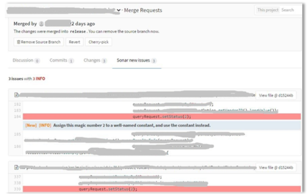
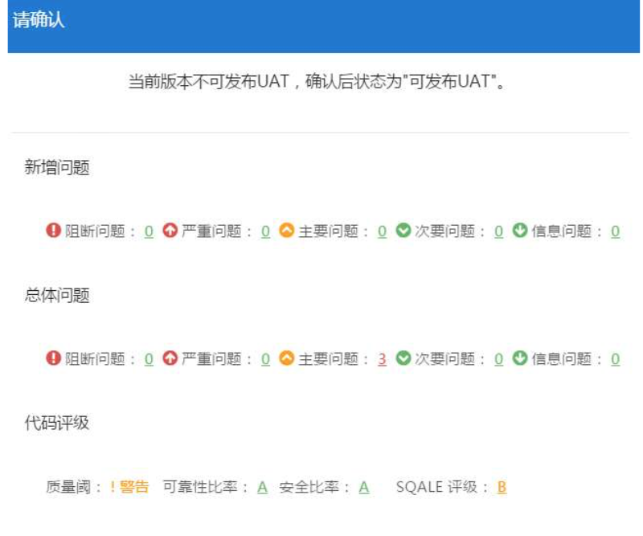
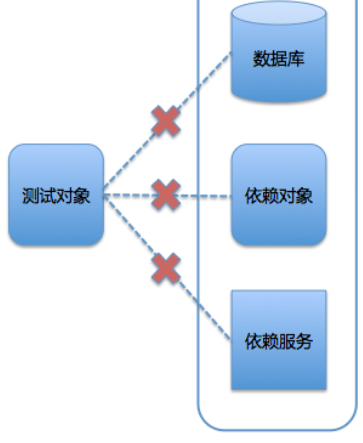

# **L6 测试管理**

## **1 代码静态检查实践**

因为这个专栏我们要解决的最主要的问题是持续交付，所以我在这个测试管理这个系列里面，不会去过多的展开测试本身的内容，而是要把重点放在与持续交付相关的三个重点上：


* 代码静态检查；
* 破坏性测试；
* Mock 与回放。

### **1-1 为什么需要代码静态检查？**

代码静态检查，即静态代码分析，**是指不运行被测代码**，仅通过分析或检查源程序的语法、结构、过程、接口等检查程序的正确性，并找出代码中隐藏的错误和缺陷（**比如参数不匹配、有歧义的嵌套语句、错误的递归、非法计算、可能出现的空指针引用等等**）。

在软件开发的过程中，静态代码分析往往在动态测试之前进行，同时也可以作为设计动态测试用例的参考。有统计数据证明，在整个软件开发生命周期中，有 70% 左右的代码逻辑设计和编码缺陷属于重复性错误，完全可以通过静态代码分析发现和修复。

但是，代码静态检查规则的建立往往需要大量的时间沉淀和技术积累，因此对初学者来说，**挑选合适的静态代码分析工具，自动化执行代码检查和分析，可以极大地提高代码静态检查的可靠性，节省测试成本**。

### **1-2 静态检查工具的优势**

总体来说，静态检查工具的优势，主要包括以下三个方面：

* 帮助软件开发人员自动执行静态代码分析，快速定位代码的隐藏错误和缺陷；
* 帮助软件设计人员更专注于分析和解决代码设计缺陷；
* 显著减少在代码逐行检查上花费的时间，提高软件可靠性的同时可以降低软件测试成本。

目前，已经有非常多的、成熟的代码静态检查工具了。其中，SonarQube 是一款目前比较流行的工具，国内很多互联网公司都选择用它来搭建静态检查的平台。

SonarQube 采用的是 B/S 架构，通过插件形式，可以支持对 Java、C、C++、JavaScript 等二十几种编程语言的代码质量管理与检测。

Sonar 通过客户端插件的方式分析源代码，可以采用 IDE 插件、Sonar-Scanner 插件、Ant 插件和 Maven 插件等，并通过不同的分析机制完成对项目源代码的分析和扫描，然后把分析扫描的结果上传到 Sonar 的数据库，之后就可以通过 Sonar Web 界面管理分析结果。

https://chao-xi.github.io/jxjenkinsbook/chap8/2chap8_code_quality_sonarqube/

### **1-3 跳过检查的几类方式**

为持续交付体系搭建好静态检查服务并设置好 Rules 后，你千万不要认为事情结束了，直接等着看检查结果就行了。因为，通常还会有以下问题发生：

* 代码规则可能不适合程序语言的多个版本；
* 第三方代码生成器自动产生的代码存在问题，该怎么略过静态检查；
* 静态检查受客观情况的限制，存在误报的情况；
* 某些规则对部分情况检查得过于苛刻；
* 其他尚未归类的不适合做静态检查的问题。

其实，这些问题都有一个共同特点：**静态检查时不该报错的地方却报错了，不该报严重问题的地方却报了严重问题。**

于是，我们针对这个共性问题的处理策略，可以分为三类：

* 把某些文件设置为完全不做静态检查；
* 把某些文件内部的某些类或方法设置为不做某些规则的检查；
* 调整规则的严重级别，让规则适应语言的多个版本。

### **1-4 如何提高静态检查的效率？**

提高静态检查的效率的重要性，可以概括为以下两个方面：

* 其一，能够缩短代码扫描所消耗的时间，从而提升整个持续交付过程的效率；
* 其二，我们通常会采用异步的方式进行静态检查，如果这个过程耗时特别长的话，会让用户产生困惑，从而质疑执行静态检查的必要性。

**怎么才能提升静态检查的效率呢**

**除了提升静态检查平台的处理能力外，在代码合入主干前采用增量形式的静态检查，也可以提升整个静态检查的效率。**增量静态检查，是指只对本次合入涉及的文件做检查，而不用对整个工程做全量检查。

### **1-5 Sonar 代码静态检查实例**

* 第一步：搭建 Sonar 服务，安装 CheckStyle 等插件。
* 第二步：设置统一的 Java 检查规则。
* 第三步：在 IDE 中安装 SonarLint 插件后，就可以使用 SonarSource 的自带规则了。
* 第四步：如果 SonarLint 的检查规则不能满足开发环境的要求，你可以执行相关的 mvn 命令，把检查结果吐到 Sonar 服务器上再看检查结果，命令如下：

```
mvn org.sonarsource.scanner.maven:sonar-maven-plugin:3.2:sonar -f ./pom.xml -Dsonar.host.url=sonar 服务器地址 -Dsonar.login= 账号名称 -Dsonar.password= 账号密码 -Dsonar.profile= 检查规则的集合 -Dsonar.global.exclusions= 排除哪些文件 -Dsonar.branch= 检查的分支
```

* 第五步：在 GitLab 的 Merge Request 中增加 Sonar 静态检查的环节，包括检查状态和结果等。



* 第六步：发布到用户验证环境（UAT）前，先查看静态检查结果。如果没有通过检查，则不允许发布。



## **2 破坏性测试**

### **2-1 什么是破坏性测试？**

这里需要注意的是，我们需要使用的测试手段必须是有效的。为什么这样说呢，有两点原因。

**第一，破坏性测试的手段和过程，并不是无的放矢，它们是被严格设计和执行的**。不要把破坏性测试和探索性测试混为一谈。也就是说，破坏性测试不应该出现，“试试这样会不会出问题”的假设，而且检验破坏性测试的结果也都应该是有预期的。


**第二，破坏性测试，会产生切实的破坏作用，你需要权衡破坏的量和度**。因为破坏不仅仅会破坏软件，还可能会破坏硬件。通常情况下，软件被破坏后的修复成本不会太大，而硬件部分被破坏后，修复成本就不好说了。所以，你必须要事先考虑好破坏的量和度。

### **2-2 破坏性测试的执行策略**

因此，绝大部分破坏性测试都会在单元测试、功能测试阶段执行。而执行测试的环境也往往是局部的测试子环境。

### **2-3 混沌工程**

混沌工程是在分布式系统上建立的实验，其目的是建立对系统承受混乱冲击能力的信心。鉴于分布式系统固有的混乱属性，也就是说即使所有的部件都可以正常工作，但把它们结合后，你还是很难预知会发生什么。

说到具体的实验方法，需要遵循以下 4 个步骤，即科学实验都必须遵循的 4 个步骤：

* 将正常系统的一些正常行为的可测量数据定义为“稳定态”；
* 建立一个对照组，并假设对照组和实验组都保持“稳定态”；
* 引入真实世界的变量，如服务器崩溃、断网、磁盘损坏等等；
* 尝试寻找对照组和实验组之间的差异，找出系统弱点。

混沌工程也有几个高级原则：

* **使用改变现实世界的事件**，就是要在真实的场景中进行实验，而不要想象和构造一些假想和假设的场景；
* **在生产环境运行**，为了发现真实场景的弱点，所以更建议在生产环境运行这些实验；
* **自动化连续实现**，人工的手工操作是劳动密集型的、不可持续的，因此要把混沌工程自动化构建到系统中；
* **最小爆破半径**，与第二条配合，要尽量减少对用户的负面影响，即使不可避免，也要尽力减少范围和程度。


### **2-4 Netflix 公司的先驱实践**

Netflix 为了保证其系统在 AWS 上的健壮性，创造了 Chaos Monkey，可以说是混沌工程真正的先驱者。

Chaos Monkey 会在工作日期间，随机地杀死一些服务以制造混乱，从而检验系统的稳定性。而工程师们不得不停下手头工作去解决这些问题，并且保证它们不会再现。久而久之，系统的健壮性就可以不断地被提高。

## **3 Mock与回放技术助力自动化回归**

### **3-1 持续交付中的测试难点**


* 测试数据的准备和清理。
* 分布式系统的依赖。
* 测试用例的高度仿真。

### **3-2 两大利器之一 Mock**

如果某个对象在测试过程中依赖于另一个复杂对象，而这个复杂对象又很难被从测试过程中剥离出来，那么就可以利用 Mock 去模拟并代替这个复杂对象。

下面这张图就是 Mock 定义的一个具象化展示



测试过程中，被测对象的外部依赖情况展示

在测试过程中，你可能会遇到这样的情况。你要测试某个方法和对象，而这个被测方法和对象依赖了外部的一些对象或者操作，比如：读写数据库、依赖另外一个对象的实体；依赖另一个外部服务的数据返回。

而实际的测试过程很难实现这三种情况，比如：单元测试环境与数据库的网络不通；依赖的对象接口还没有升级到兼容版本；依赖的外部服务属于其他团队，你没有办法部署等等。

那么，这时，你就可以利用 Mock 技术去模拟这些外部依赖，完成自己的测试工作。

Mock 因为这样的模拟能力，为测试和持续交付带来的价值，可以总结为以下三点：


* **使测试用例更独立、更解耦**。利用 Mock 技术，无论是单体应用，还是分布式架构，都可以保证测试用例完全独立运行，而且还能保证测试用例的可迁移性和高稳定性。为什么呢？ 因为足够独立，测试用例无论在哪里运行，都可以保证预期结果；而由于不再依赖于外部的任何条件，使得测试用例也不再受到外部的干扰，稳定性也必然得到提升。
* **提升测试用例的执行速度**。由于 Mock 技术只是对实际操作或对象的模拟，所以运行返回非常快。特别是对于一些数据库操作，或者复杂事务的处理，可以明显缩短整个测试用来的执行时间。 这样做最直接的好处就是，可以加快测试用例的执行，从而快速得到测试结果，提升整个持续交付流程的效率。
* **提高测试用例准备的效率**。因为 Mock 技术可以实现对外部依赖的完全可控，所以测试人员在编写测试用例时，无需再去特别考虑依赖端的情况了，只要按照既定方式设计用例就可以了。

**基于对象和类的 Mock**

Mockito 或者 EasyMock 这两个框架的实现原理，都是在运行时，为每一个被 Mock 的对象或类动态生成一个代理对象，由这个代理对象返回预先设计的结果。

这类框架非常适合模拟 DAO 层的数据操作和复杂逻辑，所以它们往往只能用于单元测试阶段。而到了集成测试阶段，你需要模拟一个外部依赖服务时，就需要基于微服务的 Mock 粉墨登场了。

**基于微服务的 Mock**

基于微服务的 Mock，我个人比较推荐的框架是 Weir Mock 和 Mock Server。这两个框架，都可以很好地模拟 API、http 形式的对象。

从编写测试代码的角度看，Weir Mock 和 Mock Server 这两种测试框架实现 Mock 的方式基本一致：

* 标记被代理的类或对象，或声明被代理的服务；
* 通过 Mock 框架定制代理的行为；
* 调用代理，从而获得预期的结果。


### **3-3 “回放”技术**

**如何把用户的请求记录下来**

* 第一种方案是，在统一的 SLB 上做统一的拦截和复制转发处理。这个方案的好处是，管理统一，实现难度也不算太大。但问题是，SLB 毕竟是生产主路径上的处理服务，一不小心，就可能影响本身的路由服务，形成故障。所以，我们有了第二种替换方案。
* 第二种方案是，在集群中扩容一台服务器，在该服务器上启动一个软交换，由该软交换负责复制和转发用户请求，而真正的用户请求，仍旧由该服务器进行处理。 这个方案比第一种方案稍微复杂了一些，但在云计算的支持下，却显得更经济。你可以按需扩容服务器来获取抽样结果，记录结束后释放该服务器资源。这个过程中，你也不需要进行过多的配置操作，就和正常的扩容配置一样，减少了风险。


