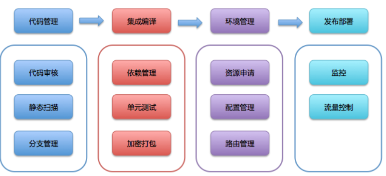
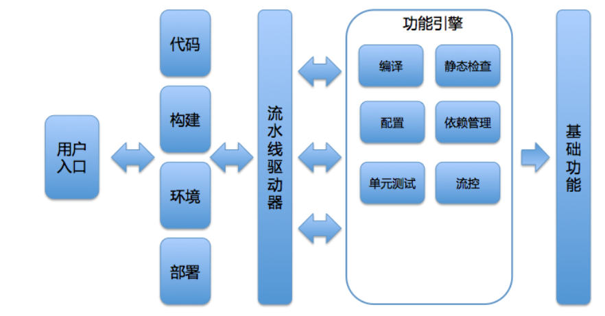

# **L7 持续交付平台化**

## **1 持续交付平台的设计**

持续交付平台最终将完成这个端到端的过程，那么流水线的每一步都可以认为是一个模块。**由此，整个平台的核心模块就是：代码管理、集成编译、环境管理、发布部署。**

这四个模块是持续交付平台中最核心，最容易做到内聚和解耦的模块。每个核心模块的周围，又围绕着各种子模块，比如：

* **代码管理模块**，往往会和代码审核、静态扫描和分支管理等模块相联系；
* **集成编译模块**，也会与依赖管理、单元测试、加密打包等模块相生相随的；
* **环境管理模块**，离不开配置管理、路由管理等模块；
* **发布部署模块**，还需要监控模块和流控模块的支持。

## **2 持续交付中有哪些宝贵数据**

### **2-1 常规系统指标数据列举**

* **第一类指标，稳定性相关指标**

作为基础服务，稳定性是我们的生命线。所以，对于所有的子系统，包括：代码管理平台、集成编译系统、环境管理系统、测试管理系统和发布系统，我们都会设立必要的稳定性指标，并进行数据监控。这些稳定性相关的数据指标，代表整个系统的可用度。

* **第二类指标，性能相关指标**

与系统性能相关的指标，通常可以直接反应系统的处理能力，以及计算资源的使用情况。更重要的是，速度是我们对用户服务能力的直观体现。很多时候，系统的处理速度上去了，一些问题也就不再是问题了。

* **push 和 fetch 代码的速度；**
* 环境创建和销毁的速度；
* 产生仿真数据的速度；
* 平均编译速度及排队时长；
* 静态检查的速度；
* 自动化测试的耗时；
* 发布和回滚的速度。

* **第三类指标，持续交付能力成熟度指标**

不同的子系统，我关注的指标也不同。

* **与代码管理子系统相关的指标包括**：commit 的数量，code review 的拒绝率，并行开发的分支数量。 这里需要注意的是，并行开发的分支数量并不是越多越好，而是要以每个团队都保持一个稳定状态为优。
* **与环境管理子系统相关的指标包括**：计算资源的使用率，环境的平均大小。 这里需要注意的是，我一直都很关注环境的平均大小这个数据。因为我们鼓励团队使用技术手段来避免产生巨型测试环境，从而达到提高利用率、降低成本的目的。而且，这个指标也可以从侧面反映一个团队利用技术解决问题的能力。
* **与集成编译子系统相关的指标包括**：每日编译数量，编译检查的数据。 我们并不会强制要求编译检查出的不良数据要下降，因为它会受各类外部因素的影响，比如历史代码问题等等。但，我们必须保证它不会增长。这也是我们的团队在坚守质量关的体现。
* **与测试管理子系统相关的指标包括**：单元测试的覆盖率，自动化测试的覆盖率。 这两个覆盖率代表了组织通过技术手段保证质量的能力，也是测试团队最常采用的数据指标。
* **与发布管理子系统相关的指标包括**：周发布数量，回滚比率。

发布数量的增加，可以最直观地表现交付能力的提升；回滚比率，则代表了发布的质量。综合使用周发布数量和回滚比例这两个指标，就可以衡量整个团队的研发能力是否得到了提升。

