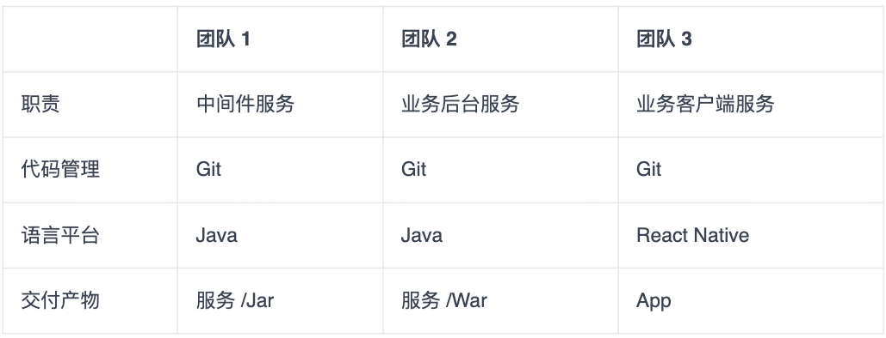
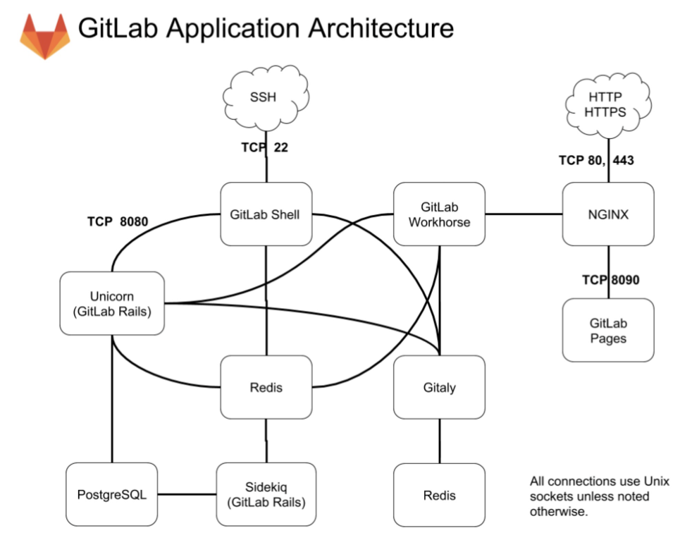
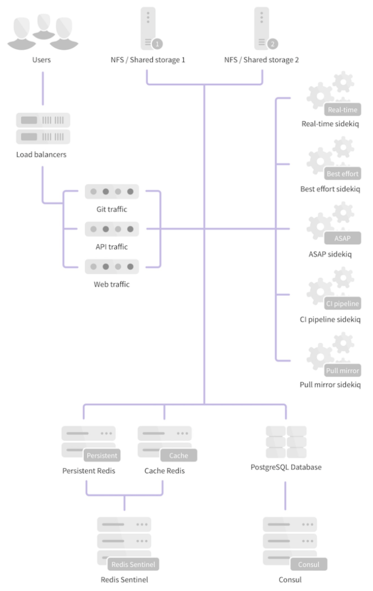
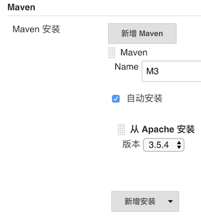
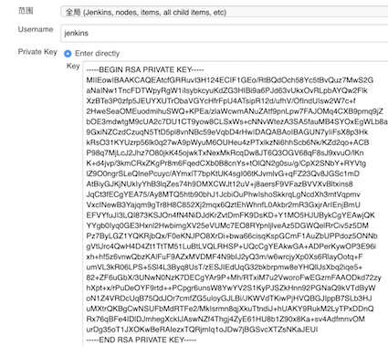
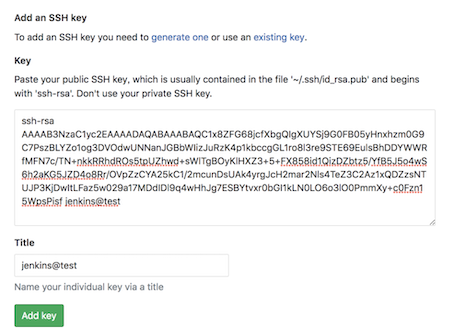
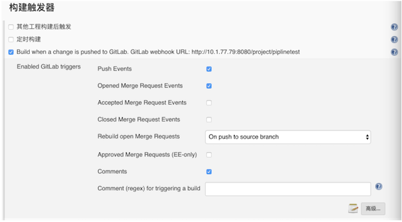

# **L8 实践案例**

## **1 快速构建持续交付系统（一）：需求分析**



在这里，我们要模拟的这个系统，最终表现为移动 App 持续交付体系的形式，需要中间件、业务后台，以及业务客户端这 3 个团队交付产物的协作，才算是完整：

* 首先，用户通过团队 3 交付的移动 App 进行系统操作；
* 其次，移动 App 需要调用团队 2 提供的业务后台服务 War，获取数据和处理业务逻辑；
* 最后，后台服务 War 需要依赖团队 1 提供的业务中间件 Jar，完成底层操作，如配置读取、缓存处理等。

这三个团队的依赖关系和交付产物，也决定了他们要采用不同的交付方式：

* 团队 1，有两类交付方式：
	* 第一类是，中间件服务的交付，使用传统的虚机部署，提供可部署的代码包；
	* 第二类是，中间件组件的交付，使用 Jar 包发布，发布到组件仓库。
* 团队 2 的交付方式是，后台服务使用 Docker 交付，部署在 k8s 集群上。
* 团队 3 的交付方式是，标准的 iOS App 交付。

### **1-1 主体流水线的需求**


整个过程可以大致描述为：代码合并到 master 后能够自动触发对应的集成编译，如编译通过则部署到对应的测试环境下，部署成功后驱动自动化测试，测试通过则分批部署到生产环境。

主体流水线发生的状态变更，都需要通过 E-mail 通知发起人。这里的发起人就是代码提交者和合并审核人。

### **1-2 代码与配置管理相关的需求**

3 个模拟团队的代码分支策略均采用标准的 GitLab Flow 模型，要求是代码通过 code review 后才能合并入 master 分支；合并入 master 分支后，能够触发对应的集成编译。

同时，我们需要**代码静态扫描服务**，帮助我们更好地把控代码质量。这个服务的具体工作形式是：

**这里需要注意的是，整个代码扫描过程是异步进行的，所以在没有得到扫描结果前，主体流水线将继续进行。**

* 如果主体流水线已经执行完，而代码扫描还没结束，也就是还没有得到扫描结果的话，整条流水线需要停下来等待；
* 而如果在执行主体流水线的过程中，代码静态扫描的结果是不通过的话，那么就需要直接中断主体流水线的执行，此次交付宣告失败。


### **1-3 构建与集成相关的需求**

* **首先，能够同时支持传统的部署包、Docker 镜像，以及移动 App 的编译和集成。**
* **其次，所有构建产物及构建历史，都能被有效、永久地记录和存储。**
* **再次，各构建产物有自己独立的版本体系，并与代码 commit ID 相关联。**
* **最后，构建通道必须能够支持足够的并发量。**


### **1-4 打包与发布相关的需求**

整个发布体系，除了要考虑标准的 War 包和 Docke 镜像发布外，我们还要考虑 Jar 包组件的发布。因为团队 1 的 Jar 包对应有两类交付方式，所以对 Jar 包的发布，我们需要做一些特殊考虑：

* 测试环境可以使用 Snapshot 版本，但是生产环境则不允许；
* 即使测试通过，也不一定需要发布 Jar 包的每个版本到生产环境；
* Jar 包是发布到对应的组件仓库，发布形式与其他几类差别（比如，War 包、Docker 镜像等）较大。


### **1-5 自动化测试的需求**


在这里，我们的自动化测试平台，选择的是 TestNG，这也是业界最为流行的自动化测试平台之一。

对于测试，系统需要注意的是，不要有一个测试任务失败就中断交付，最好是跑完所有测试任务，并收集结果。当然，我们可以通过 TestNG 平台，很容易做到这一点。

而模拟团队在持续交付主体流水线的需求下，对各个主要模块还有一些具体的需求：

* 代码与配置：需要 code review，以及静态代码扫描；
* 构建与集成：能同时支持 Jar、War、Docker，以及 App，版本管理可追溯，支持高并发；
* 打包与发布：同时支持 Jar、War、Docker、App 的发布，以及统一的部署标准；
* 自动化测试：通过 TestNG 驱动，实现全自动测试。


## **2 快速构建持续交付系统（二）：GitLab 解决代码管理问题**、

### **2-1 利用 GitLab 搭建代码管理平台**

使用官方的 Docker 镜像或一键安装包 Omnibus 安装 GitLab。

接下来，我就以 Centos 7 虚拟机为例，描述一下整个 Omnibus GitLab 的安装过程，以及注意事项。

在安装前，你需要注意的是如果使用虚拟机进行安装测试，建议虚拟机的“最大内存”配置在 4 G 及以上，如果小于 2 G，GitLab 可能会无法正常启动。


### **2-2 安装 GitLab**

安装 SSH 等依赖，配置防火墙。

```
sudo yum install -y curl policycoreutils-python openssh-server
sudo systemctl enable sshd
sudo systemctl start sshd
sudo firewall-cmd --permanent --add-service=http
sudo systemctl reload firewalld
```

安装 Postfix 支持电子邮件的发送。

```
sudo yum install postfix
sudo systemctl enable postfix
sudo systemctl start postfix
```

从 rpm 源安装，并配置 GitLab 的访问域名，测试时可以将其配置为虚拟机的 IP（比如 192.168.0.101）。

```
curl https://packages.gitlab.com/install/repositories/gitlab/gitlab-ee/script.rpm.sh | sudo bash 
sudo EXTERNAL_URL="http://192.168.0.101" yum install -y gitlab-ee
```

### **2-3 配置 GitLab**

安装完成之后，还要进行一些系统配置。对于 Omnibus GitLab 的配置，我们只需要重点关注两方面的内容：

* 使用命令行工具 gitlab-ctl，管理 Omnibus GitLab 的一些常用命令。 比如，你想排查 GitLab 的运行异常，可以执行 gitlab-ctl tail 查看日志。
* 配置文件 `/etc/gitlab/gitlab.rb`，包含所有 GitLab 的相关配置。邮件服务器、LDAP 账号验证，以及数据库缓存等配置，统一在这个配置文件中进行修改。 比如，你想要修改 GitLab 的外部域名时, 可以通过一条指令修改 `gitlab.rb` 文件：

```
external_url 'http://newhost.com'
```

然后，执行 gitlab-ctl reconfigure 重启配置 GitLab 即可。

关于 GitLab 更详细的配置，你可以[参考官方文档](https://docs.gitlab.com/omnibus/index.html#installation-and-configuration-using-omnibus-package)。

### **2-4 GitLab 的二次开发**

对 GitLab 进行二次开发时，我们可以使用其官方开发环境 gdk（ https://gitlab.com/gitlab-org/gitlab-development-kit）。

但，如果你是第一次进行 GitLab 二次开发的话，我还是建议你按照 https://docs.gitlab.com/ee/install/installation.html 进行一次基于源码的安装，这将有助于你更好地理解 GitLab 的整个架构。

为了后面更高效地解决二次开发的问题，我先和你介绍一下 GitLab 的几个主要模块：

* Unicorn，是一个 Web Server，用于支持 GitLab 的主体 Web 应用；
* **Sidekiq，队列服务，需要 Redis 支持，用以支持 GitLab 的异步任务**；
* GitLab Shell，Git SSH 的权限管理模块；
* Gitaly，Git RPC 服务，用于处理 GitLab 发出的 git 操作；
* GitLab Workhorse，基于 Go 语言，用于接替 Unicorn 处理比较大的 http 请求。




对 GitLab 应用层的修改，我们主要关注的是 GitLab Rails 和 GitLab Shell 这两个子系统。

### **2-5 二次开发的例子**

二次开发，最常见的是对 GitLab 添加一个外部服务调用，这部分需要在 `app/models/project_services` 下面添加相关的代码。

我们可以参考 GitLab 对 Microsoft Teams 的支持方式：


在 `app/models/project_services/microsoft_teams_service.rb` 下，添加一些可配置内容及其属性，这样我们就可以在 GitLab 的 service 模块页面下看到相应的配置项了。

```
# frozen_string_literal: true 
class MicrosoftTeamsService < ChatNotificationService
  def title
    'Microsoft Teams Notification'
  end 
  def description
    'Receive event notifications in Microsoft Teams'
  end 
  def self.to_param
    'microsoft_teams'
  end 
  def help
    'This service sends notifications about projects events to Microsoft Teams channels.<br />
    To set up this service:
    <ol>
      <li><a href="https://msdn.microsoft.com/en-us/microsoft-teams/connectors">Getting started with 365 Office Connectors For Microsoft Teams</a>.</li>
      <li>Paste the <strong>Webhook URL</strong> into the field below.</li>
      <li>Select events below to enable notifications.</li>
    </ol>'
  end 
  def webhook_placeholder
    'https://outlook.office.com/webhook/…'
  end 
  def event_field(event)
  end 
  def default_channel_placeholder
  end 
  def default_fields
    [
      { type: 'text', name: 'webhook', placeholder: "e.g. #{webhook_placeholder}" },
      { type: 'checkbox', name: 'notify_only_broken_pipelines' },
      { type: 'checkbox', name: 'notify_only_default_branch' }
    ]
  end 
  private 
  def notify(message, opts)
    MicrosoftTeams::Notifier.new(webhook).ping(
      title: message.project_name,
      summary: message.summary,
      activity: message.activity,
      attachments: message.attachments
    )
  end 
  def custom_data(data)
    super(data).merge(markdown: true)
  end
end
```

在 `lib/microsoft_teams/notifier.rb ` 内实现服务的具体调用逻辑。

```
module MicrosoftTeams
  class Notifier
    def initialize(webhook)
      @webhook = webhook
      @header = { 'Content-type' => 'application/json' }
    end 
    def ping(options = {})
      result = false 
      begin
        response = Gitlab::HTTP.post(
          @webhook.to_str,
          headers: @header,
          allow_local_requests: true,
          body: body(options)
        ) 
        result = true if response
      rescue Gitlab::HTTP::Error, StandardError => error
        Rails.logger.info("#{self.class.name}: Error while connecting to #{@webhook}: #{error.message}")
      end 
      result
    end 
    private 
    def body(options = {})
      result = { 'sections' => [] }
      result['title'] = options[:title]
      result['summary'] = options[:summary]
      result['sections'] << MicrosoftTeams::Activity.new(options[:activity]).prepare 
      attachments = options[:attachments]
      unless attachments.blank?
        result['sections'] << {
          'title' => 'Details',
          'facts' => [{ 'name' => 'Attachments', 'value' => attachments }]
        }
      end 
      result.to_json
    end
  end
end
```

以上就是一个最简单的 Service 二次开发的例子。熟悉了 Rails 和 GitLab 源码后，你完全可以以此类推写出更复杂的 Service。

### **2-6 GitLab 的 HA 方案**

对于研发人员数量小于 1000 的团队，我不建议你考虑 GitLab 服务多机水平扩展的方案。GitLab 官方给出了一个内存对应用户数量的参照，如下：

> 16 GB RAM supports up to 2000 users 128 GB RAM supports up to 16000 users

从这个配置参照数据中，我们可以看到一台高配的虚拟机或者容器可以支持 2000 名研发人员的操作，而单台物理机（128 GB 配置）足以供上万研发人员使用。

同时，实现 GitLab 的完整水平扩展方案，也并不是一件易事。

GitLab 提供的功能



从整体架构上看，PostgreSQL、Redis 这两个模块的高可用，都有通用的解决方案。而 GitLab 在架构上最大的问题是，需要通过文件系统在本地访问仓库文件。于是，水平扩展时，如何把本地的仓库文件当做数据资源在服务器之间进行读写就变成了一个难题。

官方推荐的方案是通过 NFS 进行多机 Git 仓库共享。但这个方案在实际使用中并不可行，git 本身是 IO 密集型应用，对于真正在性能上有水平扩展诉求的用户来说，NFS 的性能很快就会成为整个系统的瓶颈。我早期在美团点评搭建持续交付体系时，曾尝试过这个方案，当达到几百个仓库的规模时，NFS 就撑不住了。


### **2-7 如何应对代码管理的需求**

 Integrations 包括两部分

* ab service，是在 GitLab 内部实现的，与一些缺陷管理、团队协作等工具的集成服务。
* Webhook，支持在 GitLab 触发代码 push、Merge Request 等事件时进行 http 消息推送。

1. 第一步，创建对应的代码仓库
2. 第二步，配置 Sonar 静态检查
3. 第三步，解决其他设置
	* 经过创建对应的代码仓库、配置 Sonar 静态检查这两步，再配合使用 GitLab 提供的 Merge Request、Issues、CI/CD 和 Integration 功能，代码管理平台基本上就算顺利搭建完毕了。

## **3 快速构建持续交付系统（三）：Jenkins 解决集成打包问题**

### **3-1 Jenkins 的安装与配置**

**第一步，安装 Jenkins**

为了整个持续交付体系的各个子系统之间的环境的一致性，我在这里依然以 Centos 7 虚拟机为例，和你分享 Jenkins 2.138（最新版）的安装过程。假设，Jenkins 主机的 IP 地址是 10.1.77.79。

* 安装 Java 环境

```
 yum install java-1.8.0-openjdk-devel
```

* 更新 rpm 源，并安装 Jenkins 2.138

```
rpm --import https://pkg.jenkins.io/redhat-stable/jenkins.io.key
wget -O /etc/yum.repos.d/jenkins.repo https://pkg.jenkins.io/redhat-stable/jenkins.repo
yum install jenkins
```

**第二步，配置 Jenkins 对 GitLab 的访问权限**

Jenkins 安装完成之后，我们还需要初始化安装 Jenkins 的一些基础配置，同时配置 Jenkins 对 GitLab 的访问权限。

在新版的 Jenkins 中，第一次启动时会有一个初始化向导，引导你设置用户名、密码，并安装一些插件。

在这里，我推荐你勾选“安装默认插件”，用这种方式安装 Pipline、 LDAP 等插件。如果这个时候没能选择安装对应的插件，你也可以在安装完成后，在系统管理 -> 插件管理页面中安装需要的插件。

那么如何才能使编译和 GitLab、SonarQube 整合在一起呢？这里，我以一个后台 Java 项目为例，对 Jenkins 做进一步的配置，以完成 Jenkins 和 GitLab、SonarQube 的整合。这些配置内容，主要包括：

* 配置 Maven；
* 配置 Jenkins 钥匙；
* 配置 GitLab 公钥；
* 配置 Jenkins GitLab 插件。

**配置 Maven**

进入系统管理 -> 全局工具配置页面，安装 Maven，并把名字设置为 M3。


这样配置好 Maven 后，Jenkins 就会在第一次使用 GitLab 时，自动安装 Maven 了。




**配置 Jenkins 钥匙**

配置 Jenkins 钥匙的路径是：凭据 -> 系统 -> 全局凭据 -> 添加凭据。



然后，将你的私钥贴入并保存


**配置 GitLab 公钥**

在 GitLab 端, 进入 `http://{Gitlab Domain}/profile/keys`，贴入你的公钥并保存



通过配置 Jenkins 钥匙，以及配置 GitLab 公钥两步，你就已经完成了 Jenkins 对 GitLab 仓库的访问权限配置。

**配置 Jenkins GitLab 插件**

Jenkins 的 GitLab-plugin 插件的作用是，在代码提交和 Merge Request 时触发编译。安装这个插件的方法是：进入 Jenkins 的系统管理 -> 插件管理页面，选择 GitLab Plugin 安装。

Jenkins 重启后，选择凭据 -> 系统 -> 全局凭据 -> 添加凭据，再选择 GitLab API Token。然后，将 `http://10.1.77.79/profile/personal_access_tokens` 中新生成的 `access token` 贴入 `GitLab API Token`，并保存。

### **3-2 使用 Jenkins Pipeline 构建工作流**

接下来，我就和你分享一下如何编写 Jenkins Pipeline，以及从代码编译到静态检查的完整过程。这个从代码编译到静态检查的整个过程，主要包括三大步骤：

* 第一步，创建 Jenkins Pipeline 任务；
* 第二步，配置 Merge Request 的 Pipeline 验证；
* 第三部，编写具体的 Jenkins Pipeline 脚本。

首先，在 Jenkins 中创建一个流水线任务，并配置任务触发器



然后，在 GitLab 端配置 Webhook。配置方法为：在 GitLab 项目下的 settings->Integrations 下配置并勾选 “Merge request events”选项。

经过这些配置后， 每次有新的 Merge Request 被创建或更新，都会触发 Jenkins 的 Pipeline，而再由自定义的 Pipeline 脚本完成具体任务，比如代码扫描任务。

* **配置 Merge Request 的 Pipeline 验证**

在驱动代码静态扫描之后，我们还要做一些工作，以保证扫描结果可以控制 Merge Request 的行为。

进入 `settings->Merge Request` 页面, **勾选“Only allow Merge Requests to be merged if the pipeline succeeds”**。这个配置可以保证，在静态检查任务中，不能合并 Merge Request。

* **编写具体的 Pipeline 脚本**

然后我们再一起看一下为了实现我们之前的需求，即获取代码 - 编译打包 - 执行 Sonar 静态代码检查和单元测试等过程。

Jenkins 端的 Pipeline 脚本如下，同时我们需要将该脚本配置在 Jenkins 中

```
node {
   def mvnHome 
   # 修改 Merge Request 的状态，并 checkout 代码
   stage('Preparation') { // for display purposes
      mvnHome = tool 'M3'
      updateGitlabCommitStatus name: 'build', state: 'running'
      checkout scm
  } 
   # 执行 Maven 命令对项目编译和打包
   stage('Build') {
      echo 'Build Start'
      // Run the maven build
      sh "'${mvnHome}/bin/mvn' -Dmaven.test.skip=true clean package"
   } 
   # 启动 sonar 检查，允许 junit 单元测试，获取编译产物，并更新 Merge request 的状态
   stage('Results') {
      // Run sonar 
      sh “'${mvnHome}/bin/mvn' org.sonarsource.scanner.maven:sonar-maven-plugin:3.2:sonar”
      junit '**/target/surefire-reports/TEST-*.xml'
      archive 'target/*.war'
      updateGitlabCommitStatus name: 'build', state: 'success'
   }
}
```


* **第一个 stage：**

从 GitLab 中获取当前 Merge Request 源分支的代码；同时，通 Jenkins GitLab 插件将 Merge Request 所在的分支的当前 commit 状态置为 running。

这个时候，我们可以在 GitLab 的页面上看到 Merge Request 的合并选项已经被限制了，


* 第二个 stage：

比较好理解，就是执行 Maven 命令对项目编译和打包。

* 第三个 stage：

通过 Maven 调用 Sonar 的静态代码扫描，并在结束后更新 Merge Request 的 commit 状态，使得 Merge Request 允许被合并。同时将单元测试结果展现在 GitLab 上。

比如，我们在 Sonar 检测之后，可以调用 Sonar 的 API 获取静态检查的详细信息；然后，调用 GitLab 的 API，将静态检查结果通过 comment 的方式，展现在 GitLab 的 Merge Request 页面上，从而使整个持续集成的流程更加丰满和完整。

## **4.  快速构建持续交付系统（四）：Ansible 解决自动部署问题**

### **4-1 利用 Ansible 完成部署**

与其他三大主流的配置管理工具 Chef、Puppet、Salt 相比，Ansible 最大的特点在于“agentless”，即无需在目标机器装安装 agent 进程，即可通过 SSH 或者 PowerShell 对一个环境中的集群进行中心化的管理。

**Ansible 安装**

```
sudo pip install Ansible
```

提交一个 Ansible 的 Inventory 文件 hosts，该文件代表要管理的目标对象：

```
$ cat hosts
[Jenkinsservers]
10.1.77.79
```

打通本机和测试机的 SSH 访问：

```
$ ssh-copy-id deployer@localhost
```

尝试远程访问主机 10.1.77.79

```
$ Ansible -i hosts  all -u deployer -a "cat /etc/hosts” 
10.1.77.79 | SUCCESS | rc=0 >>
127.0.0.1   localhost localhost.localdomain localhost4 localhost4.localdomain4
::1         localhost localhost.localdomain localhost6 localhost6.localdomain6
```

如果返回 SUCCESS，则表示我们已经可以通过 Ansible 管理该主机了。


### **4-2 Ansible 使用**

**1. Inventory**

对于被 Ansible 管理的机器清单，我们可以通过 Inventory 文件，分组管理其中一些集群的机器列表分组，并为其设置不同变量。

比如，我们可以通过 `Ansible_user` ，指定不同机器的 Ansible 用户。

```
[Jenkinsservers]
10.1.77.79 Ansible_user=root
10.1.77.80 Ansible_user=deployer
[Gitlabservers]
10.1.77.77
```

**PlayBook**

PlayBook 是 Ansible 的脚本文件，使用 YAML 语言编写，包含需要远程执行的核心命令、定义任务具体内容，等等。

```
---
- hosts: webservers
 remote_user: root 
 tasks:
 - name: ensure apache is at the latest version
 yum:
 name: httpd
 state: latest
 - name: write the apache config file
 template:
 src: /srv/httpd.j2
 dest: /etc/httpd.conf
- hosts: databases
 remote_user: root 
 tasks:
 - name: ensure postgresql is at the latest version
 yum:
 name: postgresql
 state: latest
 - name: ensure that postgresql is started
 service:
 name: postgresql
 state: started
```

这段代码的最主要功能是，使用 yum 完成了 Apache 服务器和 PostgreSQL 的安装。

其中，包含了编写 Ansible PlayBook 的三个常用模块。

* yum 调用目标机器上的包管理工具完成软件安装 。Ansible 对于不同的 Linux 操作系统包管理进行了封装，在 CentOS 上相当于 yum， 在 Ubuntu 上相当于 APT。
* Template 远程文件渲染，可以把本地机器的文件模板渲染后放到远程主机上。
* Service 服务管理，同样封装了不同 Linux 操作系统实际执行的 Service 命令。

**通常情况下，我们用脚本的方式使用 Ansible，只要使用好 Inventory 和 PlayBook 这两个组件就可以了，即：使用 PlayBook 编写 Ansible 脚本，然后用 Inventory 维护好需要管理的机器列表**。这样，就能解决 90% 以上使用 Ansible 的需求。

**使用 Ansible 进行 Java 应用部署**

```
---
- hosts: Tomcat_server
 roles:
 - { role: Ansible-Tomcat }
```

**然后，部署具体的业务代码。**

完成这个需求，我们只需要通过 Ansible 的 SCP 模块把 War 包从 Jenkins 推送到目标机器上即可。

```
- name: Copy a war file to the remote machine 
  copy:
    src: /tmp/waimai-service.war
    dest: /opt/Tomcat/webapps/waimai-service.war
```

所以，此时更好的做法是直接在部署本地从仓库下载 War 包。
 
**最后，重启 Tomcat 服务，整个应用的部署过程就完成了。**


