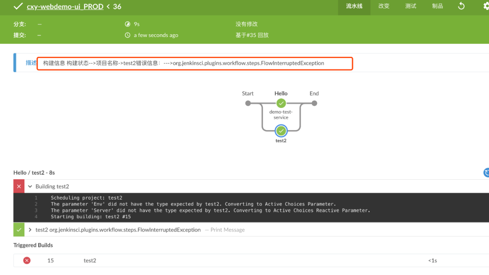

# **第十节 微服务模式下如何实现多模块并行构建发布**

在微服务项目中具有很多个服务模块，为了便于管理需要将项目规范化，使用GitLabGroup管理整个项目，每个project对应一个微服务，每个微服务对应一个Jenkins job。开始发布的时候需要我们在手动选择各个服务然后发布。模块很多的时候就不太方便了。

创建一个Jenkins项目用来统一管理，绑定GitLab group信息，然后调用Gitlab接口获取project信息。用户选择要发布的微服务，然后根据服务名称并行触发每个要发布服务的流水线进行构建和发布。

我们先来看看如何使用pipeline中的parallel语法，**这里列举了两个例子：并行任务、并行阶段**。

## 并行任务

首先我们需要定义每个任务的名称和对应的操作，可以通过一个Map类型参数实现。

**在这里定义了一个空的map，然后为这个map增加了两个任务分别为`build01`和`build02`，它们的操作是执行shell命令。**

最后通过parallel运行。

```
def tasks = [:]

//定义要并行的任务名称和任务
tasks["build01"] =  {sh "ls"} 
tasks["build02"] =  {sh "ls"}

//并行
parallel tasks
```

## 并行阶段

并行stage也是一种经常用到的运行方式，我们可以使用这种方式解决不必要的时间浪费，尤其在各个平台运行自动化测试的时候，我们不必等到windows平台验证完成再进行Linux系统中的验证。而是直接在各个平台中同时运行，加快了测试的速度。

**我们还可以使用failFast参数配置当其中一个任务失败其他任务是否一样失败，参数值为布尔类型（true false）**。

这个例子是jenkins官方提供的，大概的内容是并行在不同系统环境下进行自动化测试。

```
pipeline {
      agent none
      stages {
            stage('Run Tests') {
              parallel {
                  stage('Test On Windows') {
                      agent {
                          label "windows"
                      }
                      steps {
                          bat "run-tests.bat"
                      }
                      post {
                          always {
                              junit "**/TEST-*.xml"
                          }
                      }
                  }
                  stage('Test On Linux') {
                      agent {
                          label "linux"
                      }
                      steps {
                          sh "run-tests.sh"
                      }
                      post {
                          always {
                              junit "**/TEST-*.xml"
                          }
                      }
                  }
              }
          }
      }
}
```

## **主控Job实现**

首先我们用静态数据来存储要发布的项目名称存储为一个List，定义一个Map用来存储并行任务。**定义buildStatus展示项目错误信息（这里做了信息格式化**）。

使用build进行项目触发。这里会把每个失败的任务存储展示到流水线日志中。

```
def jobs = ["test2","demo-test-service"]
def parallelMap = [:]
def buildStatus = [:]


jobs.each{ 
    println(it)

    parallelMap[it] = {
        try {
            build job: "${it}", 
            parameters: [string(name: 'branchName', value: 'Dev')]
        } catch(e){
            println("${it}  " + e)
            buildStatus[it] = e
        }
    }
}

parallel parallelMap

//判断状态

for ( i in buildStatus.keySet()){
     currentBuild.description = "构建信息"
     currentBuild.description += ("\n项目名称->"  + i  + "错误信息：->"+ buildStatus[i])
}
```

运行效果



基本上每个模块对应一个pipeline项目。有时候我们需要设置一个集中控制项目来根据设置的参数有序触发各个模块服务对应的流水线进行发布。在各个模块之间没有发布顺序的时候，我们可以使用Pipeline的Parallel语法进行项目的并行构建。加快发布速度，减少重复手工操作成本。