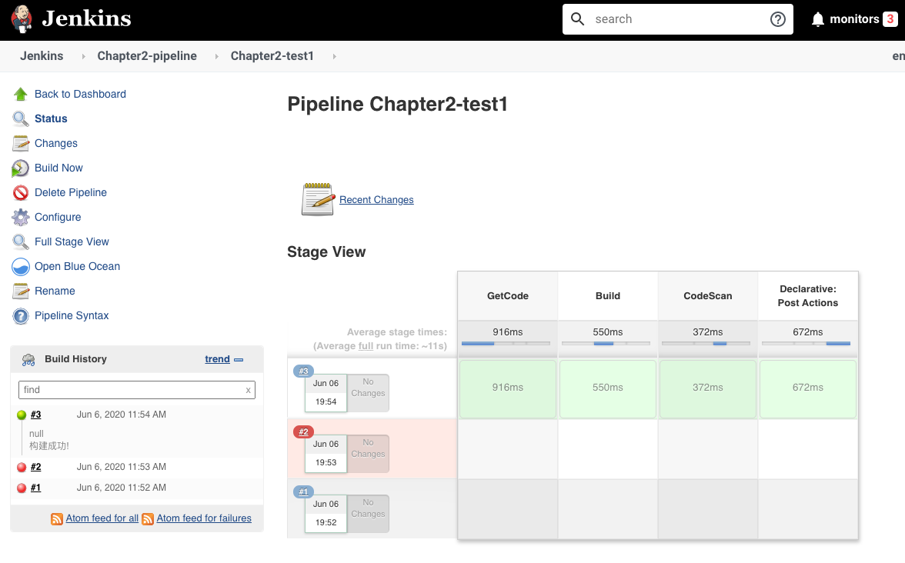
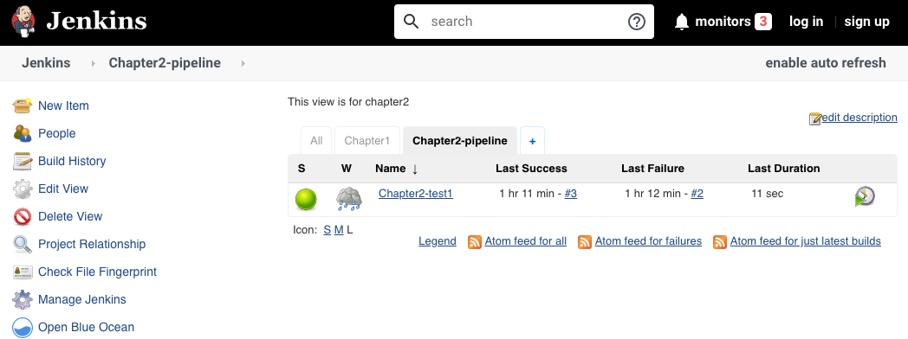

# 第一节 编写 Jenkinsfile 运行流水线

### 本节介绍
一条流水线通过一个 `Jenkinsfile` 文件进行描述，分成脚本式和声明式两种方式。

一个 `Jenkinsfile` 文件的组成：

* 指定 node 节点/ workspace
* 指定运行的选项
* 指定 stages 阶段
* 指定构建后的操作

## 1. 认识Pipeline

### 1-1 Pipeline是什么？

* `Pipeline`是`Jenkins`的核心功能，提供一组可扩展的工具。
* 通过`Pipeline` 的`DSL`语法可以完成从简单到复杂的交付流水线实现。
* `jenkins`的`Pipeline`是通过`Jenkinsfile`（文本文件）来实现的。
* 这个文件可以定义Jenkins的执行步骤，例如检出代码。

### 1-2 Jenkinsfile

* Jenkinsfile使用两种语法进行编写，分别是**声明式**和**脚本式**。
* **声明式和脚本式的流水线从根本上是不同的**。
* 声明式是`jenkins`流水线更友好的特性。
* **脚本式的流水线语法，提供更丰富的语法特性**。
* **声明式流水线使编写和读取流水线代码更容易设计。**

### 1-3 为什么使用Pipeline？

本质上，`jenkins`是一个自动化引擎，它支持许多自动模式。

流水线向`Jenkins`添加了一组强大的工具，支持用例、简单的持续集成到全面的持续交付流水线。 通过对一系列的发布任务建立标准的模板，用户可以利用更多流水线的特性，比如： 

- **代码化**: 流水线是在代码中实现的，通常会存放到源代码控制，使团队具有编辑、审查和更新他们项目的交付流水线的能力。 
- **耐用性**：流水线可以从`Jenkins`的`master`节点重启后继续运行。 
- **可暂停的**：流水线可以由人功输入或批准继续执行流水线。 - 解决复杂发布： 支持复杂的交付流程。例如循环、并行执行。 
- **可扩展性**： 支持扩展DSL和其他插件集成。


### 1-4 Pipeline 定义

* 一条流水线通过`Jenkinsfile`描述 
* 安装声明式插件`Pipeline: Declarative` 
* `Jenkinsfile`组成 
	* 指定`node节点／workspace` 
	* 指定指定运行选项 
	* 指定`stages`阶段 
	* 指定构建后操作 

**Agent-Options**

* 指定`node`节点`/workspace`
* 指定运行选项

* **声明式`Pipeline`: 使用`agent`指定运行的`slave`节点可以是`label`。**

```
pipeline{
	agent any
	stages{
   	//    
	}
}
```

**脚本式`Pipleine`： 使用`node`指定运行`slave`可以是`label`。**

```
node("slave"){
	stage("GetCode"){
    //
	}
}
```

**Stages**

* `stage`定义了在整个流水线的执行任务的概念性的不同的阶段。例如： `GetCode`、`Build`、`Test`、`Deploy`、`CodeScan`每个阶段。

* 解释：在这里我添加了三个阶段 
	* GetCode 
	* Build 
	* CodeScan 

* 声明式`pipeline`： 定义`stages->stage`。

```
pipeline{
	agent any
	stages{
    stage("GetCode"){
        //steps  
    }
        
    stage("build"){
       //step
    }
  }
}
```

* 脚本式`Pipeline`: 直接使用`stage`。

```
node("slave"){
	stage("GetCode"){
    //
	}
    
	stage("build"){
    //
	}
}
```

**step(步骤)**

* `step`是每个阶段中要执行的每个步骤。例如： 在执行`GetCode`的时候需要判断用户提供的参数`srcType`的值是`Git`还是`svn`。

```
pipeline{
agent any
stages{
    stage("GetCode"){
        steps{ 
            sh "ls "    //step
        	} 
    	}    
	}
}
```

* 脚本式`Pipeline`： 不需要`step`关键字。

```
node("slave"){
stage("GetCode"){
    //step
    if("${srcType}" == "Git"){
        //用git方式代码检出
    } else if ("${srcType}" == "SVN"){
        //用svn方式代码检出
    } else {
        error "srcType is not in [Git|SVN]"
    }
}
}
```

**Post**

* 指定构建后操作 
* 解释： 
	* `always{}`：总是执行脚本片段 
	* `success{}`：成功后执行
	*  `failure{}`：失败后执行 
	*  `aborted{}`：取消后执行 

* `currendBuild`是一个全局变量 
	* `description`：构建描述 

```
String workspace = "/home/vagrant/workspace" 

//Pipeline 
pipeline {
	agent { node { label "master"   //指定运行节点的标签或者名称
					 customWorkspace "${workspace}" //指定运行工作目录（可选）
			}
	}

	options { 
		timestamps() 	//日志会有时间
		skipDefaultCheckout()  //删除隐式checkout scm 语句
		disableConcurrentBuilds()  //静止并行
		timeout(time: 1, unit: 'HOURS')  //流水线超时设置1h
	}

	stages { 
	//下载代码
		stage("GetCode"){   //阶段名称
			steps{   //名称
				timeout(time:5, unit:"MINUTES"){   //步骤超时时间
					script{	  //填写运行代码
						println('获取代码') 
					} 
				} 
			} 
		}
	   //构建
		stage("Build"){ 
			steps{
				timeout(time:20, unit:"MINUTES"){ 
					script{ 
						println('应用打包')
					}
				} 
			}
		}

		//代码扫描
		stage("CodeScan"){
			steps{ 
				timeout(time:30, unit:"MINUTES"){ 
					script{ 
						print('代码扫描')
					} 
				}
			}
		}
	} 

	//构建后操作
	post {
		always { 
			script{ 
				println("always") 
			} 
		} 

		success {
			script{
				currentBuild.description += "\n 构建成功!" 
			} 
		}

		failure {
			script{ 
				currentBuild.description += "\n 构建失败!" 
			} 
		}

		aborted { 
			script{ 
				currentBuild.description += "\n 构建取消!" 
			} 
		} 
	} 
}
```





### 相关文档


* [Building Continuous Delivery pipelines with Jenkins2(Scripted vs. declarative pipeline)](https://github.com/Chao-Xi/JacobTechBlog/blob/master/jenkins/8Jenkins_basic_pipelineascode.md)