# **第二节 声明式流水线语法**

### 本节介绍

声明式 `Pipeline` 是最近添加到 Jenkins 流水线的，它在流水线子系统之上提供了一种更简单，更有主见的语法。 所有的声明式`Pipeline`都必须包含一个 `pipeline`块中，比如：

```
pipeline {
    //run
}
```

在声明式 `Pipeline` 中的基本语句和表达式遵循 `Groovy`的语法。但是有以下例外：

* 流水线顶层必须是一个块，特别是`pipelin{}`。
* 不需要分号作为分割符，是按照行分割的。
* 语句块只能由阶段、指令、步骤、赋值语句组成。例如: `input`被视为`input()`。


## 1-1 agent(代理)

agent 指定了流水线的执行节点。

**参数：**

* `any` 在任何可用的节点上执行`pipeline`。
* **`none` 没有指定`agent`的时候默认。**
* `label` 在指定标签上的节点上运行`Pipeline`。

`node` 允许额外的选项。

这两种是一样的

```
这两种是一样的
agent { node { label 'labelname' }}
agent { label ' labelname '}
```

### 1-1-1 agent部分详解

`agent`部分描述的是整个`pipeline`或在特定阶段执行任务时所在的`agent`。换句话说，`Jenkins master`根据此`agent`部分决定将任务分配到哪个`agent`上执行。`agent`部分必须在`pipeline`块内的顶层定义，而`stage`块内的定义是可选的。 

`agent any`告诉`Jenkins master`：任何可用的`agent`都可以执行。 

**`agent`部分的定义可以放在阶段中，用于指定该`stage执`行时的`agent`**

```
pipeline { 
	agent any 
	stages { 
		stage('Build') { 
			agent any 
			steps { 
				echo "build" 
			} 
		} 
	} 
}
```

**通过标签指定agent**

当`pipeline`需要在`JDK8`环境下进行构建时，就需要通过标签来指定`agent`。代码如下： 

```
pipeline 
{ 
	agent { 
		label 'jdk8' 
	} 
	stages { 
		stage('Build') { 
			steps { 
				echo "build" 
			} 
		} 
	} 
}
```

事实上，`agent｛label 'jdk8'｝`是以下定义方式的简略写法。 

```
agent｛
	node {
		label 'jdk8'
	}
｝
```

多`label`环境下同时执行，有`windows`和`jdk8`标签的`agent`

```
agent{
	label 'jdk8 && windows' 
}
```

上文中，在增加`agent`时，已配置好了该`agent`的默认工作目录路径，但是`agent`部分允许我们对工作目录进行自定义。 `node`除了`label`选项，还提供了另外一个选项`customWorkspace,`自定义工作目录，写法如下： 

```
agent { 
	node { 
		label 'jdk8' 
		customWorkspace '/var/lib/custom' 
	} 
} 
```

`customWorkspace`选项除了写绝对一路径， 还可以写相对于默认工作目录路径的相对路径。

**`when`指令的`beforeAgent`选项**

在默认情况下，阶段内所有的代码都将在指定的`Jenkins agent`上执行：`when`指令提供了一个`beforeAgent`选项，当它的值为`true`时， 只有符合`when`条件时才会进入该`Jenkins agent`，这样就可以避免没有必要的工作空间的分配， 也就不需要等待可用的`Jenkins agent`了。 

在某些场景下，`beforeAgent`选项通常用于加速`pipeline`的执行。示例如下： 

```
pipeline { 
	agent none 
	stages {
		 stage('Example Build') { 
		 	steps { 
		 	echo 'Hello World' 
		}
	} 
	stage('Example Deploy') { 
		agent { 
			label "some-label" 
		} 
		when { 
			beforeAgent true 
			branch 'production' 
			} 
			steps { 
				echo 'Deploying' 
			} 
		} 
	}
} 
```
只有分支为`production`时，才会进人`“Example Deploy”`阶段。这样就可以避免在`some-label `
的`agent`中拉取代码，从而达到加速`pipeline`执行的目的。 


### 1-1-2 将构建任务交给Docker 


目前我们所有的构建都执行在机器上，接下来介绍如何让构建执行在`Docker` 容器中。
 
`Jenkins master`要将构建任务分配给`Docker`, 就必须在`Jenkins agent`上安装`Docker`。建议给 
这些`agent`打上`docker`的标签。 

```
pipeline {
    agent {
        docker { image 'node:7-alpine' }
    }
    stages {
        stage('Test') {
            steps {
                sh 'node --version'
            }
        }
    }
}
```

```
[Pipeline] {
[Pipeline] stage
[Pipeline] { (Test)
[Pipeline] sh
+ node --version
v7.10.1
[Pipeline] }
[Pipeline] // stage
[Pipeline] }
$ docker stop --time=1 1a245bfd1f49c695d450bd776ff6353b39be57db4c37af9a457e3a27baf9f5d7
```


与之前不同的，在`agent`部分我们将`node`换成了`docker`。下面分别解释`docker`的常用选项。

* `label`（可选）：字符串类型，与`node`的`label`的作用一样。 
* image：字符串类型，指定构建时使用的`Docker`镜像。 
* `args`（可选）：字符串类型，`Jenkins`执行`docker run`命令时所带的参数，如`args '-v /tmp:/tmp'`。
* `aiwaysPull`（可选）：布尔类型，强制每次执行`docker pull`命令时都重新拉取镜像。 


### 1-1-3 配置`Docker`私有仓库 

`Docker` 拉取镜像时，默认是从`Docker`官方中心仓库拉取的。那么如何实现从私有仓库拉取呢？

`Docker`插件为我们提供了界面操作，具体步骤如下： 

进人`Manage Jenkins` -> `Configure System`页面，找到`“Declarative Pipeline(Docker)”`部分

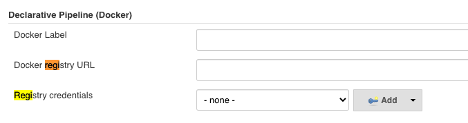 

* `Docker Label`：当`pipeline`中的`agent` 部分没有指定`label`选项时，就会使用此配置
* `Docker registry URL` : `Docker`私有仓库地址。 
* `Registry credentials`：登录`Docker`私有仓库的凭证。 


## 1-2 post

定义一个或多个`steps` ，这些阶段根据流水线或阶段的完成情况而运行(取决于流水线中`post`部分的位置). `post` 支持以下 `post-condition` 块中的其中之一: `always`, `changed`, `failure,` `success`, `unstable`, 和` aborted`。这些条件块允许在 `post` 部分的步骤的执行取决于流水线或阶段的完成状态。

* `always` 无论流水线或者阶段的完成状态。
* `changed` 只有当流水线或者阶段完成状态与之前不同时。
* `failure` 只有当流水线或者阶段状态为”failure”运行。
* `success` 只有当流水线或者阶段状态为”success”运行。
* `unstable` 只有当流水线或者阶段状态为”unstable”运行。例如：测试失败。
* `aborted` 只有当流水线或者阶段状态为”aborted “运行。例如：手动取消。
* `cleanup` 清理条件块。不论当前完成状态是什么，在其他所有条件块执行完成后都执行。 

`post`部分可以同时包含多种条件块。以下是`post`部分的完整示例。 

```
pipeline {
agent any
stages {
    stage('Example') {
        steps {
            echo 'Hello World'
        }
        post {
        	always {
        		echo "stage post always"
        	}
        }
    }
}
post { 
    always { 
        echo 'I will always say Hello again!'o
    }
}
}
```

## 1-3 stages(阶段)

包含一系列一个或多个` stage` 指令, 建议 `stages` 至少包含一个` stage` 指令用于连续交付过程的每个离散部分,比如构建, 测试, 和部署。

```
pipeline {
    agent any
    stages { 
        stage('Example') {
            steps {
                echo 'Hello World'
            }
        }
    }
}
```

## 1-4 steps(步骤)

step是每个阶段中要执行的每个步骤。

```
pipeline {
    agent any
    stages {
        stage('Example') {
            steps { 
                echo 'Hello World'
            }
        }
    }
}
```

## 1-5 指令

### 1-5-1 environment

`environment` 指令指定一个键值对序列，该序列将被定义为所有步骤的环境变量，或者是特定于阶段的步骤，这取决于 `environment` 指令在流水线内的位置。

该指令支持一个特殊的方法 `credentials() `，该方法可用于在`Jenkins`环境中通过标识符访问预定义的凭证。对于类型为 `“Secret Text”`的凭证,`credentials()` 将确保指定的环境变量包含秘密文本内容。对于类型为 `“SStandard username and password”`的凭证, 指定的环境变量指定为 `username:password `，并且两个额外的环境变量将被自动定义 :分别为 `MYVARNAME_USR `和 `MYVARNAME_PSW` 。

```
pipeline {
    agent any
    environment { 
        CC = 'jxi'
    }
    stages {
        stage('Example') {
            environment { 
                AN_ACCESS_KEY = credentials('my-prefined-secret-text') 
            }
            steps {
                sh 'printenv'
            }
        }
    }
}
```


环境变量可以被有作是`pipeline`与`Jenkins`交互的媒介。比如，刚以任`pipeline`中通过`BUILD NUMBER`变量知道构建任务的当前构建次数。环境变量可以分为Jenkins内置变量和自定义变量。

**Jenkins内置变量**

在`pipeline`执行时，`Jenkins`通过一个名为`env`的全局变量，将`Jenkins`内置环境变量暴露出来。其使用方法有多种，示例如下： 

```
pipeline { 
	agent any 
	stages { 
		stage('Example') { 
			steps {
				 echo "Running ${env.BUILD_NUMBER1} on ${env.JENKINS_URL}"  //方法 一
				 echo "Running $env.BUILD_NUMBER on $env.JENKINS_URL" //方法 二
				 echo "Running ${BUILD_NUMBER} on ${JENKINS_URL}" //方法 三
			}
		}
	}
}
```

默认`env`的属性可以直接在`pipeline`中引用。所以以上方法都是合法的。**但是不推荐方法三因为出现变量冲突时非常难查在问题** 


那么。`env`变从那有哪此可用属性呢？通过访问的`<Jenkins master的地址>/pipeline-syntax/globalenv`来获取完整列表在列表中。当一个变量声明为`”For a multibranch project"`时, 代表只有多分支项目才会有此变量 

下面我们简单介绍几个在实陈工作中经常用到的变量 

* `BUILD_NUMBER`:构建号，累加的数字。在打包时它可作为制品名称的一部分比如`server-2.jar` 
* `BRANCH_NAME`:多分支`pipeline`项目支持。当需要根据不同的分支做不同的事情时就会用到， 比如通过代码将代码将`release`分支发布到生产环境中、`master`分支发布到测试环境中 
* `BUILD_URL`:当前构建页面的`URL`。如果构建失败则需要将失败的构止链接放到邮件通知中，这个链接就可以是`BUILD_URL` 
* `GIT_BRANCH`:通过`git`拉取的源码构建的项目才会有此变最 

**在使用`env`变量时， 需要注意不同类型的项目，`env`变量从所包含的变量及其值是不一样的。 比如普通`pipeline`务中的`GIT_BRANCH`变量的值为`origin/master`,而在多分支`pipeline`任务中`GIT_BRANCH`变量的值为`master`**

> 小技巧：在调试`pipeline`时可以在开始阶段加一句：`sh 'printenv'`时变量的属性值打印出来。这样可以帮助我们避免不少问题 

**自定义`piepline`环境变量**

当`piepline`变得复杂时, 我们就会有定义自己的环境变量的需求。声明式`piepline`提供了`environment`指令方便自定义变是。比如 

```
pipeline { 
	agent any 
	environment {
		CC = 'clang'
	} 
 stages { 
	 	stage('Example') { 
	 		environment {
	 			DEBUG_FLAGS = '-g'
	 		}
	 		steps { 
	 			echo "${CC} ${DEBUG_FLAGS}" 
	 			sh 'printenv' 
	 		} 
		} 
	} 
} 
```	

```
printenv
JENKINS_NODE_COOKIE=591de548-b216-498b-8221-26ae09ca063d
XDG_SESSION_ID=4
BUILD_URL=http://192.168.33.11:8080/job/Chapter2-6env/2/
HOSTNAME=jabox
TERM=xterm-256color
SHELL=/bin/bash
HUDSON_SERVER_COOKIE=ec6f20ac1eab6177
HISTSIZE=1000
STAGE_NAME=Example
SSH_CLIENT=172.16.72.2 51333 22
BUILD_TAG=jenkins-Chapter2-6env-2
SSH_TTY=/dev/pts/1
...
LANG=en_US.UTF-8
JOB_NAME=Chapter2-6env
BUILD_DISPLAY_NAME=#2
BUILD_ID=2
JENKINS_URL=http://192.168.33.11:8080/
HISTCONTROL=ignoredups
JOB_BASE_NAME=Chapter2-6env
HOME=/home/vagrant
SHLVL=3
EXECUTOR_NUMBER=3
```

另外，`environment`指令可以在`pipeline`中定义，代表变量作用域为整个`pipeline`；也可以在`Stage`中定义，代表变量只在该阶段有效。 


但是这些变量都不是跨`pipeline`的，比如`pipeline a`访问不到`pipeline b`的变量。在`pipeline`之间共享变量可以通过参数化`pipeline`来实现。

在实际工作中，还会遇到一个环境变量引用另一个环境变量的情况。在 `environment`中可以这样定义： 

```
environment ( 
	_server_name = 'mail—server' 
	_version = "${BUILD_NUMBER}" 
	_artifact_name = "${_server_name}—S{_VERSION}.jar" 
```
值得注意的是如果在`environment`中定义的变量与`env`中的变量重名那么被重名的变量的值会被攫盖掉。比如在`environment`中定义`PATH`变量(`PATH`也是`env`中的一个变量）。

```
environment ( 
	PATH="invalid path"
}
``` 

执行`sh`时，就会报错

**自定义全局环境变量**

`env`中的变欣都是`Jenkins`内置的或者是与具体`plpeline`相关的。有时候我们需要定义一些全局的跨`plpeline `的自定义变量

进入`Manage Jenkins -> Configure System -> Global properties`页，勾选`"Environment variables"`

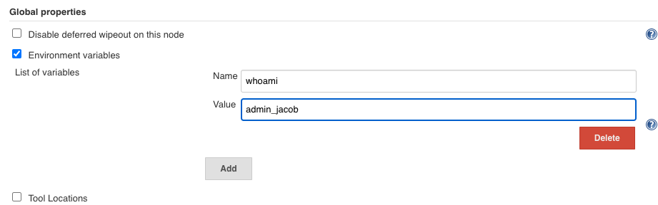 

自定义全局环境变童会被加人`env`属性列表中，所以使用自定义全局环境变量与使用`Jenkins`内置变量的方法无异：`${env. whomai} `

```
echo "whomai: ${env.whoami}"
```
```
whomai: admin_jacob
```

### 1-5-2 options

`options` 指令允许从流水线内部配置特定于流水线的选项。 流水线提供了许多这样的选项, 比如`buildDiscarder`,但也可以由插件提供, 比如 `timestamps`。

* `buildDiscarder`: 为最近的流水线运行的特定数量保存组件和控制台输出。
* `disableConcurrentBuilds`: 不允许同时执行流水线。 可被用来防止同时访问共享资源等。
* `overrideIndexTriggers:` 允许覆盖分支索引触发器的默认处理。
* `skipDefaultCheckout`: 在`agent` 指令中，跳过从源代码控制中检出代码的默认情况。
* `skipStagesAfterUnstable`: 一旦构建状态变得`UNSTABLE`，跳过该阶段。
* `checkoutToSubdirectory`: 在工作空间的子目录中自动地执行源代码控制检出。
* `timeout:` 设置流水线运行的超时时间, 在此之后，`Jenkins`将中止流水线。
* `retry`: 在失败时, 重新尝试整个流水线的指定次数。

* `timestamps` 预测所有由流水线生成的控制台输出，与该流水线发出的时间一致。


```
//指定一个小时的全局执行超时, 在此之后，Jenkins将中止流水线运行。
pipeline {
agent any
options {
    timeout(time: 1, unit: 'HOURS') 
}
stages {
    stage('Example') {
        steps {
            echo 'Hello World'
        }
    }
}
}
```


**`buildDiscarder`**：

保存最近历史构建记录的数量。当`piepline`执行完成后，会在硬盘上保存制品和构建执行日志，如果长时间不清理会占用大量空间，设置此选项后会自动清理。此选项只能在`piepline`下的`Options`中使用。示例如下： 

```
options {
	buildDiscarder(logRatator(numToKeepStr: '10'))
}
```

**`checkoutToSubdirectory`**: 

`Jenkins`从版本控制库拉取源码时，默认检出到工作空间的根目录中，此选项可以指定检出到工作空间的子目录中。示例如下： 

```
options {
	checkoutToSubdirectory('subdir')
}
```


**`disableConcurrentBuilds`**：

同一个`pipeline`, `Jenkins`默认是可以同时执行多次的，此选项是为了禁止`pipeline`同时执行。 在某些`pipeline`存在抢占资源或调用冲突的场景下，此选项非常有用。 

```
options {
	disableConcurrentBuilds()
}
```

**`newContainerPerStage`：**

当`agent`为`docker`或`dockerfile`时，指定在同一个`Jenkins`节点上，每个`stage`都分别运行在一个新的容器中，而不是所有`stage`都运行在同一个容器中。 

```
options {
	newContainerPerStage()
}
```

**`retry`：**

当发生失败时进行重试，可以指定整个`pipeline`的重试次数。需要注意的是，这个次数是指总次数，包括第`1`次失败。以下例子总共会执行`4`次。当使用`retry`选项时， `options`可以被放在`stage`块中。 

```
pipeline {
	agent any
	options {
		retry(4)	
	}

	stages{
	stage('build'){
		steps{
			echo 'ok'
			error("emmm...")
			}
		}	
	}
}
```


* **`timeout`**:

如果`piepline`执行时间过长了，超出了我们设置的`timeout`时间， Jenkins 将终止`pipeline`. 以下例子中以小时为单位，还可以以`SECONDS(秒）`、`MINUTES(分钟)`为单位。当使用timeout选项时，options可以被放在`stage`块中

```
options {
	timeout(time: 10, unit": 'HOURS'
}
```

设置此选项后， 强迫团队去处理执行时间过长的`pipeline`,从而优化`pipeline`的反馈周期。通常将`timeout`设置为10分钟就可以了


### 1-5-3 参数化pipeline

参数化`pipeline`是指可以通过传参来决定 `pipeline`的行为。参数化让写`pipeline`就像写函数， 而函数意为着可重用，更抽象。所以，通常使用参数化`pipeline`来实现一些通用的pipeline

为流水线运行时设置项目相关的参数

* `string` 字符串类型的参数, 例如:

```
parameters { string(name: 'DEPLOY_ENV', defaultValue: 'staging', description: '') }
```

* `booleanParam` 方法用来定义一个布尔类型的参数
	* `defaultValue` 默认值
	* `description`: 参数描述信息
	* `name`: 参数名

```
parameters { booleanParam(name: 'DEBUG_BUILD', defaultValue: true, description: '') }
```

* `text` 多行文本类型，换行使用`\n` 

```
parameters {
	text(name, 'DEPLOY_TEXT, defaultValue: 'One\nTwo\nThree\n', description: '') 
}
```

* `choice` 选择参数类型，使用`\n`来分隔多个选项。 

```
parameters {
	choice(name: 'CHOICES', choices: 'dev\ntest\nstaging', description: 'Please chose your env') 
}
```

* `file`，文件类型，用户可上传文件。

* `password`，密码类型。  

```
parameters { 
	password(name: 'PASSWORD', defaultValue: 'SECRET', description: 'A secret password'
}
```

* **多参数**

参数化的`pipeline`不可能只支持接收一个参数,以下就是为pipeline同时定义多个参数的例子 

```
parameters { 
	booleanParam(name: 'DEBUG_BUILD', defaultValue: true, description: '') 
	password(name: 'PASSWORD', defaultValue: 'SECRET', description: 'A secret password') 
	string(name: 'DEPLOY_ENV', defaultValue: 'staging', description: '') 
}
```

* 示例

```
pipeline {
agent any
parameters {
    string(name: 'PERSON', defaultValue: 'Mr Jenkins', description: 'Who should I say hello to?')
}
stages {
    stage('Example') {
        steps {
            echo "Hello ${params.PERSON}"
        }
    }
}
}
```


### 1-5-4 触发`pipeline`详解：

**1.构建触发器**

* `cron` 计划任务定期执行构建。

```
triggers { cron('H */4 * * 1-5') }
```

* `pollSCM` 与`cron`定义类似，但是由`jenkins`定期检测源码变化。

```
triggers { pollSCM('H */4 * * 1-5') }
```

* `upstream` 接受逗号分隔的工作字符串和阈值。 当字符串中的任何作业以最小阈值结束时，流水线被重新触发。

```
triggers { upstream(upstreamProjects: 'job1,job2', threshold: hudson.model.Result.SUCCESS) }
```

* 示例

```
pipeline {
agent any
triggers {
    cron('H */4 * * 1-5')
}
stages {
    stage('Example') {
        steps {
            echo 'Hello World'
        }
    }
}
}
```

**2.时间触发**

时间触发是指定义一个时间，时间到了就触发`pipeline`执行。 在`Jenkins Pipeline`中使用`trigger`指令来定义时间触发。

`trigger`指令只能被定义在`pipeline`块下, `Jenkins`内置支待`cron`、 `pollSCM`、`upstream`三种方式几他方式可以通过插件来实现。 

* **定时执行: cron**

定时执行就像`cronjob`,一到时间点就执行。它的使用场景通常是执行一些周期性的`job`,如每夜构建

```
pipeline { 
	agent any 
	triggers { 
		cron('0 0 * * *') 
	}
	stages { 
		stage('Nightly build') { 
			steps { 
				echo "Build every night"
			}
		}
	}
}
``` 

`Jenkins trigger cron`语法采用的是`UNIX cron`语法（有些细微的区别）。

一条`cron`包含5个字段，使用空格或`Tab分`隔，格式为：`MINUTE`, `HOUR`, `DOM`, `MONTH`, `DOW`。

每个字段的含义为：

* `MINUTE`：一小时内的分钟，取值范围为`0～59`
* `HOUR`：一天内的小时，取值范围为`0~23` 
* `DOM`：一个月的某一天，取值范围为`1-31` 
* `MONTH`：月份，取值范围为`1~12`。
* `DOW`：星期几，取值范围为`0~7`。 `0`和`7`代表星期天。 

还可以使用以下特殊字符，一次生指定多个值

* `＊`：匹配所有的值 
* `M-N`：匹配M到N之间的值。 
* `M-N/X` or `*/x`：指定在`M`到`N`范围内，以`N`值为步长。
* `A,B,....Z`：使用逗号枚举多个值 

在一些大型组织中，会同时存在大量的同一时刻执行的定时任务，比如`N`个半夜零点（`0 0 * * *`中）执行的任务。这样会产生负载不均衡。

在`Jenkins trigger cron`语法中使用`"H"`字符来解决这一问题，`H`代表`hash`。对于没必要准确到零点`0`分执行的任务，`cron`可以这样写：`H 0 * * *` , 代表在零点`0`分至零点`59`分之间任何一个时间点执行。 

需要注意的是，`H`应用在`DOM（一个月的某一天）`字段时会有不准确的清况，因为10月有31天，而2月却是28天。 

`Jenkins trigger cron`还设计了一些人性化的别名：`@yearly`、 `@annually`、 `@monthly`、 `@weekly`、 `@daily`、`＠ midnight`和`＠hourly`。例如，`@hourly`与`H * * * *`相同，代表一小时内的任何时间 `@midnight`实际上代表在半夜`12:00`到凌晨`2:59`之间的某个时间。其他别名很少有应用场景。 

* **轮询代码仓库：pollSCM**

轮询代码仓库是指定期到代码仓库询问代码是否有变化，如果有变化就执行。有读者会问: 那多久轮询一次？笔者的回答是：越频繁越好。因为构建的间隔时间越长，在一次构建内就可能 会包含多次代码提交。当构建失败时，你无法马上知道是哪一次代码提交导致了构建失败。

```
pipeline { 
	agent any 
	triggers { 
		// check every minute 
		pollSCM(`H/1 * * * *`) 
	} 
}
```

**3.事件触发** 

事件触发就是发生了某个事件就触发`pipeline`执行。这个事件可以是你能想到的任何事件。 比如手动在界面上触发、其他`job`主动触发、`HTTP API Webhook`触发等 

**由上游任务触发：upstream**

当`B`任务的执行依赖`A`任务的执行结果时，`A`就被称为`B`的上游任务。在`Jenkins 2.22`及以 上版本中，`trigger`指令开始支持`upstream`类型的触发条件。`upstream`的作用就是能让`B plpeline`自行决定依赖哪些上游任务。示例如下 

```
// jobl fil job2 #6kII45- 

triggers { 
	upstream(upstreamProjects: 'job1,job2', threshold: hudson.model.Result.SUCCESS)
}
```

当`upstreamProjects `参数接收多个任务时，使用, 分隔。`threshold`参数是指上游任务的执行结果是什么值时触发。`hudson.model.Result`是一个枚举包括以下值： 

* `ABORTED`：任务被手动中止。 
* `FAILURE`：构建失败。 
* `SUCCESS`：构建成功。 
* `UNSTABLE`：存在一些错误，但不至于构建失败。 
* `NOT BUILT`：在多阶段构建时，前面阶段的问题导致后面阶段无法执行。 

注意：需要手动触发一次任务，让`Jenkins`加载`pipeline`后，`trigger`指令才会生效。 

**由另一个`pipeline`传参并触发** 

既然存在参数化的`pipeline`, 那么就表示可以在一个`pipeline`中"调用"另一个`pipeline`。 `Jenkins pipeline`中可以使用`build`步掇实现此功能。`build`步骤是`pipeline`插件的一个组件所以不需要另外安装插件可以直接使用

`build`步骤其实也是一种触发`pipeline`执行的方式它与`triggers`指令中的`upstream`方式有两个区别： 

* (1) `build`步骤是由上游`pipeline`使用的，而`upstream`方式是由下游`pipeline`使用的。
* (2) `build`步骤是可以带参数的，而`upstream`方式只是被动触发，并且没有带参数。 

```
steps { 
	build( 
		job:"parameters-example", 
		parameters: [ 
			booleanParam(name: 'userFlag', value: true) 
		]
	)
}
```

我们来看看`build`步骤的基本的两个参数。

* `job`（必填）：目标`Jenkins`任务的名称。 
* `parameters`(可选）数组类型，传入目标`pipeline`的参数列表。传参方法与定参方法类似。 

```
parameters: [ 
	booleanParam(name: 'DEBUG_BUILD', value: true), 
	password(name: 'PASSWORD', value: 'prodSECRET'), 
	string(name: 'DEPLOY_ENV', value: 'prod'), 
	text(name: 'DEPLOY_TEXT', value: 'a\nb\nc\n'), 
	string(name: 'CHOICES', value: 'dev') 
]
```

我们注意到`choice`类型的参数没有对应的传参方法，而是使用`string`传参方法代替的。 

除此之外，`build`步骤还支持其他三个参数 

* `propagate`（可选）：布尔类型，如果值为`true`，则只有当下游`pipeline`的最终构建状态为 `SUCCESS`时，上游`pipeline`才算成功；如果值为`false`，则不论下游`pipeline`的最终构建状态是什么，上游`pipeline`都忽略。默认值为`true` 
* `quietPeriod`（可选）：整型，触发下游`pipeline`后，下游`pipeline`等待多久执行。如果不设置此参数，则等待时长由下游`pipeline`确定。单位为秒。 
* `wait`(可选）：布尔类型，是否等待下游`pipeline`执行完成。默认值为`true` 

如果你使用了`folder`插件（`https://plugins.jenkins.io/clondbees-folder`)，那么就需要注意`build` 步骤的`job`参数的写法了。 

使用`Folder`插件，可以让我们像管理文件夹下的文件一样来管理`Jenkins`项目。 我们的`Jenkins` 项目可以创建在这些文件夹下。如果日标pipeline与源pipeline在同一个目录下则叮以直接使 用名称；如果不在同一个目录下，则需要指定相对路径，如`sister-folder/downstream`,或者指定绝对路径，如`top-level-folder/nested-folder/dowsstream`。

**获取上游`pipeline`的信息**

遗憾的是，上游`pipeline`触发下游`pipeline`时，并没有自动带上自身的信息。所以，当下游 `pipeline`需要使用上游`pipeline`的信息时，上游`pipeline`信息就要以参数的方式传给下游`pipeline`。 比如在上游`pipeline`中调用下游`pipeline`时，可以采用以下做法。 

```
build job: 'all-in-one-deploy' , parameters: [ 
	string(name: 'DEPLOY_ENV', value: '${deploy_env}"), 
	string(name: 'triggerJobName', value: "${env.JOB_NAME}"),
	string(name: 'triggerJobBuildNumber', value: ${env.BUILD_NUMBER}") 
] 
```

**4. 使用`Conditonal BuildStep`插件处理复杂的判断逻辑:** 
 
这样写起来很不优雅`Conditional BuildStep`插件,可以让我们像使用`when`指令样进行条件判断以下代码就是安装`Conditional BuildStep`插件的写法

```
pipeline {
	agent any 
	parameters {
		choice(name: 'CHOICES', choices: 'dev\ntest\nstaging', description: 'Please choose your env') 
	}
	
	stages { 
		stage("deploy test") { 
			when { 
				expression { return params.CHOICES == 'test' }
			}
			steps { 
				echo "deploy to test"
			}
		} 
		stage("deploy staging") { 
			when { 
				expression { return params.CHOICES == 'staging' }
			}
			steps { 
				echo "deploy to staging" 
			}
		}
	}
}
```

```
[Pipeline] {
[Pipeline] stage
[Pipeline] { (deploy test)
Stage "deploy test" skipped due to when conditional
[Pipeline] }
[Pipeline] // stage
[Pipeline] stage
[Pipeline] { (deploy staging)
[Pipeline] echo
deploy to staging
```

现实中，我们会面对更复杂的判断条件。而`expression`表达式本质上就是一个`Groovy`代 码块，大大提高了表达式的灵活胜。以下是比较常用的例子。

* 或逻辑 

```
when { 
	// A or B 
	expression {  return A || B } 
} 
```

* 与逻辑 

```
when { 
	// A or B 
	expression {  return A && B } 
} 
```

* 从文件中取值

```
when { 
	expression { return readFile('pom.xml' ).contains('mycomponent') } 
}
```

* 正则表达式

```
when { 
	expression { return token ==~ /(?i)(Y|YES|T|TRUE|ON|RUN)/}
}
```


**5. 使用`Generic Webhook Trigger`插件实现触发**

安`装Generic Webhook Trigger`插件（下文使用`GWT`简称）后，`Jenkins`会暴露一个API: `<JENKINS_URL>/generic-webhook-trigger/invoke`，即由`GWT`插件来处理此`API`的请求。 如何处理呢？`GWT`插件接收到`JSON`或`XML`的`HTTP POST`请求后，根据我们配置的规则决定触发哪个`Jenkins`项目。基本原理就这么简单。下面我们先感受一下，然后再详细介绍`GWT `各参数的含义。 

现在，我们创建一个普通的`pipeline项`目。代码如下： 

```
pipeline { 
	agent any 
	triggers { 
		GenericTrigger(
			genericVariables: [ 
				[key: 'ref', value: '$.ref']
			],
			token: 'secret',
			causeString: 'Triggered on $ref',
			printContributedVariables: true,
			printPostContent: true
        )
	}
	stages { 
		stage('Some step')  { 
			steps { 
			sh "echo $ref"
			sh "printenv"
		}
	}
  }
} 
```

注意：在创建完成后，需要手动运行一次，这样`pipeline`的触发条件才会生效。 然后我们发起一次`HTTP POST`请求.

```
curl -X POST -H "Content-Type: application/json" -d '{"ref": "refs/heads/master"}' -vs http://192.168.33.11:8080/generic-webhook-trigger/invoke?token=secret
```
```
...
<meta http-equiv="Content-Type" content="text/html;charset=utf-8"/>
<title>Error 403 No valid crumb was included in the request</title>
</head>
<body><h2>HTTP ERROR 403 No valid crumb was included in the request</h2>
<table>
<tr><th>URI:</th><td>/jenkins/generic-webhook-trigger/invoke</td></tr>
<tr><th>STATUS:</th><td>403</td></tr>
<tr><th>MESSAGE:</th><td>No valid crumb was included in the request</td></tr>
<tr><th>SERVLET:</th><td>Stapler</td></tr>
</table>
<hr><a href="http://eclipse.org/jetty">Powered by Jetty:// 9.4.27.v20200227</a><hr/>.
...
```
我们需要`disbale CSRF`,  open `"Manage Jenkins" / "Script Console"`

```
import jenkins.model.Jenkins
def instance = Jenkins.instance
instance.setCrumbIssuer(null)
```

>  It should be enabled afterwards again by setting to the Default CrumbIssuer again 

```
import hudson.security.csrf.DefaultCrumbIssuer
import jenkins.model.Jenkins

def instance = Jenkins.instance
instance.setCrumbIssuer(new DefaultCrumbIssuer(true))
instance.save()
```

```
curl -X POST -H "Content-Type: application/json" -d '{"ref": "refs/heads/master"}' -vs http://192.168.33.11:8080/generic-webhook-trigger/invoke?token=secret
```

日志如下

```
Triggered on refs/heads/master
Running in Durability level: MAX_SURVIVABILITY
[Pipeline] Start of Pipeline
GenericWebhookEnvironmentContributor
 Received:

{"ref": "refs/heads/master"}


Contributing variables:

    ref = refs/heads/master


[Pipeline] node
Running on Jenkins in /var/jenkins_home/workspace/Chapter2-8webhook
[Pipeline] {
[Pipeline] stage
[Pipeline] { (Some step)
[Pipeline] sh
+ echo refs/heads/master
refs/heads/master
[Pipeline] sh
+ printenv
JAVA_URL_VERSION=8u242b08
...
```

`Generi Trigger`触发条件由`GWT`插件提供。此触发条件可以说是`GWT`的所有内容。 

笔者将`GenericTrigger`触发条件分为`5`部分，这样更易于理解各参数的作用。

* 从`HTTP POST`请求中提取参数值。
* `token`,` GWT`插件用于标识`Jenkins`项目的唯一性。 
* 根据请求参数值判断是否触发`Jenkins`项目的执行。 
* 日志打印控制。 
* `Webhook`响应控制。 

* **从`Webhook`请求中捉取参数值**

一个`HTTP POST`请求可以从三个维度提取参数即`POST body`、`URL`参数和`header`。` GWT` 插件提供了三个参数分别对这下个维度的数据进行提取 

1.`genericVariables`:提取`POST body`中的参数。 
 
```
genericVariables: [ 
	[key: 'ref', value: '$.ref', 
	[key: 'before', 
	value: '$before', 
	expressionType: 'JSONPath', 
	regexprFiter: ' ',
	defaultValue: ' '
	]
]
```

* ` value`: `JSONPath`表达式或者`XPath`表达式取决于`expressionType`参数值，用于从`POST body` 中提取值
*  `key`：从`POST body`中提取出的值的新变量，可用于`pipeline`其他步骤。 
*  `expressionType:` 可选 `value`的表达式类型，默认为`JSONPath`。当请求为`XML`内容时，必须指定`XPath`值。 
*  `defaultValue`：可选，当提取不到值，且`defaultValue`不为空时，则使用`defaultValue`作为返回值 
*  `regexpFilter`：可选，过滤表达式，对提取出来的仇进行过滤。`regexpFilter`做的事情其实就是 `string.replaceAll(regexpFilter," ");`。`string`是从`HTTP`请求中提取出来的值。 

2.`genericRequestVariables`：从`URL`参数中提取值。 

```
genericRequestVariables: [ 
	[key: 'requestWithNumber', regexpFilter: '[^0-9]'], 
	[key: 'requestWithString', regexpFilter: ''] 
] 
```

3.`genericHeaderVariables`：从`HTTP header`中提取值。 

```
genericHeaderVariables: [ 
	[key: headerWithNumber', regexpFilter: '[^0-9]'], 
	[key: 'rheaderWithString', regexpFilter: ' '] 
] 
```
`genericHeaderVariables`的用法与`genericRequestVariables`一样，区另是它是从`HTTP header`中提取值的。 

触发具体某个`Jenkins`项目

我们看到`GenericTrigger`方法有一个`token`参数。 

```
triggers { 
	GenericTrigger( 
		token: 'secret',
	)
}
```
`token`参数的作用是标识一个`pipeline`,在`Jenkins`中的唯一性（当然，没有人阻止你让所有的 `pipeline`使用同一个token)。为什么需要这个参数呢？这要从`GWT`插件的原理说起 

当`Jenkins`接收到`genenic-webhook-trigger/invoke`接口的请求时，会将请求代理给`GWT` 插件处理。

`GWT`插件内部会从`Jenkins`实例对象中取出所有的参数化`Jenkins`项目，包括`pipeline`, 然后进行遍历。如果在参数化项目中`GenericTrigger`配置的`token`的值与`Webhook`请求时的`token` 的值一致，则触发此参数化项日。 

如果多个参数化项目的`token`值一样，则他们都会被触发。 

> 小技巧：`pipeline`的`token`可以被设置为`Jenkins`的项目名。比如： 

```
triggers { 
	GenericTrigger( 
	// ... 
	token: env.JOB_NAME, 
	// ...
	)
} 
```

**根据请求参数值判断是否触发`Jenkins`项目执行 **

`GWT`并不只是根据`token`值来判断是否触发，还可以根据我们提取出的值进行判断。如下： 

```
GenericTrigger( 
	genericVariables: [ 
		[key: 'refValue', value: '$.ref']
	], 
	token: env.JOB_NAME, 
	
	regexpFilterText: '$refValue', 
	regegpFilterExpresston: 'refs/heads/(master|dev)' 
```

* `regexpFi!terText:`需要进行匹配的`key`例子中，我们使用从`POST body`中提取出的`refValue` 变量值。 
* `regexpFilterExpression`：正则表达式。 

如果`regexpFilterText`参数的值符合`regexpFilterExpressnon`参数的正则表达式，则触发执行。 

**控制打印内容**

打印日志有助于调试。GWT插件提供了三个参数。 

* `printPostContent`：布尔值， 将`Webhook`请求信息打印到日志上。
* `printContributedVariables`: 布尔值，将提取后的变量名及变量值打印出来。，
* `causeString`：字符串类型，触发原因，可以直接引用提取后的变量， `causeString`：`Triggered on $msg`。 

**控制响应** 

* `silentResponse`：布尔类型，在正常情况下，当`Webhook`请求成功后，`GWT`插件会返回`HTTP 200`状态码和触发结果给调用方。但是当`silentResponse`设置为`true`时，就只返回`HTTP 200` 状态码,不返回触发结果。 


### 1-5-5 tool

获取通过自动安装或手动放置工具的环境变量。支持`maven/jdk/gradle`。工具的名称必须在`系统设置->全局工具配置中定义`。

示例:

```
pipeline {
    agent any
    tools {
        maven 'apache-maven-3.0.1' 
    }
    stages {
        stage('Example') {
            steps {
                sh 'mvn --version'
            }
        }
    }
}
```

Or 

**Global Tool Configuration -> Maven**

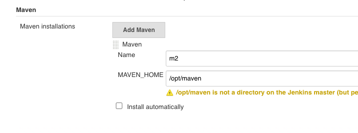

在`Agent`上面安装最新的`maven`

```
https://linuxize.com/post/how-to-install-apache-maven-on-centos-7/
wget https://www-us.apache.org/dist/maven/maven-3/3.6.3/binaries/apache-maven-3.6.3-bin.tar.gz -P /tmp
sudo tar xf /tmp/apache-maven-3.6.3-bin.tar.gz -C /opt
sudo ln -s /opt/apache-maven-3.6.3 /opt/maven
sudo vim /etc/profile.d/maven.sh

export JAVA_HOME=/usr/lib/jvm/jre-openjdk
export M2_HOME=/opt/maven
export MAVEN_HOME=/opt/maven
export PATH=${M2_HOME}/bin:${PATH}

sudo chmod +x /etc/profile.d/maven.sh

source /etc/profile.d/maven.sh
``` 

```
$ mvn -version
Apache Maven 3.6.3 (cecedd343002696d0abb50b32b541b8a6ba2883f)
Maven home: /opt/maven
Java version: 1.8.0_252, vendor: Oracle Corporation, runtime: /usr/lib/jvm/java-1.8.0-openjdk-1.8.0.252.b09-2.el7_8.x86_64/jre
Default locale: en_US, platform encoding: UTF-8
OS name: "linux", version: "3.10.0-957.12.2.el7.x86_64", arch: "amd64", family: "unix"

$ whereis mvn
mvn: /opt/apache-maven-3.6.3/bin/mvn.cmd /opt/apache-maven-3.6.3/bin/mvn
```

```
stage('tools') {
        steps {
        
            mvnHome = tool "m2"
            println(mvnHome)
                        
            sh "${mvnHome}/bin/mvn --version"
        }
    }
```

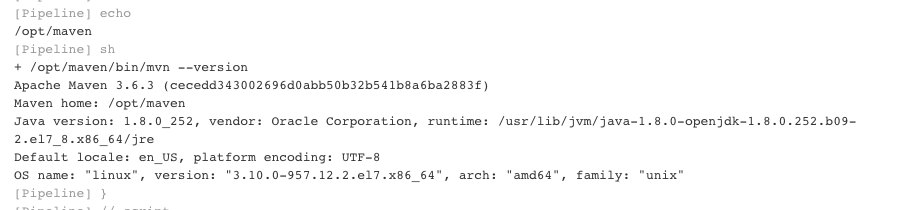
 
 
### 1-5-6 input

执行`input`步骤会暂停`pipeline`，直到用户输入参数。这是一种特殊的参数化`pipeline`的方法。我们可以利用`Input`步骤实现以下两种场景： 

* (1)实现简易的审批流程。例如，`pipeline`暂停在部署前的阶段，由负责人点击确认后，才能部署 
* (2)实现手动测试阶段。在`pipeline`中增加一个手动测试阶段，该阶段中只有一个`input`步骤，当手动测试通过后，测试人员才可以通过这个`Input`步骤。 

```
pipeline { 
	agent any 
	stages { 
		stage('deploy') { 
			steps { 
				input message: "Deploy or terminate" 
			} 
		}
	}
}
```

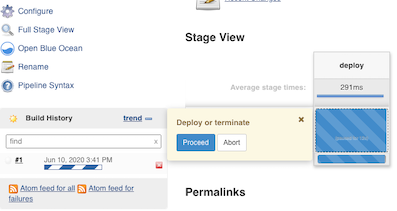

```
[Pipeline] input
Deploy or terminate
Proceed or Abort
[Pipeline] }
[Pipeline] // stage
```

**Input 步骤的复杂用法**

```
def approvalMap 

pipeline { 
    agent any 
    stages { 
        stage('pre deploy') { 
            steps { 
                script { 
                    approvalMap = input( 
                        message: 'Ready to deploy to which env?' ,
                        ok: 'ok', 
                        parameters: [ 
                            choice(choices: 'dev\ntest\nprod', description: 'Deploy to which Env? ', name: 'ENV'),
                            string(defaultValue: '', description: '', name: 'myparam') 
                        ], 
                        submitter: 'admin,admin2,releaseGroup', 
                        submitterParameter: 'APPROVER' 
                    )
                }
            }
        }
        stage('deploy') { 
            steps { 
                echo "APPROVER is ${approvalMap['APPROVER']}" 
                echo "Deploy to the Env: ${approvalMap['ENV']}"
                echo "Self defined param: ${approvalMap['myparam']}" 
                }
            }
        }
}
```

> approvaiMap 还可以防在**environment**中，更加优雅

```
environment {
	approvalMap = ' '
}
```

我们在`pipeline`外定义了一个变量`approvalMap`：这是因为定义在阶段内的变最的作用域只在这个阶段中，而`input`步骤的返回值需要跨阶段使用，听以需要将其定义在`pipeline`外：这样变量`approvaiMap`的作用域就是整个`pipeline`了。 

同时，由于在`pipeline`中直接使用了`Groovy`语言赋值表达式．所以需要将`approvalMap=input(...)`放到`script`块中。 

`input`步骤的返回值类型取决于要返回的值的个数。如果只有一个值，返回值类型就是这个值的类型；如果有多个值，则返回值类型是`Map`类型。本例返回的`approvalMap`就是一个`map`, `Map`的`key`就是每个参数的`name`属性，比如`ENV`、`myparam`都是`key` 

除了可以在返回的`map`中放手动输入的值，还可以放其他数据，比如`submitterParameter: 'APPROVER`，代表将`key APPROVER`放到返回的`map`中。 下面我们分别介绍`input`步骤的参数。


* `message` 呈现给用户的提示信息。
* `id` 可选，默认为`stage`名称。
* `ok` 默认表单上的`ok`文本。
* `submitter `可选的,以逗号`","`分隔的用户列表或允许提交的外部组名。默认允许任何用户。
* `submitterParameter` 环境变量的可选名称。如果存在，用`submitter`名称设置。
* `parameters` 提示提交者提供的一个可选的参数列表。

示例：

```
pipeline {
    agent any
    stages {
        stage('Example') {
            input {
                message "Should we continue?"
                ok "Yes, we should."
                submitter "alice,bob"
                parameters {
                    string(name: 'PERSON', defaultValue: 'Mr Jenkins', description: 'Who should I say hello to?')
                }
            }
            steps {
                echo "Hello, ${PERSON}, nice to meet you."
            }
        }
    }
}
```

**设置手动输入步骤超时后，`pipeline`自动中止** 

`input`步骤可以与`timeout`步骤实现超时自动中止`pipeline`，防止无限等待。以下`pipeline`一小时后不处理就自动中止。 

```
pipeline { 
	agent any 
	stages { 
		stage('deploy') { 
			steps { 
				timeout(time: 1, unit:'HOURS') { 
					input message: "Deploy or terimate" 
				} 
			}
		}
	}
}
```

### 1-5-7 `when`和多分支构建

**根据分支部署到不同的环境**

`git`分支可以用于对代码进行物理隔离。对分支的管理有很多方法，比如主干开发，发布分支以及`Gitflow`法等。我们不讨论它们的好坏。 


但不论使用哪种分支管理方法，都可能会涉及一个问题：如何根据不同的分支做不同的事情，比如根据不同的分支部署到不同的环境。类似这样的事情可以使用`if-else`来实现。 

```
stage("deploy to test"){ 
	steps{ 
		script { if (env.GIT_BRANCH == 'master') { 
				echo "deploy to test env" 
			} 
		} 
	} 
} 
stage("deploy to prod"){ 
	steps{ 
		script { 
			if (env.GIT_BRANCH == 'release') { 
				echo "deploy to prod" 
				} 
			} 
		} 
} 
```

但是这样的代码不够优雅，而且不是声明式的。使用`when`指令可以让`pipeline`看起来更优雅。 

```
stage("deploy to test"){ 
	when { 
		branch 'master' 
	} 
		steps{ 
		echo "deploy to test" 
	} 
} 

stage("deploy to prod"){ 
	when { 
		branch 'release' 
	} 
	steps{ 
		echo "deploy to prod" 
	} 
} 
```


`when` 指令允许流水线根据给定的条件决定是否应该执行阶段。 `when` 指令必须包含至少一个条件。 如果`when` 指令包含多个条件, 所有的子条件必须返回`True`，阶段才能执行。 这与子条件在 `allOf` 条件下嵌套的情况相同。

**内置条件**

* `changelog`：如果版本控制库的`changelog`符合正则表达式, 则执行 

```
when {
	changelog '.*^\\[DEPENDENCY\\].+$'
}
```

* `changeset`：如果版本控制库的变更集合中包含一个或多个文件符合给定的`Ant`风格路径表达式，则执行 

```
when {
	changeset "**/*.js"
}
```

* `equals`：如果期望值与给定的值相同则执行 

```
when { 
	equals expected: 2, actual: currentBuild.number 
}
```

* `branch`: 当正在构建的分支与模式给定的分支匹配时，执行这个阶段,这只适用于多分支流水线例如:

```
when { branch 'master' }
```

* `environment` 当指定的环境变量是给定的值时，执行这个步骤,例如:

```
when { environment name: 'DEPLOY_TO', value: 'production' }
```

* `expression` 当指定的`Groovy`表达式评估为`true`时，执行这个阶段, 例如:

```
when { expression { return params.DEBUG_BUILD } }
```

```
when { 
	expression  { 
		return env.BRANCH_NAME != 'master'; 
	}
}
```

当表达式返回的是字符串时，它必须转换成布尔类型或`null`;否则，所有的字符串都被当作`true`处理。 


* `buildingTag`：如果`pipeline`所执行的代码被打了`tag`则执行 

```
when { 
	buildingTag() 
} 
```

* `not` 当嵌套条件是错误时，执行这个阶段,必须包含一个条件，例如:

```
when { not { branch 'master' } }
```

* `allOf` 当所有的嵌套条件都正确时，执行这个阶段,必须包含至少一个条件，例如:

```
when { 
	allOf {
		 branch 'master'; 
		 environment name: 'DEPLOY_TO', value: 'production' 
	} 
}
```

* `anyOf` 当至少有一个嵌套条件为真时，执行这个阶段,必须包含至少一个条件，例如:

```
when { anyOf { branch 'master'; branch 'staging' } }
```

* `tag`：如果`pipeline`所执行的代码被打了`tag`，且`tag名`称符合规则，则执行 

```
when { 
	tag "release-*" 
} 
```

如果`tag`的参数为空，即`tag()`，则表示不论`tag`名称是什么都执行，与`buildingTag`的效果相同。 


`tag`条件支持`comparator`参数，支持的值如下。 

`EQUALS`：简单的文本比较。 

```
when { 
	tag pattern: "release-3.1", comparator: "EQUALS"
} 
```

`GLOB`（默认值）:`Ant`风格路径表达式。由于是默认值，所以使用时一般省略。完整写法如下： 

```
when { 
	tag pattern: "release—*", comparator: "GLOB"
}
```

`PEGEXP`：正则表达式。使用方法如下 

```
when { 
	tag pattern: "release —\\d+", comparator: "REGEXP" 
}
```

**示例：**

```
pipeline {
    agent any
    stages {
        stage('Example Build') {
            steps {
                echo 'Hello World'
            }
        }
        stage('Example Deploy') {
            when {
                branch 'production'
            }
            steps {
                echo 'Deploying'
            }
        }
    }
}
```

```
pipeline {
    agent any
    stages {
        stage('Example Build') {
            steps {
                echo 'Hello World'
            }
        }
        stage('Example Deploy') {
            when {
                branch 'production'
                environment name: 'DEPLOY_TO', value: 'production'
            }
            steps {
                echo 'Deploying'
            }
        }
    }
}
```

```
pipeline {
    agent any
    stages {
        stage('Example Build') {
            steps {
                echo 'Hello World'
            }
        }
        stage('Example Deploy') {
            when {
                allOf {
                    branch 'production'
                    environment name: 'DEPLOY_TO', value: 'production'
                }
            }
            steps {
                echo 'Deploying'
            }
        }
    }
}
```

```
pipeline {
    agent any
    stages {
        stage('Example Build') {
            steps {
                echo 'Hello World'
            }
        }
        stage('Example Deploy') {
            when {
                branch 'production'
                anyOf {
                    environment name: 'DEPLOY_TO', value: 'production'
                    environment name: 'DEPLOY_TO', value: 'staging'
                }
            }
            steps {
                echo 'Deploying'
            }
        }
    }
}
```

```
pipeline {
    agent any
    stages {
        stage('Example Build') {
            steps {
                echo 'Hello World'
            }
        }
        stage('Example Deploy') {
            when {
                expression { BRANCH_NAME ==~ /(production|staging)/ }
                anyOf {
                    environment name: 'DEPLOY_TO', value: 'production'
                    environment name: 'DEPLOY_TO', value: 'staging'
                }
            }
            steps {
                echo 'Deploying'
            }
        }
    }
}
```

```
pipeline {
    agent none
    stages {
        stage('Example Build') {
            steps {
                echo 'Hello World'
            }
        }
        stage('Example Deploy') {
            agent {
                label "some-label"
            }
            when {
                beforeAgent true
                branch 'production'
            }
            steps {
                echo 'Deploying'
            }
        }
    }
}
```

**`Generic Webhook Trigger`插件在多分支`pipeline`**

在多分支`pipeline`场景下，我们希望触发某个分支的构建执行，`GenericTrigger`可以这么传参： 

```
triggers { 
	GenericTrigger( 
		genericVariables: [ 
			[key: 'ref', value: '$.ref'] 
		], 
		
		token: env.JOB_NAME, 
		regexpFilterText: '$ref', 
		regexpFilterExpression: 'refs/heads/' + env.BRANCH_NAME
		} 
}
```


### 指令 1-5-8 Examples

```
pipeline {
    agent { node { label "hostmachine"   //指定运行节点的标签或者名称
			}
	}
parameters {
    string(name: 'PERSON', defaultValue: 'Mr Jenkins', description: 'Who should I say hello to?')
}
stages {
    stage('parameter') {
        when { environment name: 'PERSON', value: 'jacob' }
        steps {
            echo "Hello ${params.PERSON}"
        }
    }
    
    stage('tools') {
        steps {
            script{
                mvnHome = tool "m2"
                println(mvnHome)
                            
                sh "${mvnHome}/bin/mvn --version"
            }
        }
    }
    
    stage('Input') {
            input {
                message "Should we continue?"
                ok "Yes, we should."
                submitter "Jacob"
                parameters {
                    string(name: 'PERSON', defaultValue: 'Mr Jenkins', description: 'Who should I say hello to?')
                }
            }
            steps {
                echo "Hello, ${PERSON}, nice to meet you."
            }
        }
}
}
```

 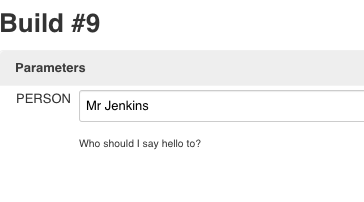 **which is not `jacob`**
 
 ` when { environment name: 'PERSON', value: 'jacob' }`  跳过此**Stage**
 
 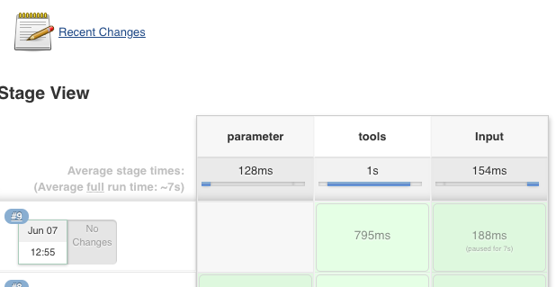 

### 1-5-9 并行构建

声明式流水线的阶段可以在他们内部声明多隔嵌套阶段, 它们将并行执行。 注意，一个阶段必须只有一个 `steps` 或` parallel`的阶段。 嵌套阶段本身不能包含 进一步的 `parallel` 阶段, 但是其他的阶段的行为与任何其他 `stageparallel` 的阶段不能包含` agent` 或 `tools` 阶段, 因为他们没有相关 `steps`。

另外, 通过添加 `failFast true `到包含`parallel`的 `stage`中， 当其中一个进程失败时，你可以强制所有的 `parallel` 阶段都被终止。

**示例:**

```
pipeline {
    agent any
    stages {
        stage('Non-Parallel Stage') {
            steps {
                echo 'This stage will be executed first.'
            }
        }
        stage('Parallel Stage') {
            when {
                branch 'master'
            }
            failFast true
            parallel {
                stage('Branch A') {
                    agent {
                        label "for-branch-a"
                    }
                    steps {
                        echo "On Branch A"
                    }
                }
                stage('Branch B') {
                    agent {
                        label "for-branch-b"
                    }
                    steps {
                        echo "On Branch B"
                    }
                }
            }
        }
    }
}
```

`Jenkins pipeline`插件支持这种并行构建，并月一使用起来也非常简单。 

```
pipeline{ 
	agent none 
	stages{ 
		stage('Run Tests'){ 
			failFast true 
			parallel{ 
				stage('Test On Chrome'){ 
					agent{ label "chrome" } 
					steps{ 
						echo "Chrome U工测试"
					} 
				} 
				stage('Test On Firefox'){ 
					agent{ label "firefox" } 
					steps{ 
						echo "Firefox UI测试" 
						} 
				} 
				stage('Test On IE'){ 
					agent{ label "ie" } 
					steps{ 
						echo "IE UI 测试“ 
					} 
				} 
			} //end of parallel 
		} //end of run tests 
	} //end of stages 
} //end of pipeline 
```

在`stage`部分包含一个`Run Tests`阶段，在这个阶段下包含一个`parallel`块，在`parallel`块下又包含了多个阶段。位于`parallel`块下的阶段都将并行执行，而且并行阶段还可以被分到不同的`Jenkins agent`上执行。 

因为parallel本身不包含任何步骤，所以在`parallel`块下本身不允许包含`agent`和`tools`.

在默认情况下，`Jenkins pipeline`要等待`parallel`块下所有的阶段都执行完成，才能确定结果。**如果希望所有并行阶段中的某个阶段失败后，就让其他正在执行的阶段都中止，那么只需要在与`parallel`块同级的位置加人`failFast true`就可以了。** 

**在不同的分支上应用并行构建**

```
pipeline { 
	agent any 
	stages { 
		stage('Parallel Stage') { 
			failFast true 
			parallel { 
				stage('Branch master') { 
					when { branch 'master' } 
					agent any 
					steps { 
						echo "On Branch master" 
					} 
				}
				stage('Branch dev') {
					when { branch 'staging' }
					agent any
					stages {
						stage('嵌套staging 1'){
							steps{
								echo "staging 1"
							}
						}
						stage('嵌套staging 2'){
							steps{
								echo "staging 2"
							}
						}
					}
				} // end of staging
			} // end of parallel
		}
	}
} //end of pipepline 
```		

我们注意到在并行阶段`Branch staging`下又出现了一个stage部分。 是的，阶段是可以嵌套的。
			
**并行步骤**

前面我们介绍的是阶段级别的并行执行`Jenkins pipeline`还支持步骤级别的并行执行。这也是`Jenkins Pipeline`最早支持的并行方式 

```
stage('parallel build') { 
	steps { 
		parallel {
			jdk8: {
				echo "jdk8 build" 
			},
			jdk9: {
				echo "jdk9 build" 
			}
		}
	}
}
```
			
## 1-6 step步骤

### 1-6-1 script

`script` 步骤需要 `[scripted-pipeline]`块并在声明式流水线中执行。对于大多数用例来说,应该声明式流水线中的“脚本”步骤是不必要的，但是它可以提供一个有用的”逃生出口”。**非平凡的规模和/或复杂性的script块应该被转移到 共享库 。**

**示例：比如分别在不同的浏览器上跑测试**

```
pipeline {
    agent any
    stages {
        stage('Example') {
            steps {
                echo 'Hello World'

                script {
                    def browsers = ['chrome', 'firefox']
                    for (int i = 0; i < browsers.size(); ++i) {
                        echo "Testing the ${browsers[i]} browser"
                    }
                }
            }
        }
    }
}
```


## 1-7 pipeline内置基础步骤 


### 1-7-1 文件目录相关步骤 

**`deleteDir`:删除当前目录** 

`deleteDir`是一个无参步骤，删除的是当前工作目录。通常它与`dir`步骤一起使用，用于删 
除指定目录下的内容。 

**`dir`：切换到目录**

默认`pipeline`工作在工作空间目录下，dir步骤可以让我们切换到其他目录。使用方法如下： 

```
dir("/var/logs"){
	deleteDir()
}
```

**fileExists：判断文件是否存在**

`fileExists('/tmp/a.jar'）` 判断`/tmp/a.jar`文件是否存在。如果参数是相对路径，则判断在相对当前工作目录下，该文件是否存在。结果返回布尔类型。 

**isUnix：判断是否为类UNIX系统**

如果当前`pipeline`运行在一个类`UNIX`系统上，则返回`true`

**pwd：确认当前目录**

`pwd`与`Linux`的`pwd`命令一样，返回当前所在目录：它有一个布尔类型的可选参数：`tmp`，如 
果参数值为`true`，则返回与当前工作空间关联的临时目录。 

**writeFile：将内容写入指定文件中**

`writeFile`支持的参数有： 

* `file`：文件路径，可以是绝对路径，也可以是相对路径。 
* `text`: 要写人的文件内容。 
* `encoding`（可选）：目标文件的编码。 如果留空，则使用操作系统默认的编码。如果写的是 `Base64`的数据，则可以使用`Base64` 编码。 


**`readFile`：读取文件内容** 

读取指定文件的内容，以文本返回。`readFile`支持的参数有：

* `file`：路径，可以是绝对路径，也可以是相对路径：
* `encoding`（可选）：读取文件时使用的编码。 

示例如下： 

```
script{ 
	// "amVua2lucyBib29r" 是 "jenkins book" 进行Base64编码后的值
	writeFile(file:"base64File", text: "amVua2lucyBib29r", encoding: "Base64") 
	def content = readFile(file: 'base64File', encoding: 'UTF—8' ) 
	echo "${content}" 
	// 打印结果: jenkins book 
}
```


### 1-7-2 制品相关步骤 

**stash：保存临时文件**

`stash`步骤可以将一些文件保存起来，以便被同一次构建的其他步骤或阶段使用。如果整个 `pipeline`的所有阶段在同一台机器上执行，则`stash`步骤是多余的。所以，通常需要`stash`的文件都是要跨`Jenkins node`使用的。 


`stash`步骤会将文件存储在`tar`文件中，对于大文件的`stash`操作将会消耗`Jenkins master`的计算资源。`Jenkins`官方文档推荐，当文件大小为**`5~1OOMB`时**，应该考虑使用其他替代方案。 

`stash`步骤的参数列表如下： 

* `name`：字符串类型，保存文件的集合的唯一标识。 
* `allowEmpty`：布尔类型，允许`stash`内容为空。 
* `excludes`：字符串类型，将哪些文件排除。如果排除多个文件，则使用逗号分隔。留空代表 不排除任何文件。 
* `includes`：字符串类型，`stash`哪些文件，留空代表当前文件夹下的所有文件。
* `useDefaultExciudes`：布尔类型，如果为`true`，则代表使用`Ant`风格路径默认排除文件列表。 

除了`name参`数，其他参数都是可选的。`excludes`和`includes`使用的是`Ant`风格路径表达式。 

**`unstash`：取出之前`stash`的文件**
 
`unstash`步骤只有一个`name`参数，即`stash`时的唯一标识。通常`stash`与`unstash`步骤同时使用。以下是完整示例。 

```
pipeline { 
	agent none 
	stages {
		stage('stash') { 
			agent { label "master" } 
			steps { 
				writeFile file: "a.txt",text: "$BUILO_NUMBER" 
				stash(name "abc", includes: "a.txt")
				}
			}	
		stage('unstash') { 
			agent { label "node2" }
			steps {
				script{ 
					unstash("abc") 
					def content = readFile("a.txt") 
					echo "${content}" 
				}
			}
		}
	}
}
```
`stash`步骤在`master`节点上执行，而`unstash`步骤在 `node2`节点上执行


### 1-7-3 命令相关步骤 

与命令相关的步骤其实是`Pipeline: Nodes and processes`插件提供的步骤。 由于它是`Pipeline` 插件的一个组件，所以基本不需要单独安装。 

**sh：执行shell命令** 

`sh`步骤支持的参数有：

* `script`：将要执行的`shell`脚本，通常在类`UNIX`系统上可以是多行脚本。
* `encoding`：脚本执行后输出日志的编码，默认值为脚本运行听在系统的编码。
* `return Status`：布尔类型， 默认脚本返回的是状态码， 如果是一个非零的状态码，则会引发 `pipeline`执行失败。如果`returnStatus`参数为`true`,则不论状态码是什么,`pipeline`的执行都不会受影响。 
* `return Stdout`：布尔类型，如果为`true`，则任务的标准输出将作为步骤的返回值，而不是打印到构建日志中（如果有错误，则依然会打印到日志中）。 

除了`script`参数，其他参数都是可选的。 

`returnStatus`与`returnStdout`参数一般不会同时使用，因为返回值只能有一个。如果同时使用、 则只有`returnStatus`参数生效。

**bat、powershell步骤**

`bat`步骤执行的是`Windows`的批处理命令。`powershell`步骤执行的是`PowerShell`脚本，支持`3+`版本。这两个步骤支持的参数与`sh`步骤的一样，这里就不重复介绍了。 


### 1-7-4 其他步骤 

**`error`：主动报错，中止当前`pipeline`**

`error`步骤的执行类似于抛出一个异常。它只有一个必需参数：`message`。通常省略参数： `error("there's an error"）`。 

**tool：使用预定义的工具** 

如果在`Global Tool Configuration`（全局工具配置）中配置了工具，如图所示，比如 
配置了`Docker`，那么可以通过`tool`步骤得到工具路径。 

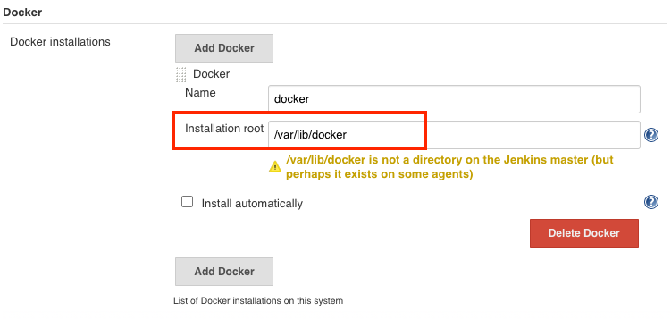 

```
stage('Docker') {
            steps { 
	            script{ 
		            def t = tool name: 'docker', type: 'org.jenkinsci.plugins.docker.commons.tools.DockerTool'
		            echo "${t}" // 打印 /var/lib/docker 
	            } 
            }
        }
```

```
...
/var/lib/docker
[Pipeline] }
[Pipeline] // script
[Pipeline] }
[Pipeline] // stage
[Pipeline] }
[Pipeline] // node
[Pipeline] End of Pipeline
```

**tool步骤支持的参数有：** 

* name：工具名称。 
* type（可选）：工具类型，指该工具安装类的全路径类名。 

每个插件的`type`值都不一样，而且绝大多数插件的文档根本不写`type`值。除了到该插件的源码中查找，还有一种方法可以让我们快速找到`type`值，就是前往`Jenkins pipeline`代码片段生成器中生成该`tool`步骤的代码即可，


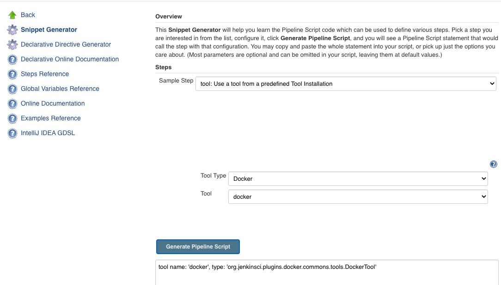 

**`timeout`：代码块超时时间** 

为`timeout`步骤闭包内运行的代码设置超时时间限制。一如果超时，将抛出一个`org.jenkinsci.plugins.workflow. steps.FlowlnterruptedException`异常。`timeout`步骤支持如下参数：
 
* `time`：整型, 超时时间。 
* `unit`（可选）：时间单位，支持的值有`NANOSECONDS`、 `MICROSECONDS`、` MILLISECONDS`、 `SECONDS`、`MINUTES`（默认）、`HOURS`、`DAYS`。 
* `activity`（可选）：布尔类型，如果值为`true`，则只有当日志没有活动后，才真正算作超时 

**`waitUntil`：等待条件满足**

不断重复`waitUntil`块内的代码，直到条件为`true`. `waitUntil`不负责处理块内代码的异常，直到异常时直接向外抛出。`waitUntil`步骤最好与`timeout`步骤共同使用，避免死循环。示例如下： 

```
timeout(50) { 
	waitUntil { 
		script { 
			def r = sh script: 'curl http://exmaple', returnStatus: true 
			return (r == 0) 
		} 
	} 
} 
```

**retry：重复执行块 **

执行`N`次闭包内的脚本。如果其中某次执行抛出异常，则只中止本次执行，并不会中止整个`retry`的执行。同时，在执行`retry`的过程中，用户是无法中止`pipeline`的。 

```
steps{ 
	retry(20){ 
		script{ 
		sh script: 'curl http://exmaple', returnStatus: true
		} 
	} 
} 
```

**`sleep`：让`pipeline`休眠一段时间** 

`sleep`步骤可用于简单地暂停`pipeline`，其支持的参数有：

* `time`：整型，休眠时间。
* `unit`（可选）:时间单位，支持的值有`NANOSECONDS`、` MICROSECONDS`、 `MILLISECONDS`、 `SECONDS`（默认）、`MINUTES`、`HOURS`、`DAYS` 

示例如下： 

```
sleep(120) // 休眠120s
sleep(time:'2', unit:"MINUTES") // 休眠2分钟 
```

### 1-7-5 使用pipeline代码片段生成器学习 

对于初学`Jenkins pipeline`的新人来说，如何开始写`pipeline`是一个坎儿。好在`Jenkins`提供了 

一个`pipeline`代码片段生成器，通过界面操作就可以生成代码。 

进入`pipeline`项目后，单击左边的`“Pipeline Syntax”`菜单项（只有`pipeline`项目有）图3-6所示。 

进入`“Pipeline Syntax"`页面后，在右边的“Sample Step”下拉框中选择需要生成代码的步骤，并根据提示填入参数，然后单击`“Generate Pipeline Script”`按钮，就可以生成代码了，如 

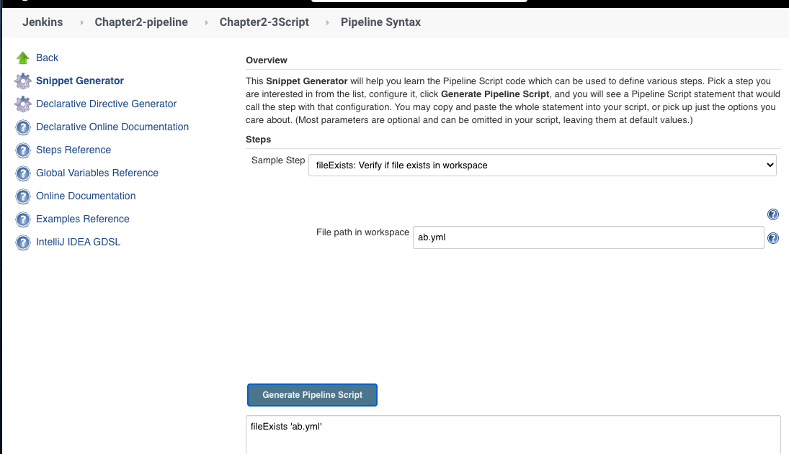 


### 1-7-6 使用`VS Code`扩展校验`Jenkinsfile `

不像Java语言有各种开发工具支持，`Jenkinsfile` 从诞生以来就没有很好的工具支持, 无奈只能使用`VSCode`文本编辑器`＋Groovy`语法高亮进行开发。对语法的校验全凭自己对`Jenkinsfile`的了解

2018年11月初，Jenkins官方博客介绍了一个`VS Code`扩展：`Jenkins Pipeline Linter Connector,` 实现了对`Jenkinsfile`的语法校验。 

在`VS Code`应用市场搜索`“Jenkins Pipeline Linter Connector”`并安装，然后对一该扩展进行设置，


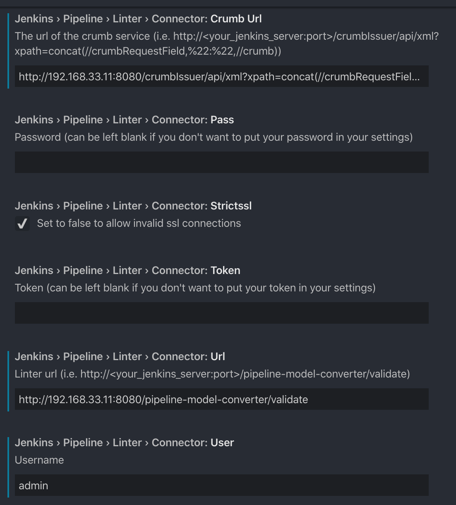 

然后，进人`Jenkins`的`Manage Jenkins`->`Manage Configure Global Security`页，确认`Jenkins `
启用了`“CSRF Protection"`

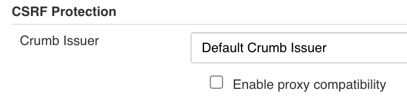 

接下来，打开一个`Jenkinsfile`文件，调用扩展命令， 

vscode `shift + command + p`

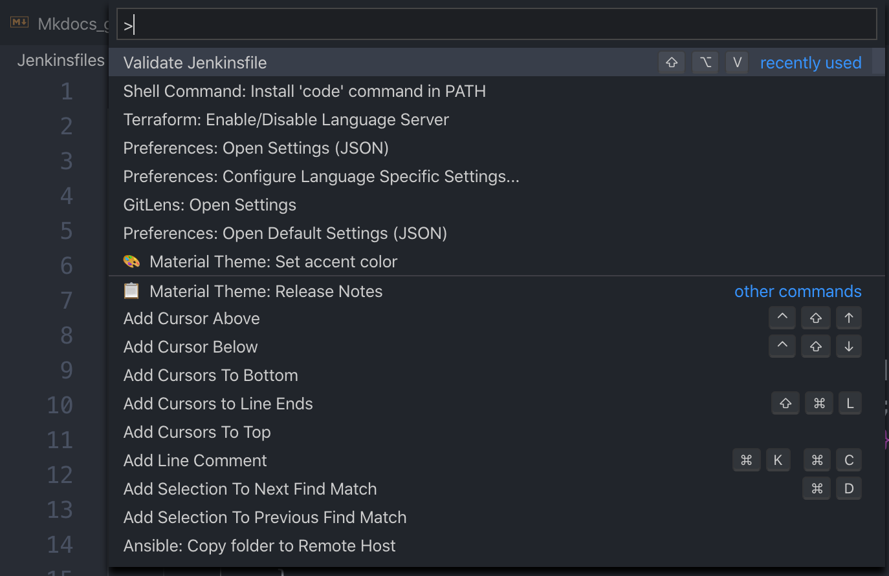 

最后在OUTPUT中可以看利校验结果 

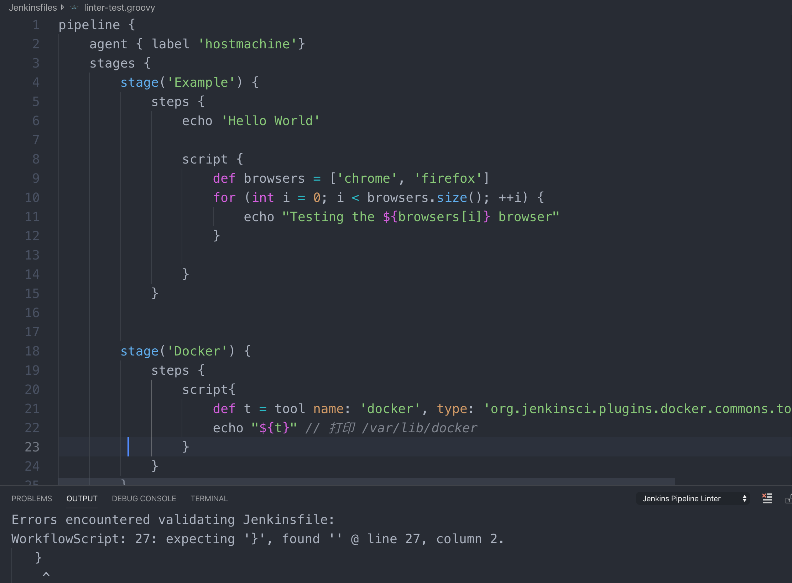 

使用`Workspace Cleanup`插件理空间 

通常， 当`pipeline`执行完成后，不会自动清理空间如果需要（通常需要）清理工作空间，则可以通过`Workspace Cleanup`插件实现 

* 安装`Workspace Cleanup`插件
*  在`pipeline`的`post`部分加入插件步骤

```
post {
	always {
		cleanWs()
	}
}
```

### 1-7-7 Ant风格路径表达式简介

`Ant`是比`Maven`更老的`Java`构建工具。`Ant`发明了一种描述文件路径的表达式，大家都习惯称其为`Ant`风格路径表达式。 `Jenkins pipeline`的很多步骤的参数也会使用此表达式。 

`Ant`路径表达式包括3种通配符。

* `？`：匹配任何单字符。 
* `*`：匹配`0`个或者任意数量的字符。 
* `**`：匹配0个或者更多的目录。 

我们通过以下例子来学习。

*  `**/cvs/*`：匹配`cvs`文件夹下的所有文件，`cvs`文件夹可以在任何层级。

以下路径会被匹配到： 

```
CVS/Repository 
org/apache/CVS/Entries 
org/apache/jakarta/tools/ant/CVS/Entries 
```

以下`foo/bar`部分不会被匹配到

```
org/apache/CVS/foo/bar/Entries 
```

* `org/apache/jakarta/**`：匹配`org/apache/jakarta`路径下的所有文件。 

以下路径会被匹配到： 

```
org/apache/jakarta/tools/ant/docs/index.html 
org/apache/jakarta/test.xml 
```
以下路径不会被匹配到： 

```
org/apache/xyz.java
```

* `org/apache/**/CVS/*`：匹配`org/apache`路径下的`cvs`文件夹下的所有文件。`cvs`文件夹可以在任何层级。 

以下路径会被匹配到： 

```
org/apache/CVS/Entries 
org/apache/jakarta/tools/ant/CVS/Entries 
```

以下路径不会被匹配到： 

```
org/apache/CVS/foo/bar/Entries 
```

* `**/test/**`: 匹配所有路径中含有`test`的路径

## How to check Jenkins DSL Viewer Page

Input the url of Viewer Page

```
htpp://jenkins_url/plugin/job-dsl/api-viewer/index.html
```

For example:

```
http://192.168.33.11:8080/plugin/job-dsl/api-viewer/index.html
```

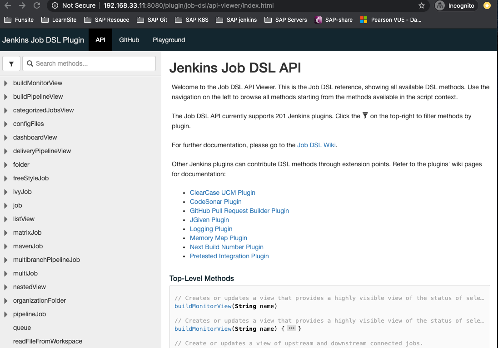 