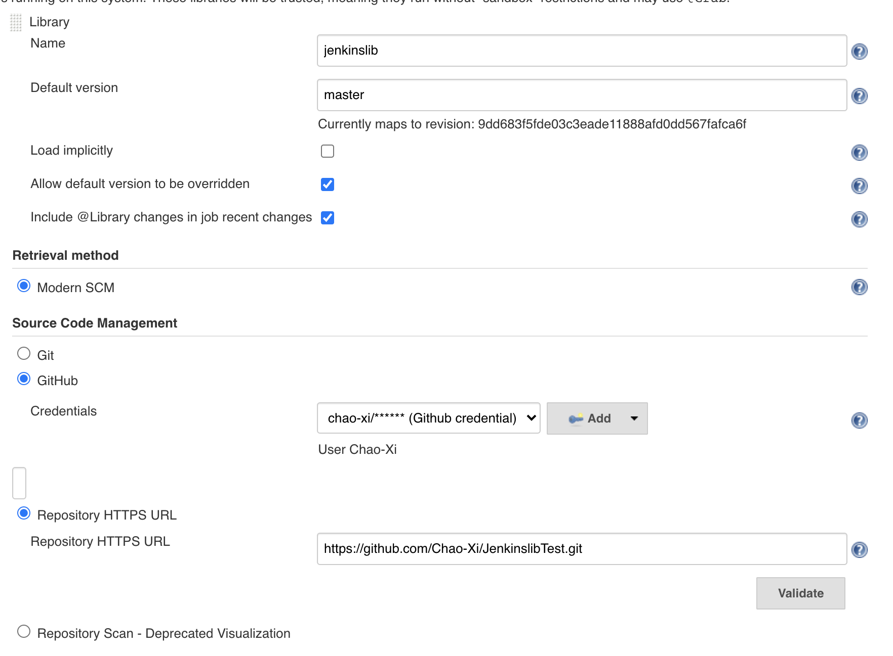
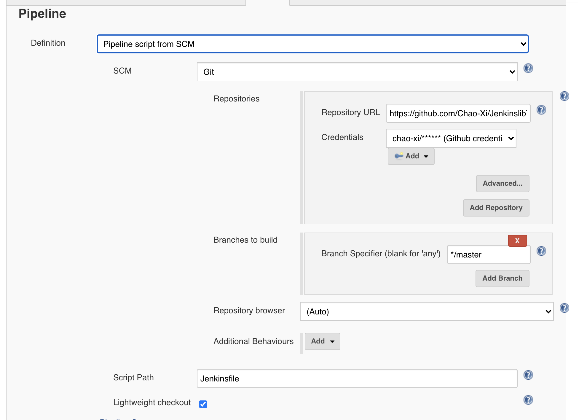

# **第四节 Jenkins Pipeline 扩展 —— 共享库**

## 1. 在pipene中定义函数 

`pipeline`本质就是一个`Groovy`脚本。所以，可以在`pipeline`中定义函数，并使用`Groovy`语言自带的特性。如下代码示例，我们定义了`createVersion`函数，并使用了`Date`类。 

```
pipeline { 
	agent any 
	stages {
		stage('Build') { 
			steps { 
				echo "${createVersion(BUILD_NUMBER)}" 
			} 
		}
	}
}

def createVersion(String BUILD_NUMBER) {
	return new Date().format( 'yyMM' ) + "-${BUILD_NUMBER}"
}
```

日志打印

```
2006-4
[Pipeline] }
[Pipeline] // stage
[Pipeline] }
[Pipeline] // node
[Pipeline] End of Pipeline
Finished: SUCCESS
```

其实还有一种更加优雅的写法，将变量定义在`evnvironment `部分

```
pipeline{
    agent any
    environment {
        _version = createVersion(BUILD_NUMBER)
    }
    stages {
        stage('Build'){
            steps {
                echo "${_version}"
            }
        }
    }
}

def createVersion(String BUILD_NUMBER) {
	return new Date().format( 'yyMM' ) + "-${BUILD_NUMBER}"
}
```

如果在一个`JenklnfiIe`中定义一个函数倒是无伤大雅， 但是如果在20个`JenklnfiIe`中重复定义这个函数20遍，就有问题了——存在大量重复的代码，所以，不推荐大量使用自定义的函数


## 2. Jenkins 共享库

### 本节介绍

由于流水线被组织中越来越多的项目所采用，常见的模式很可能会出现。 在多个项目之间共享流水线有助于减少冗余并保持代码。流水线支持创建 "共享库" ，可以在外部源代码控制仓库中定义并加载到现有的流水线中。

* **`src`目录类似于标准`Java`源目录结构。执行流水线时，此目录将添加到类路径中。** 
* **`vars`目录托管脚本文件，这些脚本文件在“管道”中作为变量公开。**
* `resources`目录允许`libraryResource`从外部库中使用步骤来加载相关联的非 `Groovy`文件。 


```
$ tree JenkinslibTest
JenkinslibTest
├── README.md
├── src
│   └── org
│       └── devops
│           ├── build.groovy
│           └── tools.groovy
└── vars
    └── hello.groovy

4 directories, 4 files
```

* `src`:  类
* `vars`: 变量

**`tools.groovy`**

```
package org.devops

//Print content
def PrintMes(content){
  println(content)
}
```

**`build.groovy`**

```
package org.devops

def PrintMes(){
  println("Hello World!")
}
```

**`hello.groovy`**

```
def call(){
  print("hello")
}
```

**Global Pipeline Libraries**





下面介绍一下配置项。 

* `Name`：共享库的唯一标识，在`Jenkinsfile`中会使用到。
* `Default version`：默认版本。可以是分支名、`tag`标签等。 
* `Load implicitly`:隐式加载。如果勾选此项，将自动加载全局共享库，在`Jenkinsfile`中不需要显式引用，就可以直接使用。 
* `Allow default version to be overridden`：如果勾选此项，则表示允许`“Default version”`被`Jenkinsfile`中的配置覆盖。
* `Include @Library changes in job recent changes`:如果勾选此项，那么共享库的最后变更信息会跟项目的变更信息一起被打印在构建日志中。 
* `Retrieval method`：获取共享库代码的方法。我们选择`“Modern SCM”`选项，进而选择使用`Git`仓库。 

**提示:** 除了可以使用`Git`仓库托管共享库代码，还可以使用`SVN`仓库托管。使用不同的代码仓库托管, "Default version" 的值的写法不一样。


## 3. 简单使用库 

标记`Load`的共享库隐含的允许管道立即使用任何此类库定义的类死全局变量。 要访问其他共享库， Jenkinsfile需要使用`@Library`注释，并指定库的名称

```
@Library('my-shared-library')  _
/* Using a version specifierk such as branch, tag, etc */ 


@Library('my-shared-library@<version>')  _

@Library('my-shared-library@1.0') _ 
/* Accessing multiple libraries with one statement */ 

@Library(['my-shared-library', 'otherlib@abc12341']) _ 
```

`_`： 代表引用


* 版本
* 分支，`@Library('my-shared-library@dev') _`
* `tag`标签，如`@Library('my-shared-library@release1.0') _` 
* `git commit id`，如`@Library('my-shared-library@e88044e73fea304a905dc00a1af2l97d945aa1e36') _` 


因为`Jenkins`交持同时添加多个共享库, 所以`@Library`注解还允许我们同时引入多个共享
库、如`@Library( ['global-shared-library','my-shared-library@dev']) _`。

**需要注意的是，Jenkins处理多个共享库出现同名函数的方式是先定义者生效。也就是说如 `global-shared-library`与`my-shared-library`存在同名的`sayHello`, 而`@Library`引人时`'global-shared-library'` 在`my-shared-library` 前那么就只有`global-shared-library`的`sayHello`生效。**


### `Jenkinsfile`

```
@Library('jenkinslib') _
def tools = new org.devops.tools()


String workspace = "/home/vagrant/workspace" 

//Pipeline 
pipeline {
	agent { node { label "hostmachine"   //指定运行节点的标签或者名称
					 customWorkspace "${workspace}" //指定运行工作目录（可选）
			}
	}

	options { 
		timestamps() 	//日志会有时间
		skipDefaultCheckout()  //删除隐式checkout scm 语句
		disableConcurrentBuilds()  //静止并行
		timeout(time: 1, unit: 'HOURS')  //流水线超时设置1h
	}

	stages { 
	//下载代码
		stage("GetCode"){   //阶段名称
			steps{   //名称
				timeout(time:5, unit:"MINUTES"){   //步骤超时时间
					script{	  //填写运行代码
						println('获取代码') 
					} 
				} 
			} 
		}
	   //构建
		stage("Build"){ 
			steps{
				timeout(time:20, unit:"MINUTES"){ 
					script{ 
						println('应用打包')
						
						mvnHome = tool "m2"
                        println(mvnHome)
                        
                        sh "${mvnHome}/bin/mvn --version"
					}
				} 
			}
		}

		//代码扫描
		stage("CodeScan"){
			steps{ 
				timeout(time:30, unit:"MINUTES"){ 
					script{ 
						print('代码扫描')

						tools.PrintMes('This from shared Libray')
					} 
				}
			}
		}
	} 
```



让我们看看`build-log`

```
Obtained Jenkinsfile from git https://github.com/Chao-Xi/JenkinslibTest.git
Running in Durability level: MAX_SURVIVABILITY
Loading library jenkinslib@master
Examining Chao-Xi/JenkinslibTest
Attempting to resolve master as a branch
Resolved master as branch master at revision c06d27a576408f760436629bc6b4948d8722ed89
using credential GitHub
Cloning the remote Git repository
Cloning with configured refspecs honoured and without tags
Cloning repository https://github.com/Chao-Xi/JenkinslibTest.git
...
19:07:38  代码扫描
[Pipeline] echo
19:07:38  This from shared Libray
...
```

## 4. 共享库详细的介绍

回顾一下库目录

```
.
├── Jenkinsfile
├── Jenkinsfiletests
│   └── Jenkinsfile-mvn
├── README.md
├── src
│   └── org
│       ├── devops
│       │   ├── build.groovy
│       │   └── tools.groovy
│       └── showme
│           └── Utils.groovy
└── vars
    ├── hello.groovy
    ├── mvn.groovy
    └── sayHello.groovy

6 directories, 9 files
```

首先看`vars`目录

放在`vars`目录下的是可以从`pipeline`直接调用的全局变量（使用变量这个名称实在有些奇怪）。变量的文件名即为在`pipeline`中调用的函数名。文件名为驼峰式（`camelCased`)的 

使用`vars`目录下的全局变量可以调用`Jenkins pipelne`的步骤。正如`sayHello.groovy`脚本 直接使用了`echo`步骤 

```
def call(String name = 'human'）{ 
    echo ”Hello, ${name).“
}
```

当我们在`Jenkinsfile`中写`sayHello("world")`时它实际调用的是`sayHello. groovy`文件中的`call`函数 

**`call`函数还支持接收闭包`（Closure)`。下例中，我们定义了一个`mvn`全局变量。**

```
//var/mvn.groovy

def call(mvnExec) { 
	configFileProvider([configFile(fileId: 'maven-global-settings', variable: 'MAVEN_GLOBAL_ENV')]) { 
	mvnExec("${MAVEN_GLOBAI_ENV}")
	}
} 
```

以上`call`函数里的内容就是将`configFileProvider`哆嗦的写法封装在`mvn`变量中。这样我们就 
可以更简捷地执行`mvn`命令了

```
@Library('global-shared-library@master') _ 
pipeline {
	agent any 
	tools { 
		maven 'mvn-3.5.4' 
	}

	stages { 
		stage('Build') { 
			steps 
				mvn { settings -> 
					sh "mvn -s ${settings} clean install" 
				} 
			} 
		} 
	}
}
```

接着我们来看src目录。 

**`src`目录是一个标准的`Java`源码结构，目录中的类被称为库类(`Library class`)：而`@Library(' global-shared-library@dev') _`中的`_`代表一次性静态加载`src`目录下的所有代码到`classpath `中**： 

```
package org.showme

class Utils implements Serializable { 
	def getVersion(String BUILD_NUMBER ,String GIT_COMMIT){ 
		return new Date().format( 'yyMM' ) + "-${BUILD_NUMBER}" + "-${GIT_COMMIT}" 
		}
}
```


**提示：`Utils`实现了`Serializable`接口，是为了确保当`pipeline`被`Jenkins`挂起后能正确恢复。** 


在使用`src`目录中的类时，需要使用全包名。同时，因为写的是`Groovy`代码，所以还需要使 
用`script`指令包起来, 示例如下： 

```
@Library(['jenkinslib'])  _ 
pipeline { 
    agent any 
    stages { 
        stage('Build') { 
            steps { 
                script{ 
                    def util = new org.showme.Utils() 
                    def v = util.getVersion("${BUILD_NUMBER}", "${GIT_COMMIT}") 
                    echo "${v}" 
                }    
            } 
        } 
    } 
} 
```

* `Script Path`: `./Jenkinsfiletests/Jenkinsfile-mvn`

```
[Pipeline] { (Build)
[Pipeline] script
[Pipeline] {
[Pipeline] echo
2006-3-261d033b7fd541cadab80ddb110a3e7ddd93cdd7
[Pipeline] }
[Pipeline] // script
[Pipeline] }
[Pipeline] // stage
[Pipeline] }
[Pipeline] // withEnv
```

`src`目录中的类，还可以使用`Groovy`的。**`Grab`注解，自动下载第三方依赖包**。 

```
package org.showme
@Grab(group = 'org.apache.commons', module = 'commons—lang3', version = '3.6') 
import org.apache.commons.lang3.StringUtils 
...
```

**使用共享库实现pipeline模板**

声明式`pipeline`在`1.2`版本后，可以在共享库中定义`pipeline`。通过此特性，我们可以定义`pipeline`的模板，根据不同的语言执行不同的`pipeline`。共享库代码如下： 

```
// vars/generatePipeline.groovy 

def call(String lang) {
	if(lang == 'go') {
		pipeline { 
			agent any 
			stages { 
				stage('set GOPATH') { 
					steps { 
						echo "GOPATH is ready" 
					} 
				} 
			}
		} 
	} else if(lang == 'java') { 
		pipeline { 
		agent any 
		stages { 
			stage('clean install') { 
				steps { 
					sh "mvn clean install" 
					} 
				} 
			} 
		} 
	} 
//其他语言
}
```

使用时，`Jenkinsfile`只有两行代码： 

```
@Library(['jenkinslib'])  _ 
generatePipeline('go')
```

**如果大多数项目的结构都是标准化的，那么利用`pipeline`模板技术可以大大降低维护`pipeline` 的成本。**


## 5. 实践使用共享库格式化日志

本节使用前面一节课学习的共享库来实践，使用共享库来格式化日志输出。

### 5-1 安装`ansicolor` 插件 

注意：我们需要安装 插件AnsiColor，这样才能使用ansiColor()方法，可以在片段生成器查看更多的用法。

https://plugins.jenkins.io/ansicolor/

### 5-2 增加格式化输出方法

`tools.groovy`

```
package org.devops

//格式化输出
def PrintMes(value,color){
    colors = ['red'   : "\033[40;31m >>>>>>>>>>>${value}<<<<<<<<<<< \033[0m",
              'blue'  : "\033[47;34m ${value} \033[0m",
              'green' : ">>>>>>>>>>${value}>>>>>>>>>>",
              'green1' : "\033[40;32m >>>>>>>>>>>${value}<<<<<<<<<<< \033[0m" ]
    
   ansiColor('xterm') {
        println(colors[color])
    }
}
```

### 5-3 修改`Jenkinsfile`


在`Jenkinsfile`中使用`@Library('jenkinslib') _`来加载共享库，注意后面符号`_`用于加载。类的实例化`def tools = new org.devops.tools()`,使用类中的方法`tools.PrintMes("获取代码",'green')`。

```
@Library('jenkinslib') _
def tools = new org.devops.tools()

String workspace = "/home/vagrant/workspace" 

//Pipeline 
pipeline {
	agent { node { label "hostmachine"   //指定运行节点的标签或者名称
					 customWorkspace "${workspace}" //指定运行工作目录（可选）
			}
	}

	options { 
		timestamps() 	//日志会有时间
		skipDefaultCheckout()  //删除隐式checkout scm 语句
		disableConcurrentBuilds()  //静止并行
		timeout(time: 1, unit: 'HOURS')  //流水线超时设置1h
	}

	stages { 
	//下载代码
		stage("GetCode"){   //阶段名称
			steps{   //名称
				timeout(time:5, unit:"MINUTES"){   //步骤超时时间
					script{	  //填写运行代码
						println('获取代码') 
						tools.PrintMes('代码扫描','green1')
					} 
				} 
			} 
		}
	   //构建
		stage("Build"){ 
			steps{
				timeout(time:20, unit:"MINUTES"){ 
					script{ 
						println('应用打包')
						tools.PrintMes('代码扫描','blue')
						
						mvnHome = tool "m2"
                        println(mvnHome)
                        
                        sh "${mvnHome}/bin/mvn --version"
					}
				} 
			}
		}

		//代码扫描
		stage("CodeScan"){
			steps{ 
				timeout(time:30, unit:"MINUTES"){ 
					script{ 
						print('代码扫描')
						tools.PrintMes('代码扫描','green')
					} 
				}
			}
		}
	} 
```

**接下来在你的Jenkins上面运行一下吧，测试一下是否能够看到带有绿色的文字呢？**


