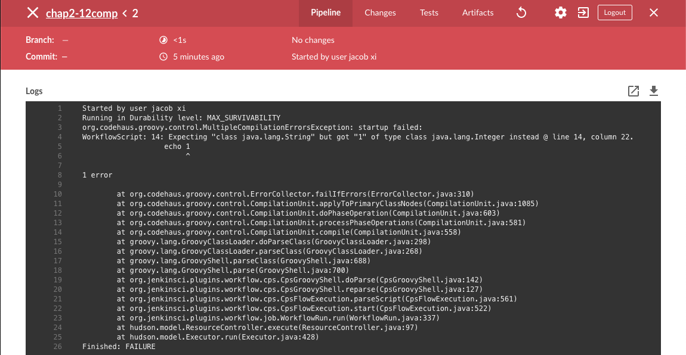
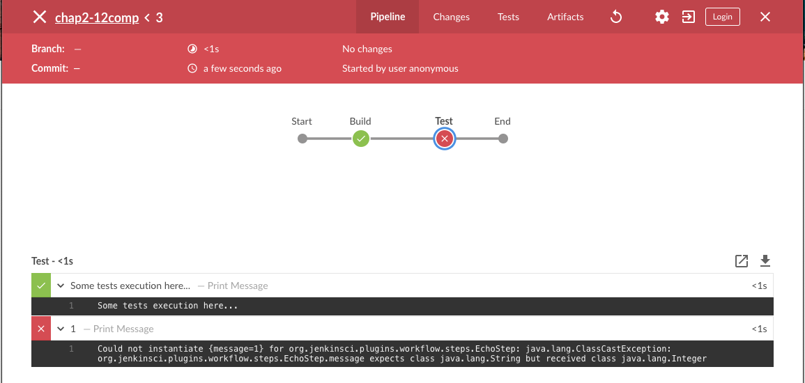
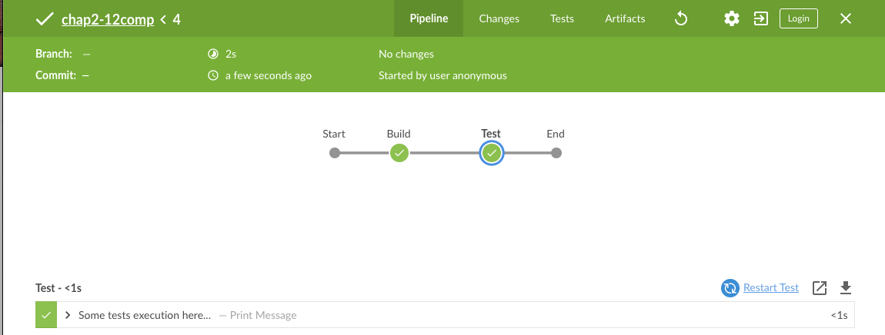
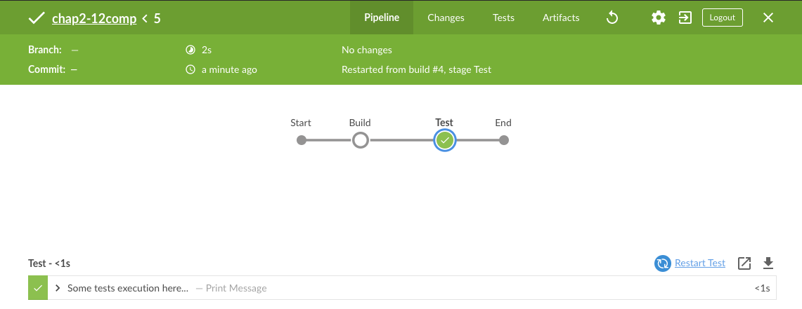
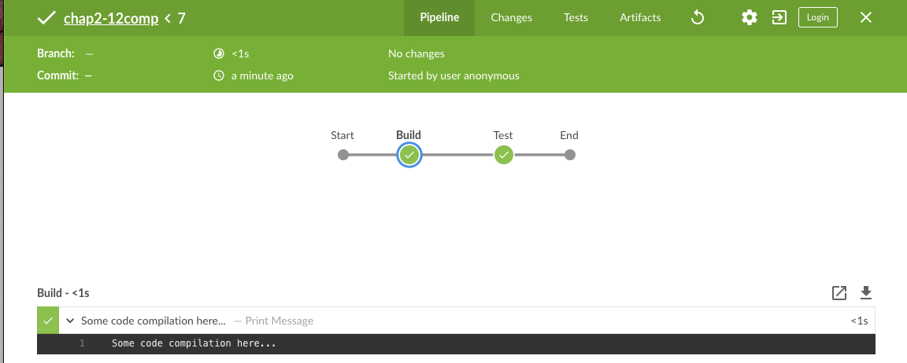
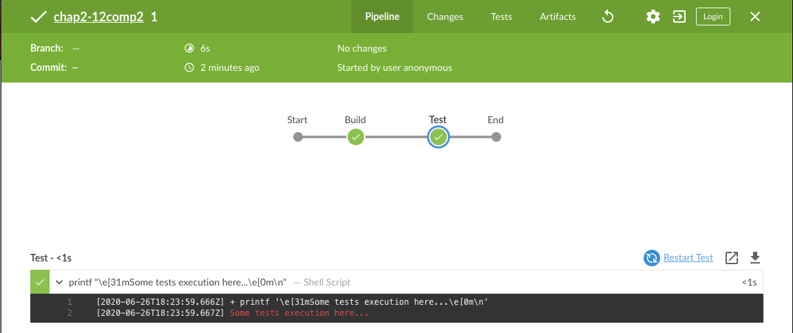
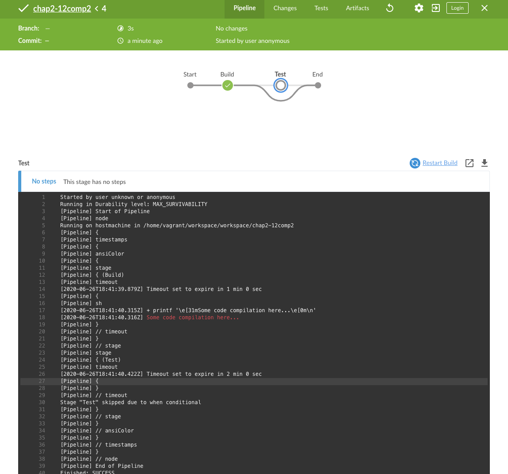
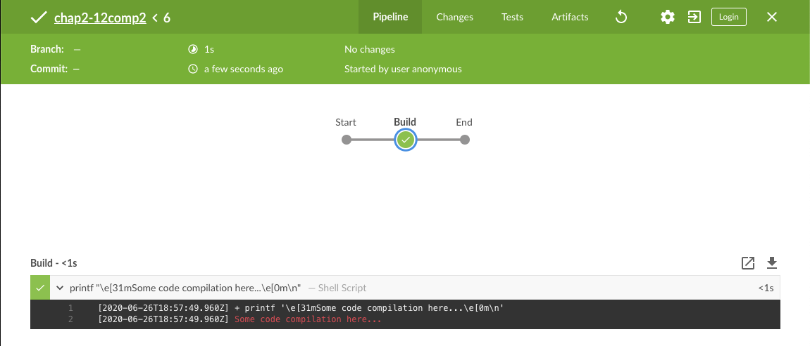

# **第六节 脚本式管道与声明式管道-四个实际差异**

为什么要有两种管道类型？

* 脚本化管道是`Jenkins`中作为代码的管道的第一个实现。即使它使用底层的管道子系统，它还是或多或少地设计为使用`Groovy`构建的通用`DSL`。这意味着它不具有固定的结构，并且由您决定如何定义管道逻辑。
* 声明性管道更自以为是，其结构是明确定义的。可能看起来有些局限。


但实际上，您可以使用脚本化或声明性管道来实现相同的目的。那么选择哪一个呢？如果您问我这个问题，**我会说使用声明性管道**。以下内容这就是为什么。

## 1、管道启动时的代码验证

```
pipeline {
    agent any

    stages {
        stage("Build") {
            steps {
                echo "Some code compilation here..."
            }
        }

        stage("Test") {
            steps {
                echo "Some tests execution here..."
                echo 1
            }
        }
    }
}
```

如果我们尝试运行以下管道，则验证将很快使构建失败。该**日志**显示只能与触发`String`参数，所以我们得到这样的错误。



请注意，管道没有执行任何阶段，只是失败了。这可能为我们节省了很多时间-想象一下执行`Build`阶段几分钟，**而只是获取`echo`步骤希望得到的信息`java.lang.String`而不是`java.lang.Integer`**。


现在，让我们看一下与该示例等效的脚本管道。

```
node {
    stage("Build") {
        echo "Some code compilation here..."
    }

    stage("Test") {
        echo "Some tests execution here..."
        echo 1
    }
}
```



它按预期失败。但是这次是执行**Build**阶段，也是**Test**阶段的第一步。如您所见，没有验证管道代码。在这种情况下，声明式管道可以更好地处理此类用例。

## 2、从指定步骤重新开始

声明式管道具有的另一个很酷的功能是“从阶段重新启动”。让我们修复上一个示例中的管道，看看是否只能重新启动**Test**阶段。

```

pipeline {
    agent any

    stages {
        stage("Build") {
            steps {
                echo "Some code compilation here..."
            }
        }

        stage("Test") {
            steps {
                echo "Some tests execution here..."
            }
        }
    }
}
```

让我们执行它。



在这里您可以看到已选择测试阶段。在右侧的步骤列表上方，**有一个名为“重新启动测试”的选项。让我们单击它并查看结果**。





如您所见，Jenkins跳过了**Build**阶段（它使用了先前构建中的工作空间），并从**Test**阶段开始了下一个管道执行。当您执行一些外部测试并且由于远程环境的某些问题而导致测试失败时，这可能会很有用。您可以使用测试环境解决问题，然后重新运行该阶段，而无需重建所有工件。（在这种情况下，应用程序的代码未更改。）

现在，让我们看一下脚本化管道示例。

```

node {
    stage("Build") {
        echo "Some code compilation here..."
    }

    stage("Test") {
        echo "Some tests execution here..."
    }
}
```



**如您所见，没有重新启动选项。声明式管道与脚本式管道`-2：0`。**

## 3、声明式管道`options`块

两种管道类型都支持第三个功能，但是我认为声明性管道更好地处理了它。假设我们将以下功能添加到上一个管道中。


* 控制台日志中的时间戳。
* ANSI颜色输出。 
* **在1分钟的超时构建阶段，2分钟超时的测试阶段**。

```
pipeline {
    agent any

    options {
        timestamps()
        ansiColor("xterm")
    }

    stages {
        stage("Build") {
            options {
                timeout(time: 1, unit: "MINUTES")
            }
            steps {
                sh 'printf "\\e[31mSome code compilation here...\\e[0m\\n"'
            }
        }

        stage("Test") {
            options {
                timeout(time: 2, unit: "MINUTES")
            }
            steps {
                sh 'printf "\\e[31mSome tests execution here...\\e[0m\\n"'
            }
        }
    }
}
```



这是控制台日志。

```
Started by user unknown or anonymous
Running in Durability level: MAX_SURVIVABILITY
[Pipeline] Start of Pipeline
[Pipeline] node
Running on hostmachine in /home/vagrant/workspace/workspace/chap2-12comp2
[Pipeline] {
[Pipeline] timestamps
[Pipeline] {
[Pipeline] ansiColor
[Pipeline] {
[Pipeline] stage
[Pipeline] { (Build)
[Pipeline] timeout
02:23:57  Timeout set to expire in 1 min 0 sec
[Pipeline] {
[Pipeline] sh
02:23:59  + printf '\e[31mSome code compilation here...\e[0m\n'
02:23:59  Some code compilation here...
[Pipeline] }
[Pipeline] // timeout
[Pipeline] }
[Pipeline] // stage
[Pipeline] stage
[Pipeline] { (Test)
[Pipeline] timeout
02:23:59  Timeout set to expire in 2 min 0 sec
[Pipeline] {
[Pipeline] sh
02:23:59  + printf '\e[31mSome tests execution here...\e[0m\n'
02:23:59  Some tests execution here...
[Pipeline] }
[Pipeline] // timeout
[Pipeline] }
[Pipeline] // stage
[Pipeline] }
[Pipeline] // ansiColor
[Pipeline] }
[Pipeline] // timestamps
[Pipeline] }
[Pipeline] // node
[Pipeline] End of Pipeline
Finished: SUCCESS
```

在声明性管道中，选项与管道脚本逻辑分开。**该脚本管道也支持`timestamps`，`ansiColor`和`timeout`选项，但它需要一个不同的代码**。这是使用脚本化管道表达的相同管道。

```
node {
    timestamps {
        ansiColor("xterm") {
            stage("Build") {
                timeout(time: 1, unit: "MINUTES") {
                    sh 'printf "\\e[31mSome code compilation here...\\e[0m\\n"'
                }
            }
            stage("Test") {
                timeout(time: 2, unit: "MINUTES") {
                    sh 'printf "\\e[31mSome tests execution here...\\e[0m\\n"'
                }
            }
        }
    }
}
```

**我想你看到了问题。在这里，我们仅使用`timestamps`和`ansiColorJenkins`插件**。想象再添加一个或两个插件。声明式与脚本式，3：0。


## 4、用when块跳过阶段。

在此博客文章中我最后要提到的是**`when`声明性管道支持的块**。让我们改进前面的示例并添加以下条件：

* 仅在等于时执行测试阶段。`env.FOO=bar`

这是声明性管道代码的外观。

```
pipeline {
    agent any

    options {
        timestamps()
        ansiColor("xterm")
    }

    stages {
        stage("Build") {
            options {
                timeout(time: 1, unit: "MINUTES")
            }
            steps {
                sh 'printf "\\e[31mSome code compilation here...\\e[0m\\n"'
            }
        }

        stage("Test") {
            when {
                environment name: "FOO", value: "bar"
            }
            options {
                timeout(time: 2, unit: "MINUTES")
            }
            steps {
                sh 'printf "\\e[31mSome tests execution here...\\e[0m\\n"'
            }
        }
    }
}
```

然后执行它。



```
node {
    timestamps {
        ansiColor("xterm") {
            stage("Build") {
                timeout(time: 1, unit: "MINUTES") {
                    sh 'printf "\\e[31mSome code compilation here...\\e[0m\\n"'
                }
            }
            if (env.FOO == "bar") {
                stage("Test") {
                    timeout(time: 2, unit: "MINUTES") {
                        sh 'printf "\\e[31mSome tests execution here...\\e[0m\\n"'
                    }
                }
            }
        }
    }
}
```

**如您所见，我们必须使用`if-condition`来检查是否`env.FOO`等于`bar`，然后才添加`Test`阶段。**（不幸的是，这并不是真正的跳过。）让我们运行它，看看结果如何。



这是不同的结果。在脚本化管道用例中，甚至不会呈现“ 测试”阶段。在我看来，这可能会带来一些不必要的混乱，声明性管道会更好地处理它。声明式与脚本式，`4：0`。


