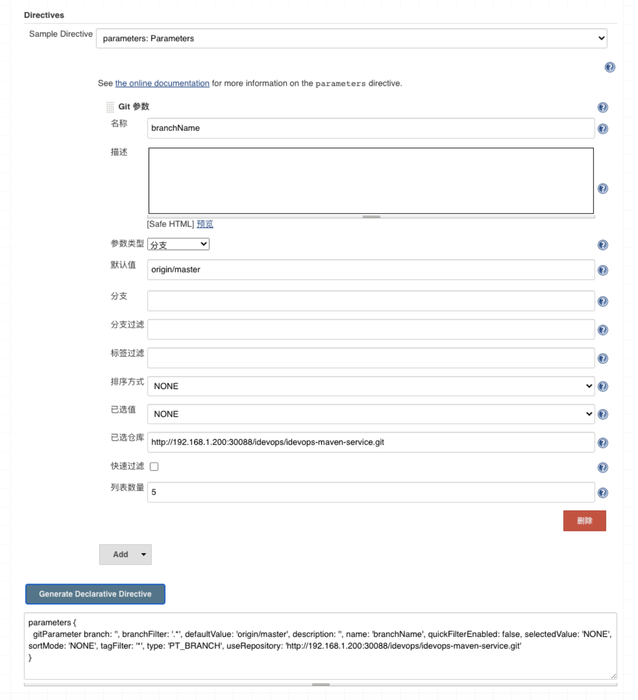

# 第七节 使用Jenkins Git参数实现分支标签动态选择

## 1、为什么要使用Git参数？

我们为什么要使用 git参数呢？每个项目代码库都会有不同的分支，（如果你没有用多分支流水线的情况下）对于普通的流水线项目我们可以 让一条流水线来支持多个分支的发布，其实有时候你会发现每个分支的集成步骤都是差不多的。如果出现差异步骤我们也可以在`jenkinsfile`中根据不同的分支执行不同的stage。

如何解决固定分支问题？起初我们的流水线项目配置分支可能是采用的选项参数。创建一个选项参数然后把项目经常用到的分支给更新上去，最后开发人员在发布的时候来选择对应的分支。看似解决了固定分支问题，但是后期维护起来非常困难，需要不断的更改参数值。

创建一个字符参数设置一个默认值，然后 交给开发人员自己填写。这样的确方便了配置管理人员，给开发人员增加了负担，手动输入避免不了带来了错误发生的可能。

我们来通过下面的内容，掌握如何使用 git参数实现动态分支构建呢？

## 2、在Pipeline项目中使用

这里把普通的pipeline项目定义为 未将Jenkinsfile内容保存在版本控制系统中，而是存储在该JOB中。

### 2-1 普通的Pipeline项目

**首先我们添加一个`srcUrl`参数定义项目代码库的地址，便于后期在`pipeline`中调用。**

* `srcUrl`: `http://192.168.1.200:30088/idevops/idevops-maven-service.git`
* `branchName `: `origin/master`

编写`Jenkinsfile`

```
//pipeline
pipeline{
    agent { node { label "build"}}
    
    
    stages{

        stage("CheckOut"){
            steps{
                script{
                   
                    println("${branchName}")
                
                    checkout([$class: 'GitSCM', branches: [[name: "${branchName}"]], 
                              doGenerateSubmoduleConfigurations: false, 
                              extensions: [], 
                              submoduleCfg: [], 
                              userRemoteConfigs: [[credentialsId: 'gitlab-admin-user', 
                              url: "${srcUrl}"]]])

                }
            }
        }
    }
}
```


对于将`jenkinsfile`保存在作业中，这种方式有利有弊，好处是可以方便我们进行代码调试，坏处是不利于统一管理。大家酌情使用。

### 2-2 流行的Pipeline项目

这里流行的`Pipeline`项目我们理解为此`job`使用的`jenkinsfile`文件存储在`git`版本控制系统中。

首先我们创建一个测试`jenkinsfile`,保存在`git`项目中，命名为`git.jenkinsfile`。此文件内容与上面那种方式是一样的，只不过将`jenkinsfile`纳入了版本控制。

```
//pipeline
pipeline{
    agent { node { label "build"}}
    
    
    stages{

        stage("CheckOut"){
            steps{
                script{
                   
                    println("${branchName}")
                
                    checkout([$class: 'GitSCM', branches: [[name: "${branchName}"]], 
                              doGenerateSubmoduleConfigurations: false, 
                              extensions: [], 
                              submoduleCfg: [], 
                              userRemoteConfigs: [[credentialsId: 'gitlab-admin-user', 
                              url: "${srcUrl}"]]])

                }
            }
        }
    }
}
```

然后我们来创建一个新的流水线项目。**注意情况我们现在用到了两个仓库，一个是`Jenkinsfile`仓库，另一个是项目代码仓库。创建一个参数`srcUrl`用于存储项目代码仓库的`URL`。**

默认`git`参数会识别到`Jenkinsfile`的仓库，所以我们需要在git参数的高级设置中指定我们要使用的仓库地址。80%错误因为没有指定仓库导致获取分支错误等问题。

### 2-3 使用Pipeline as Code

我们将参数信息全部放到Jenkinsfile中存储。此时生成的代码就不区分在作业中保存还是在版本控制系统中保存了。**不过还是建议大家把`jenkinsfile`纳入版本控制系统中保存。**

我们如何生成Jenkinsfile代码？很方便的工具，我们导航到 流水线语法-> Declarative Directive Generator 。



最后完整的Jenkinsfile如下所示：

```
//pipeline
pipeline{
    agent { node { label "build"}}
    
    parameters {
      string defaultValue: 'http://192.168.1.200:30088/idevops/idevops-maven-service.git', 
             description: '', 
             name: 'srcUrl', 
             trim: false
             
      gitParameter  branch: '', 
                    branchFilter: '.*', 
                    defaultValue: 'origin/master', 
                    description: '', 
                    name: 'branchName', 
                    quickFilterEnabled: false, 
                    selectedValue: 'NONE', 
                    sortMode: 'NONE', 
                    tagFilter: '*', 
                    type: 'PT_BRANCH', 
                    useRepository: 'http://192.168.1.200:30088/idevops/idevops-maven-service.git'
    
    }
    stages{

        stage("CheckOut"){
            steps{
                script{
                   
                    println("${branchName}")
                
                    checkout([$class: 'GitSCM', branches: [[name: "${branchName}"]], 
                              doGenerateSubmoduleConfigurations: false, 
                              extensions: [], 
                              submoduleCfg: [], 
                              userRemoteConfigs: [[credentialsId: 'gitlab-admin-user', 
                              url: "${srcUrl}"]]])

                }
            }
        }
    }
}
```

同样的配置过程，我们构建 一次之后就能够 正常获取到项目代码库的分支信息了。


