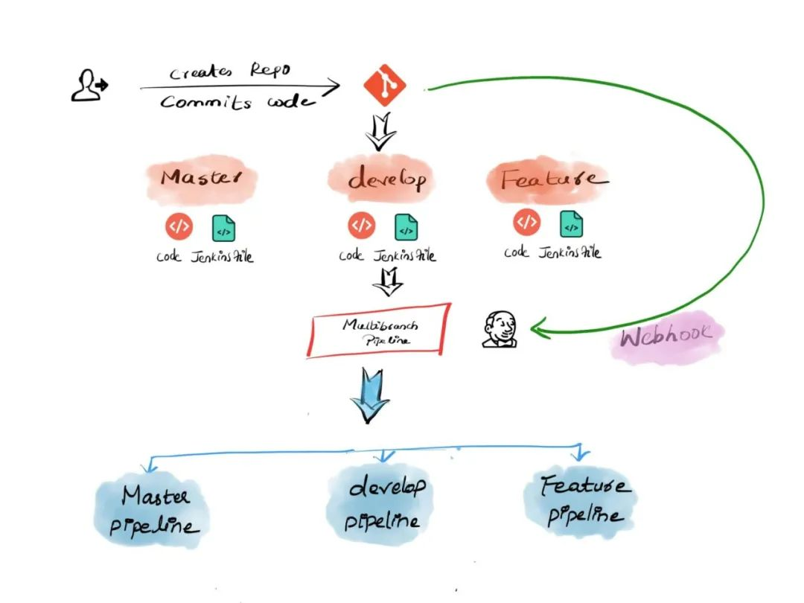

# **第八节 多分支类型管道- 基于Jenkinsfile自动创建Pipeline(2023)**

> Jenkins多分支管道是设计CI/CD工作流的最佳方法之一，因为它完全是基于git的pipeline as code

多分支管道是一种基于Git分支自动创建Jenkins Pipeline的概念。这意味着，它可以在SCM（Github）中创建时自动发现新的Git分支，并自动为该分支创建管道。当管道构建开始时，Jenkins在该分支中使用Jenkinsfile进行构建阶段。

SCM可以是Github，Bitbucket或Gitlab存储库。



```
stage ('Deploy for production') {
	when {
		branch 'production'
	}
	
	steps {
		...
	}
}
```

因此，每当开发人员将PR从功能分支提交到其他分支时，管道将运行单元测试和Sonar分析阶段，从而跳过部署阶段。而且，多分支流水线不仅限于连续交付应用程序。您也可以使用它来管理基础结构代码

## 多分支管道如何工作？

我将引导您完成基本的构建和部署工作流程，以了解多分支管道的工作方式。

假设我希望Jenkins管道在以下条件下构建和部署应用程序。

1. 开发人员通过向功能分支提交代码来从功能分支开始。
2. 每当开发人员从功能分支提PR来开发分支时，**Jenkins管道都应触发以运行单元测试和静态代码分析**。
3. 在功能分支中成功测试代码后，开发人员将PR合并到开发分支。
4. 当代码准备发布时，开发人员将PR从develop分支提到master。它应该触发一个构建管道，该管道将运行单元测试用例，代码分析并将其部署到dev / QA环境。

通过Jenkins多分支管道可以轻松实现此工作流程。下图显示了以上示例构建过程的多分支管道工作流的外观


这是多分支管道的工作方式。

1. 当开发人员从功能分支创建PR来开发分支时，Github将带有PR信息的Webhook发送给Jenkins。
2. Jenkins收到PR，并找到相关的多分支管道并自动创建分支管道。
	* 然后，它按照功能分支中Jenkinsfile中提到的步骤运行作业。
	* 签出期间，PR中的源分支和目标分支将合并。
	* PR合并将在Github上被阻止，直到从Jenkins返回构建状态为止
3. 构建完成后，Jenkins会将状态更新为Github PR。现在您将能够合并代码。
	* 另外，如果您想查看Jenkins构建日志，则可以在PR状态下找到Jenkins构建日志链接。

## 多分支Pipleline Jenkinsfile

在开始实施之前，让我们看一下可在管道中使用的多分支管道Jenkins示例Jenkinsfile。

为了使多分支管道正常工作，您需要在SCM存储库中包含Jenkinsfile。

如果您正在学习/测试，则可以使用下面提供的多分支管道Jenkinsfile。它具有一个检出阶段和其他阶段，它们会回显消息。

另外，您可以克隆并使用具有此Jenkinsfile的Github存储库

> 注意：将代理标签“ master”替换为您的Jenkins代理名称。master也可以工作，但不建议它在实际的项目环境中运行。

```
pipeline {

  agent {
      node {
          label 'master'
      }
  }

  options {
      buildDiscarder logRotator(
                  daysToKeepStr: '16',
                  numToKeepStr: '10'
          )
  }

  stages {
       
      stage('Cleanup Workspace') {
          steps {
              cleanWs()
              sh """
              echo "Cleaned Up Workspace For Project"
              """
          }
      }

      stage('Code Checkout') {
          steps {
              checkout([
                  $class: 'GitSCM',
                  branches: [[name: '*/main']],
                  userRemoteConfigs: [[url: 'https://github.com/spring-projects/spring-petclinic.git']]
              ])
          }
      }

      stage(' Unit Testing') {
          steps {
              sh """
              echo "Running Unit Tests"
              """
          }
      }

      stage('Code Analysis') {
          steps {
              sh """
              echo "Running Code Analysis"
              """
          }
      }

      stage('Build Deploy Code') {
          when {
              branch 'develop'
          }
          steps {
              sh """
              echo "Building Artifact"
              """

              sh """
              echo "Deploying Code"
              """
          }
      }

  }  
}
```

## 设置Jenkins多分支管道

在这里，我将逐步引导您逐步在Jenkins上建立多分支管道。该设置将基于Github和最新的Jenkins 2.x版本。您还可以将Bitbucket或Gitlab用作多分支管道的SCM源。

步骤1：在Jenkins主页上创建一个“新项目”。


步骤2：从选项中选择“多分支管道”，然后单击“确定”。


步骤3：点击“添加来源”，然后选择Github。


步骤4：在认证字段下，选择Jenkins并使用您的Github用户名和密码创建一个认证。


步骤5：选择创建的凭据，然后提供您的Github存储库以验证凭据，如下所示。

如果您正在测试多分支管道，则可以克隆演示Github存储库并使用它。

[https://github.com/devopscube/multibranch-pipeline-demo](https://github.com/devopscube/multibranch-pipeline-demo)。


第6步：选择所需的选项以符合您的要求。您可以选择发现存储库中的所有分支，也可以仅选择具有“拉取请求”的分支。

管道还可以从分叉的仓库中发现具有PR的分支。

选择这些选项取决于所需的工作流程。


您可以从“添加”按钮中选择其他行为。

例如，如果选择不从存储库中发现所有分支，则可以选择正则表达式或通配符方法从存储库中发现分支，如下所示。


**这是一个正则表达式和通配符示例。**


步骤7：如果选择为Jenkinsfile使用其他名称，则可以通过在构建配置中指定名称来实现。

在“脚本路径”选项中，您可以提供所需的名称。确保仓库中的Jenkinsfile与您在管道配置中提供的名称相同。

另外，启用“放弃旧版本”以仅保留所需的生成日志，如下所示。


步骤8：保存所有作业配置。Jenkins扫描已配置的Github存储库，以查找所有提升了PR的分支。

下图显示了扫描三个分支的作业，并且由于我没有提出任何拉取请求，Jenkins不会创建任何基于分支的管道。我将展示如何在设置Webhook之后测试自动管道创建。


到目前为止，我们已经在Jenkins完成了配置，可以根据PR请求扫描分支。

为了拥有完整的工作流程，我们需要在Github中配置一个Webhook，以将所有事件（提交，PR等）发送给Jenkins，因为可以自动触发管道。

## **为多分支管道配置Webhook**

请按照以下步骤在存储库上设置Jenkins Webhook。

第1步：转到Github存储库，然后单击设置。


步骤2：选择左侧的webhook选项，然后单击“添加Webhook”按钮。


**步骤3：在有效负载URL下添加您的Jenkins URL，后跟“ `**/github-webhook /`**”。选择内容类型为“ `application/json`”，然后单击“添加Webhook”**

注意：您可以选择要在Jenkins中接收的Webhook类型。例如，您只想在PR期间触发管道。然后，您可以从“让我选择单个事件”选项中仅选择PR事件。


您将在成功的 Webhook配置上看到一个绿色的勾号 ，如下所示。


如果您没有看到绿色的勾号或警告标志，请单击Webhook链接，然后单击最后一个Webhook。您应该能够使用状态代码查看为什么Webhook传递失败。


现在，我们完成了多分支管道的所有必需配置。下一步是测试多分支管道工作流触发器。

## 测试多分支管道


出于演示目的，我选择了“仅将分支作为PR的分支”选项。使用此选项，仅发现具有PR请求的分支。

要使用多分支管道，可以将此回购与示例Jenkinsfile一起使用。https://github.com/devopscube/multibranch-pipeline-demo

这个仓库有三个分支。更新功能分支中自述文件中的某些内容，并提高PR以进行开发。它将向Jenkins发送一个Webhook，并且Jenkins将发送回Jenkins的工作详细信息，并且PR将进入检查状态，如下所示。


如果单击“详细信息”，它将带您到Jenkins构建日志。您可以在您的Jenkins文件中编写自定义检查，以用于构建审核。

现在，如果您选择了Jenkins，您将在Jenkins中找到功能分支的管道，如下所示。


**如果构建失败，则可以将更改提交到功能分支，并且只要PR打开，它将触发功能管线**。

在Jenkinfile中，如果分支未开发，我添加了一个条件以跳过部署阶段。您可以在Jenkins构建日志中进行检查。另外，如果您在**蓝海仪**表板中检查构建流程，则可以清楚地看到跳过的部署阶段，如下所示。


现在合并功能分支PR并将新的PR从development提升到master分支。

Jenkins将收到来自Github的Webhook，以获取新的PR，并如下所示创建开发管道。


对于开发分支，启用了部署阶段，如果您检查了Blue Ocean的构建流程，则可以看到所有阶段都已成功触发。


## **对多分支管道进行故障排除**

我将讨论在多分支管道中可能会遇到的一些错误，以及如何解决这些错误。

分支发现问题

有时，即使在SCM中创建了新分支之后，它也可能不会反映在Jenkins管道中。您可以尝试运行“立即扫描存储库”选项以再次扫描存储库。另外，检查管道中的存储库扫描配置。

Webhooks 不会触发管道

当Webhook没有触发管道时，请检查Github中的Webhook交付状态代码和错误。另外，请检查Jenkins URL是否正确。

还要从Manage Jenkins-> System Logs-> All Jenkins日志中检查Jenkins日志。如果Jenkins能够接收Webhook，则日志应显示未触发作业的原因。
