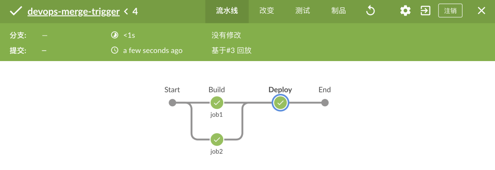

# **第九节 实践-Jenkins 声明式管道中的动态并行阶段 2023**

在 Jenkins Pipeline 中，parallel 是一个用于在不同的 agent 节点上并行执行多个步骤的语句。

通过使用 parallel，可以在减少构建时间的同时提高其效率。

### Parallel使用方法

在 script 标签中定义一个 HashMap 变量 jobs，用于存储需要并行执行的任务。

```
def jobs = [:]
```

在 jobs 中添加需要并行执行的任务。每个任务都需要定义一个唯一的名称、代理和一组步骤。

```
jobs["job1"] = {
    stage("job1") {
        steps{
           script {
                sh "echo 123"
            }
        }
    }
}


jobs["job2"] = {
    stage("job2") {
        steps{
           script {
                sh "echo 123"
            }
        }
    }
}
```

在 parallel 语句中使用 jobs 变量并行执行这些任务。

```
parallel jobs
```

以下是一个完整的例子，

```
pipeline {
    agent any
    stages {
        stage('Build') {
            steps {
                script {
                    def jobs = [:]
                    jobs["job1"] = {
                        stage("job1") {
                            sh "echo 123"
                        }
                    }
                    jobs["job2"] = {
                        stage("job2") {
                            sh "echo 123"
                        }
                    }
                    parallel jobs
                }
            }
        }
        stage('Deploy') {
            steps {
                echo 'Deploying'
            }
        }
    }
}
```



## CollectEntries用法

collectEntries 是 Groovy 的一个方法，用于将一个键值对集合转换成一个 Map。

该方法可以对集合进行遍历处理，并将每个元素转换成一个 Map 的一个键值对，从而生成一个新的 Map。

在 Jenkins Pipeline 中，collectEntries 可以用于处理多个项目，将其转换为一个 Map 并进行进一步处理。

```
pipeline {
    agent any
    stages {
        stage('Collect entries') {
            steps {
                script {
                    def projects = [
                        'Project 1': 5,
                        'Project 2': 3,
                        'Project 3': 1,
                        'Project 4': 2
                    ]
                    
                    def priorityMap = projects.collectEntries {
                        [it.key, it.value * 10]
                    }
                    
                    // Output the new map
                    echo "${priorityMap}"
                }
            }
        }
    }
}
```

在这个 Pipeline 示例中，我们定义了一个具有四个项目的简单列表，并使用 collectEntries 将其转换为一个新的 Map。

**在 collectEntries 中，我们对每个 Map 元素(key-value对)进行了处理，将其值(value)乘以 10 生成新的值，并将其作为新 Map 的值(value)。**

```
// Example function that would return an array of jobs to deploy
def getjobsToDeploy() {
    def jobList = []
    for (int i = 0; i < 5; i++) {
        jobList << "buildjob" + i.toString()
    }
  return jobList
}

// Convert array of jobs to map of stages
def getDeployStages() {
  return getjobsToDeploy().collectEntries { job ->
    [
      (job): {
        stage("deploy ${job}") {
          sh "ls "
        }
      }
    ]
  }
}

def getTestStages() {
  return getjobsToDeploy().collectEntries { job ->
    [
      (job): {
        stage("test ${job}") {
          sh "ls "
        }
      }
    ]
  }
}

pipeline {
  agent any
  stages {
    // other stages...
    stage('Deploy') {
      steps {
        script {
          // Directly pass the map of stages to `parallel`
          parallel getDeployStages()
          
        }
      }
    }

    stage('Test') {
      steps {
        script {
          parallel getTestStages() 
        }
      }
    }
  }
}
```