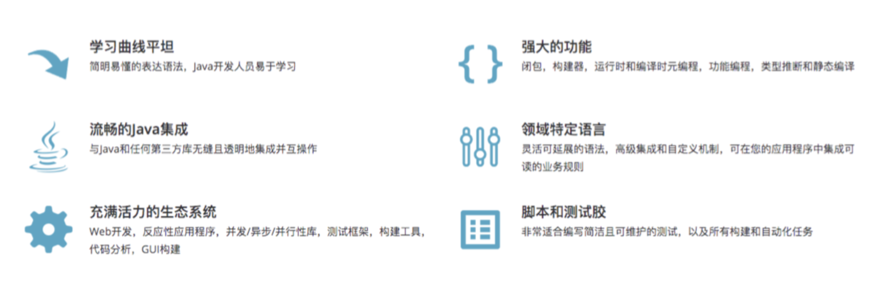
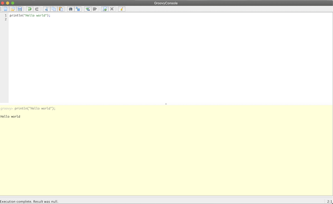
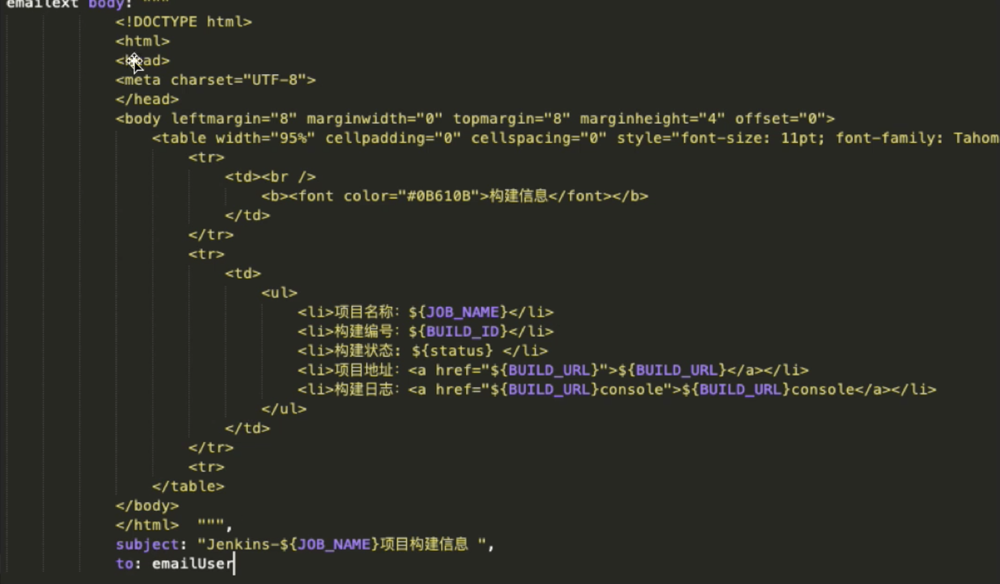

# 第二节 Groovy 基础

## 1、 字符串与列表

### 1-1 Groovy - 简介

* `Groovy`是一种**功能强大，可选类型和动态语言**，支持Java平台 
* 旨在提高开发人员的生产力得益于简洁，**熟悉且简单易学的语法**。 
* 可以与任何Java程序顺利集成，并立即为您的应用程序提供强大的功能， 包括脚本编写功能，**特定领域语言编写**，运行时和编译时**元编程**以及**函数式**编程 




### 1-2 Install Groovy

https://groovy-lang.org/install.html

You should now have Groovy installed properly. You can test this by typing the following in a command shell:

```
groovysh
```
```
$ groovysh
Groovy Shell (3.0.4, JVM: 13.0.2)
Type ':help' or ':h' for help.
--------------------------------------------------------------------------------------------------------------------------------------------------------
groovy:000> println("hello world");
hello world
===> null
```

Which should create an interactive groovy shell where you can type Groovy statements. 

```
groovyConsole
```



To run a specific Groovy script type:

```
groovy SomeScript
```

### 1-3 Groovy 数据类型

* 字符串表示：单引号、双引号、三引号 
* 常用方法： 
	* `contains()`工是否包含特定内容返回true false 
	* `size()` `length()`字符串数量大小长度 
	* `toString()` 转换成`string`类型 `indexOf()`
	* 元素的索引 `endsWith()` 是否指定字符结尾 
	* `minus() plus()` 去掉、增加字符串 
	* `reverse()` 反向排序 
	* `substring(1,2)`字符串的指定索引开始的子字符串 
	* `toUpperCase() toLowerCase()`字符串大小写转换 
	* `split()`字符串分割默认空格分割返回列表 


```
groovy:000> "devsecurityops".contains("ops")
===> true
groovy:000> "devsecurityops".contains("users")
===> false
groovy:000> "devsecurityops".endsWith("ops")
===> true
groovy:000> "devsecurityops".endsWith("abc")
===> false
groovy:000> "devsecurityops".length()
===> 14
groovy:000> "devsecurityops".size()
===> 14
groovy:000> "dev"+"ops"
===> devops
groovy:000> "devops" - "dev"
===> ops
```

```
groovy:000> "devops".toUpperCase()
===> DEVOPS
groovy:000> "DEVOPS".toLowerCase()
===> devops
```

```
 "dev1,dev2,dev3"
===> dev1,dev2,dev3

groovy:000>  "host1,host2,host3".split(',')
===> [host1, host2, host3]

groovy:000> hosts = "host1,host2,host3".split(',')
===> [host1, host2, host3]

groovy:000> for( i in hosts){
groovy:001>   println(i)
groovy:002> }
host1
host2
host3
===> null

groovy:000> result = [1,2,3,4].add(5)
===> true
```

### 1-4 Groovy数据类型一list 

* 列表符号：[]
* 常用方法
	*  `＋ - ＋ -=` 元素增加减少 
	* `add() <<`  添加元素 
	* `isEmpty()`判断是否为空 
	* `intersect([2,3]) disjoint([1]）` 取交集、判断是否有交集 
	* `flatten(）` 合并嵌套的列表 
	* `unique()`去重 
	* `reverse()` `sort()`反转升序 
	* `count()` 元素个数 
	* `join(）` 将元素按照参数链接 
	* `sum() min() max(）` 求和最小值最大值 
	* `contains()` 包含特定元素 
	* `remove(2) removeAll()`
	* `each{}`遍历 

```
groovy:000> []
===> []
groovy:000> [1,2,3,4] + 4
===> [1, 2, 3, 4, 4]
groovy:000> [1,2,3,4] + 46
===> [1, 2, 3, 4, 46]
groovy:000> [1,2,3,4] << 14
===> [1, 2, 3, 4, 14]
groovy:000> result = [1,2,3,4].add(5)
===> true
groovy:000> print(result)
true===> null
groovy:000> [2,3,4,5,6,6,6].unique()
===> [2, 3, 4, 5, 6]
groovy:000> [2,3,4,5,6,6,6].join("-")
===> 2-3-4-5-6-6-6
groovy:000> [2,3,4,5,6,6,6].each{
groovy:001> println it}
2
3
4
5
6
6
6
===> [2, 3, 4, 5, 6, 6, 6]
```

## 2、 字典条件语句与循环

本节介绍 Groovy 基础语法中的字典条件语句循环语句。

### 2-1 Groovy数据类型一Map

* 表示： `[:]` 
* 常用方法： 
	* `size() map` 大小 
	* `['key'].key  get()` 获取`value` 
	* `isEmpty ()` 是否为空 `containKey ()` 是否包含`key` 
	* `containValue （）`是否包含指定的`value` 
	* `keySet (）` 生成`key`的列表 
	* `each{}`遍历map 
	* `remove( 'a'）`删除元素`(k-v)` 

```
groovy:000> [:]
===> [:]
groovy:000> [1:2]
===> [1:2]
groovy:000> [1:2][1]
===> 2

groovy:000> [1:2,3:4,5:6].keySet()
===> [1, 3, 5]
groovy:000> [1:2,3:4,5:6].values()
===> [2, 4, 6]

groovy:000> [1:2,3:4,5:6]+[7:8]
===> [1:2, 3:4, 5:6, 7:8]

groovy:000> [1:2,3:4,5:6]-[1:2]
===> [3:4, 5:6]
```

### 2-2 Groovy条件语句一if

```
if（表达式）{ 
	//xxxx 
	} else if（表达式2) {
	//xxxxx 
	} else { 
	// 
	} 
```
```
groovy:000> buildType = "maven"
===> maven
groovy:000> if (buildType == "maven"){
groovy:001>   println("This is a maven project");
groovy:002> } else if(buildType == "gradle"){
groovy:003>   println("project type error");
groovy:004> }
This is a maven project
===> null
```

### 2-3 Groovy条件语句一switch

```
switch(" ${buildType}")
{ 
	case: "maven":
	//xxxx 
	break;
	case "ant": 
	//xxxx 
	break; 
	default:
	//xxxx 
}
```
```
buildType = "maven";
switch("${buildType}"){ 
case 'maven': 
	println("This is a maven project !"); 
	break;
	;;
	case 'gradle': 
	println("This is a gradle projects !"); 
	break;
	;; 
	default: 
	println("Project Type Error");
	;;
}
```
```
$ groovy switch.groovy 
This is a maven project !
```

```
groovy:000> langs = ["java","python","ruby"]
===> [java, python, ruby]

$ groovy for.groovy 
lang is java
lang is python
lang is ruby
```


## 3、函数使用

### 3-1 `def `定义函数语法：

```
 def PrintMes(Value){ 
 	printin(Value) 
 	//xxxx 
 	return value 
 } 
```

```
def PrintMes(info){ 
	println (info) 
	return info 
} 

response = PrintMes("DevOps") 
println(response) 
```

### 3-2 Groovy正则表达式 

```
@NonCPS 
String getBranch(String branchName){ 
	def matcher = （branchName =~ "RELEASE-[0-9]{4}") 
	if (matcher.find()) { 
		newBranchName = matcher[0] 
		} else { 
		newBranchName = branchName 
		) 
	newBranchName 
} 

newBranchName = getBranch(branchName) 
println("New branch Name" ----> ${newBranchName}") 
```

## 4、 常用的 Pipeline DSL 方法

### 4-1 常用	DSL-	`readJSON`- JSON 数据格式化

```
def response = readJSON text: "${scanResult}" 
println(scanResult) 

//原生方法

import groovy.json.* 

@NonCPS 

def GetJson(text) {
	def prettyJson = JsonOutput.prettyPrint(text) 
	new JsonSlurperClassic().parseText(prettyJson) 
}
```

### 4-2 常用DSL-`withCredentials` 

```
withCredentias([string(credentialsId: "xxxxx", variable: "sonarToken")])
{ 
	printin(sonarToken) 
} 
```

### 4-3 常用DSL一`checkout `

```
//Git 
checkout([$class: 'GitSCM', branches:  [[name: "branchName"]], 			
			doGenerateSubmoduleConfigurations: false, 
			extensions: [], submoduleCfg: [], 
			userRemoteConfigs: [[credentialsId: "${credentialsId}", 
			url: "${srcUrl}"]]])
			
//Svn 
checkout([$class: 'SubversionSCM', additionalCredentials: [], 
			filterChangelog: false, ignoreDirPropChanges: false, 
			locations: [[credentialsId: "${credentialsId}", 
			depthOption: 'infinity', ignoreExternalsOption: true, 
			remote: "${svnUrl}"]], workspaceUpdater: [$class: 'CheckoutUpdater']] 
) 
```

### 4-4常用DSL一 `publishHTML `

```
publishHTML([allowMissing: false, 
	alwaysLinkToLastBuild: false, 
	keepAll: true, 
	reportDir: './report/', 
	reportFiles: "a.html, b.html", 
	reportName: 'InterfaceTestReport', 
	reportTitles: 'HTML'
])
```

### 4-5常用DSL 一 `input `

```
def result = input message: '选择xxxxx’, 
				ok: '提交',
				parameters: [extendedChoice( 
						description: 'xxxxx', 
						descriptionPropertyValue:'', 
						multiSelectDelimiter: ',', 
						name: 'failePositiveCases', 
						quoteValue: false, 
						saveJSONParameterToFile: false, 
						type: 'PT_CHECKBOX', 
						value: "1,2,3", 
						visibleltemCount: 99)] 
println(result) 
```

### 4-6 常用DSL-`BuildUser`

```
wrap([$class: 'BuildUser']) {
	echo "full name is $BUILD_USER" 
	echo "user id is $BUILD_USER_ID" 
	echo "user email is $BUILD_USER_EMAIL"  
}
```

### 4-7 常用DSL一 `httpRequest`

```
ApiUrl = "http://xxxxxx/api/project_branches/list?project=${projectName}" 
Result = httpRequest authentication: 'xxxxxxxxx', 
	quiet: true, 
	contentType: 'APPLICATION_JSON' , 
	url: "${ApiUrl}" 
``` 

### 4-8 常用DSL一 `email`


