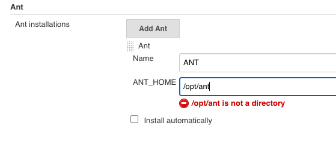
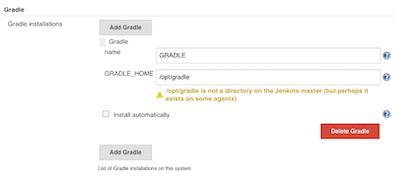
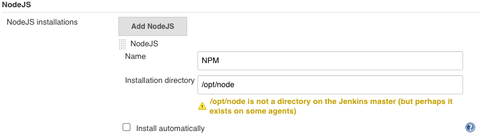
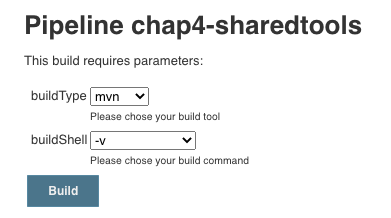

# 第一节 构建工具集成

## 1、集成 Maven 构建工具


### 1-1 安装`maven`

https://maven.apache.org/download.cgi

```
$  java -version
openjdk version "1.8.0_252"
OpenJDK Runtime Environment (build 1.8.0_252-b09)
OpenJDK 64-Bit Server VM (build 25.252-b09, mixed mode)

$ sudo yum install java-1.8.0-openjdk-devel
$ javac -version
javac 1.8.0_252
```

```
tar zxf apache-maven-3.6.3-bin.tar.gz -C /usr/local/

vim /etc/profile

#设置全局变量(/etc/profile)
export JAVA_HOME=/usr/local/jdk1.8.0_252
export M2_HOME = /usr/local/apache-maven-3.6.3 
export PATH=$PATH:$JAVA_HOME/bin:$M2_HOME


source /etc/profile
```

#### 安装`Maven on Centos`

```
https://linuxize.com/post/how-to-install-apache-maven-on-centos-7/
wget https://www-us.apache.org/dist/maven/maven-3/3.6.3/binaries/apache-maven-3.6.3-bin.tar.gz -P /tmp
sudo tar xf /tmp/apache-maven-3.6.3-bin.tar.gz -C /opt
sudo ln -s /opt/apache-maven-3.6.3 /opt/maven
sudo vim /etc/profile.d/maven.sh

export JAVA_HOME=/usr/lib/jvm/jre-openjdk
export M2_HOME=/opt/maven
export MAVEN_HOME=/opt/maven
export PATH=${M2_HOME}/bin:${PATH}

sudo chmod +x /etc/profile.d/maven.sh

source /etc/profile.d/maven.sh

$ mvn -version
Apache Maven 3.6.3 (cecedd343002696d0abb50b32b541b8a6ba2883f)
Maven home: /opt/maven
Java version: 1.8.0_252, vendor: Oracle Corporation, runtime: /usr/lib/jvm/java-1.8.0-openjdk-1.8.0.252.b09-2.el7_8.x86_64/jre
Default locale: en_US, platform encoding: UTF-8
OS name: "linux", version: "3.10.0-957.12.2.el7.x86_64", arch: "amd64", family: "unix"

$ whereis mvn
mvn: /opt/apache-maven-3.6.3/bin/mvn.cmd /opt/apache-maven-3.6.3/bin/mvn
```

### 1-2 集成`maven`

* 常用命令 
	* `clean`清理构建目录 
	* `clean package`打包 
	* `clean install`打包部署 
	* `clean test`单元测试 

* Jenkins 配置 `maven`


```
stage("Build"){
	 mvnHome = "/opt/apache-maven-3.6.3/bin/mvn" 
	 sh "${mvnHome}/mvn clean package " 
}
```
**`maven.jenkinsfile`**

```
#!groovy
pipeline {
 	agent { node { label "hostmachine" }}
 	stages{
		stage('tools') {
	        steps {
	        	script {
	            	mvnHome = tool "m2"
	            	sh "${mvnHome}/bin/mvn --version"
	            } 
	        }
	    }
    }
 }
```

```
...
[Pipeline] tool
[Pipeline] sh
+ /opt/maven/bin/mvn --version
Apache Maven 3.6.3 (cecedd343002696d0abb50b32b541b8a6ba2883f)
Maven home: /opt/maven
Java version: 1.8.0_252, vendor: Oracle Corporation, runtime: /usr/lib/jvm/java-1.8.0-openjdk-1.8.0.252.b09-2.el7_8.x86_64/jre
Default locale: en_US, platform encoding: UTF-8
OS name: "linux", version: "3.10.0-957.12.2.el7.x86_64", arch: "amd64", family: "unix"
...
```

## 2、集成 Ant 构建工具


* https://ant.apache.org/bindownload.cgi

### 2-1 安装Ant

```
unzip apache-ant-1.9.15-bin.zip
sudo mv apache-ant-1.9.15 /opt/ant
sudo ln -s /opt/ant/bin/ant /usr/bin/ant

sudo vim /etc/profile.d/ant.sh

#!/bin/bash
ANT_HOME=/opt/ant
PATH=$ANT_HOME/bin:$PATH
export PATH ANT_HOME
export CLASSPATH=.

sudo  chmod +x /etc/profile.d/ant.sh
source /etc/profile.d/ant.sh
```

```
$ ant -version
Unable to locate tools.jar. Expected to find it in /usr/lib/jvm/java-1.8.0-openjdk-1.8.0.252.b09-2.el7_8.x86_64/lib/tools.jar
Apache Ant(TM) version 1.9.15 compiled on May 10 2020

$ echo $ANT_HOME
/opt/ant

$ /opt/ant/bin/ant -v
Unable to locate tools.jar. Expected to find it in /usr/lib/jvm/java-1.8.0-openjdk-1.8.0.252.b09-2.el7_8.x86_64/lib/tools.jar
Apache Ant(TM) version 1.9.15 compiled on May 10 2020
Trying the default build file: build.xml
Buildfile: build.xml does not exist!
Build failed
```



```
#!groovy
pipeline {
 	agent { node { label "hostmachine" }}
 	parameters {
    	choice(name: 'buildShell', choices: '-v\nclean package\nclean install\nclean test', description: 'Please chose your env') 
	}
 	stages{
		stage('tools-mvn') {
	        steps {
	        	script {
	            	mvnHome = tool "m2"
	            	sh "${mvnHome}/bin/mvn ${buildShell}"
	            } 
	        }
	    }

	    stage('tools-ant') {
	        steps {
	        	script {
	            	antHome = tool "ANT"
	            	sh "${antHome}/bin/ant ${buildShell}"
	            } 
	        }
	    }
    }
 }
```

### 2-2 Console Output

```
+ /opt/maven/bin/mvn -v
Apache Maven 3.6.3 (cecedd343002696d0abb50b32b541b8a6ba2883f)
Maven home: /opt/maven
Java version: 1.8.0_252, vendor: Oracle Corporation, runtime: /usr/lib/jvm/java-1.8.0-openjdk-1.8.0.252.b09-2.el7_8.x86_64/jre
Default locale: en_US, platform encoding: UTF-8
OS name: "linux", version: "3.10.0-957.12.2.el7.x86_64", arch: "amd64", family: "unix"
[Pipeline] }
...
+ /opt/ant/bin/ant -v
Unable to locate tools.jar. Expected to find it in /usr/lib/jvm/java-1.8.0-openjdk-1.8.0.252.b09-2.el7_8.x86_64/lib/tools.jar
Apache Ant(TM) version 1.9.15 compiled on May 10 2020
Trying the default build file: build.xml
Buildfile: build.xml does not exist!
Build failed
```

## 3、集成 Gradle 构建工具

* https://gradle.org/releases/

```
wget https://services.gradle.org/distributions/gradle-6.5-bin.zip
unzip gradle-6.5-bin.zip
sudo mv gradle-6.5 /opt/gradle

sudo ln -s /opt/gradle/bin/gradle /usr/bin/gradle

sudo vim /etc/profile.d/gradle.sh


#!/bin/bash
GRADLE_HOME=/opt/gradle
PATH=$GRADLE_HOME/bin:$PATH
export PATH GRADLE_HOME
export CLASSPATH=.

sudo  chmod +x /etc/profile.d/gradle.sh

source /etc/profile.d/gradle.sh
```

```
$ gradle -v

Welcome to Gradle 6.5!

Here are the highlights of this release:
 - Experimental file-system watching
 - Improved version ordering
 - New samples

For more details see https://docs.gradle.org/6.5/release-notes.html


------------------------------------------------------------
Gradle 6.5
------------------------------------------------------------

Build time:   2020-06-02 20:46:21 UTC
Revision:     a27f41e4ae5e8a41ab9b19f8dd6d86d7b384dad4

Kotlin:       1.3.72
Groovy:       2.5.11
Ant:          Apache Ant(TM) version 1.10.7 compiled on September 1 2019
JVM:          1.8.0_252 (Oracle Corporation 25.252-b09)
OS:           Linux 3.10.0-957.12.2.el7.x86_64 amd64

$ echo $GRADLE_HOME
/opt/gradle
```



### 3-1 `Gradle`测试

```
#!groovy
pipeline {
 	agent { node { label "hostmachine" }}
 	parameters {
    	choice(name: 'buildShell', choices: '-v\nclean package\nclean install\nclean test', description: 'Please chose your env') 
	}
 	stages{
		stage('tools-mvn') {
	        steps {
	        	script {
	            	mvnHome = tool "m2"
	            	sh "${mvnHome}/bin/mvn ${buildShell}"
	            } 
	        }
	    }

	    stage('tools-ant') {
	        steps {
	        	script {
	        		try {
	            		antHome = tool "ANT"
	            		sh "${antHome}/bin/ant ${buildShell}"
	            	} catch(e){
	            		println(e)
	            	}
	            } 
	        }
	    }

	    stage('tools-gradle') {
	        steps {
	        	script {
	            	gradleHome = tool "GRADLE"
	            	sh "${gradleHome}/bin/gradle ${buildShell}"
	            } 
	        }
	    }
    }
 }
```

### 3-2 Gradle常用命令

- `./gradle -v` 版本号，首次运行，没有`gradle`的要下载的哦。
- `./gradle clean` 删除`HelloWord/app`目录下的`build`文件夹
- `./gradle build` 检查依赖并编译打包
- `./gradle assembleDebug` 编译并打Debug包
- `./gradle assembleRelease` 编译并打Release的包
- `./gradle installRelease` Release模式打包并安装
- `./gradle uninstallRelease` 卸载Release模式包

## 4、集成 NPM 构建工具

* https://nodejs.org/en/download/

### 4-1 安装Node

```
wget https://nodejs.org/dist/v12.18.1/node-v12.18.1-linux-x64.tar.xz
tar -xf node-v12.18.1-linux-x64.tar.xz
sudo mv node-v12.18.1-linux-x64 /opt/node
sudo ln -s /opt/node/bin/node /usr/bin/node

sudo vim /etc/profile.d/node.sh

#!/bin/bash
NODE_HOME=/opt/node
PATH=$NODE_HOME/bin:$PATH
export PATH NODE_HOME
export CLASSPATH=.

source /etc/profile.d/node.sh
```
```
$ node -v
v12.18.1
$ npm -v
6.14.5
```

```
echo $NODE_HOME
/opt/node
```




### 4-2 `Node`构建测试


```
#!groovy
pipeline {
 	agent { node { label "hostmachine" }}
 	parameters {
    	choice(name: 'buildShell', choices: '-v\nclean package\nclean install\nclean test', description: 'Please chose your env') 
	}
 	stages{
		stage('tools-mvn') {
	        steps {
	        	script {
	            	mvnHome = tool "m2"
	            	sh "${mvnHome}/bin/mvn ${buildShell}"
	            } 
	        }
	    }

	    stage('tools-ant') {
	        steps {
	        	script {
	        		try {
	            		antHome = tool "ANT"
	            		sh "${antHome}/bin/ant ${buildShell}"
	            	} catch(e){
	            		println(e)
	            	}
	            } 
	        }
	    }

	    stage('tools-gradle') {
	        steps {
	        	script {
	            	gradleHome = tool "GRADLE"
	            	sh "${gradleHome}/bin/gradle ${buildShell}"
	            } 
	        }
	    }

	    stage('tools-npm') {
	        steps {
	        	script {
	            	npmHome = tool "NPM"
	            	sh "${npmHome}/bin/npm ${buildShell}"
	            	sh "${npmHome}/bin/node ${buildShell}"
	            } 
	        }
	    }
    }
 }
```
 
```
...
 + /opt/node/bin/npm -v
6.14.5
[Pipeline] sh
+ /opt/node/bin/node -v
v12.18.1
...
```

### 4-3 Npm常用构建命令

* `npm install`
* `npm run build`

## 5、使用共享库整合封装工具

### 5-1 Shared Library function

`JenkinslibTest/src/org/devops/buildtools.groovy`

```
package org.devops

// build tools
def Build(buildType, buildShell){
    def buildTools = ["mvn":"m2", "ant":"ANT","gradle":"GRADLE","npm":"NPM"]

    println("The current build tool is ${buildType}")
    buildHome = tool buildTools[buildType]

    sh "${buildHome}/bin/${buildType} ${buildShell}"
}
```

### 5-2 Pipeline function

```
#!groovy
@Library('jenkinslib@master') _

def build = new org.devops.buildtools()
pipeline {
 	agent { node { label "hostmachine" }}
 	parameters {
 		choice(name: 'buildType', choices: 'mvn\nant\ngradle\nnpm', description: 'Please chose your build tool') 
    	choice(name: 'buildShell', choices: '-v\nclean package\nclean install\nclean test', description: 'Please chose your build command') 
	}
 	stages{
		stage('tools-mvn') {
	        steps {
	        	script {
	            	build.Build(buildType,buildShell)
	            } 
	        }
	    }
    }
 }
```



```
...
The current build tool is mvn
[Pipeline] tool
[Pipeline] sh
+ /opt/maven/bin/mvn -v
Apache Maven 3.6.3 (cecedd343002696d0abb50b32b541b8a6ba2883f)
Maven home: /opt/maven
Java version: 1.8.0_252, vendor: Oracle Corporation, runtime: /usr/lib/jvm/java-1.8.0-openjdk-1.8.0.252.b09-2.el7_8.x86_64/jre
Default locale: en_US, platform encoding: UTF-8
OS name: "linux", version: "3.10.0-957.12.2.el7.x86_64", arch: "amd64", family: "unix"
...
```