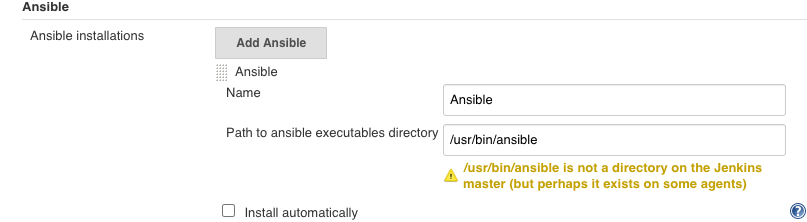

# 第三节 Jenkins集成Ansibe实现自动化部署 

## 1、Ansible介绍 

`Ansible`采用了与`Puppet` , `Chef`不一样的解决方案，不需要在受控机器上安装额外的客户端软件。原因是`Ansible`使用的是`SSH`协议与受控机器进行通信的，一般服务器默认有`SSH`服务。 `Ansible`也因此被称为`agentless`（去客户端的）。 

`Ansible`也不像`Puppet`、`Chef`那样需要在一台相对稳定的机器上安装一个主控程序，好让所有的受控机器连接上来。只要是安装了`Ansible`的机器就可以作为主控机器，比如工作时用的电脑.

`Puppet`和`Chef`都自己做了一套`DSL`，而`Ansible`使用`YAML`格式作为自己的`DSL`格式。 

笔者认为这是非常聪明的设计一：

* 一是大家都熟悉YAML格式；
* 二是不需要自己设计DSL;
* 三是不用自己写编译器(`YAML`可以直接映射到`Python`对象）。


`Ansible`将部署逻辑放在一个称为`“playbook”`的`YAML`文件中。通常，文件名是`playbook.yml`

```
---
- hosts: web 
  tasks: 
    — name: install nginx 
      apt: name=nginx state=latest 
    
    — hosts: db 
      tasks: 
        — name: install mysql 
          yum: name={{item}}
          with_items: 
            — 'mysql—common' 
            — 'mysql—client' 
            — 'mysql—server' 
```

组织受控机器的逻辑被放在`Inventory`文件中。它是`ini`格式的默认文件名为`hosts`

```
[web]
192.168.33.10

[db]
192.168.33.11
```

只要运行

`ansible-playbook --inventory hosts --user vagrant --ask-pass playbook`, `yml`命令，输入`SSH`登录时用户`vagrant`的密码，就可以执行我们描述好的部署逻辑。为简单起见，我们是用户名和密码方式登录。


## 2、`Ansible`安装与集成

`Jenkins`与`Ansible`集成能让`Jenkins`执行`ansible`命令。

是具体步骤如下： 

* (1）安装`Ansible`插件 
* (2）在主控机器上安装`Ansible`井设置不进行`host key`检查。

```
sudo yum install epel-release
sudo yum -y install ansible
```
```
$ ansible --version
ansible 2.9.10
  config file = /etc/ansible/ansible.cfg
  configured module search path = [u'/home/vagrant/.ansible/plugins/modules', u'/usr/share/ansible/plugins/modules']
  ansible python module location = /usr/lib/python2.7/site-packages/ansible
  executable location = /usr/bin/ansible
  python version = 2.7.5 (default, Apr  9 2019, 14:30:50) [GCC 4.8.5 20150623 (Red Hat 4.8.5-36)]
```

主控机器指的是真正执行`ansible`命令的机器，也就是`Jenkins`。我们需要在主控机器上自行安装`Ansible`,然后修改主控机器的`Ansible`配置，不进行`host key`检查 

```
cat /etc/ansible/ansible.cfg

[defaults]
host_key_checking = False
```

如果要求安全级别高，则应该提前将所有受控机器的`fingerprint`放到主控机器的`knowhosts` 文件中。 

* (3）在`Jenkins`上进人`Manage Jenkins -> Global Tool Configuration-> Ansible`配置页面配置 `Ansible`的执行路径. 

我们可以同时添加多个`Ansible`版本。请留意`Name`字段的滇后面介绍的`ansiblePlaybook `步骤会使用到。 

* (4）在`Jenkins`上添加登录受控机器的凭证。`Ansible`与受控机器连接的凭证需要我们在`Jenkins`手动添加。根据项目的实际清况可以选择使用用户名和密码的方式或者用户名和密钥的 



### 2-1 简单集成`ansible` 与 `SharedLibrary ` 

```
cd /etc/ansible
sudo vim hosts

[jabox]
127.0.0.1 ansible_connection=local

ansible -m ping localhost
127.0.0.1 | SUCCESS => {
    "ansible_facts": {
        "discovered_interpreter_python": "/usr/bin/python"
    }, 
    "changed": false, 
    "ping": "pong"
}
```

**SharedLibrary**

**`JenkinslibTest/src/org/devops/deploy.groovy`**

```
package org.devops

//salt stack

def SaltDeploy(host,func){
    sh "sudo salt ${host} ${func}"
}

def AnsibleDeploy(host,func){
    sh "ansible ${host} ${func}"
}
```

**Pipeline**

```
#!groovy
@Library('jenkinslib@master') _

def build = new org.devops.buildtools()
def deploy = new org.devops.deploy()

pipeline {
 	agent { node { label "hostmachine" }}
 	parameters {
 		choice(name: 'buildType', choices: 'mvn\nant\ngradle\nnpm', description: 'Please chose your build tool') 
    	choice(name: 'buildShell', choices: '-v\nclean package\nclean install\nclean test', description: 'Please chose your build command') 
    	choice(name: 'deployHosts', choices: 'jabox', description: 'Please chose your salt minion')
	}
 	stages{
		stage('build-deploy') {
	        steps {
	        	script {
	            	build.Build(buildType,buildShell)

	            	deploy.SaltDeploy("${deployHosts}","test.ping")
	            	deploy.AnsibleDeploy("${deployHosts}","-m ping")
	            } 
	        }
	    }
    }
 }
```

```
...
[Pipeline] tool
[Pipeline] sh
+ /opt/maven/bin/mvn -v
Apache Maven 3.6.3 (cecedd343002696d0abb50b32b541b8a6ba2883f)
Maven home: /opt/maven
Java version: 1.8.0_252, vendor: Oracle Corporation, runtime: /usr/lib/jvm/java-1.8.0-openjdk-1.8.0.252.b09-2.el7_8.x86_64/jre
Default locale: en_US, platform encoding: UTF-8
OS name: "linux", version: "3.10.0-957.12.2.el7.x86_64", arch: "amd64", family: "unix"
[Pipeline] sh
+ sudo salt jabox test.ping
jabox:
    True
[Pipeline] sh
+ ansible jabox -m ping
127.0.0.1 | SUCCESS => {
    "ansible_facts": {
        "discovered_interpreter_python": "/usr/bin/python"
    }, 
    "changed": false, 
    "ping": "pong"
}
[Pipeline] }
[Pipeline] // script
[Pipeline] }
[Pipeline] // stage
[Pipeline] }
[Pipeline] // node
[Pipeline] End of Pipeline
Finished: SUCCESS
```

### 2-2 简单集成`ansible playbook` 与 `Jenkins ` 

**部署目录如下**

```
$ cd orkspace/workspace/chap4-ansible2
$ tree .

.
├── hosts
└── playbook.yml

0 directories, 2 files
```

**playbook.yml**

```
---
- hosts: localhost
  tasks:
    - debug: msg="{{ lookup('env','BUILD_TAG') }}"
```

**hosts 文件**

```
[localhost]
127.0.0.1 ansible_connection=local
```

**Jenkinsfile内容如下**

```
pipeline {
 	agent { node { label "hostmachine" }}
 	stages{
		stage('AnsibleDeploy') {
	        steps {
	        	ansiblePlaybook(
	        			playbook: "${env.WORKSPACE}/playbook.yml",
	        			inventory: "${env.WORKSPACE}/hosts",
	        		)
	    	}
    	}
 	}
 }
```

打印日志

```
Running on hostmachine in /home/vagrant/workspace/workspace/chap4-ansible2
[Pipeline] {
[Pipeline] stage
[Pipeline] { (AnsibleDeploy)
[Pipeline] ansiblePlaybook
[chap4-ansible2] $ ansible-playbook /home/vagrant/workspace/workspace/chap4-ansible2/playbook.yml -i /home/vagrant/workspace/workspace/chap4-ansible2/hosts

PLAY [localhost] ***************************************************************

TASK [Gathering Facts] *********************************************************
ok: [127.0.0.1]

TASK [debug] *******************************************************************
ok: [127.0.0.1] => {
    "msg": "jenkins-chap4-ansible2-9"
}

PLAY RECAP *********************************************************************
127.0.0.1                  : ok=2    changed=0    unreachable=0    failed=0    skipped=0    rescued=0    ignored=0   
```

## 3、`Ansible`插件详解

### 3-1 `ansibilePlaybook`步骤 

`ansiblePlaybook`步骤除支持 `playbook`,`inventory`, `credetialsId`三个参数外，还支持以下参数。

* `installation`：字符串类型，值为前面设置的`Name` 字段的值。用于指定不同版本的`Ansible`
* `vaultCredentialsld` : `Ansible vault`密码在`Jenkins`中的凭证ID，它相当于`--vault一password-file`参数
* `disabieHostKeychecking `: 布尔类型，是否进行`host key`检查。
* `become`：布尔类型, 在执行操作时是否加上 `sudo`,它相当于`ansible`命令行的 `--become`参数。
* `becorneUser`:  字符串类型,切换到超级管理员用户名,默认是：`root`。它相当于`ansible`命令行的`--become-user`参数。  
* `limlt`：字符串类型, 指定执行的主机。相当于`ansible`命令行的`-l`参数。多个主机之间使用逗号分隔 
* `tags`：指定执行打上特定`tag`的任务。它相当于`ansible`命令行的`-t`参数。多个`tag`之间使用逗号分隔 
* `skippedTags` 参数。字符串类型, 指定跳过哪些`tag`的任务,它相当于`ansible`命令行的`--skip-tags`参数，多个`tag`之间使用逗号分隔。
* `StartAtTask`: 字符串类型, 从指定任务开始执行。它相当于`ansible`命令行的`--start-at-task`参数 
* `forks`: 并行执行的进程数。相当干`ansible`命令行的`-f`参数
* `extras`: 字符串类型, 扩展参数。当`ansiblePlaybook`步骤的参数无法满足需求时，可以使用此参数，例如`extras: '--syntax-check'`
* `extrasVars`: `List<org.jenkinsci.plugins.ansible.ExtraVar>`类型，扩展变量。它相当于`ansible`命令行的`-e`参数, 格式如下 

```
extraVars: [
	<key>: '<value>', 
	<key>: [value: '<value>', hidden: true|false] 
]
```

`extraVars`支持`hidden`属性，当其值为`true`时，在执行日志中会隐藏参数值。 

我们来看一下完整的代码示例。 

```
pipeline {
	agent any 
	stages {
		stage('Syntax check ansible playbook'){
			steps {
				ansiblePlaybook( 
					disableHostKeyChecking: true, 
					playbook: "${env.WORKSPACE}/playbook.yml",
	        		inventory: "${env.WORKSPACE}/hosts",
	        		credentialsId: 'vagrant', 
	        		extras: '--syntax—check' 
	        	)
	        }
	    }

	    stage('Deploy') {
	    	steps {	
		    	ansiblPlaybook( 
		    			disableHostKeyChecking: true, 
						playbook: "${env.WORKSPACE}/playbook.yml",
		        		inventory: "${env.WORKSPACE}/hosts",
		        		credentialsId: 'vagrant', 
		        		// skippedTags: 'debugtag'
		        		forks: 2, 
		        		limit: 'example1,example', 
		        		tags: 'debugtag,testtag', 
		        		extraVars: [
		        			login: 'mylogin'
		        			secret_key: [value: 'g4fKkiEllpeF6pY05', hidden: true] 
		        		]
		        		// startAtTask: 'task4'
		        	)
		    	}
	    	}
	    }
	}
```

`ansibleplaybook`步骤只是`Ansible`插件提供的两个步骤中的一个还有`ansibleVault`步骤 

### 3-2 `ansibleVault`步骤 

放在配置文件中的`MySQL`连接密码想必是不希望如诉有人看见的。`Ansible vault`是`Anaible` 的一个特性,它能帮助我们加解密配置文件或者某个配置项 

在`ansiblePlaybook`步骤中`vaultCradentialsId`参数的作用就是在`ansible-playbook`执行过程中，会对事先放在`playbook中`的密义进行解密解密需要密码`vaultCradentialsId`就是我们事先存储在`Jenkins`中的密码的凭证`ID`。

 而`ansibleVault`步骤所做的事情就是执行`Ansible`提供的`ansible-vault`命令。该命令通常用于对敏感数据进行加解密。
 
 `ansibleVault`支持以下参数。 

* `action `(必填：字符串类型，`ansibleVault`执行的操作类型。包括：
	* `encrypt`加密文件 。
	* `encrypt_string`加密字符 
	* `rekey`使用一个新的密码,进行加密但需要旧的密码 
	* `ecceypt`解密 

* `content`：字符串类型, 加密文本时的字符串内容。 
* `input`：字符串类型追加到`ansible-vault`命令行后面的参数 
* `installation`：字符串类型与`ansibilePlaybook `步骤的`installation`参数的作用一样。 
* `newVaultCredentialsld`：字符串类型, 使用新的凭证进行重新加密相当于`ansible-vault`命令的`--new-vault-password-file`参数 
* `output`符串类型，追加到`ansible-vault`命令行后面的参数但是会放在`input`参数之前
* `vaultCradentialsId`（必填）：字符串类型，密码的凭证lD。 

接下来，我们看看ausible Vault应用场景的代码示例 。

对文本内容进行加密 

```
ansibleVault( 
	action: "encrypt_string", 
	content: "${secret}",
	vaultCradentialsId: "vaultid", 
)
```

对于`content`参数，也常通过参数化传入，而不是这样写的

* 加密文件 

```
ansibleVault( 
	action: "encrypt", 
	vaultCredentialsId: "vaultid", 
	input: "./vault--test.yml" 
)
```

* 更换`vault`密码

```
ansibleVault( 
	action:"rekey", 
	vaultCredentialsId:"vaultid", 
	newVaultCredentialsId:"vaultid2", 
	input: "./vault-test.yml" 
) 
``` 

* 解密文件 

```
ansibleVault( 
	action:"decrypt", 
	vaultCredentialsId:"vaultid2", 
	input: "./vault-test.yml" 
) 
```