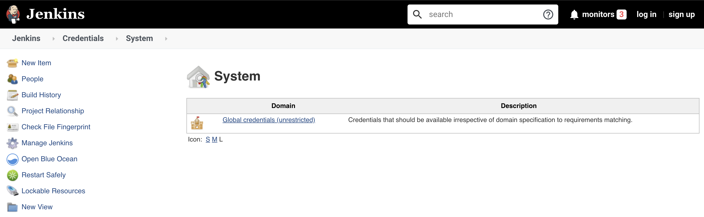
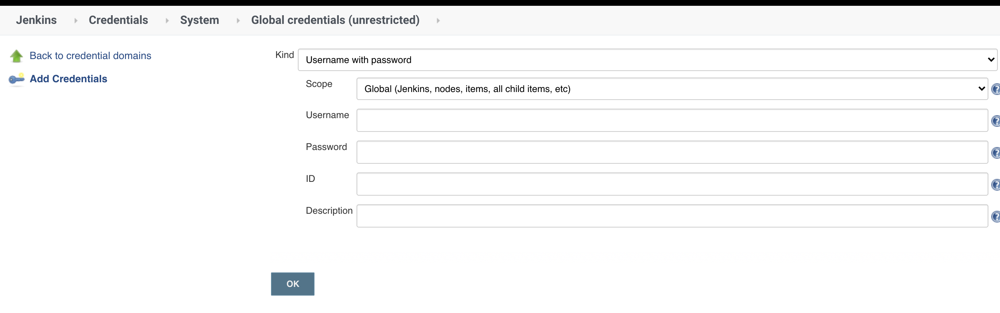
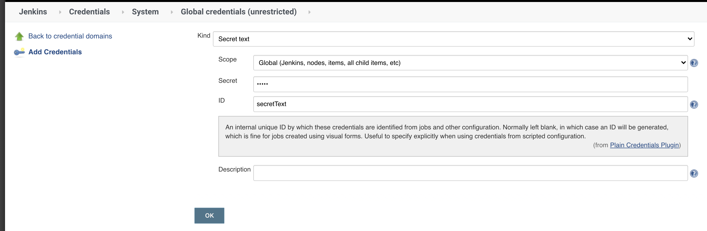
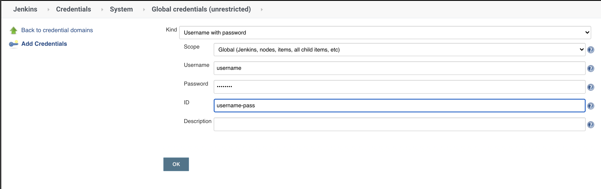
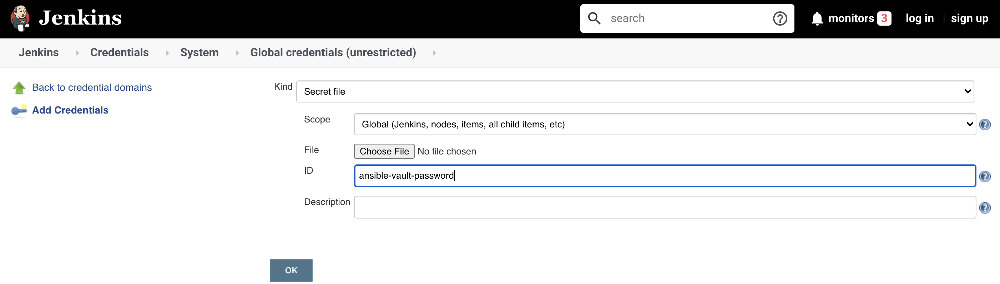
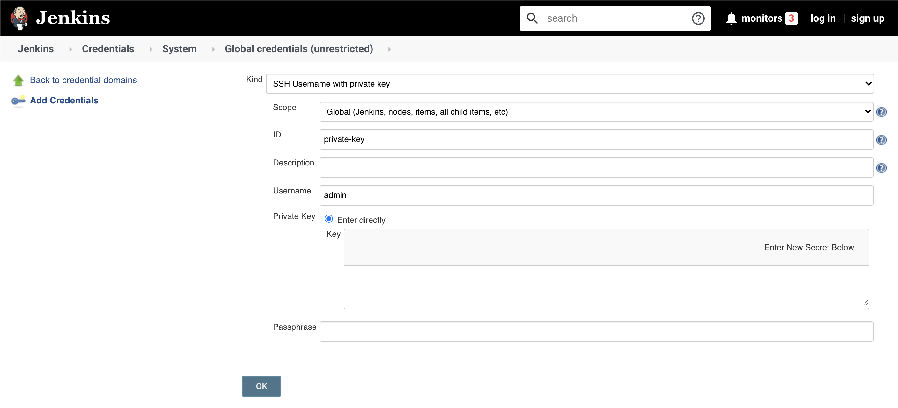

# 第一节 凭证管理

## 1、凭证是什么 

凭证（`credential`）是`Jenkins`进行受限操作时的凭据。比如使用`SSH`登录远程机器时，用户名和密码或`SSH key`就是凭证。而这些凭证不可能以明文写在`Jenkinsfile`中。Jenkins凭证管理指的就是对这些凭证进行管理。 

为了最大限度地提高安全性，在`Jenkins master`节点上对凭证进行加密存储（通过Jenkins实 例ID加密），只有通过它们的凭证ID才能在pipeline中使用，并且限制了将证书从一个`Jenkins` 实例复制到另一个`Jenkins`实例的能力。 


也因为所有的凭证都被存储在`Jenkins master`上，所以在`Jenkins master`上最好不要执行任务， 以免被`pipeline`非法读取出来。那么在哪里执行`pipeline`呢？应该分配到`Jenkins agent`上执行。

## 2、创建凭证 

在创建凭证前，请确保当前用户有添加凭证的权限。我们使用超级管理员的身份登录。单击 
`Jenkins`首页左侧的`Credentials -> System`




然后单击`“Global credentials (unrestricted)”`链接，再单击`“Add Credentials"`



在右侧的表单中、我们来看几个关键的选项。

* `Kind`：选择凭证类型。 
* `Scope`:凭证的作用域。有两种作用域： 
	* `Global`，全局作用域。如果凭证用于`pipeline`，则使用作用域，作用域。 
	* `System`，如果用于`Jenkins`本身的系统管理， 例如电子邮件身份验证，代理连接等，则使用此种作用域。 
* `ID`：在`pipeline`使用凭证的唯一标识。

`Jenkins`默认支持以下凭证类型: `Secret text`,`Username with password` , `Secret file`、 `SSH Usename with private key`、`Certificate`、`PKCS#12`、`Docker Host Certificate Authentication credentials`

接下来，分别介绍几种常用的凭证。 

## 3、常用凭证 

添加凭证后，需要安装`"Credentials Binding Plugin"`插件，就可以在 pipeline中使用withCredentials 步骤使用凭证了。


### 3-1 Secret text 

`Secret text`是一串需要保密的文本，比如`GitLab`的`API token`。



```
withCredentials([string(credentialsId: 'secretText', variable: 'varName')]) { 
		echo "${varName}" 
} 
```

### 3-2 Usernarne with password 

`Username with password`指用户和密码凭证。



```
withCredentials([usernamePassword(credentialsId: 'gitlab—userpwd—pair', usernameVariable: 'username', passwordVariable: 'passwd')]){ 
		echo "${username} ${passwd}" 
} 
```

### 3-3 Secret file 

`Secret file`指需要保密的文本文件。 使用`Secret file`时，`Jenkins`会将文件复制到一个临时目录中，再将文件路径设置到一个变量中。 构建结束后，所复制的`Secret file` 会被删除。

示例如下： 

```
withCredentials([file(credentialsId: 'ansible-vault-password', variable: 'vault')]){ 
		sh "ansible -i hosts playbook.yml --vault-password-file=${vault}" 
} 
```


### 3-4 SSH Username with private key 

`SSH Usernarne with private key`指一对`SSH`用户名和密钥。



```
withCredentials([sshUserPrivateKey(
				keyFileVariable:"key", 
				credentialsId : "private-key" )]) { 
		echo "${key}" 
} 
```

* `sshUserPrivateKey`函数还支持以下参数。 
* `usernarneVariable`: SSH用户名的变量名。 
* `passphraseVariable`: SSH key密码的变量名。 

## 4、优雅地使用凭证 

声明式`pipeline`提供`credentials helper`方法（只能在`environment` 指令中使用）来简化凭证的使用。以下是使用方法。 

### Secret text 

```
environment { 
	AWS_ACCESS_KEY_ID = credentials( 'aws-secret-key-id' ) 
	AWS_SECRET_ACCESS_KEY = credentials( 'aws-secret-access-key' ) 
} 
```

`AWS-SECRET-KEY-ID`和`AWS-SECRET-ACCESS-KEY`是我们预先定义的凭证ID。`credentials`方法将凭证的值赋给变量后，我们就可以像使用普通环境变量一样使用它们了，如： `echo "${AWS_ACCESS_KEY_ID}"`。 

### Username with password 

```
environment { 
	BITBUCKET_CREDS = credentials( 'jenkins-bitbucket-creds' ) 
}
```

与`Secret text`不同的是，我们需要通过`BITBUCKET_CREDS_USR`拿到用户名的值，通过 `BITBUCKET_CREDS_PSW`拿到密码的值。而变量`BITBUCKET_CREDS`的值则是一个字符串，格 式为：`＜用户名＞:＜密码＞`。 


### Secret file

```
environment { 
	KNOWN_HOSTS = credentials('known_hosts') 
} 
```

通过`credentials helper`方法，我们可以像使用环境变量一样使用凭证。 

但遗憾的是，`credentials helper`方法只支持`Secret texts`, `Username with passwords`, `Secret file`三种凭证。 

