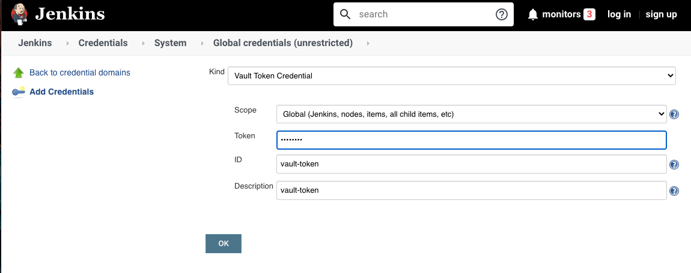
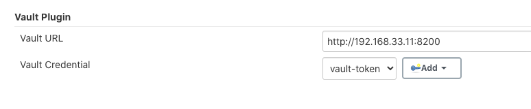

# **第二节 凭证管理使用HashiCorp Vault** 

如果觉得`Jenkins` 的凭证管理功能太弱无法满足你的需求则可以考虑使用`HashCorp Vault` 

## 1、HashrCorp Vault介绍 

HashCorp Vault是款对敏感信息进行存储并进行访问控制的的工具。敏感信息指的是密码 
、token、密钥等。它不仅可以存储敏感信息还具有滚动更新、审计等功能 


### 1-1 快速启动 Vault on Docker

[**Store Secrets using Hashicorp Vault with Docker**](3docker_valut.md)


### 1-2 集成HashrCorp Vault

1. 安装HashCorp Vault插件
2. 添加`Vault Token`凭证




3.配置`Vault`插件




首先我们使用`vault`命令向`vault`服务写入私密数据以方便测试：

```
vault write -address=${VAULT_ADDR} \
	secret/hello value=world
Success! Data written to: secret/hello
```

```
vault read -address=${VAULT_ADDR} \
	secret/hello
Key             Value
lease_duration  2592000
value           world
```

接着在`pipeline`中读取，示例代码如下： 

```
pipeline { 
	agent { label 'hostmachine '}
	
	environment { 
		SECRET = vault path: 'secret/hello', key: 'value' 
	} 

	stages { 
		stage("read vault key") { 
			steps { 
				script{ 
					def x = vault path: 'secret/hello', key: 'value' 
					echo "${x}" 
					echo "${SECRET}" 
				}
			} 
		} 
	} 
} 
```

我们可以在`environment`和`steps`中使用`vault`步骤。推荐在`environment`中使用。 vault步骤的参数如下: 

* `path`，存储键值对的路径。 
* `key`，存储内容的键。 
* `vaultUrl`（可选）, `vault`服务地址。 
* `credentialsld`（可选）,`vault`服务认证的凭证。 

如果不填`vaultUrl`与`credentialsld`参数，则使用系统级别的配置。 

