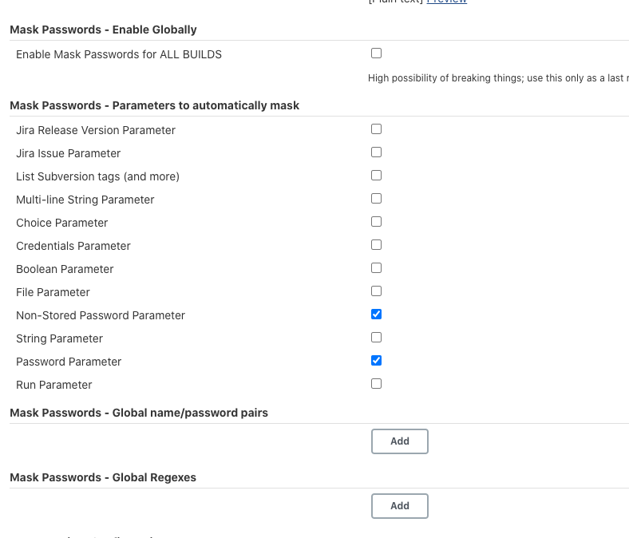

# **第三节 在Jenkins日志中隐藏敏感信息** 

如果使用的是`credentials helper`方法或者`withCredentials`。步骤为变量赋值的，那么这个变量的值是不会被明文打印到`Jenkins`日志中的。除非使用以下方法： 

```
steps { 
	script{ 
		def hack = 'hack it' 
		withCredentials([string(credentialsId: 'abc', variable: 'secretText')]) { 
			echo "${secretText}"
			hack = "${secretText}" 
		} 
		echo "${hack}"
	} 
} 
```

在没有使用`credential`的场景下，我们又该如何在日志中隐藏变量呢？可以使用`Masked Password`插件。通过该插件提供的包装器，可以隐藏我们指定的敏感信息。 

示例代码如下： 

```
pipeline { 
	agent any 
	environment { 
		SECRET1 = "secret1" 
		SECRET2 = "secret2" 
		NOT_SECRET = "no secret" 
	} 
	stages { 
		stage("read vault key"){ 
			steps { 
				wrap([$class: 'MaskPasswordsBuildWrapper', varPasswordPairs: [ 
					[password: env['SECRET1'], var: 's1'],
					[password: env['SECRET2'], var: 's2']]] 
					) { 
					echo "Masked secret: ${SECRET1} and ${SECRET2}" 
					echo "secret1" 
					echo "Not masked secret ${NOT_SECRET}" 
				} 
			} 
		} 
	} 
}
```

```
[Pipeline] stage (hide)
[Pipeline] { (read vault key)
[Pipeline] wrap
[Pipeline] {
[Pipeline] echo
Masked secret: ******** and ********
[Pipeline] echo
********
[Pipeline] echo
Not masked secret no secret
[Pipeline] }
```

初次使用	`Masked Password` 插件很容易以为是使用。`s1`和`s2`作为变量的，如`echo "Masked secret: ${SECRET1} and ${SECRET2}"`。

实际上，`var`参数只是用于方便在自由风格的`Jenkins`项目 中区分不同的需要隐藏的密文。在`pipeline`中使用，它就没有存在的意义了。但是即使这样也不能省略它，必须传一个值。`password`参数传的是真正要隐藏的密文。 

那么，为什么`echo "secret1" `这条语句中并没有使用预定义的变量，`secret1`也会被隐藏呢？这是由`Masked Password`插件的实现方式决定的。 

`Jenkins`提供了`ConsoleLogFilter`接口，可以在日志打印阶段实现我们自己的业务逻辑。 
`Masked Password`插件实现了`ConsoleLogFilter`接口，然后利用正则表达式将匹配到的文本 `replaceAll`成`******`。 

`MaskPasswordsBuildWrapper`包装器除了支持`varPasswordPair`。参数，还支持`varMask Regexes`参数．使用自定义的正则表达式匹配需要隐藏的文本。写法如下： 

```
steps { 
	wrap([$class: 'MaskPasswordsBuildWrapper', 
		varMaskRegexes: [[regex: 'abc--.*']] 
	] 
	) {
		echo "abc--xxxx" 
	}
}
```

通过`Masked Password`插件还可以设置全局级别的密文隐藏，在`Manage Jenkins -> Configure System`页中可以找到，


