# **第一节 Ldap 用户认证集成**

## 1、安装Ldap服务 & 安装Ldap控制台

### 通过`docker` 安装

* [docker openldap](https://github.com/osixia/docker-openldap)
* [docker phpldapadmin](https://github.com/osixia/docker-phpLDAPadmin)

### Quick start

**`start.sh`**

```
#!/bin/bash -e
docker run -p 389:389 -p 636:636 --name ldap-service --hostname ldap-service --detach osixia/openldap:1.4.0
docker run --name phpldapadmin-service --hostname phpldapadmin-service -p 6443:443 --link ldap-service:ldap-host --env PHPLDAPADMIN_LDAP_HOSTS=ldap-host --detach osixia/phpldapadmin:0.9.0

PHPLDAP_IP=$(docker inspect -f "{{ .NetworkSettings.IPAddress }}" phpldapadmin-service)

echo "Go to: https://$PHPLDAP_IP"
echo "Login DN: cn=admin,dc=example,dc=org"
```

`source start.sh`

```
Go to: https://172.17.0.5
Login DN: cn=admin,dc=example,dc=org
Password: admin
```

* https://192.168.33.11:6443/

```
$ curl --insecure -I https://172.17.0.5
HTTP/1.1 200 OK
Date: Mon, 13 Jul 2020 17:09:45 GMT
Server: Apache
Expires: Thu, 19 Nov 1981 08:52:00 GMT
Pragma: no-cache
Cache-control: private
Set-Cookie: 5d89dac18813e15aa2f75788275e3588=lnfqfhbuvl0lqsgfmee2mqvhho; path=/
Strict-Transport-Security: max-age=15768000
Upgrade: h2,h2c
Connection: Upgrade
X-Content-Type-Options: nosniff
X-XSS-Protection: 1; mode=block
X-Frame-Options: SAMEORIGIN
Vary: User-Agent
Content-Type: text/html; charset="UTF-8"
```

```
$ curl ldap://192.168.33.11:389
DN: 
        objectClass: top
        objectClass: OpenLDAProotDSE
```


## 2、创建OU组织用户数据

### 2-1 创建OU

选择`Organisational unit` 组织单元

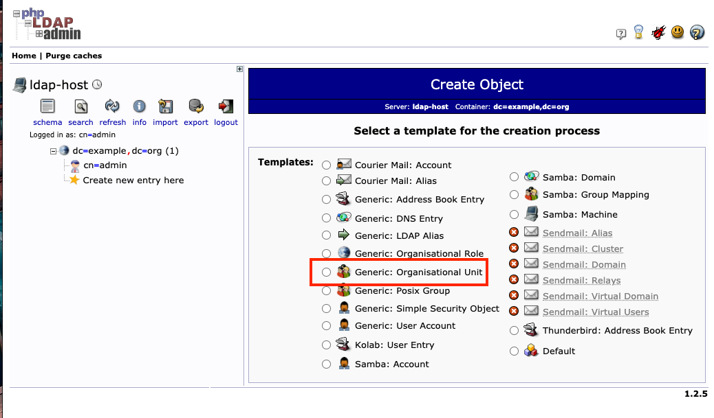

输入OU名称(**jenkins**)

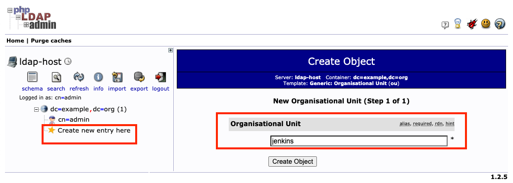

提交信息

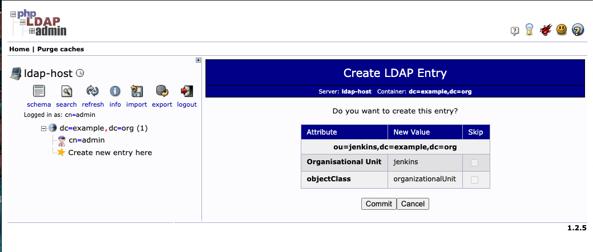

### 2-2 创建人员


* 选择`OU`->选择新建子条目

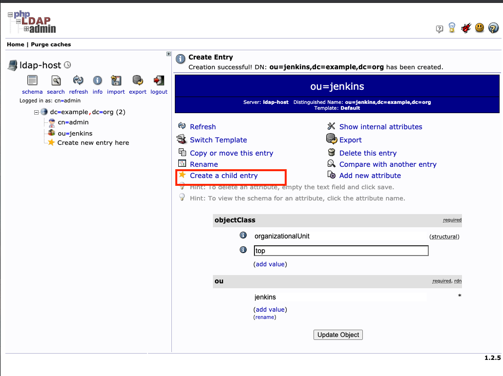

选择默认模板

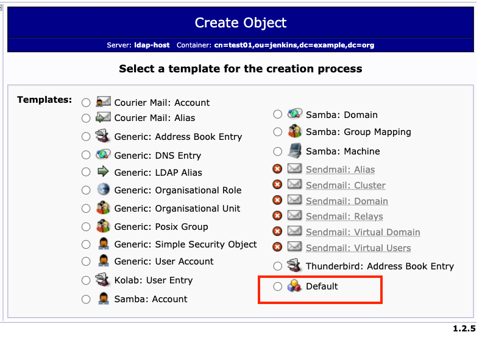

选择inetorgperson

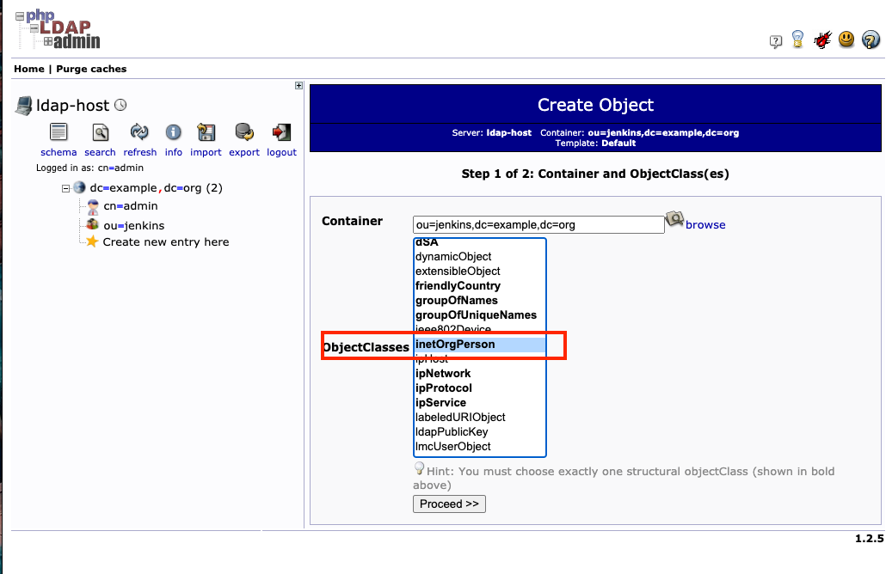

填写并提交信息

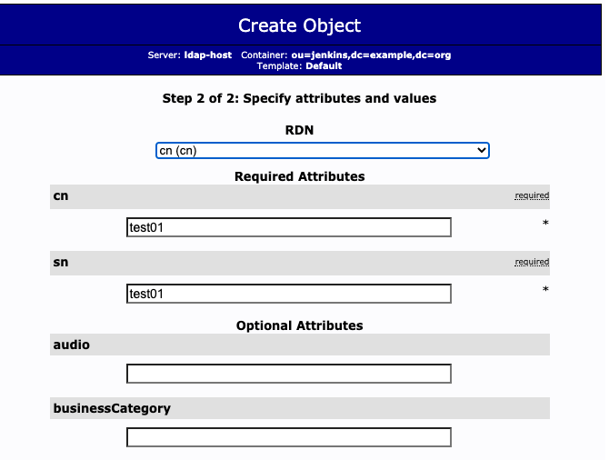


* user： **test01**
* password: **12345**

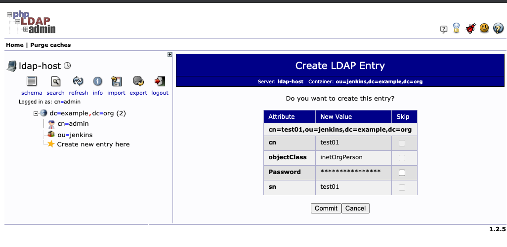

用户创建完成


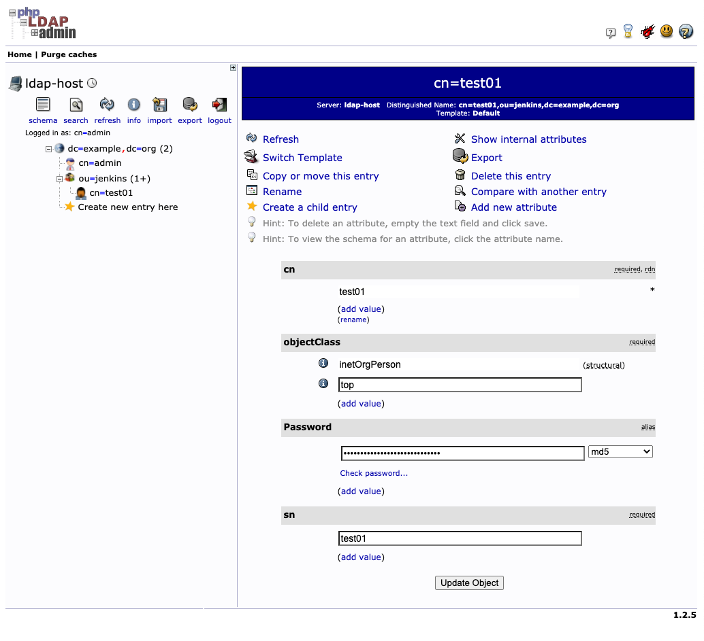


### 3、Jenkins集成Ldap

### 3-1 先决条件

1. 备一个`adminDN`账号用于查询用户。 `cn=admin,dc=example,dc=org`
2. 将访问`Jenkins`的用户放到一个OU中。 `ou=jenkins,dc=example,dc=org`
3. 提供`ldap`服务器地址。 `ldap://192.168.33.11:389`

### 3-2 Jenkins配置

* 安装ldap插件
* 全局安全配置


`http://192.168.33.11:8080/configureSecurity/`

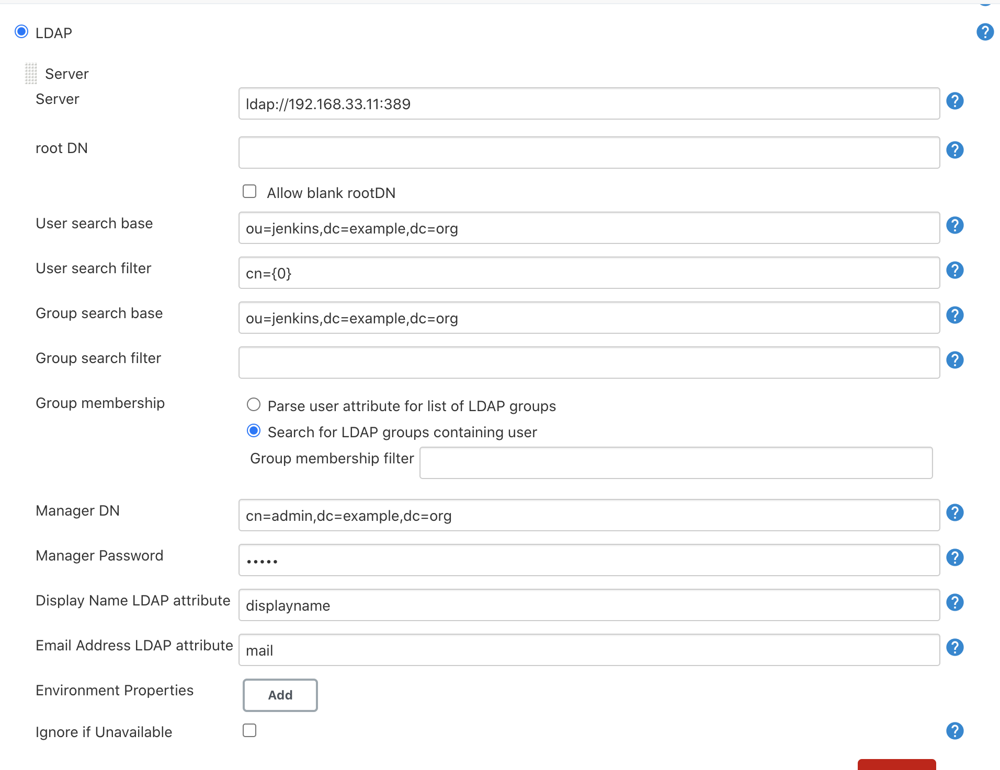

选择账号测试，出现一下信息集成完毕

* user： **test01**
* password: **12345**

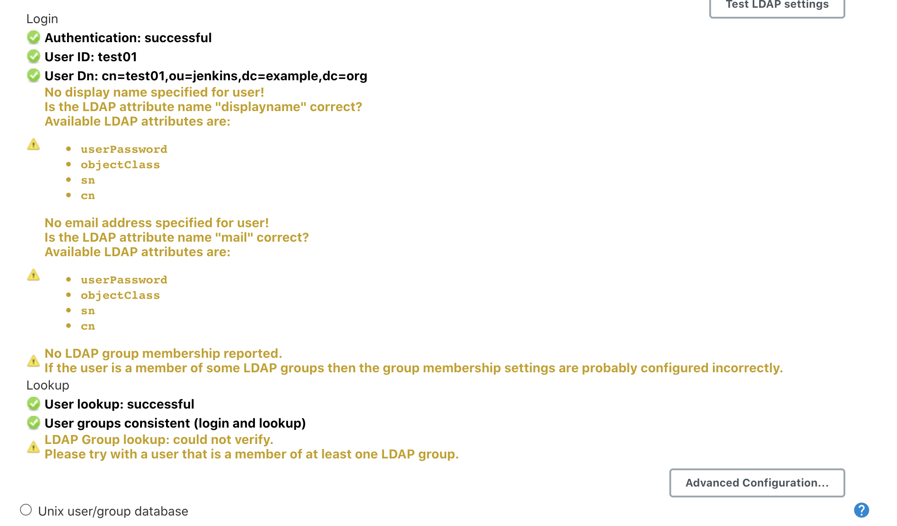

重新登录

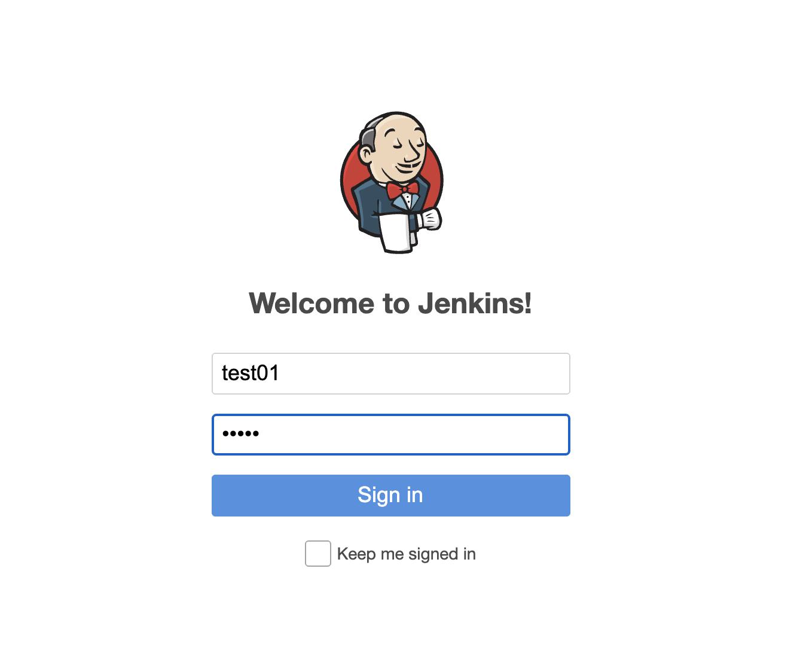

`role-strategy/assign-roles`

Assign 新的 Roles 例如 admin

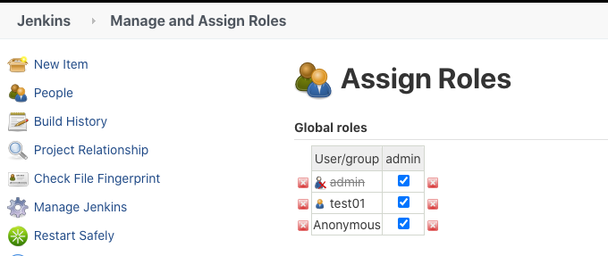
