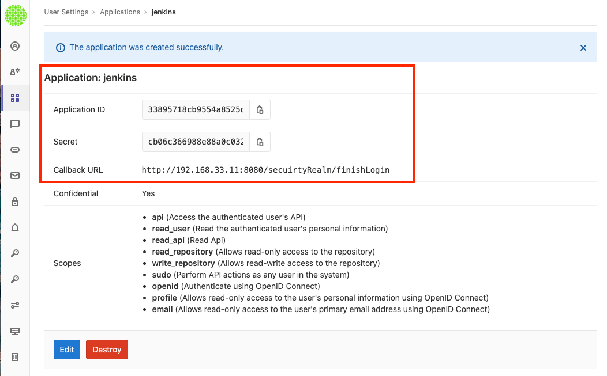
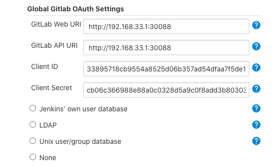
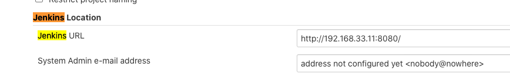
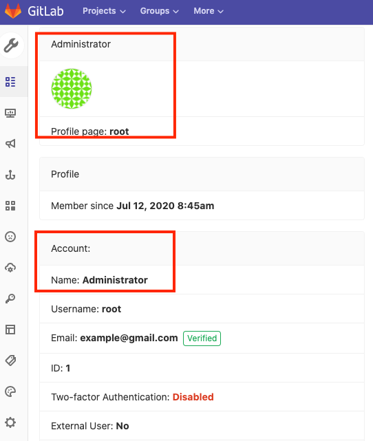
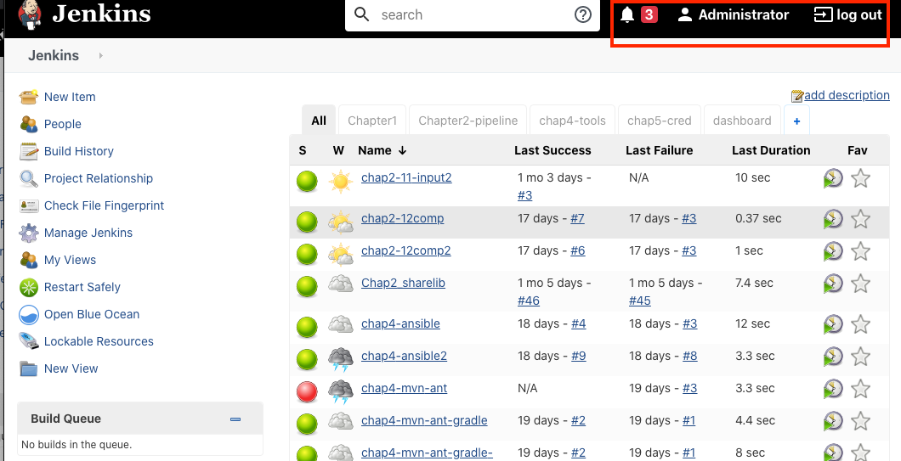

# **第二节 Jenkins集成`Gitlab SSO`单点登录**


## 1、Gitlab安装

### 安装 Gitlab 

1. [在 Kubernetes 上安装 Gitlab （New)](https://github.com/Chao-Xi/JacobTechBlog/blob/master/k8s_dev/k8s_gitlab/6k8s_gitlab_install.md)

### 改变`gitlab service` from `ClusterIP` to `nodePort` 

```
...
---
apiVersion: v1
kind: Service
metadata:
  name: gitlab
  namespace: kube-ops
  labels:
    name: gitlab
spec:
  ports:
    - name: http
      port: 80
      targetPort: http
      nodePort: 30088
    - name: ssh
      port: 22
      targetPort: ssh
      nodePort: 30022
  type: NodePort
  selector:
    name: gitlab
```

**curl from vm machine**

```
$ curl http://192.168.33.1:30088
<html><body>You are being <a href="http://192.168.33.1:30088/users/sign_in">redirected</a>.</body></html>
```

登录

* root
* admin321

## 2、Gitlab配置

* 安装`Jenkins Gitlab Authentication` 插件
* **应用管理->创建应用->配置重定向url** 
* **Application**



* Callback URL: http://192.168.33.11:8080/securityRealm/finishLogin
* Application ID: 33895718cb9554a8525d06b357ad54dfaa7f5de1ec6867bad98a6fa77e7fd506
* secret: cb06c366988e88a0c0328d5a9c0f8add3b803032b5c93943b8e2cfa61963cbc2
* http://192.168.33.11:8080/securityRealm/finishLogin


## 3、Jenkins配置

### 3-1 Configure Global Security



###3-2 configuration

**Jenkins Location**



### 3-3 重新登录

最后实现的效果是用户在gitlab登录之后，输入jenkins域名会直接进入jenkins。




2chap6_gitlab.md