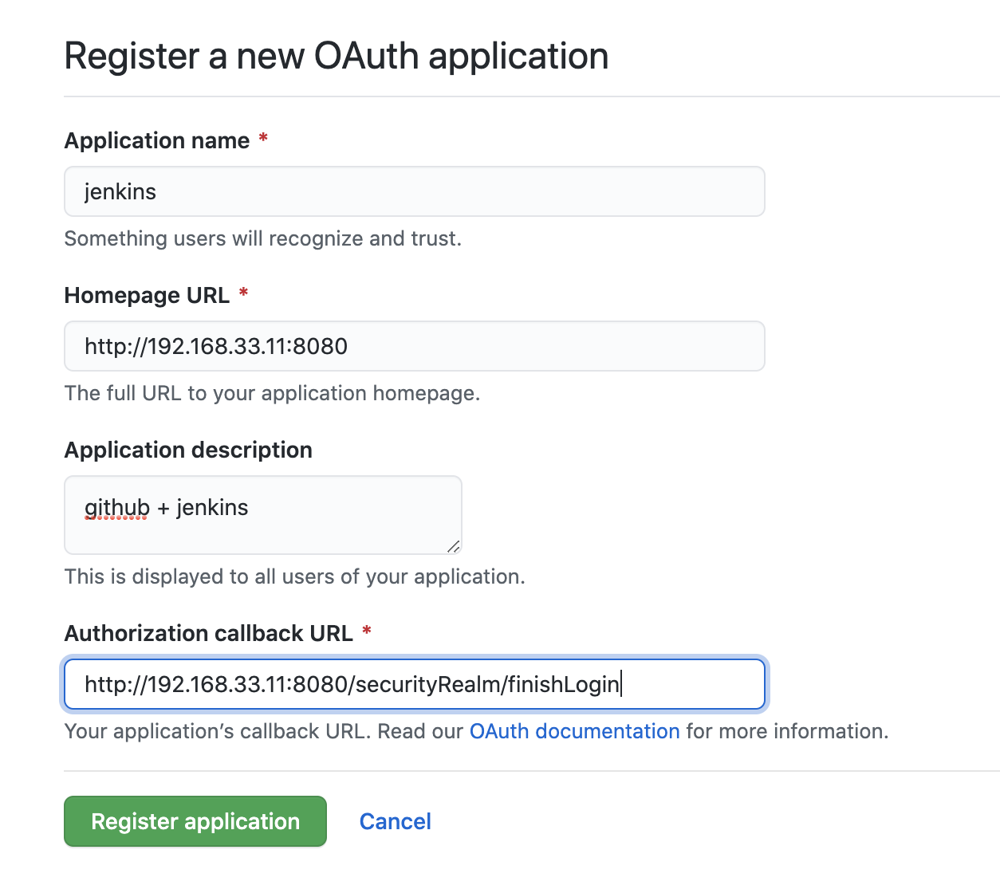
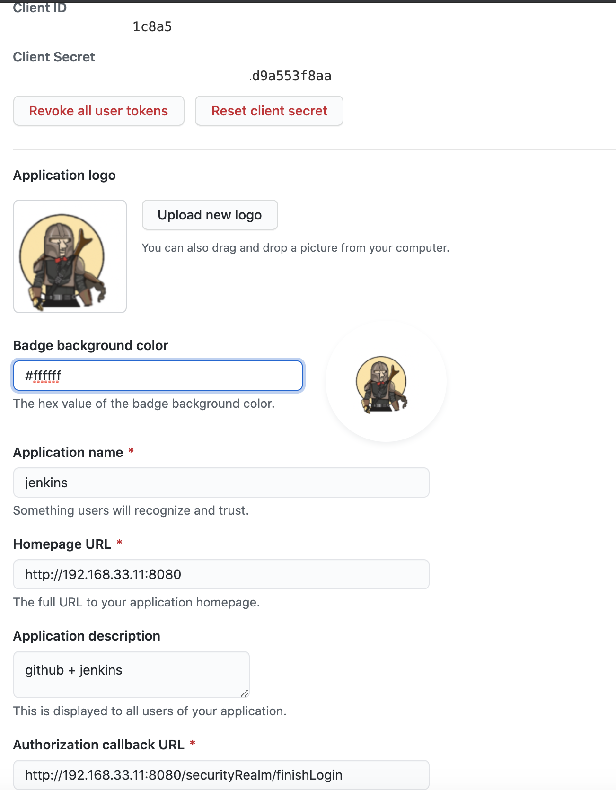
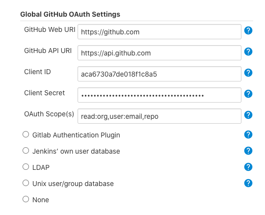
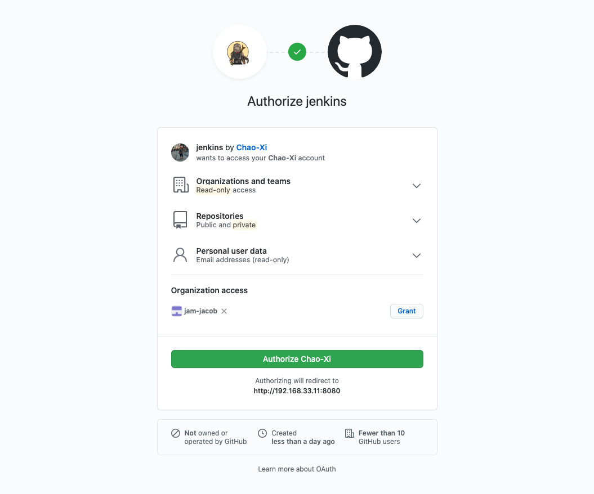
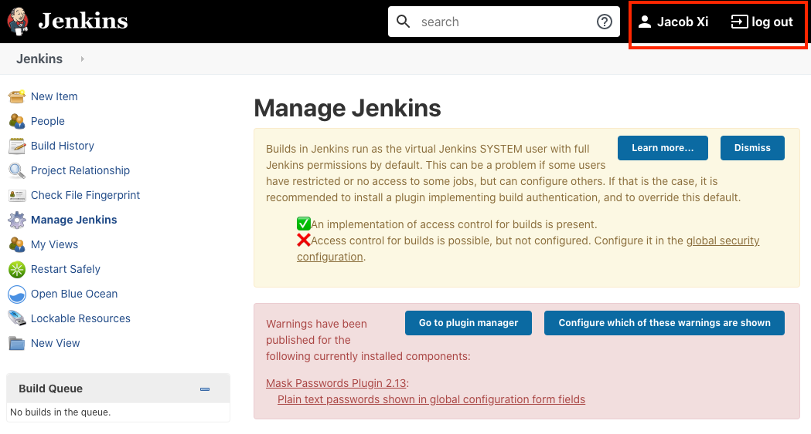
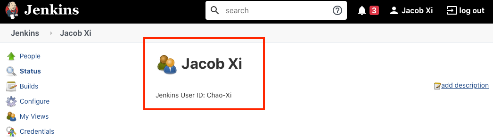

# 第三节 Jenkins集成`Github SSO`单点登录

## 1、Github配置

* 安装插件`GitHub Authentication plugin`
* `Settings -> devloper settings -> OAuth Apps -> Register a new OAuth application`

* `http://192.168.33.11:8080/securityRealm/finishLogin`
* `http://192.168.33.11:8080/`

## 2、Jenkins配置

### 2-1 Configure Global Security

### 2-2 重新登录

最后实现的效果是用户在github登录之后，输入jenkins域名会直接进入jenkins。

