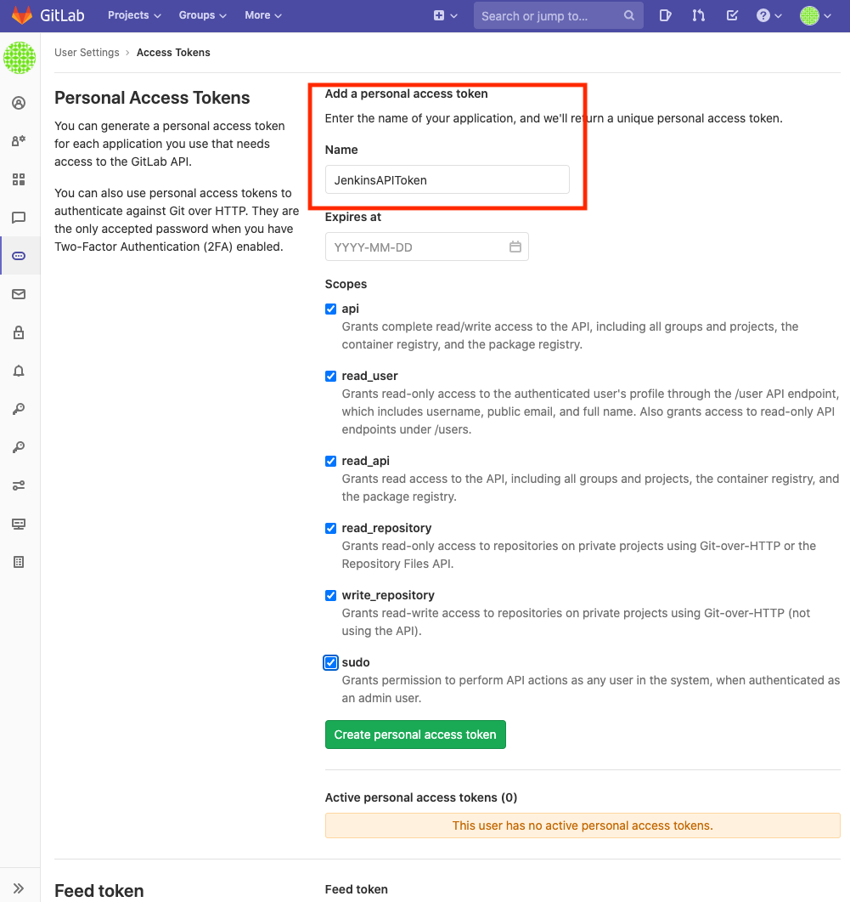
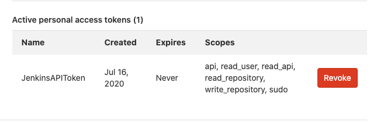
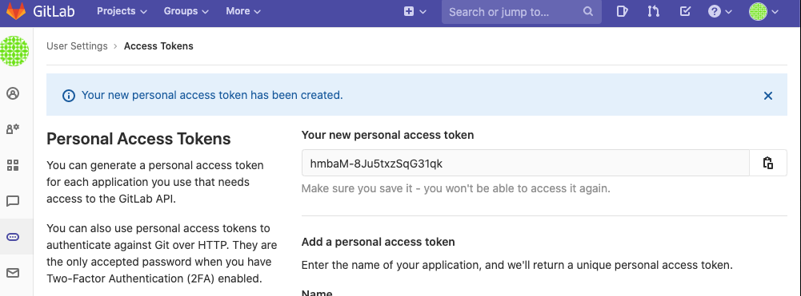
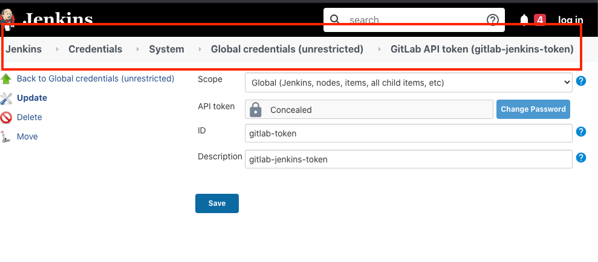
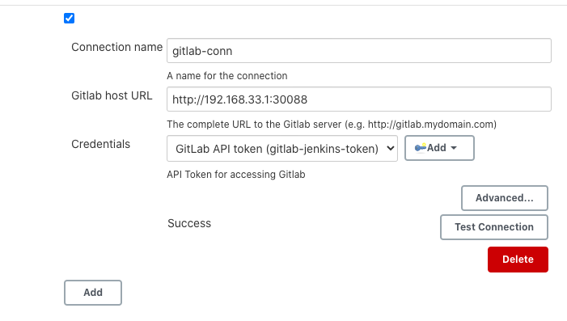

# 第一节 Gitlab – Jenkins Integration

## 1、`Gitlab – Jenkins` Integration 需求

* Jenkins GitLab Plugin
* Jenkins Git Plugin
* Jenkins GitLab Hook plugin

First, we must create a **user that Jenkins will use to interact via the GitLab API**. You should set this user as **global admin** or add as a **member to related Group/Project**. In order to report build status, **developer permission required**.

First open GitLab and go to Profile Settings

## 2、Gitlab配置

**`profile -> Settings -> Access Token ->  Jenkins API Token.`**

## 3、Jenkins配置

### 3-1 Configure  Jenkins Token

### 3-2 Gitlab Connection

**Manage Jenkins -> Configure System**

* Connection name	
* Gitlab host URL	
* Credentials	

**Finally click “Test” and see the “Success” message.**
